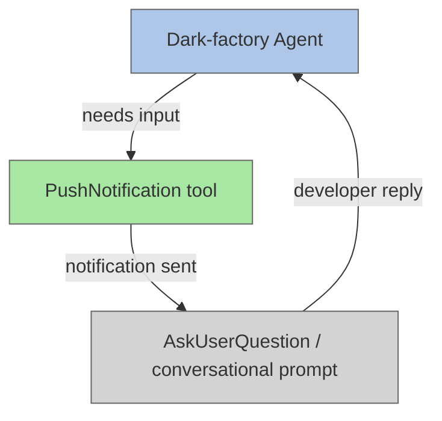

# Desktop Notification Before User Input

## Plan Metadata

- Plan type: `plan`
- Parent plan: N/A
- Depends on: N/A
- Status: `approved`

## System Intent

- What is being built: Instrumentation of every dark-factory agent that asks the user/developer for input, so that a `PushNotification` tool call is issued immediately before the user-input request.
- Primary consumer(s): Dark-factory agents running autonomously in the background; the developer who needs to be notified when their input is required.
- Boundary (black-box scope only): The `PushNotification` tool is a built-in Claude Code capability — its internals are out of scope. The agents themselves are the only files being modified.

## Stage Gate Tracker

- [x] Stage 1 Mermaid approved
- [x] Stage 2 Flows approved
- [x] Stage 3 Logs + Deployment approved or skipped

## Mermaid Diagram



## Flows

### Global Types

```txt
StandardError {
  message: string (human-readable description of what went wrong)
}

PushNotificationPayload {
  title: string  (short label, e.g. "Input Required")
  message: string (one sentence describing what the agent needs)
}
```

---

### Flow: `notifyThenAsk`

This is the single pattern applied in every location below. Before any user-input request the agent must:
1. Call `PushNotification` with a title and message that describes what input is needed.
2. Immediately issue the user-input request (conversational prompt or `AskUserQuestion`).

#### Types

```txt
NotifyThenAskInput {
  context: string  (what the agent was doing when it needs input)
  question: string (the exact question being asked of the developer)
}

NotifyThenAskOutput {
  developerReply: string
}
```

#### Paths

| path | input | output | path-type | notes | updated |
| --- | --- | --- | --- | --- | --- |
| `notifyThenAsk.success` | `NotifyThenAskInput` | `NotifyThenAskOutput` | happy path | PushNotification fires, developer replies | |
| `notifyThenAsk.notificationIgnored` | `NotifyThenAskInput` | `NotifyThenAskOutput` | happy path | Developer misses notification but still replies — no change in behavior | |

#### Pseudocode

```
function notifyThenAsk(title, message, question):
  PushNotification(title=title, message=message)
  reply = ask(question)   // conversational or AskUserQuestion tool
  return reply
```

---

## Files to Update

Each entry below identifies the exact file, the location of the user-input request, and the instruction text to add.

---

### 1. `agents/featurework/agents/feature-agent.md`

**Location:** The plan-approval gate section (around line 54-56).

**Current behavior:** Asks the developer: *"Approve this plan? Reply 'yes' or 'approve' to proceed…"*

**Instruction to add (immediately before the approval prompt):**
> Before asking the developer for plan approval, call `PushNotification` with:
> - title: `"Plan Approval Required"`
> - message: `"A plan is ready for your review and requires approval to proceed."`

---

### 2. `agents/featurework/planning/agents/planning-agent.md`

**Location:** Stage gate — "User approval required" after Mermaid diagram; "One approval per flow" after each flow.

**Current behavior:** At each stage gate the agent waits for the developer to approve before advancing.

**Instruction to add (before each stage-gate approval prompt):**
> Before presenting each stage gate and asking for approval, call `PushNotification` with:
> - title: `"Plan Review Required"`
> - message: `"A planning stage is ready for your review and approval."`

---

### 3. `agents/featurework/execution/skills/deviation-protocol/SKILL.md`

**Location:** Lines 15-21 — asks developer how to proceed when a plan conflict is encountered.

**Current behavior:** Presents the conflict and asks: *"How would you like to proceed? Options: (1) course-correct … or (2) hard-stop …"*

**Instruction to add (immediately before presenting the conflict and asking):**
> Before asking the developer how to proceed on a plan conflict, call `PushNotification` with:
> - title: `"Developer Decision Required"`
> - message: `"A plan conflict was encountered and requires your decision to continue."`

---

### 4. `agents/featurework/execution/agents/execution-agent.md`

**Location:** Hard-stop handling section (around lines 34-37) — agent informs the developer that execution is paused and waits for them to say the plan is ready to resume.

**Current behavior:** Informs the developer that execution is paused, then waits for a reply.

**Instruction to add (before informing the developer and waiting):**
> Before informing the developer of a hard-stop and waiting for them to resume, call `PushNotification` with:
> - title: `"Execution Paused — Input Required"`
> - message: `"Plan execution has been paused due to a hard-stop. Review the plan and reply when ready to resume."`

---

### 5. `agents/fix-flow/agents/fix-flow-orchestrator.md`

**Location:** Line 16 — if the flow name is not provided, stop and ask the developer.

**Current behavior:** Stops and asks the developer for the missing flow name.

**Instruction to add (before asking for the flow name):**
> Before asking the developer for the required flow name, call `PushNotification` with:
> - title: `"Input Required"`
> - message: `"The fix-flow orchestrator needs a flow name to proceed."`

---

### 6. `agents/fix-flow/agents/ralph-fix-and-push.md`

**Location:** Lines 38-41 — asks the developer how to proceed when the debugger-agent is stuck.

**Current behavior:** Asks the developer for guidance when the same root cause repeats with no new progress.

**Instruction to add (before asking the developer for guidance):**
> Before asking the developer how to proceed when the debugger-agent is stuck, call `PushNotification` with:
> - title: `"Debugging Stuck — Input Required"`
> - message: `"The debugger-agent is stuck on a repeated root cause and needs your guidance to proceed."`

---

### 7. `agents/dark-factory/agents/dark-factory-agent.md`

**Location:** Line 117 — asks one clarifying question when task classification is ambiguous.

**Current behavior:** Asks the developer one clarifying question before routing.

**Instruction to add (before asking the clarifying question):**
> Before asking the developer a clarifying question about an ambiguous task, call `PushNotification` with:
> - title: `"Clarification Required"`
> - message: `"The dark-factory agent needs one clarification before it can route your request."`

---

### 8. `agents/documentation/agents/detect-drift-agent.md`

**Location:** Line 32 — asks the developer how to proceed on `wrong` drift items.

**Current behavior:** Notes `wrong` items in the report and asks the developer how to proceed.

**Instruction to add (before asking the developer):**
> Before asking the developer how to proceed on unresolvable drift items, call `PushNotification` with:
> - title: `"Documentation Drift — Input Required"`
> - message: `"The detect-drift agent found items it cannot resolve automatically and needs your guidance."`

---

### 9. `agents/documentation/agents/update-documentation-agent.md`

**Location:** Line 17 — if the required plan argument is not provided, stop and ask the developer.

**Current behavior:** Stops and asks the developer for the missing plan path.

**Instruction to add (before asking for the plan path):**
> Before asking the developer for the required plan path, call `PushNotification` with:
> - title: `"Input Required"`
> - message: `"The update-documentation agent needs a plan path to proceed."`

---

## Logs

| Source | Location |
|--------|----------|
| N/A | No log sinks — all changes are agent instruction text only |

## Deployment

- Mechanism: `local only`
- Deploy command:
  ```bash
  # No deployment needed — changes are .md instruction files only
  ```
- Notes: All changes are to agent instruction `.md` files. No code is compiled or deployed. Changes take effect immediately when an agent reads its updated instructions.
