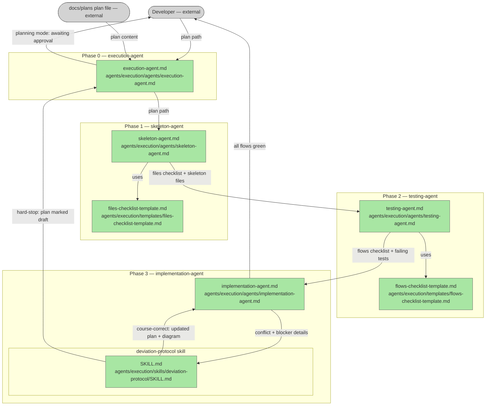

# Execution Agent

## Plan Metadata

- Plan type: `plan`
- Parent plan: N/A
- Depends on: N/A
- Status: `documentation`

Status semantics:
- `draft`: Plan is being created or updated and is not final.
- `approved`: Plan is approved but not yet applied in code.
- `documentation`: Code currently exists and matches the plan contract.

Update rule:
- When an existing plan is edited, set status to `draft` until re-approved.

## System Intent

- What is being built: Four agents under `agents/execution/` — an orchestrator that calls three sub-agents (skeleton-agent, testing-agent, implementation-agent) in sequence to take an approved plan file and execute it end-to-end. Includes a hard-stop deviation protocol for plan conflicts.
- Primary consumer(s): Developers who have an approved plan in `docs/plans/` and want to execute it without manually driving each step.
- Boundary (black-box scope only): Accepts a path to a `docs/plans/*.md` file; emits implemented, tested code. Does not produce plans, does not open PRs, does not deploy. Stops and updates the plan if a conflict is found.

## Stage Gate Tracker

- [x] Stage 1 Mermaid approved
- [x] Stage 2 I/O contracts approved
- [x] Stage 3 pseudocode/technical details approved

---

## 1. Mermaid Diagram



---

## 2. Black-Box Inputs and Outputs

### Global Types

```txt
PlanPath {
  value: string (repo-relative or absolute path to a docs/plans/*.md file)
}

FlowEntry {
  name: string (flow identifier as written in the plan)
  testFiles: string[] (paths from the plan's "Test files:" row; empty if N/A)
  coreFiles: string[] (paths from the plan's "Core files:" row)
  paths: PathRow[]
}

PathRow {
  name: string (e.g. "createResource.success")
  input: string
  output: string
  pathType: "happy path" | "error" | "subpath"
  notes: string
}

FileItem {
  path: string
  kind: "file" | "class" | "function"
  done: boolean
}

FlowChecklistItem {
  flowName: string
  testFiles: string[]
  coreFiles: string[]
  testWritten: boolean
  testFailing: boolean
  implemented: boolean
  testPassing: boolean
}

DeviationRecord {
  phase: string
  flowName: string
  blockerDescription: string
  resolution: string
}
```

### Flow: `orchestrate`
- Test files: N/A
- Core files: `agents/execution/agents/execution-agent.md`

#### Type Definitions

```txt
OrchestrateInput {
  planPath: PlanPath
}

OrchestrateOutput {
  flowsGreen: boolean
  checklistPath: string (path to tmp/flows-checklist.md)
}
```

#### Paths

| path-name | input | output/expected state change | path-type | notes | updated |
|---|---|---|---|---|---|
| `orchestrate.success` | `OrchestrateInput` | `OrchestrateOutput flowsGreen=true`; all flows implemented and passing | `happy path` | Calls skeleton → testing → implementation in strict sequence | Y |
| `orchestrate.plan-not-found` | `OrchestrateInput` with invalid path | error: stop and report to developer | `error` | Do not invoke any sub-agent | |
| `orchestrate.plan-not-approved` | `OrchestrateInput` with draft plan | warning: ask developer whether to continue | `error` | Plan status must be "approved" to execute | |
| `orchestrate.sub-agent-abort` | any sub-agent returns abort | stop and report deviation to developer | `error` | Deviation protocol fired inside implementation-agent | |

### Flow: `skeleton`
- Test files: N/A
- Core files: `agents/execution/agents/skeleton-agent.md`, `agents/execution/templates/files-checklist-template.md`

#### Type Definitions

```txt
SkeletonInput {
  planPath: PlanPath
}

SkeletonOutput {
  checklistPath: string (path to tmp/files-checklist.md)
  filesCreated: string[]
}
```

#### Paths

| path-name | input | output/expected state change | path-type | notes | updated |
|---|---|---|---|---|---|
| `skeleton.success` | `SkeletonInput` | `SkeletonOutput`; all skeleton files exist; checklist fully checked off | `happy path` | Files have correct structure, no implementation logic | Y |
| `skeleton.plan-unreadable` | `SkeletonInput` with unreadable plan | error returned to orchestrator | `error` | Orchestrator stops and reports | |

### Flow: `testing`
- Test files: N/A
- Core files: `agents/execution/agents/testing-agent.md`, `agents/execution/templates/flows-checklist-template.md`

#### Type Definitions

```txt
TestingInput {
  planPath: PlanPath
}

TestingOutput {
  checklistPath: string (path to tmp/flows-checklist.md)
  testFilesWritten: string[]
  allTestsFailing: boolean
}
```

#### Paths

| path-name | input | output/expected state change | path-type | notes | updated |
|---|---|---|---|---|---|
| `testing.success` | `TestingInput` | `TestingOutput`; test files written; all new tests fail | `happy path` | A test that passes before implementation is flagged and reported | Y |
| `testing.no-flows` | `TestingInput` for plan with no flows | error returned to orchestrator | `error` | Plan must define at least one flow | |
| `testing.test-passes-before-impl` | test asserts pass before any implementation | warning reported to developer before continuing | `error` | Skeleton may already contain logic; investigate before continuing | |

### Flow: `implementation`
- Test files: per plan flow table
- Core files: `agents/execution/agents/implementation-agent.md`

#### Type Definitions

```txt
ImplementationInput {
  planPath: PlanPath
  checklistPath: string (path to tmp/flows-checklist.md written by testing-agent)
}

ImplementationOutput {
  allFlowsGreen: boolean
  flowsChecklistPath: string
}
```

#### Paths

| path-name | input | output/expected state change | path-type | notes | updated |
|---|---|---|---|---|---|
| `implementation.success` | `ImplementationInput` | `ImplementationOutput allFlowsGreen=true`; all checklist rows done | `happy path` | Implements one flow at a time; runs tests after each | Y |
| `implementation.test-still-failing` | flow tests fail after implementation attempt | diagnose; fix attempt; re-run | `subpath` | Loops within agent judgment before escalating | |
| `implementation.plan-conflict` | conflicting or ambiguous plan | deviation protocol fires; returns abort to orchestrator | `error` | Plan file updated before any resume | |

### Flow: `deviationProtocol`
- Test files: N/A
- Core files: `agents/execution/skills/deviation-protocol/SKILL.md`

#### Type Definitions

```txt
DeviationProtocolInput {
  record: DeviationRecord
  planPath: PlanPath
}

DeviationProtocolOutput {
  decision: "course-correct" | "hard-stop"
}
```

#### Paths

| path-name | input | output/expected state change | path-type | notes | updated |
|---|---|---|---|---|---|
| `deviationProtocol.courseCorrect` | `DeviationProtocolInput` | developer provides guidance; plan and diagram updated; returns course-correct | `happy path` | Implementation resumes from current flow with updated plan | Y |
| `deviationProtocol.hardStop` | `DeviationProtocolInput` | developer halts execution; plan marked draft; returns hard-stop | `happy path` | Execution-agent returns to planning mode; waits for developer to mark plan approved before resuming | Y |

---

## 3. Pseudocode / Technical Details for Critical Flows

### `execution-agent` (orchestrator):

```
RECEIVE planPath

ASSERT plan file is readable
IF plan status != "approved": warn developer, ask to confirm

spawn skeleton-agent with planPath
WAIT — assert tmp/files-checklist.md fully checked off and every listed file exists on disk

spawn testing-agent with planPath
WAIT — assert tmp/flows-checklist.md exists and all new tests are failing

spawn implementation-agent with planPath and checklistPath
WAIT — if returns hardStop: enter planning mode, wait for developer to mark plan approved
      if returns allFlowsGreen=true: report success to developer
```

### `skeleton-agent`:

```
RECEIVE planPath

READ planPath
EXTRACT all paths from "Core files:" and "Test files:" columns across all flows
DEDUPLICATE by path
WRITE tmp/files-checklist.md using files-checklist-template.md

FOR each file (dependency order):
  CREATE directories as needed
  WRITE skeleton file:
    - valid syntax, no implementation
    - stubs for classes and functions named in plan
    - TODO comment per stub referencing flow name
  MARK checklist row [x]

RETURN checklistPath, filesCreated
```

### `testing-agent`:

```
RECEIVE planPath

READ planPath
EXTRACT flows (each ### Flow: block)
WRITE tmp/flows-checklist.md using flows-checklist-template.md

FOR each flow where testFiles != N/A:
  FOR each path row in the flow:
    WRITE test function in the flow's test file:
      - name: test_<flowName>_<pathName>
      - arrange minimal inputs per the plan's input column
      - assert expected output per the plan's output column
      - comment: # Plan path: <path-name>
  MARK flows-checklist: testWritten=true

RUN test suite
FOR each new test:
  ASSERT it fails (assertion error, not import error)
  IF a test passes: FLAG and report before continuing
  MARK flows-checklist: testFailing=true

RETURN checklistPath, testFilesWritten, allTestsFailing
```

### `implementation-agent`:

```
RECEIVE planPath, checklistPath

FOR each flow in checklistPath where implemented=false:
  READ plan section for this flow
  IMPLEMENT the flow in the plan's core files
  RUN flow's tests
  IF pass:
    mark checklist: implemented=true, testPassing=true
  ELSE:
    diagnose
    IF fixable (no plan conflict):
      fix and re-run tests
    ELSE:
      invoke deviation-protocol/SKILL.md with blocker details
      IF decision=hard-stop: RETURN { allFlowsGreen: false, hardStop: true }
      IF decision=course-correct: re-read updated plan, resume this flow

RETURN { allFlowsGreen: true, flowsChecklistPath: checklistPath }
```

### `deviation-protocol/SKILL.md`:

```
STOP — write no more code

ASK developer how to proceed:
  - describe what was being implemented
  - describe the conflict or ambiguity clearly
  - ask: "How would you like to proceed? You can course-correct (give me guidance and I will
    update the plan and continue) or hard-stop (we go back to planning and you tell me when
    it is ready to resume)."

WAIT for developer response

IF course-correct:
  APPLY developer guidance to the plan file:
    - update affected flow contracts, pseudocode, or file structure as needed
    - invoke create-mermaid-diagram skill to update the diagram if the architecture changed
    - add entry to "## Deviations" section: date, flow, blocker, resolution, status=course-corrected
  SET plan status = "approved"
  RETURN { decision: "course-correct" }

IF hard-stop:
  ADD entry to "## Deviations" section: date, flow, blocker, status=hard-stop
  SET plan status = "draft"
  NOTIFY developer: plan is draft, implementation is paused — tell me when the plan is ready
    to resume and I will continue from the current flow
  RETURN { decision: "hard-stop" }
```

- Implementation notes: The agent must not write any more code after hitting a conflict until the developer responds. On course-correct, the diagram must be updated before implementation resumes so the plan always reflects the current architecture. On hard-stop, execution-agent waits in planning mode until the developer explicitly says the plan is ready.

---

## 4. File Structure

```
agents/execution/
├── agents/
│   ├── execution-agent.md        # Orchestrator — calls the three agents below in sequence
│   ├── skeleton-agent.md         # Phase 1 — reads plan, creates skeleton files and files checklist
│   ├── testing-agent.md          # Phase 2 — writes failing tests and flows checklist
│   └── implementation-agent.md  # Phase 3 — implements flows, runs tests, deviation protocol
├── skills/
│   └── deviation-protocol/
│       └── SKILL.md              # Asks developer how to proceed; handles course-correct and hard-stop
└── templates/
    ├── files-checklist-template.md
    └── flows-checklist-template.md
```
