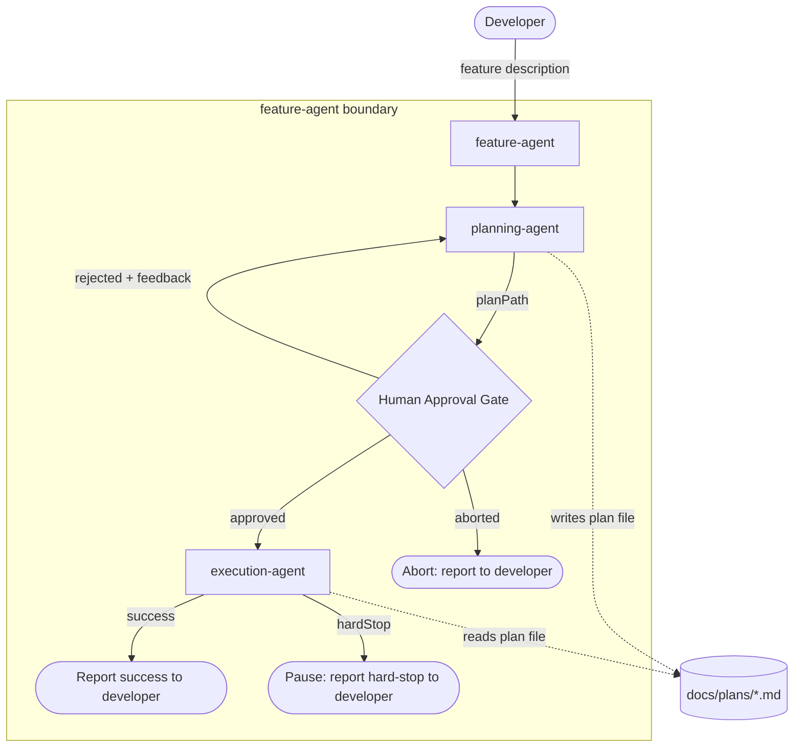

# Feature-Agent Orchestrator Plan

## Plan Metadata

- Plan type: `plan`
- Parent plan: N/A
- Depends on: N/A
- Status: `approved`

Status semantics:
- `draft`: Plan is being created or updated and is not final.
- `approved`: Plan is approved but not yet applied in code.
- `documentation`: Code currently exists and matches the plan contract.

Update rule:
- When an existing plan is edited, set status to `draft` until re-approved.

## System Intent

- What is being built: `feature-agent` — a new orchestrator agent that sequences `planning-agent` → human approval gate → `execution-agent`. The approval gate includes a feedback-and-retry loop so the developer can reject a plan and get a revised one before execution begins.
- Primary consumer(s): Developers who want to go from a feature idea to working code in a single invocation without manually coordinating the planning and execution agents.
- Boundary (black-box scope only): `feature-agent` owns only the sequencing and approval gate. It delegates all planning work to `planning-agent` and all execution work to `execution-agent` without modifying either. `CLAUDE.md` is updated to register the new agent in the Agents table.

## Stage Gate Tracker

- [ ] Stage 1 Mermaid approved
- [ ] Stage 2 I/O contracts approved
- [ ] Stage 3 pseudocode/technical details approved

## 1. Mermaid Diagram



## 2. Black-Box Inputs and Outputs

### Global Types

```txt
FeatureDescription {
  description: string (natural-language description of the feature to build)
}

PlanPath {
  value: string (absolute path to the plan file, e.g. docs/plans/2026-04-25-foo.md)
}

ApprovalDecision {
  approved: boolean
  feedback: string | null (required when approved=false; null when approved=true)
}

HardStopReport {
  hardStop: true
  reason: string (description of the deviation that caused the stop)
}

SuccessReport {
  allFlowsGreen: true
}
```

### Flow: `orchestrateFeature`
- Test files: N/A
- Core files: `agents/featurework/agents/feature-agent.md`

#### Type Definitions

```txt
OrchestrateFeatureInput {
  description: FeatureDescription (required)
}

OrchestrateFeatureOutput (success) {
  status: "complete"
  planPath: PlanPath
}

OrchestrateFeatureOutput (aborted) {
  status: "aborted"
  reason: string
}

OrchestrateFeatureOutput (hard-stop) {
  status: "hard-stop"
  planPath: PlanPath
  reason: string
}
```

#### Paths

| path-name | input | output/expected state change | path-type | notes | updated |
| --- | --- | --- | --- | --- | --- |
| `orchestrateFeature.success` | `OrchestrateFeatureInput` | `OrchestrateFeatureOutput status=complete; plan file exists, all flows green` | `happy path` | developer approves on first presentation | |
| `orchestrateFeature.approve-after-retry` | `OrchestrateFeatureInput` | `OrchestrateFeatureOutput status=complete; revised plan file exists, all flows green` | `subpath` | developer rejects with feedback one or more times before approving | |
| `orchestrateFeature.aborted` | `OrchestrateFeatureInput` | `OrchestrateFeatureOutput status=aborted` | `error` | developer explicitly cancels rather than approving or giving feedback | |
| `orchestrateFeature.hard-stop` | `OrchestrateFeatureInput` | `OrchestrateFeatureOutput status=hard-stop; execution paused pending plan revision` | `error` | execution-agent returns hardStop=true; feature-agent surfaces the pause and stops | |

---

### Flow: `invokePlanningAgent`
- Test files: N/A
- Core files: `agents/featurework/agents/feature-agent.md`

#### Type Definitions

```txt
InvokePlanningAgentInput {
  description: FeatureDescription (required)
  feedback: string | null (null on first invocation; developer rejection feedback on retry)
}

InvokePlanningAgentOutput {
  planPath: PlanPath (path to the written plan file)
}
```

#### Paths

| path-name | input | output/expected state change | path-type | notes | updated |
| --- | --- | --- | --- | --- | --- |
| `invokePlanningAgent.success` | `InvokePlanningAgentInput` | `InvokePlanningAgentOutput; plan file written to docs/plans/` | `happy path` | planning-agent writes the file; feature-agent reads planPath from the return value | |
| `invokePlanningAgent.retry-with-feedback` | `InvokePlanningAgentInput feedback!=null` | `InvokePlanningAgentOutput; revised plan file written` | `subpath` | on retry, feature-agent passes prior feedback so planning-agent can revise | |
| `invokePlanningAgent.failure` | `InvokePlanningAgentInput` | `abort with error message` | `error` | planning-agent errors or returns no planPath | |

---

### Flow: `humanApprovalGate`
- Test files: N/A
- Core files: `agents/featurework/agents/feature-agent.md`

#### Type Definitions

```txt
HumanApprovalGateInput {
  planPath: PlanPath
  attemptNumber: number (1-based; increments on each retry)
}

HumanApprovalGateOutput {
  decision: ApprovalDecision
}
```

#### Paths

| path-name | input | output/expected state change | path-type | notes | updated |
| --- | --- | --- | --- | --- | --- |
| `humanApprovalGate.approved` | `HumanApprovalGateInput` | `ApprovalDecision approved=true` | `happy path` | developer responds with approval; proceed to execution-agent | |
| `humanApprovalGate.rejected-with-feedback` | `HumanApprovalGateInput` | `ApprovalDecision approved=false feedback=<text>` | `subpath` | developer supplies feedback; loop back to planning-agent | |
| `humanApprovalGate.aborted` | `HumanApprovalGateInput` | `ApprovalDecision approved=false feedback=null` | `error` | developer cancels without feedback; feature-agent stops and reports aborted | |

---

### Flow: `invokeExecutionAgent`
- Test files: N/A
- Core files: `agents/featurework/agents/feature-agent.md`

#### Type Definitions

```txt
InvokeExecutionAgentInput {
  planPath: PlanPath (must point to a plan with status=approved)
}

InvokeExecutionAgentOutput {
  result: SuccessReport | HardStopReport
}
```

#### Paths

| path-name | input | output/expected state change | path-type | notes | updated |
| --- | --- | --- | --- | --- | --- |
| `invokeExecutionAgent.success` | `InvokeExecutionAgentInput` | `SuccessReport allFlowsGreen=true` | `happy path` | all flows implemented and tests pass | |
| `invokeExecutionAgent.hard-stop` | `InvokeExecutionAgentInput` | `HardStopReport hardStop=true` | `error` | execution-agent hit a deviation; feature-agent surfaces the pause and stops without re-invoking | |

---

### Flow: `updateClaudeMd`
- Test files: N/A
- Core files: `CLAUDE.md`

#### Type Definitions

```txt
UpdateClaudeMdInput {
  agentName: string = "feature-agent"
  description: string (one-line description for the Agents table)
}

UpdateClaudeMdOutput {
  updated: boolean
}
```

#### Paths

| path-name | input | output/expected state change | path-type | notes | updated |
| --- | --- | --- | --- | --- | --- |
| `updateClaudeMd.success` | `UpdateClaudeMdInput` | `CLAUDE.md Agents table contains feature-agent row` | `happy path` | insert row in alphabetical or logical order in the table | |

## 3. Pseudocode / Technical Details for Critical Flows

### Main orchestration loop

```
feature-agent(description):

  feedback = null
  attemptNumber = 1

  LOOP:
    # Step 1: invoke planning-agent
    planResult = invoke planning-agent(
      description = description,
      feedback = feedback       # null on first pass; rejection text on retries
    )

    IF planResult is error:
      report error to developer
      STOP

    planPath = planResult.planPath

    # Step 2: present plan and request approval
    display "Plan written to <planPath>. Please review."
    display contents of planPath to developer

    response = await developer input
      (ask: "Approve this plan? Reply 'yes' to proceed, or provide feedback to revise.")

    IF response == "abort" OR (response is rejection AND feedback is empty/null):
      report "Feature work aborted by developer." to developer
      STOP

    IF response == "yes" OR response == "approve":
      decision = { approved: true, feedback: null }
    ELSE:
      # Treat any non-approval as feedback for a retry
      decision = { approved: false, feedback: response }
      feedback = response
      attemptNumber += 1
      CONTINUE LOOP   # go back to planning-agent

    # Step 3: explicit approval received — invoke execution-agent
    BREAK LOOP

  execResult = invoke execution-agent(planPath = planPath)

  IF execResult.hardStop == true:
    report "Execution paused: hard-stop triggered. Reason: <execResult.reason>." to developer
    report "Edit the plan at <planPath> and re-invoke execution-agent when ready."
    STOP

  # execResult.allFlowsGreen == true
  report "Feature complete. Plan: <planPath>." to developer
  STOP
```

- Implementation notes:
  - `feature-agent` must never modify `planning-agent` or `execution-agent`.
  - The approval gate is a plain conversational prompt to the developer — no tool call or sub-agent needed.
  - When passing feedback to `planning-agent` on a retry, prepend a clear instruction such as "Revise the plan based on this developer feedback: <feedback>" so the planning-agent understands the context.
  - After a hard-stop from `execution-agent`, `feature-agent` does NOT re-invoke `execution-agent`. The developer resumes manually.
  - The `feature-agent` file lives at `agents/featurework/agents/feature-agent.md`. The `agents/featurework/` directory must be created.

### CLAUDE.md update

```
Edit CLAUDE.md Agents table:
  Add row:
    | `feature-agent` | Orchestrates end-to-end feature work: invokes planning-agent, gates on human approval (with feedback-and-retry), then invokes execution-agent. |
```

- Implementation notes:
  - Insert the row in the Agents table in `CLAUDE.md`.
  - Do not modify any other row or section.
