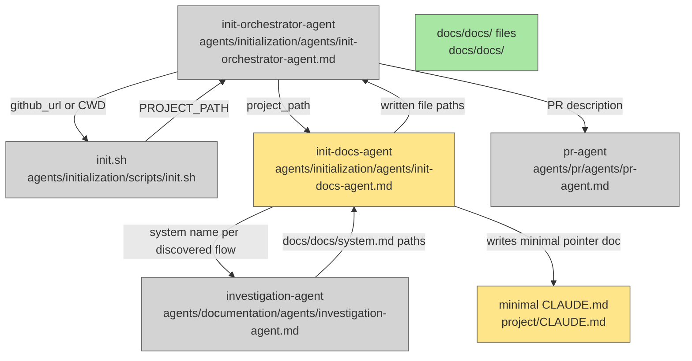

# Plan: Fix Init Flow — docs/docs/ generation + minimal CLAUDE.md

**Date:** 2026-04-25  
**Status:** draft  
**Updates:** `agents/initialization/agents/init-docs-agent.md`

---

## Stage 1 — Architecture Diagram



**Node legend:**
- Gray — no changes
- Yellow — updated
- Green — new output artifact
- Red — deleted (none in this change)

**Boundaries:**
- `init.sh`, `init-orchestrator-agent`, `pr-agent` are **out of scope** — no changes required.
- `investigation-agent` is **out of scope** — called as-is, no changes.

**Stage 1 gate:** [ ] approved

---

## Stage 2 — Flow Contracts

### Flow 1: init-docs-agent — discover systems and generate docs/docs/

**Purpose:** Replace the current monolithic CLAUDE.md generation with per-system doc generation via `investigation-agent`, followed by writing a minimal CLAUDE.md pointer doc.

#### Input

| Field | Type | Source |
|---|---|---|
| `project_path` | string (directory path) | `init-orchestrator-agent` |

#### Steps

1. Orient: read top-level directory listing of `project_path` to identify major systems/components (same as today — `ls -la <project_path>`).
2. For each major system or flow discovered, invoke `investigation-agent` with the system name and `project_path` as context. The investigation-agent writes `<project_path>/docs/docs/<system-name>.md`.
3. After all investigations complete, write a minimal `<project_path>/CLAUDE.md` using the structure defined below.
4. Return all written file paths to caller.

#### What counts as a "major system"

Use the same heuristics the current agent uses for architecture sections — primary source directories, entry points, CI/deploy scripts. Each distinct concern (e.g., API layer, worker, data model, CI pipeline) becomes one `investigation-agent` invocation. For small projects this may be 2–4 systems; for large ones, more. If the project has no clear system boundaries, use a single invocation for the whole project.

#### Output

| Field | Type | Description |
|---|---|---|
| written paths | string[] | All files written: `docs/docs/*.md` + `CLAUDE.md` |

#### Paths table

| Path | Description |
|---|---|
| Happy path | Project has identifiable systems → investigation-agent runs per system → docs written → minimal CLAUDE.md written → paths returned |
| No clear system boundaries | Fall back to single `investigation-agent` call for the whole project |
| `investigation-agent` fails for one system | Log the failure, skip that system, continue with remaining systems and still write CLAUDE.md |
| `project_path` does not exist | Return error immediately, do not proceed |

---

### Flow 2: minimal CLAUDE.md — content and structure

**Purpose:** Define exactly what the new minimal CLAUDE.md contains so init-docs-agent can write it correctly.

#### Input

| Field | Type | Source |
|---|---|---|
| `project_path` | string | init-docs-agent internal |
| `project_name` | string | derived from `basename(project_path)` |
| `docs_written` | string[] | paths returned by investigation-agent invocations |

#### Output — CLAUDE.md structure

```markdown
# <project_name>

This project is documented in `docs/`. See:

- `docs/docs/` — authoritative system documentation (source of truth for how this codebase works)
- `docs/plans/` — implementation plans for completed and in-progress work
- `docs/bugs/` — debugged and solved issues (audit logs)
```

No architecture section. No entry points table. No development instructions. No deploy section. No notes. Those all live in `docs/docs/` files generated by `investigation-agent`.

#### Paths table

| Path | Description |
|---|---|
| Happy path | `docs/written` non-empty → mention specific docs files if helpful, otherwise use the generic structure above |
| No docs written (all investigations failed) | Write CLAUDE.md with generic pointer text only |

**Stage 2 gate:** [ ] approved

---

## Stage 3 — Files Checklist

| File | Change type |
|---|---|
| `agents/initialization/agents/init-docs-agent.md` | Updated — replace body with new behavior (invoke investigation-agent, write minimal CLAUDE.md) |

No other files require changes.

**Stage 3 gate:** [ ] approved

---

## Acceptance Criteria

- [ ] `init-docs-agent` no longer writes architecture/entry-points/development/deploy/notes sections to CLAUDE.md
- [ ] `init-docs-agent` invokes `investigation-agent` for each major system found in the project
- [ ] `investigation-agent` produces `docs/docs/*.md` files under `project_path`
- [ ] The generated `CLAUDE.md` contains only: project name, one-line description, and pointers to `docs/docs/`, `docs/plans/`, `docs/bugs/`
- [ ] `init-orchestrator-agent`, `init.sh`, `pr-agent`, and `investigation-agent` are not modified
- [ ] PR description updated to reflect "Adds docs/docs/ and CLAUDE.md" instead of "Adds CLAUDE.md"
