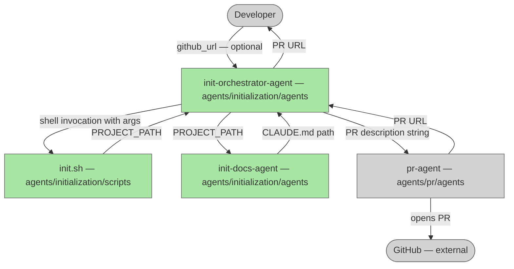

# Init Dark Factory

## Plan Metadata

- Plan type: `plan`
- Parent plan: N/A
- Depends on: N/A
- Status: `approved`

Status semantics:
- `draft`: Plan is being created or updated and is not final.
- `approved`: Plan is approved but not yet applied in code.
- `documentation`: Code currently exists and matches the plan contract.

Update rule:
- When an existing plan is edited, set status to `draft` until re-approved.

## System Intent

- What is being built: An initialization system (`init-orchestrator-agent`) that sets up any project to use dark factory. It runs a shell script to establish the canonical `<name>/<name>/` directory structure, invokes `init-docs-agent` to generate a `CLAUDE.md` for the project, then opens a PR titled "init: dark factory" via `pr-agent`.
- Primary consumer(s): Developers onboarding a new or existing project to the dark factory workflow.
- Boundary (black-box scope only): `init-orchestrator-agent` owns sequencing only. `init.sh` owns filesystem setup. `init-docs-agent` owns CLAUDE.md generation. `pr-agent` owns PR lifecycle. GitHub and the target repository are external and out of scope.

## Stage Gate Tracker

- [x] Stage 1 Mermaid approved
- [x] Stage 2 Flows approved
- [x] Stage 3 Logs + Deployment approved or skipped

## Mermaid Diagram

> Use the `create-mermaid-diagram` skill to generate this diagram.



## Flows

### Global Types

```txt
ProjectPath {
  value: string (relative path to the nested project root, e.g. "myrepo/myrepo/")
}

PrUrl {
  value: string (URL of the opened pull request)
}

StandardError {
  message: string (human-readable description of what went wrong)
}
```

### Flow: `runInitScript`
- Test files: N/A
- Core files: `agents/initialization/scripts/init.sh`

#### Types

```txt
RunInitScriptInput {
  github_url: string | null (HTTPS or SSH GitHub remote URL; null for existing-project case)
  cwd: string (current working directory when script is invoked)
}

RunInitScriptOutput {
  project_path: ProjectPath
}
```

#### Paths

| path | input | output | path-type | notes | updated |
| --- | --- | --- | --- | --- | --- |
| `runInitScript.clone` | `RunInitScriptInput github_url!=null` | `RunInitScriptOutput; repo-name/repo-name/ created` | `happy path` | repo-name = basename of URL with .git stripped | |
| `runInitScript.move` | `RunInitScriptInput github_url=null` | `RunInitScriptOutput; dirname/dirname/ created, all files copied in including dotfiles` | `happy path` | dirname = basename of cwd | |
| `runInitScript.dir-exists` | `RunInitScriptInput` | `StandardError; no filesystem change` | `error` | script exits non-zero; orchestrator stops and reports | |

#### Pseudocode

```
# clone case
REPO_NAME = basename(github_url).replace(".git", "")
mkdir REPO_NAME && cd REPO_NAME && git clone github_url
echo "PROJECT_PATH=${REPO_NAME}/${REPO_NAME}"

# move case (existing project)
DIRNAME = basename(cwd)
mkdir DIRNAME
find . -maxdepth 1 ! -name '.' ! -name DIRNAME -exec cp -rp {} DIRNAME/ +
# captures dotfiles (.git, .env, .github/, etc.)
# set -euo pipefail propagates any cp failure as non-zero exit
# using + batches cp calls for efficiency (one invocation per batch)
echo "PROJECT_PATH=${DIRNAME}/${DIRNAME}"
```

---

### Flow: `generateDocs`
- Test files: N/A
- Core files: `agents/initialization/agents/init-docs-agent.md`

#### Types

```txt
GenerateDocsInput {
  project_path: ProjectPath
}

GenerateDocsOutput {
  claude_md_path: string (path to the written CLAUDE.md file)
}
```

#### Paths

| path | input | output | path-type | notes | updated |
| --- | --- | --- | --- | --- | --- |
| `generateDocs.success` | `GenerateDocsInput` | `GenerateDocsOutput; CLAUDE.md written at project_path/CLAUDE.md` | `happy path` | init-docs-agent explores project and fills each CLAUDE.md section from code evidence | |
| `generateDocs.failure` | `GenerateDocsInput` | `StandardError; no CLAUDE.md written` | `error` | orchestrator stops; does not attempt PR | |

---

### Flow: `orchestrateInit`
- Test files: N/A
- Core files: `agents/initialization/agents/init-orchestrator-agent.md`

#### Types

```txt
OrchestrateInitInput {
  github_url: string | null
}

OrchestrateInitOutput {
  status: "complete" | "failed"
  pr_url: PrUrl | null
  reason: string | null (populated on failure)
}
```

#### Paths

| path | input | output | path-type | notes | updated |
| --- | --- | --- | --- | --- | --- |
| `orchestrateInit.clone-success` | `OrchestrateInitInput github_url!=null` | `OrchestrateInitOutput status=complete; repo cloned, CLAUDE.md generated, PR opened` | `happy path` | | |
| `orchestrateInit.move-success` | `OrchestrateInitInput github_url=null` | `OrchestrateInitOutput status=complete; files moved, CLAUDE.md generated, PR opened` | `happy path` | | |
| `orchestrateInit.script-failure` | `OrchestrateInitInput` | `OrchestrateInitOutput status=failed` | `error` | init.sh exits non-zero; stop immediately | |
| `orchestrateInit.docs-failure` | `OrchestrateInitInput` | `OrchestrateInitOutput status=failed` | `error` | init-docs-agent fails; stop before opening PR | |
| `orchestrateInit.pr-failure` | `OrchestrateInitInput` | `OrchestrateInitOutput status=failed` | `error` | pr-agent fails; CLAUDE.md exists but no PR opened | |

## Logs

N/A — no runtime logging; all output is via agent console messages.

## Deployment

- Mechanism: `local only`
- Deploy command:
  ```bash
  bash agents/initialization/scripts/init.sh [github-url]
  ```
- Notes: Script must be run from the intended parent directory. After script completes, invoke `init-docs-agent` with the resulting `PROJECT_PATH`, then `pr-agent`.

## Handoff to Related Plan Reconciliation

After all stages are approved, apply `.agent/skills/reconcile-plans/SKILL.md` to propagate contract updates across linked plans.
