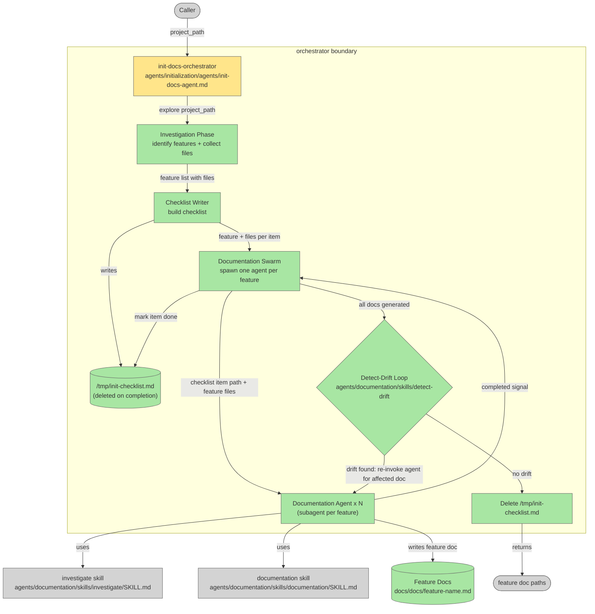

# Init-Docs Agent Redesign — Documentation Orchestrator

## Plan Metadata

- Plan type: `plan`
- Parent plan: N/A
- Depends on: N/A
- Status: `approved`

Status semantics:
- `draft`: Plan is being created or updated and is not final.
- `approved`: Plan is approved but not yet applied in code.
- `documentation`: Code currently exists and matches the plan contract.

Update rule:
- When an existing plan is edited, set status to `draft` until re-approved.

## System Intent

- What is being built: A redesigned `init-docs-agent` that acts as a documentation orchestrator instead of a single monolithic agent. It replaces the existing single-agent that wrote one CLAUDE.md with an orchestrator that identifies discrete features in a project, creates a checklist, then spawns a documentation agent per feature in parallel.
- Primary consumer(s): Developers (and other agents, e.g. `init.sh`) who call `init-docs-agent` with a `project_path` to initialize documentation for a new or undocumented project.
- Boundary (black-box scope only): The orchestrator owns investigation, checklist creation, agent spawning, and checklist status updates. Each spawned documentation agent owns the actual feature doc. The `investigate` skill and `documentation` skill (both under `agents/documentation/skills/`) are treated as black-box dependencies — this plan does not modify them.

## Stage Gate Tracker

- [x] Stage 1 Mermaid approved
- [x] Stage 2 Flows approved
- [x] Stage 3 Logs + Deployment approved or skipped

## Mermaid Diagram

> Generated and validated with `mmdc` — no parse errors.



## Flows

- Flow naming rule: ``### Flow: `<flowname>` ``
- `N/A` for test files means explicit no-test-required waiver (not a missing mapping).

### Global Types

```txt
StandardError {
  message: string (human-readable description of what went wrong)
}

FeatureItem {
  name: string (short label, e.g. "user auth", "image upload")
  files: string[] (list of relevant file paths within project_path)
  status: "pending" | "done"
}

DriftReport {
  has_drift: boolean
  affected_docs: string[] (paths to docs/docs/<feature>.md files that have drift)
  findings: string (human-readable summary from detect-drift skill)
}
```

---

### Flow: `orchestrate`
- Test files: N/A
- Core files: `agents/initialization/agents/init-docs-agent.md`

#### Types

```txt
OrchestratorInput {
  project_path: string (required — absolute path to the project directory to document)
}

OrchestratorOutput {
  feature_doc_paths: string[] (paths to all docs/docs/<feature>.md files written and verified)
}
```

#### Paths

| path | input | output | path-type | notes | updated |
| --- | --- | --- | --- | --- | --- |
| `orchestrate.success` | `OrchestratorInput` | `OrchestratorOutput` | `happy path` | All features documented; detect-drift reports no drift; checklist deleted | |
| `orchestrate.no-features-found` | `OrchestratorInput` | `StandardError` | `error` | Investigation phase finds no identifiable features; checklist not created | |
| `orchestrate.agent-failure` | `OrchestratorInput` | `OrchestratorOutput (partial)` | `error` | One or more documentation agents fail; failed features are skipped in drift loop; orchestrator returns partial results; checklist deleted regardless | |

#### Pseudocode

```
function orchestrate(project_path):
  // Phase 1 — Investigation
  features = investigateProject(project_path)
    // explore directory tree, identify discrete features
    // collect relevant files per feature
  if features is empty:
    return StandardError("No identifiable features found in project")

  // Phase 2 — Checklist (written to /tmp, not inside the project)
  checklist_path = "/tmp/init-checklist.md"
  writeChecklist(checklist_path, features)
    // write [ ] per feature + associated file list

  // Phase 3 — Documentation Swarm (parallel)
  doc_paths = []
  for each feature in features (run in parallel):
    doc_path = spawnDocumentationAgent(feature, project_path)
      // agent uses investigate skill + documentation skill
      // writes docs/docs/<feature-name>.md inside project_path
    if doc_path succeeded:
      updateChecklist(checklist_path, feature, done=true)
      doc_paths.append(doc_path)

  // Phase 4 — Detect-Drift Loop
  loop:
    report = runDetectDrift(doc_paths)
      // calls agents/documentation/skills/detect-drift/SKILL.md
      // audits all docs in doc_paths against actual code
    if report.has_drift == false:
      break
    for each affected_doc in report.affected_docs:
      feature = featureForDoc(affected_doc)
      spawnDocumentationAgent(feature, project_path)
        // re-generates the affected doc in-place

  // Phase 5 — Cleanup
  delete(checklist_path)

  return { feature_doc_paths: doc_paths }
```

---

### Flow: `investigate-project`
- Test files: N/A
- Core files: `agents/initialization/agents/init-docs-agent.md`

#### Types

```txt
InvestigateInput {
  project_path: string (absolute path to the project directory)
}

InvestigateOutput {
  features: FeatureItem[] (list of identified features with associated files)
}
```

#### Paths

| path | input | output | path-type | notes | updated |
| --- | --- | --- | --- | --- | --- |
| `investigate-project.success` | `InvestigateInput` | `InvestigateOutput` | `happy path` | One or more features found; each has at least one associated file | |
| `investigate-project.no-features` | `InvestigateInput` | `InvestigateOutput { features: [] }` | `error` | Project is empty or structure is unrecognisable; caller handles this as fatal | |

#### Pseudocode

```
function investigateProject(project_path):
  // Walk directory tree; use investigation heuristics to identify discrete subsystems
  // Group related files under a named feature
  // Return list of FeatureItem with status = "pending"
```

---

### Flow: `spawn-documentation-agent`
- Test files: N/A
- Core files: `agents/initialization/agents/init-docs-agent.md`, `agents/documentation/skills/investigate/SKILL.md`, `agents/documentation/skills/documentation/SKILL.md`

#### Types

```txt
DocAgentInput {
  feature: FeatureItem
  project_path: string
}

DocAgentOutput {
  doc_path: string (absolute path to the written docs/docs/<feature-name>.md)
}
```

#### Paths

| path | input | output | path-type | notes | updated |
| --- | --- | --- | --- | --- | --- |
| `spawn-documentation-agent.success` | `DocAgentInput` | `DocAgentOutput` | `happy path` | Documentation written; file exists at doc_path | |
| `spawn-documentation-agent.failure` | `DocAgentInput` | `StandardError` | `error` | Agent fails or produces no output; orchestrator marks this feature's checklist item as failed and continues | |

#### Pseudocode

```
function spawnDocumentationAgent(feature, project_path):
  // Subagent runs in parallel with other documentation agents
  // Step 1: run investigate skill on feature.files to deepen context
  // Step 2: run documentation skill to write docs/docs/<feature.name>.md
  // Step 3: return absolute path of written doc
```

---

### Flow: `detect-drift-loop`
- Test files: N/A
- Core files: `agents/initialization/agents/init-docs-agent.md`, `agents/documentation/skills/detect-drift/SKILL.md`

#### Types

```txt
DetectDriftLoopInput {
  doc_paths: string[] (paths to all generated feature docs to audit)
}

DetectDriftLoopOutput {
  verified_doc_paths: string[] (paths to docs that passed drift check)
}
```

#### Paths

| path | input | output | path-type | notes | updated |
| --- | --- | --- | --- | --- | --- |
| `detect-drift-loop.clean` | `DetectDriftLoopInput` | `DetectDriftLoopOutput` | `happy path` | First detect-drift pass finds no drift; loop exits immediately | |
| `detect-drift-loop.fixed-on-retry` | `DetectDriftLoopInput` | `DetectDriftLoopOutput` | `happy path` | Drift found on first pass; affected docs re-generated; second pass finds no drift | |
| `detect-drift-loop.persistent-drift` | `DetectDriftLoopInput` | `DetectDriftLoopOutput (partial)` | `error` | Drift in a doc cannot be resolved after re-generation (e.g. underlying code is ambiguous); orchestrator logs the unresolved doc and excludes it from output | |

#### Pseudocode

```
function detectDriftLoop(doc_paths):
  loop:
    report = runDetectDrift(doc_paths)
      // calls detect-drift skill
      // report.has_drift: boolean
      // report.affected_docs: string[] of doc paths with drift
    if not report.has_drift:
      return { verified_doc_paths: doc_paths }
    for each doc in report.affected_docs:
      feature = featureForDoc(doc)
      spawnDocumentationAgent(feature, project_path)
        // re-generates the affected doc in-place
  // (loop continues until no drift is reported)
```

ONCE YOU GET APPROVAL FROM THE DEVELOPER, DELETE THIS LINE AND UPDATE THE STAGE GATE TRACKER

## Logs

| Source | Location |
|--------|----------|
| init-docs-orchestrator | local stdout (no persistent log target — agent-only execution) |

## Deployment

- Mechanism: `local only`
- Deploy command:
  ```bash
  # No deploy step — agent file is invoked directly by the Claude Code harness
  ```
- Notes: The agent file at `agents/initialization/agents/init-docs-agent.md` is replaced in-place. No infrastructure changes required.

ONCE YOU GET APPROVAL FROM THE DEVELOPER, DELETE THIS LINE AND UPDATE THE STAGE GATE TRACKER

## Handoff to Related Plan Reconciliation

After all stages are approved, apply `.agent/skills/reconcile-plans/SKILL.md` to propagate contract updates across linked plans.
