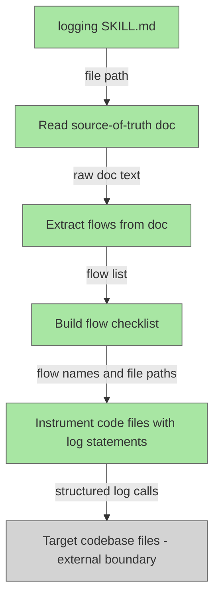

# Logging Skill

## Plan Metadata

- Plan type: `plan`
- Parent plan: N/A
- Depends on: N/A
- Status: `approved`

Status semantics:
- `draft`: Plan is being created or updated and is not final.
- `approved`: Plan is approved but not yet applied in code.
- `documentation`: Code currently exists and matches the plan contract.

Update rule:
- When an existing plan is edited, set status to `draft` until re-approved.

## System Intent

- What is being built: A code-writing skill (`skills/logging/SKILL.md`) that instruments a target codebase with structured log statements. The skill reads a source-of-truth doc file (plan, bug report, or documentation file) to identify the flows present in that codebase, builds a per-flow checklist, then writes structured log calls — `flow | step | data` — directly into the relevant code files.
- Primary consumer(s): Claude Code agents executing the logging skill against a target codebase, and downstream debugger agents that parse the emitted structured logs.
- Boundary (black-box scope only): The skill owns the logic for reading the source-of-truth doc, identifying flows, and writing log statements. The target codebase files are treated as an external boundary — the skill writes into them but does not own them. The downstream log-ingestion / debugger agent is out of scope.

## Stage Gate Tracker

- [x] Stage 1 Mermaid approved
- [x] Stage 2 I/O contracts approved
- [x] Stage 3 pseudocode/technical details approved

## 1. Mermaid Diagram



## 2. Black-Box Inputs and Outputs

### Global Types

```txt
FlowName {
  value: string (stable identifier for an end-to-end user or system flow)
}

StepName {
  value: string (specific action or transition within a flow)
}

LogStatement {
  flow: FlowName
  step: StepName
  data: object (relevant runtime context — no secrets or PII)
}

FlowEntry {
  flow: FlowName
  description: string (human-readable purpose of the flow)
  steps: StepName[] (ordered list of meaningful steps identified in the doc)
  codeFiles: string[] (paths to source files that implement this flow)
}

ChecklistItem {
  flow: FlowName
  done: boolean (whether log statements have been written for this flow)
}
```

### Flow: `identifySourceOfTruth`
- Test files: N/A
- Core files: `skills/logging/SKILL.md`

#### Type Definitions

```txt
IdentifySourceOfTruthInput {
  hint: string (optional — user-supplied path or description pointing to the plan/bug/doc file)
}

IdentifySourceOfTruthOutput {
  docPath: string (absolute or repo-relative path to the source-of-truth file)
  docType: string ("plan" | "bug" | "doc" — inferred from file location or frontmatter)
}
```

#### Paths

| path-name | input | output/expected state change | path-type | notes | updated |
| --- | --- | --- | --- | --- | --- |
| `identifySourceOfTruth.hint-provided` | `IdentifySourceOfTruthInput` with hint | `IdentifySourceOfTruthOutput` with resolved path | `happy path` | Use the hint directly; confirm file exists | Y |
| `identifySourceOfTruth.infer-from-context` | `IdentifySourceOfTruthInput` with no hint | `IdentifySourceOfTruthOutput` with inferred path | `happy path` | Search `docs/plans/`, `docs/bugs/`, `docs/docs/` for the most relevant file given current task context | Y |
| `identifySourceOfTruth.not-found` | `IdentifySourceOfTruthInput` | error: no suitable file found | `error` | Stop and ask the user to specify the file; do not proceed | |

---

### Flow: `extractFlows`
- Test files: N/A
- Core files: `skills/logging/SKILL.md`

#### Type Definitions

```txt
ExtractFlowsInput {
  docPath: string (path to source-of-truth file)
}

ExtractFlowsOutput {
  flows: FlowEntry[] (all flows found in the document)
}
```

#### Paths

| path-name | input | output/expected state change | path-type | notes | updated |
| --- | --- | --- | --- | --- | --- |
| `extractFlows.success` | `ExtractFlowsInput` | `ExtractFlowsOutput` with one or more flows | `happy path` | Parse section headers, flow tables, or named sequences from the doc; derive step names from path rows or prose | Y |
| `extractFlows.no-flows-found` | `ExtractFlowsInput` | error: zero flows extracted | `error` | Warn the user; the doc may not describe flows in a parseable way — ask for clarification before continuing | |

---

### Flow: `buildChecklist`
- Test files: N/A
- Core files: `skills/logging/SKILL.md`

#### Type Definitions

```txt
BuildChecklistInput {
  flows: FlowEntry[]
}

BuildChecklistOutput {
  checklist: ChecklistItem[] (one item per flow, all initially done=false)
}
```

#### Paths

| path-name | input | output/expected state change | path-type | notes | updated |
| --- | --- | --- | --- | --- | --- |
| `buildChecklist.success` | `BuildChecklistInput` | `BuildChecklistOutput` | `happy path` | Emit the checklist to the user before instrumenting so progress is visible | Y |

---

### Flow: `instrumentCode`
- Test files: N/A
- Core files: `skills/logging/SKILL.md`

#### Type Definitions

```txt
InstrumentCodeInput {
  flow: FlowEntry (single flow being instrumented)
}

InstrumentCodeOutput {
  filesModified: string[] (paths of files that received new log statements)
  logStatementsAdded: LogStatement[] (each statement that was inserted)
}
```

#### Paths

| path-name | input | output/expected state change | path-type | notes | updated |
| --- | --- | --- | --- | --- | --- |
| `instrumentCode.success` | `InstrumentCodeInput` | `InstrumentCodeOutput`; target files contain new log calls | `happy path` | Insert logs at: flow entry, each meaningful step transition, branching decisions, external I/O boundaries, and error paths | Y |
| `instrumentCode.file-not-found` | `InstrumentCodeInput` with unresolvable codeFiles | partial output; missing files reported | `error` | Log the gap, mark checklist item incomplete, continue to next flow | |
| `instrumentCode.unsupported-language` | `InstrumentCodeInput` for a language with no known log call pattern | partial output | `error` | Note the language and ask user for the correct log call syntax before proceeding | |

---

## 3. Pseudocode / Technical Details for Critical Flows

### Log statement format (language-agnostic contract)

Every inserted log call MUST follow this 3-part signature:

```
<logFn>( <flowName>, <stepName>, <dataObject> )
```

Language examples:
- JavaScript/TypeScript: `console.log("login", "submit", { username })`
- Python: `logger.info("login", "submit", {"username": username})`
- Go: `log.Info("login", "submit", map[string]any{"username": username})`

Rules:
- `flowName` — stable snake_case or kebab-case string matching the flow name in the source-of-truth doc
- `stepName` — action verb + subject, e.g. `"submit"`, `"validate-token"`, `"fetch-user"`
- `dataObject` — structured key-value context; omit secrets and PII; always an object/map, never a plain string

### `instrumentCode` execution strategy:

```
for each flow in checklist:
  read each file in flow.codeFiles
  identify log insertion points:
    - function/method entry points that begin the flow
    - each branch decision relevant to the flow
    - each external I/O call (API, DB, queue)
    - error catch blocks
    - flow exit / return points
  for each insertion point:
    derive step name from surrounding code context
    derive data object from locally-scoped variables
    insert log statement immediately before or at the point of action
  mark checklist item done
  report files modified and statements added
```

- Implementation notes: Prefer inserting logs at the call site (before the external call) so input context is captured even when the call fails. Use the flow name from the source-of-truth doc verbatim — do not normalize or abbreviate it.

## 4. Handoff to Related Plan Reconciliation

No linked plans at this time. When `skills/logging/SKILL.md` is authored and merged, update this plan's status to `documentation`.
