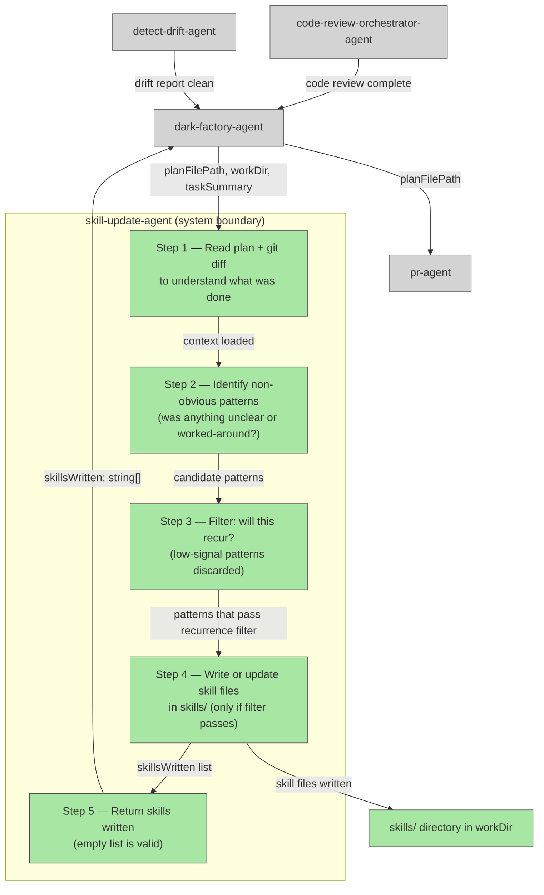

# skill-update-agent

## Plan Metadata

- Plan type: `plan`
- Parent plan: `docs/plans/2026-04-25-dark-factory-agent.md`
- Depends on: N/A
- Status: `approved`

Status semantics:
- `draft`: Plan is being created or updated and is not final.
- `approved`: Plan is approved but not yet applied in code.
- `documentation`: Code currently exists and matches the plan contract.

Update rule:
- When an existing plan is edited, set status to `draft` until re-approved.

## System Intent

- What is being built: A `skill-update-agent` that runs near the end of the `dark-factory-agent` manufacture loop (after code review and doc updates, before the PR step). It reviews the work that was just completed, identifies any non-obvious patterns or workarounds that were encountered during the task, and — only when those patterns are likely to recur — writes or updates skill files in the target project's `skills/` directory so future manufacture runs benefit from that knowledge.
- Primary consumer(s): `dark-factory-agent` (invokes it as Step 4c, between `detect-drift-agent` and `pr-agent`). Indirectly benefits future invocations of any agent that reads project skills.
- Boundary (black-box scope only): Accepts the completed work context (plan file path, work dir, and a summary of what was done). Produces zero or more new/updated skill files in `<workDir>/skills/`. Returns a list of skills written (may be empty). Does not open PRs, does not modify agent files, does not edit plans.

## Stage Gate Tracker

- [ ] Stage 1 Mermaid approved
- [ ] Stage 2 Flows approved
- [ ] Stage 3 Logs + Deployment approved or skipped

## Mermaid Diagram



ONCE YOU GET APPROVAL FROM THE DEVELOPER, DELETE THIS LINE AND UPDATE THE STAGE GATE TRACKER

## Flows

- Flow naming rule: ``### Flow: `<flowname>` ``
- `N/A` for test files means explicit no-test-required waiver (not a missing mapping).

### Global Types

```txt
StandardError {
  message: string (human-readable description of what went wrong)
}

SkillFile {
  path:    string  (relative path within workDir, e.g. "skills/handle-git-conflicts/SKILL.md")
  action:  "created" | "updated"
}
```

### Flow: `skillUpdateAgent`

- Test files: N/A (agent instruction file, no automated tests)
- Core files:
  - `agents/skill-update/agents/skill-update-agent.md` (new — the agent instruction file)

#### Types

```txt
SkillUpdateInput {
  planFilePath:  string | null  (path to the approved plan file for the completed task, or null)
  workDir:       string         (absolute path to the isolated work dir)
  taskSummary:   string         (brief human-readable description of what was accomplished)
}

SkillUpdateOutput {
  skillsWritten: SkillFile[]   (may be empty — agent wrote zero skills if nothing qualified)
}
```

#### Paths

| path | input | output | path-type | notes | updated |
| --- | --- | --- | --- | --- | --- |
| `skillUpdateAgent.noSkillsNeeded` | `SkillUpdateInput` | `SkillUpdateOutput { skillsWritten: [] }` | happy path | Agent determines no non-obvious recurring patterns exist; returns empty list | |
| `skillUpdateAgent.skillsWritten` | `SkillUpdateInput` | `SkillUpdateOutput` | happy path | One or more skill files written/updated in `skills/`; list returned | |
| `skillUpdateAgent.readError` | `SkillUpdateInput` | `StandardError` | error | Cannot read plan file or git diff; agent reports error; dark-factory-agent surfaces it but continues to PR (non-fatal) | |

#### Pseudocode

```
skill-update-agent(planFilePath, workDir, taskSummary):

  # Step 1 — gather context
  if planFilePath is not null:
    read planFilePath to understand what flows were built and why
  run git diff HEAD~1 or git log --oneline -5 in workDir to see what changed

  # Step 2 — identify candidate patterns
  For each non-obvious thing encountered during the task
  (detected by: comments like "NOTE", "WORKAROUND", "HACK", "non-obvious",
   repeated lookups in the plan pseudocode, deviations that were resolved,
   things the agent had to figure out that aren't documented anywhere):
    add to candidatePatterns list

  # Step 3 — recurrence filter
  For each candidate in candidatePatterns:
    Ask: "Is this specific to this one task, or would a future agent hit the same wall?"
    If task-specific only (e.g. a one-off data migration quirk): discard
    If general and likely to recur (e.g. "how to do X in this codebase"): keep

  if filteredPatterns is empty:
    return { skillsWritten: [] }

  # Step 4 — write/update skill files
  For each pattern in filteredPatterns:
    slug = kebab-case name for the pattern (e.g. "handle-git-conflicts")
    skillPath = "skills/<slug>/SKILL.md"

    if skillPath already exists in workDir:
      read existing skill, merge new knowledge, write updated file
    else:
      write new SKILL.md using the skill template:
        ---
        name: <slug>
        description: "<one sentence: what this skill does and when to use it>"
        user-invocable: false
        ---
        ## When to use
        <condition that triggers this skill>

        ## Steps
        <numbered steps describing what to do>

        ## Notes
        <any caveats or gotchas>

    record { path: skillPath, action: "created" | "updated" }

  # Step 5 — return
  return { skillsWritten: [recorded SkillFile entries] }
```

ONCE YOU GET APPROVAL FROM THE DEVELOPER, DELETE THIS LINE AND UPDATE THE STAGE GATE TRACKER

---

### Flow: `darkFactoryAgentIntegration`

- Test files: N/A (orchestration change to existing agent)
- Core files:
  - `agents/dark-factory/agents/dark-factory-agent.md` (updated — adds Step 4c)

#### Types

```txt
(reuses DarkFactoryInput / DarkFactoryOutput from parent plan)

DarkFactoryOutput updated to include:
DarkFactoryOutput {
  prUrl:         string
  merged:        true
  workDir:       string
  skillsWritten: SkillFile[]   (added — may be empty)
}
```

#### Paths

| path | input | output | path-type | notes | updated |
| --- | --- | --- | --- | --- | --- |
| `darkFactoryAgentIntegration.noSkills` | `DarkFactoryInput` | `DarkFactoryOutput { skillsWritten: [] }` | happy path | skill-update-agent ran, found nothing, manufacture continues normally | |
| `darkFactoryAgentIntegration.skillsAdded` | `DarkFactoryInput` | `DarkFactoryOutput` | happy path | skill-update-agent wrote skills; they are included in the PR diff | |
| `darkFactoryAgentIntegration.skillUpdateError` | `DarkFactoryInput` | `DarkFactoryOutput` | error (non-fatal) | skill-update-agent errors; dark-factory-agent logs warning and continues to pr-agent | |

#### Pseudocode

```
dark-factory-agent (updated step ordering):

  # Steps 1–4b unchanged (prep, route, code-review, update-docs, detect-drift)

  # Step 4c — NEW: skill update
  try:
    skillResult = invoke skill-update-agent with:
      planFilePath = planFilePath
      workDir      = workDir
      taskSummary  = taskDescription
    log "Skills written: " + skillResult.skillsWritten
  catch error:
    warn developer: "skill-update-agent failed: <error>. Continuing to PR."

  # Step 5 — PR (unchanged; any new skill files are already staged in workDir)
  prResult = openPR(planFilePath, taskDescription)
  ...
```

ONCE YOU GET APPROVAL FROM THE DEVELOPER, DELETE THIS LINE AND UPDATE THE STAGE GATE TRACKER

## Logs

| Source | Location |
|--------|----------|
| skill-update-agent stdout | terminal / caller stdout |
| dark-factory-agent (Step 4c) | terminal / caller stdout |

## Deployment

- Mechanism: `local only`
- Deploy command:
  ```bash
  # No deployment step — agent is a markdown file checked into the repo.
  # It is invoked automatically by dark-factory-agent as Step 4c.
  ```
- Notes: The skill-update-agent is non-fatal. If it errors, dark-factory-agent logs a warning and continues to the PR step. This ensures the manufacture loop is never blocked by skill-writing failures.

ONCE YOU GET APPROVAL FROM THE DEVELOPER, DELETE THIS LINE AND UPDATE THE STAGE GATE TRACKER

## Handoff to Related Plan Reconciliation

After all stages are approved, apply `.agent/skills/reconcile-plans/SKILL.md` to propagate contract updates across linked plans.
