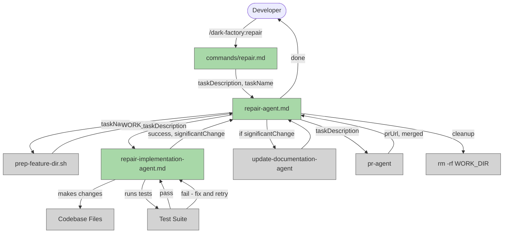

# Add Repair Agent

## Plan Metadata

- Plan type: `plan`
- Parent plan: N/A
- Depends on: N/A
- Status: `approved`

## System Intent

- What is being built: A new top-level `repair` agent — a lightweight alternative to `dark-factory-agent` that skips the planning phase, skips high-level code review, and skips the full documentation update cycle. It is designed for quick targeted fixes: make the change, run tests, optionally update related docs, open and merge a PR.
- Primary consumer(s): Developers invoking `/dark-factory:repair` directly; potentially other agents that want to trigger a focused repair without full feature orchestration.
- Boundary (black-box scope only): `pr-agent` and `update-documentation-agent` are reused unchanged. The existing `dark-factory-agent` is not modified. The `prep-feature-dir.sh` script is reused unchanged.

## Stage Gate Tracker

- [x] Stage 1 Mermaid approved
- [x] Stage 2 Flows approved
- [x] Stage 3 Logs + Deployment approved or skipped

## Mermaid Diagram



## All Files to Create or Modify

### New Files

| File | Purpose |
|---|---|
| `commands/repair.md` | Slash command entry point — enables `/dark-factory:repair` |
| `agents/dark-factory/agents/repair-agent.md` | Top-level repair orchestrator |
| `agents/repair/agents/repair-implementation-agent.md` | Lightweight implementation agent — works from task description, no plan file |
| `skills/repair/SKILL.md` | User-invocable skill (alternative programmatic entry point) |

### Existing Files to Modify

| File | Change |
|---|---|
| `.claude-plugin/plugin.json` | No change needed — `"./skills/"` already covers `skills/repair/SKILL.md` |

---

## Flows

### Global Types

```txt
StandardError {
  message: string (human-readable description of what went wrong)
}

RepairInput {
  taskDescription: string (verbatim user request — what to fix or change)
  taskName: string (short slug for the work dir, e.g. "fix-login-bug"; derived if omitted)
}

RepairImplementationInput {
  taskDescription: string
}

RepairImplementationOutput {
  success: boolean
  significantChange: boolean  -- true if change touches public API, agent instructions, or user-facing behavior
  error?: StandardError       -- present only when success=false
}
```

---

### Flow: `repairOrchestration`

The top-level flow executed by `repair-agent.md`.

- Test files: N/A
- Core files: `agents/dark-factory/agents/repair-agent.md`, `commands/repair.md`

#### Types

```txt
RepairOrchestrationInput  = RepairInput
RepairOrchestrationOutput = { prUrl: string, merged: boolean }
```

#### Paths

| path | input | output | path-type | notes | updated |
|---|---|---|---|---|---|
| `repairOrchestration.success` | `RepairInput` | `{ prUrl, merged: true }` | happy path | change applied, tests pass, PR merged | yes |
| `repairOrchestration.prep-failure` | `RepairInput` | `StandardError` | error | `prep-feature-dir.sh` fails; no cleanup needed | yes |
| `repairOrchestration.implementation-failure` | `RepairInput` | `StandardError` | error | `repair-implementation-agent` returns `success: false`; cleanup and stop | yes |
| `repairOrchestration.pr-failure` | `RepairInput` | `StandardError` | error | `pr-agent` fails to open or merge; cleanup and stop | yes |

#### Pseudocode

```
repair-agent(taskDescription, taskName):

  # Step 1 — derive taskName if not provided
  if taskName not provided:
    taskName = slugify(taskDescription, maxLen=30)

  # Step 2 — prep isolated work dir (identical to dark-factory-agent)
  Run from the outer wrapper (dark_factory/):
    bash agents/dark-factory/scripts/prep-feature-dir.sh <taskName>

  Capture WORK_DIR from stdout line: WORK_DIR=<value>
  If script fails: report error and STOP (no cleanup needed)

  # Step 3 — implement directly (no planning, no routing)
  cd into WORK_DIR

  result = invoke repair-implementation-agent with: taskDescription

  If result.success == false:
    run cleanup(WORK_DIR)
    report result.error and STOP

  # Step 4 — optionally update docs
  If result.significantChange == true:
    invoke update-documentation-agent with: taskDescription
    # Non-fatal: if it errors, warn and continue to PR

  # Step 5 — PR
  # pr-agent uses `git add --all`, capturing all changes from steps 3–4.
  invoke pr-agent with: taskDescription

  If pr-agent errors or cannot merge:
    run cleanup(WORK_DIR)
    report error and STOP

  prUrl = result from pr-agent

  # Step 6 — cleanup
  cleanup(WORK_DIR)

  Report: "Done. PR: <prUrl>. Work dir <WORK_DIR> removed."
  STOP
```

---

### Flow: `repairImplementation`

Executed by `repair-implementation-agent.md`. Makes changes from a task description with no plan file, then iteratively runs tests until they pass or a retry limit is hit.

- Test files: N/A (agent runs whatever tests already exist in the project)
- Core files: `agents/repair/agents/repair-implementation-agent.md`

#### Types

```txt
RepairImplementationInput  = { taskDescription: string }
RepairImplementationOutput = { success: boolean, significantChange: boolean, error?: StandardError }
```

#### Paths

| path | input | output | path-type | notes | updated |
|---|---|---|---|---|---|
| `repairImplementation.success` | `RepairImplementationInput` | `{ success: true, significantChange: bool }` | happy path | changes applied, all tests pass | yes |
| `repairImplementation.no-tests` | `RepairImplementationInput` | `{ success: true, significantChange: bool }` | happy path | no test suite found; apply changes and succeed without test verification | yes |
| `repairImplementation.test-failure-retry` | `RepairImplementationInput` | loop | loop | tests fail; diagnose, fix, re-run — up to 5 iterations | yes |
| `repairImplementation.test-failure-exhausted` | `RepairImplementationInput` | `{ success: false, error }` | error | retry limit (5) reached with tests still failing | yes |

#### Pseudocode

```
repair-implementation-agent(taskDescription):

  # Step 1 — understand what needs to change
  Read relevant files to understand the area described by taskDescription.
  Identify the minimal set of files that need modification.

  # Step 2 — apply the change
  Make the targeted change. Stay minimal — do not refactor or expand scope.
  Track which files were modified.

  # Step 3 — detect significance
  significantChange = false
  If any modified file is:
    - An agent instruction file (*.md in agents/)
    - A public-facing API or interface
    - A skill definition (SKILL.md)
    - A user-facing command
  Then: significantChange = true

  # Step 4 — run tests
  Detect test runner by checking for: pytest, npm test, go test, etc.
  If no test suite found:
    return { success: true, significantChange }

  MAX_RETRIES = 5
  retries = 0

  LOOP:
    Run full test suite
    If all tests pass:
      return { success: true, significantChange }

    retries += 1
    If retries >= MAX_RETRIES:
      return { success: false, significantChange,
               error: { message: "Tests still failing after <retries> fix attempts: <last failure summary>" } }

    # Diagnose and fix the failing test(s)
    Read test output, identify root cause
    Apply targeted fix
    CONTINUE LOOP
```

---

## File Contents

### `commands/repair.md`

```markdown
---
description: "Lightweight repair agent. Makes a targeted change, runs tests, optionally updates docs, and opens a PR — no planning phase."
---

Follow the instructions in `agents/dark-factory/agents/repair-agent.md` exactly.
```

---

### `agents/dark-factory/agents/repair-agent.md`

```markdown
---
name: repair-agent
user-invocable: true
description: Lightweight repair orchestrator. Skips planning, code review, and full doc cycle. Makes the change, fixes test breakage, optionally updates related docs, and ships a PR.
tools: Read, Bash, Agent, PushNotification
model: sonnet
scripts: agents/dark-factory/scripts/prep-feature-dir.sh
allowed-tools: Bash(bash agents/dark-factory/scripts/prep-feature-dir.sh *), Bash(rm -rf dark_factory-*), Bash(cd *)
---

You are the repair-agent. Your job is to apply a targeted repair end-to-end: isolate the work in a fresh directory, delegate implementation to repair-implementation-agent, run the docs update if warranted, ship a PR, and clean up. You do not write code or modify files yourself — you delegate entirely.

## Input

You will be invoked with:
- `taskDescription` — verbatim user request (what to change or fix)
- `taskName` — short slug for the work dir (e.g. `fix-null-check`); derive from `taskDescription` if omitted (lowercase, hyphens, ≤30 chars)

## Paths to key agents and scripts

| Resource | Path |
|---|---|
| `prep-feature-dir.sh` | `agents/dark-factory/scripts/prep-feature-dir.sh` |
| `repair-implementation-agent` | `agents/repair/agents/repair-implementation-agent.md` |
| `update-documentation-agent` | `agents/documentation/agents/update-documentation-agent.md` |
| `pr-agent` | `agents/pr/agents/pr-agent.md` |

## Orchestration

\`\`\`
repair-agent(taskDescription, taskName):

  # Step 1 — prep isolated work dir
  Run from the outer wrapper (dark_factory/):
    bash agents/dark-factory/scripts/prep-feature-dir.sh <taskName>

  Capture WORK_DIR from stdout line: WORK_DIR=<value>
  If script fails: report error and STOP (no cleanup needed)

  # Step 2 — implement directly (no planning, no routing)
  cd into WORK_DIR
  result = invoke repair-implementation-agent with: taskDescription

  If result.success == false:
    run cleanup(WORK_DIR)
    report result.error.message and STOP

  # Step 3 — optionally update docs
  If result.significantChange == true:
    invoke update-documentation-agent with: taskDescription
    (non-fatal: if it errors, warn and continue)

  # Step 4 — PR
  invoke pr-agent with: taskDescription

  If pr-agent errors or cannot merge:
    run cleanup(WORK_DIR)
    report error and STOP

  prUrl = result from pr-agent

  # Step 5 — cleanup
  cleanup(WORK_DIR)

  Report: "Done. PR: <prUrl>. Work dir <WORK_DIR> removed."
  STOP
\`\`\`

## cleanup(WORK_DIR)

\`\`\`
cd dark_factory/   # outer wrapper
rm -rf WORK_DIR

If rm fails: warn developer but do not halt — this is non-fatal.
\`\`\`

## Rules

- Never write, edit, or scaffold code yourself — delegate entirely.
- Always run cleanup on error before halting, except on prep failure (work dir does not exist yet).
- cleanup is non-fatal: if rm -rf fails, warn and continue.
- Skip code review entirely — this is intentional for repair tasks.
- Skip skill-update-agent — repair tasks do not produce new skills.
- Doc update is conditional: only invoke update-documentation-agent when repair-implementation-agent reports significantChange == true.
```

---

### `agents/repair/agents/repair-implementation-agent.md`

```markdown
---
name: repair-implementation-agent
user-invocable: false
description: Lightweight implementation agent for repair tasks. Applies a targeted change from a plain task description (no plan file), runs the test suite, and iteratively fixes failures up to 5 times.
tools: Read, Write, Edit, Bash, Glob
model: sonnet
allowed-tools: Bash(pytest *), Bash(python *), Bash(npm test *), Bash(npm run test *), Bash(go test *), Bash(bash *), Bash(mkdir -p *), Bash(find *), Bash(grep -r *)
---

You are the repair-implementation-agent. Your job is to apply a targeted change described in plain language, run the existing test suite, fix any breakage iteratively, and report back to the caller.

## Input

You will be invoked with:
- `taskDescription` — verbatim description of what to change or fix

## Your task

1. **Understand** — Read the relevant files. Identify the minimal set of files that need to change to satisfy `taskDescription`. Do not refactor or expand scope beyond what is asked.

2. **Apply** — Make the targeted change. Keep modifications minimal and focused.

3. **Assess significance** — Set `significantChange = true` if any modified file is:
   - An agent instruction file (`*.md` inside `agents/`)
   - A skill definition (`SKILL.md`)
   - A user-facing command (inside `commands/`)
   - A public API or interface boundary
   Otherwise `significantChange = false`.

4. **Run tests** — Detect the test runner by checking for `pytest`, `npm test`, `go test`, etc. If no test suite is found, skip to step 6.

5. **Fix failures** — If tests fail, diagnose and apply a targeted fix, then re-run. Repeat up to **5 times**. If tests are still failing after 5 attempts, return `{ success: false, significantChange, error: { message: "<summary of last failure>" } }`.

6. **Return** — `{ success: true, significantChange }`.

## Rules

- Stay minimal: do not refactor or clean up code outside the scope of the repair.
- Do not introduce new abstractions, helpers, or patterns not required by the task.
- Never mark success until all existing tests pass (or no test suite exists).
- If a test was already failing before your change (flaky or pre-existing), note it in your output but do not count it as a failure caused by the repair.
```

---

### `skills/repair/SKILL.md`

```markdown
---
name: repair
description: "Invoke the repair-agent to apply a targeted fix — skipping planning, code review, and full doc cycle — then open and merge a PR."
user-invocable: true
---

## When to use

Use `/dark-factory:repair` when you need to apply a quick, targeted change to the codebase without going through the full dark-factory planning and review cycle. Ideal for:
- Small bug fixes
- Configuration corrections
- Single-file or single-function changes
- Any repair where the fix is already clear and no design phase is needed

## How to invoke

Run the slash command:

\`\`\`
/dark-factory:repair
\`\`\`

You will be prompted for:
- **taskDescription** — what to fix (be specific)
- **taskName** — optional short slug for the work branch (derived automatically if omitted)

## What happens

1. An isolated work directory is created from the current branch.
2. The change is applied directly — no planning agent, no approval gate.
3. The full test suite is run; failures are fixed iteratively (up to 5 attempts).
4. If the change is significant (touches agents, skills, commands, or public APIs), related documentation is updated.
5. A PR is opened and merged automatically.
6. The work directory is removed.

## What is skipped (compared to `/dark-factory:manufacture`)

- Planning agent
- High-level code review
- Full documentation update cycle (only triggered for significant changes)
- Skill update agent
```

---

## Logs

| Source | Location |
|---|---|
| repair-agent | stdout / Claude Code conversation |
| repair-implementation-agent | stdout / Claude Code conversation |

## Deployment

- Mechanism: `local only`
- Deploy command:
  ```bash
  # No deployment needed — agent and skill .md files are used directly by Claude Code
  # After creating files, update the locally installed plugin:
  claude plugin marketplace add "$(pwd)"
  claude plugin update dark-factory
  claude plugin list   # confirm repair skill appears
  ```
- Notes: Changes take effect immediately when files are added. No changes to `plugin.json` are required because `"./skills/"` already covers the new `skills/repair/SKILL.md`.

## Handoff to Related Plan Reconciliation

After all stages are approved, apply `.agent/skills/reconcile-plans/SKILL.md` to propagate contract updates across linked plans.
