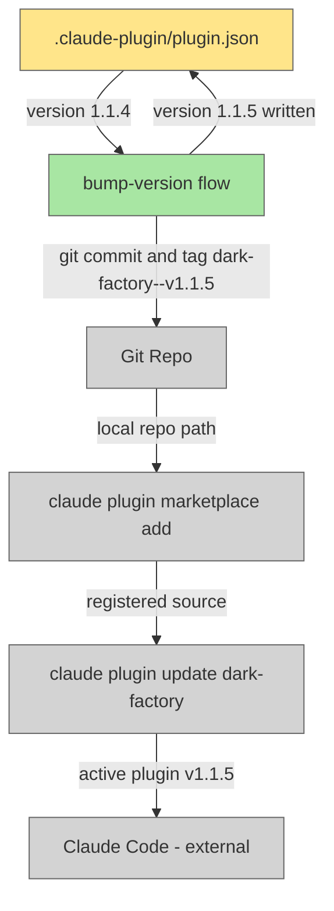

# Bump Version and Update Plugin

## Plan Metadata

- Plan type: `plan`
- Parent plan: N/A
- Depends on: N/A
- Status: `draft`

## System Intent

- What is being built: A two-step process that increments the plugin's patch version in `.claude-plugin/plugin.json`, creates a git commit and tag, then re-registers and updates the locally installed Claude Code plugin so the running environment reflects the new version.
- Primary consumer(s): Developer / CI — anyone who invokes dark-factory commands in Claude Code.
- Boundary (black-box scope only): Claude Code plugin registry (external); GitHub remote (external, for push only).

## Stage Gate Tracker

- [ ] Stage 1 Mermaid approved
- [ ] Stage 2 Flows approved
- [ ] Stage 3 Logs + Deployment approved or skipped

## Mermaid Diagram



ONCE YOU GET APPROVAL FROM THE DEVELOPER, DELETE THIS LINE AND UPDATE THE STAGE GATE TRACKER

## Flows

- Flow naming rule: ``### Flow: `<flowname>` ``
- `N/A` for test files means explicit no-test-required waiver (not a missing mapping).

### Global Types

```txt
StandardError {
  message: string (human-readable description of what went wrong)
}
```

### Flow: `bump-version`

- Test files: N/A
- Core files: `.claude-plugin/plugin.json`

#### Types

```txt
VersionBumpInput {
  currentVersion: string  (semver string read from plugin.json, e.g. "1.1.4")
  bumpType: "patch"       (always patch for this plan)
}

VersionBumpOutput {
  newVersion: string      (incremented semver, e.g. "1.1.5")
  commitSha: string       (sha of the resulting git commit)
  tag: string             (git tag created, e.g. "dark-factory--v1.1.5")
}
```

#### Paths

| path | input | output | path-type | notes | updated |
| --- | --- | --- | --- | --- | --- |
| `bump-version.success` | `VersionBumpInput` | `VersionBumpOutput` | happy path | Increments patch segment of version in `.claude-plugin/plugin.json`, commits, and creates git tag `dark-factory--v<newVersion>` | |
| `bump-version.already-bumped` | `VersionBumpInput` | `StandardError` | error | Tag already exists for this version — abort to avoid duplicate tags | |

#### Pseudocode

```
read version from .claude-plugin/plugin.json
split on "." → [major, minor, patch]
patch += 1
newVersion = major.minor.patch
# guard: if git tag "dark-factory--v<newVersion>" already exists → return StandardError { message: "tag already exists: dark-factory--v<newVersion>" }
write newVersion back to plugin.json
git add .claude-plugin/plugin.json
git commit -m "chore: bump version to <newVersion>"
git tag "dark-factory--v<newVersion>"
```

ONCE YOU GET APPROVAL FROM THE DEVELOPER, DELETE THIS LINE AND UPDATE THE STAGE GATE TRACKER

### Flow: `update-plugin`

- Test files: N/A
- Core files: `skills/install-plugin/SKILL.md`

#### Types

```txt
UpdatePluginInput {
  repoPath: string   (absolute path to the plugin source repo)
}

UpdatePluginOutput {
  installedVersion: string  (version string confirmed by `claude plugin list`)
}
```

#### Paths

| path | input | output | path-type | notes | updated |
| --- | --- | --- | --- | --- | --- |
| `update-plugin.success` | `UpdatePluginInput` | `UpdatePluginOutput` | happy path | Re-registers local repo as marketplace source then runs `claude plugin update dark-factory`; confirms new version via `claude plugin list` | |
| `update-plugin.not-registered` | `UpdatePluginInput` | `StandardError` | error | Marketplace add fails (path not found or already registered differently) | |
| `update-plugin.update-failed` | `UpdatePluginInput` | `StandardError` | error | `claude plugin update` exits non-zero | |

#### Pseudocode

```
claude plugin marketplace add <repoPath>
claude plugin update dark-factory
claude plugin list   # verify new version appears
```

ONCE YOU GET APPROVAL FROM THE DEVELOPER, DELETE THIS LINE AND UPDATE THE STAGE GATE TRACKER

## Logs

| Source | Location |
|--------|----------|
| claude plugin CLI | stdout/stderr of terminal session |

## Deployment

- Mechanism: `local only`
- Deploy command:
  ```bash
  # Step 1 — bump version (run from repo root)
  # (edit .claude-plugin/plugin.json, then:)
  git add .claude-plugin/plugin.json
  git commit -m "chore: bump version to 1.1.5"
  git tag dark-factory--v1.1.5

  # Step 2 — update locally installed plugin
  claude plugin marketplace add /home/lewibs/github/dark_factory/dark_factory-bump-version-update-plugin
  claude plugin update dark-factory
  claude plugin list
  ```
- Notes: Push tag to remote separately with `git push origin dark-factory--v1.1.5` after local verification.

ONCE YOU GET APPROVAL FROM THE DEVELOPER, DELETE THIS LINE AND UPDATE THE STAGE GATE TRACKER

## Handoff to Related Plan Reconciliation

After all stages are approved, apply `.agent/skills/reconcile-plans/SKILL.md` to propagate contract updates across linked plans.
