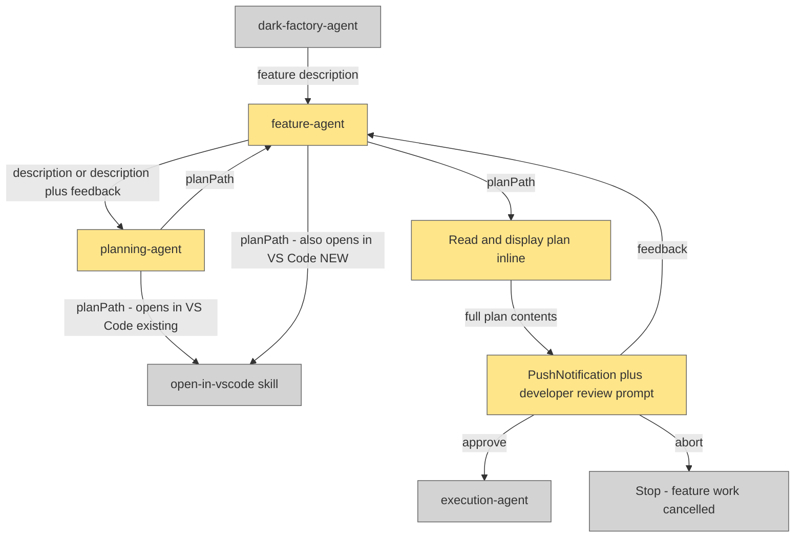

# Feature Plan Review Flow

## Plan Metadata

- Plan type: `plan`
- Parent plan: N/A
- Depends on: N/A
- Status: `draft`

## System Intent

- What is being built: Updates to the feature orchestration flow so that (1) the plan file is always opened in VS Code after planning completes, and (2) the approval gate in `feature-agent` explicitly works with the developer iteratively until they confirm the plan is 100% correct before execution begins.
- Primary consumer(s): `dark-factory-agent` (caller), developers running `dark-factory:manufacture`
- Boundary (black-box scope only): `execution-agent`, `dark-factory-agent` — neither is modified. `open-in-vscode` skill is called but not modified.

## Stage Gate Tracker

- [ ] Stage 1 Mermaid approved
- [ ] Stage 2 Flows approved
- [ ] Stage 3 Logs + Deployment approved or skipped

## Mermaid Diagram



ONCE YOU GET APPROVAL FROM THE DEVELOPER, DELETE THIS LINE AND UPDATE THE STAGE GATE TRACKER

## Flows

### Global Types

```txt
StandardError {
  message: string (human-readable description of what went wrong)
}
```

### Flow: `openPlanInVSCode`
- Test files: N/A
- Core files: `agents/featurework/agents/feature-agent.md`

#### Types

```txt
OpenPlanInput {
  planPath: string (absolute path to the written plan file)
}

OpenPlanOutput {
  void (side effect: file opens in VS Code editor; non-fatal if VS Code CLI absent)
}
```

#### Paths

| path | input | output | path-type | notes | updated |
| --- | --- | --- | --- | --- | --- |
| `openPlanInVSCode.success` | `OpenPlanInput` | `OpenPlanOutput` | `happy path` | VS Code CLI present; file opens immediately | yes |
| `openPlanInVSCode.cli-missing` | `OpenPlanInput` | `OpenPlanOutput` | `error (non-fatal)` | `code` CLI not found (exit 127); log path, continue | yes |

#### Pseudocode

```
# In feature-agent, after receiving planPath from planning-agent:
invoke open-in-vscode skill with: planPath

# planning-agent already calls this at plan write time.
# feature-agent adds a second call here as a belt-and-suspenders guarantee
# so the file is always opened even if planning-agent's call was skipped.
```

ONCE YOU GET APPROVAL FROM THE DEVELOPER, DELETE THIS LINE AND UPDATE THE STAGE GATE TRACKER

---

### Flow: `iterativeReview`
- Test files: N/A
- Core files: `agents/featurework/agents/feature-agent.md`

#### Types

```txt
ReviewInput {
  planPath: string (absolute path to the plan file)
  planContents: string (full text of the plan file, read by feature-agent)
}

ReviewOutput {
  decision: "approve" | "abort"
}

FeedbackRevision {
  feedback: string (developer's free-text revision request)
  description: string (original feature description, carried through all retries)
}
```

#### Paths

| path | input | output | path-type | notes | updated |
| --- | --- | --- | --- | --- | --- |
| `iterativeReview.approve` | `ReviewInput` | `ReviewOutput{approve}` | `happy path` | Developer replies "yes" or "approve"; proceed to execution-agent | yes |
| `iterativeReview.abort` | `ReviewInput` | `ReviewOutput{abort}` | `error` | Developer replies "abort"; stop all work | yes |
| `iterativeReview.feedback-retry` | `ReviewInput` | `FeedbackRevision` | `loop` | Any other reply is treated as feedback; re-invoke planning-agent, then re-open in VS Code, re-display, re-prompt | yes |

#### Pseudocode

```
LOOP:
  # planning-agent already opens in VS Code; feature-agent opens again here
  invoke open-in-vscode skill with: planPath

  Read plan file at planPath
  Display: "Plan written to <planPath>. Please review."
  Display full plan contents inline

  call PushNotification(title: "Plan Approval Required",
                        message: "A plan is ready for your review and requires approval to proceed.")

  Ask developer:
    "Please review the plan above. Reply:
     - 'approve' or 'yes' to proceed to implementation
     - 'abort' to cancel
     - Any other text to request a revision"

  response = developer reply

  if response == "abort":
    report "Feature work aborted by developer."
    STOP

  if response in ["yes", "approve"]:
    BREAK LOOP   # proceed to execution-agent

  # Anything else is revision feedback
  feedback = response
  invoke planning-agent with: "Revise the plan based on this developer feedback: <feedback>\n\nOriginal description: <description>"
  planPath = new planPath from planning-agent
  CONTINUE LOOP
```

ONCE YOU GET APPROVAL FROM THE DEVELOPER, DELETE THIS LINE AND UPDATE THE STAGE GATE TRACKER

## Logs

| Source | Location |
|--------|----------|
| feature-agent | stdout / Claude Code conversation |

## Deployment

- Mechanism: `local only`
- Deploy command:
  ```bash
  # No deployment needed — agent .md files are used directly by Claude Code
  ```
- Notes: Changes take effect immediately when the agent files are updated.

ONCE YOU GET APPROVAL FROM THE DEVELOPER, DELETE THIS LINE AND UPDATE THE STAGE GATE TRACKER

## Handoff to Related Plan Reconciliation

After all stages are approved, apply `.agent/skills/reconcile-plans/SKILL.md` to propagate contract updates across linked plans.
