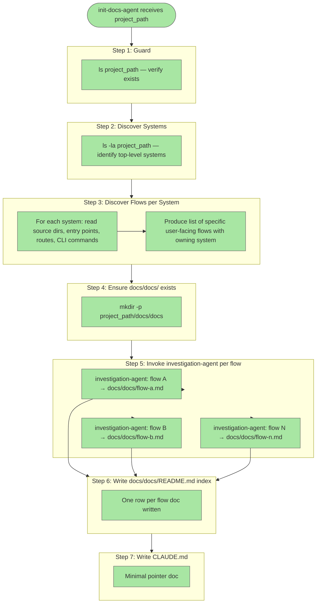

# Fix Init Doc Granularity: Per-Flow Documentation

## Plan Metadata

- Plan type: `plan`
- Parent plan: N/A
- Depends on: N/A
- Status: `approved`

## System Intent

- What is being built: A rewrite of `agents/initialization/agents/init-docs-agent.md` so that on project init, documentation is produced at user-flow granularity (e.g. "upload image", "create account", "send message") rather than at coarse system granularity (e.g. "frontend", "backend"). Each discovered flow becomes one `docs/docs/<flow-name>.md` file following the documentation template.
- Primary consumer(s): Developers reading generated docs; `update-documentation-agent` and `detect-drift-agent` which validate docs against code.
- Boundary (black-box scope only): Only `agents/initialization/agents/init-docs-agent.md` is modified. `investigation-agent`, the documentation template, and all other agents/skills are unchanged.

## Stage Gate Tracker

- [x] Stage 1 Mermaid approved
- [x] Stage 2 Flows approved
- [x] Stage 3 Logs + Deployment approved or skipped

## Mermaid Diagram



## Flows

### Global Types

```txt
SystemInfo {
  name: string (e.g. "backend", "frontend")
  rootDir: string (relative path within project_path)
}

FlowInfo {
  name: string (slug, e.g. "upload-image", "create-account")
  displayName: string (human-readable, e.g. "Upload Image")
  owningSystem: string (SystemInfo.name)
  outputPath: string (docs/docs/<name>.md)
}

FlowDocInput {
  flowName: string
  displayName: string
  owningSystem: string
  projectPath: string
  outputPath: string
}

FlowDocOutput {
  outputPath: string (path written)
}

StandardError {
  message: string (human-readable description of what went wrong)
}
```

---

### Flow: `discoverSystems`

- Test files: N/A
- Core files:
  - `agents/initialization/agents/init-docs-agent.md` (Step 2)

#### Types

```txt
Input: project_path string
Output: SystemInfo[]
```

#### Paths

| path | input | output | path-type | notes |
| --- | --- | --- | --- | --- |
| `discoverSystems.success` | `project_path` | `SystemInfo[]` | `happy path` | ls -la identifies distinct top-level directories; each becomes a SystemInfo |
| `discoverSystems.flat` | `project_path` | `SystemInfo[name=project]` | `fallback` | No sub-directories detected; treat entire project as one system |

---

### Flow: `discoverFlowsPerSystem`

This is the new step inserted between current Steps 2 and 4. For each `SystemInfo`, the agent reads source files to enumerate specific user-facing flows.

- Test files: N/A
- Core files:
  - `agents/initialization/agents/init-docs-agent.md` (new Step 3)

#### Types

```txt
Input: SystemInfo[]
Output: FlowInfo[]
```

#### Paths

| path | input | output | path-type | notes |
| --- | --- | --- | --- | --- |
| `discoverFlowsPerSystem.success` | `SystemInfo[]` | `FlowInfo[]` | `happy path` | Agent reads routes, CLI entry points, event handlers, and API endpoints per system; maps each to a named FlowInfo |
| `discoverFlowsPerSystem.noFlows` | `SystemInfo` | `FlowInfo[name=<system>]` | `fallback` | No discrete flows found; treat the whole system as one flow using the system name |

#### Pseudocode

```
For each system in SystemInfo[]:
  1. Glob <system.rootDir> for entry-point files:
     - routes files (routes.*, urls.*, router.*)
     - CLI entry points (cli.*, commands/*)
     - event handlers (handlers/*, listeners/*)
     - API controllers (controllers/*, views/*, endpoints/*)
  2. Read each entry-point file; extract named actions/endpoints/commands
     Examples: GET /upload → "upload-image", POST /register → "create-account"
  3. For each distinct action, create FlowInfo{
       name: kebab-case slug,
       displayName: human-readable label,
       owningSystem: system.name,
       outputPath: "docs/docs/<name>.md"
     }
  4. If no actions found, emit one FlowInfo using system.name as the name
Return deduplicated FlowInfo[] across all systems
```

---

### Flow: `invokeInvestigationPerFlow`

Replaces the old per-system investigation-agent invocation. One `investigation-agent` call per `FlowInfo`.

- Test files: N/A
- Core files:
  - `agents/initialization/agents/init-docs-agent.md` (Step 5, replaces old Step 4)
  - `agents/documentation/agents/investigation-agent.md`

#### Types

```txt
Input: FlowInfo[]
Output: FlowDocOutput[]
```

#### Paths

| path | input | output | path-type | notes |
| --- | --- | --- | --- | --- |
| `invokeInvestigationPerFlow.success` | `FlowInfo` | `FlowDocOutput` | `happy path` | investigation-agent investigates the flow and writes docs/docs/<flow-name>.md using the documentation template |
| `invokeInvestigationPerFlow.agentFailure` | `FlowInfo` | `StandardError` | `error` | investigation-agent fails; log warning, skip this flow, continue with remaining flows |

#### Pseudocode

```
For each flow in FlowInfo[]:
  Invoke investigation-agent (Task tool) with prompt:
    "Investigate the '<flow.displayName>' user flow within the '<flow.owningSystem>'
     system of the project located at '<projectPath>'.
     Focus on the specific actions a user takes to complete this flow end-to-end.
     Treat '<projectPath>' as the project root for all file reads and writes.
     Write your documentation to '<flow.outputPath>'.
     Return the path to the file you wrote."
  On success: add flow.outputPath to docs_written
  On failure: log "Warning: investigation-agent failed for flow '<flow.name>'. Skipping."
```

---

### Flow: `writeIndexAndClaude`

Unchanged from current Steps 5 and 6, except the index now lists one row per flow doc instead of one row per system doc.

- Test files: N/A
- Core files:
  - `agents/initialization/agents/init-docs-agent.md` (Steps 6–7)

#### Types

```txt
Input: FlowDocOutput[] (docs_written)
Output: paths to docs/docs/README.md and CLAUDE.md
```

#### Paths

| path | input | output | path-type | notes |
| --- | --- | --- | --- | --- |
| `writeIndexAndClaude.success` | `FlowDocOutput[]` | `README.md + CLAUDE.md` | `happy path` | README index lists one row per flow doc; CLAUDE.md is a minimal pointer |
| `writeIndexAndClaude.empty` | `[]` | `README.md + CLAUDE.md` | `fallback` | All flows failed; README says "No documentation generated yet"; CLAUDE.md uses generic placeholder |

---

## Logs

| Source | Location |
|--------|----------|
| N/A | This is an agent instruction rewrite — no runtime log sources are introduced or modified. |

## Deployment

- Mechanism: `local only`
- Deploy command:
  ```bash
  # No deployment needed — modifying agents/initialization/agents/init-docs-agent.md
  # takes effect immediately for the next /dark-factory:init run.
  ```
- Notes: Verify by running `/dark-factory:init` on a sample project and confirming that `docs/docs/` contains one file per user flow (e.g. `upload-image.md`, `create-account.md`) rather than one file per top-level directory.
