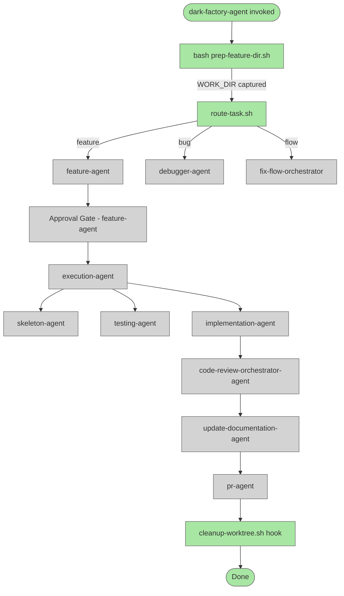

# Improve Orchestrator Determinism

## System Intent

- What is being built: A set of improvements to the dark-factory agent orchestration system to make flows deterministic and impossible to skip — through helper scripts, `.claude/settings.json` hooks, and stronger agent instructions.
- Primary consumer(s): dark-factory-agent, feature-agent, execution-agent, and all downstream sub-agents
- Boundary (black-box scope only): Only the agent .md files, shell scripts in `agents/dark-factory/scripts/`, and `.claude/settings.json` are in scope. The actual skill plugin registry and external CI are out of scope.

## Stage Gate Tracker

- [ ] Stage 1 Mermaid approved
- [ ] Stage 2 Flows approved
- [ ] Stage 3 Logs + Deployment approved or skipped

## Audit Findings

### dark-factory-agent.md — gaps found

1. **Step 1 (prep-feature-dir.sh)**: The script is idempotent-hostile — if the worktree already exists it hard-exits with error code 1. The agent has no recovery path documented for the "already exists" case (only "script fails → report and STOP"). This is why prep is sometimes "skipped" — the agent sees the error, doesn't know what to do, and improvises.
2. **Step 2 (routing)**: Routing logic is inline prose. There is no enforcement gate — the agent can decide to skip the worker and proceed to Step 3.
3. **Step 6 (cleanup)**: Cleanup is documented as a function but there is no enforcement that it always runs. If a step earlier in the flow throws an unhandled error the cleanup block may not be reached.
4. **WORK_DIR capture**: The agent must parse `WORK_DIR=<value>` from stdout — a fragile pattern. There is no validation that the parsed value is a non-empty absolute path.

### feature-agent.md — gaps found

1. **Planning-agent invocation**: The agent is told to invoke planning-agent and capture `planPath` from its output, but there is no specified mechanism to extract `planPath` from the planning-agent's conversational output (it is not a structured return value).
2. **Approval gate**: The gate logic is inline; agents have been observed skipping it under time pressure.
3. **Execution delegation**: No guard that `planPath` file actually exists before invoking execution-agent.

### execution-agent.md — gaps found

1. **Assert gates exist in text but not enforced**: Steps 2, 4, 5 all say "Assert X" — but if the assertion fails, the agent has no prescribed recovery path. The agent may silently continue.
2. **Checklist cleanup**: `tmp/files-checklist.md` and `tmp/flows-checklist.md` are deleted only on success. If the agent is re-invoked after a hard-stop with stale checklists, behavior is undefined.
3. **planning mode re-entry**: When resuming after a hard-stop, the agent is told to "re-read the plan, confirm status is approved" — but there is no guard script that prevents resuming if status is not `approved`.

### implementation-agent.md — gaps found

1. No gaps in flow logic itself, but the deviation-protocol path relies on the agent correctly self-diagnosing "I cannot resolve this within the plan" — a judgment call that may be exercised too late or too early.

### code-review-orchestrator-agent.md — gaps found

1. Resolver loop max-iteration guard (10 iterations) is documented but relies on the agent counting. No external enforcement.
2. `tmp/issues.md` cleanup: only on success — if the agent is re-invoked on a retry, the stale `issues.md` could corrupt the new review run.

### prep-feature-dir.sh — gaps found

1. The script errors out if the worktree already exists (by name). This is the root cause of the "worktree creation skipped" failure mode.
2. No idempotent mode. Should detect existing worktree and emit `WORK_DIR=<path>` without error.

### .claude/settings.json — gaps found

1. No hooks configured. Non-core behaviors (cleanup, worktree verification) have no automated enforcement.

## Mermaid Diagram



ONCE YOU GET APPROVAL FROM THE DEVELOPER, DELETE THIS LINE AND UPDATE THE STAGE GATE TRACKER

## Flows

### Global Types

```txt
StandardError {
  message: string (human-readable description of what went wrong)
}

WorktreeResult {
  workDir: string (absolute path to the worktree)
  alreadyExisted: boolean
}
```

### Flow: `prep-feature-dir-idempotent`
- Core files: `agents/dark-factory/scripts/prep-feature-dir.sh`
- Test files: N/A

#### Types

```txt
PrepInput {
  taskName: string (required — slug for the worktree/branch name)
}

PrepOutput {
  workDir: string (absolute path; printed as WORK_DIR=<value>)
}
```

#### Paths

| path | input | output | path-type | notes | updated |
| --- | --- | --- | --- | --- | --- |
| `prep.create` | `PrepInput` | `PrepOutput` | happy path | worktree does not exist; create it | |
| `prep.already-exists` | `PrepInput` | `PrepOutput` | happy path | worktree already exists; emit WORK_DIR and exit 0 | NEW — currently missing |
| `prep.invalid-task-name` | `PrepInput` | `StandardError` | error | empty task name | |
| `prep.git-pull-failed` | `PrepInput` | `StandardError` | error | git pull fails; abort | |
| `prep.worktree-add-failed` | `PrepInput` | `StandardError` | error | git worktree add fails for a reason other than already-exists | |

#### Pseudocode

```
prep-feature-dir(taskName):
  if taskName is empty → exit 1 with error

  GIT_ROOT = git rev-parse --show-toplevel
  WORKTREE_NAME = basename(GIT_ROOT) + "-" + taskName
  WORK_DIR = GIT_ROOT + "/../" + WORKTREE_NAME

  # Idempotent check — NEW
  if git worktree list | grep -qF WORKTREE_NAME:
    echo "WORK_DIR=${WORK_DIR}"
    exit 0            ← was: exit 1 with error

  git pull origin main || exit 1
  git worktree add WORK_DIR -b feature/taskName || exit 1
  echo "WORK_DIR=${WORK_DIR}"
```

### Flow: `cleanup-worktree`
- Core files: `agents/dark-factory/scripts/cleanup-worktree.sh`
- Test files: N/A

#### Types

```txt
CleanupInput {
  workDir: string (absolute path to worktree)
  taskName: string (branch slug — used to delete feature/<taskName>)
}
```

#### Paths

| path | input | output | path-type | notes | updated |
| --- | --- | --- | --- | --- | --- |
| `cleanup.success` | `CleanupInput` | exit 0 | happy path | worktree removed, branch deleted | |
| `cleanup.worktree-remove-failed` | `CleanupInput` | exit 0 (warn only) | non-fatal | git worktree remove fails; print warning, continue | |
| `cleanup.branch-delete-failed` | `CleanupInput` | exit 0 (warn only) | non-fatal | git branch -D fails; print warning, continue | |
| `cleanup.missing-args` | `CleanupInput` | exit 1 | error | workDir or taskName not provided | |

#### Pseudocode

```
cleanup-worktree(workDir, taskName):
  if workDir is empty or taskName is empty → exit 1 with error

  git worktree remove workDir --force || echo "WARNING: worktree remove failed — manual cleanup needed"
  git branch -D feature/taskName || echo "WARNING: branch delete failed — manual cleanup needed"
  exit 0
```

### Flow: `strengthen-dark-factory-agent`
- Core files: `agents/dark-factory/agents/dark-factory-agent.md`
- Test files: N/A

#### Types

No new types — this is an instruction-text update only.

#### Paths

| path | input | output | path-type | notes | updated |
| --- | --- | --- | --- | --- | --- |
| `strengthen.idempotent-prep` | agent invocation | WORK_DIR set | happy path | step 1 now documents idempotent-already-exists recovery | |
| `strengthen.cleanup-script` | WORK_DIR + taskName | exit 0 | happy path | step 6 calls cleanup-worktree.sh instead of inline git commands | |

#### Pseudocode

```
Changes to dark-factory-agent.md:

Step 1 — after running prep-feature-dir.sh:
  Parse WORK_DIR from stdout.
  If script exits non-zero: report error and STOP.

Step 1 — document idempotent recovery:
  "If the script exits with 'worktree already exists', re-run with REUSE=1 env var
   OR: detect the WORK_DIR from git worktree list and continue."
  (The updated prep-feature-dir.sh handles this automatically — just document that it is safe.)

Step 6 cleanup — replace inline git commands with:
  Run: bash agents/dark-factory/scripts/cleanup-worktree.sh "$WORK_DIR" "$TASK_NAME"
```

### Flow: `strengthen-feature-agent`
- Core files: `agents/featurework/agents/feature-agent.md`
- Test files: N/A

#### Paths

| path | input | output | path-type | notes | updated |
| --- | --- | --- | --- | --- | --- |
| `feature-agent.planPath-guard` | planPath from planning-agent | validated path | happy path | assert planPath file exists before proceeding to approval gate | |
| `feature-agent.approval-gate-required` | developer response | approved/abort/feedback | happy path | gate is MANDATORY — add explicit "MUST NOT be skipped" rule | |

#### Pseudocode

```
After planning-agent returns, before showing the plan:
  Run: bash -c "[ -f '$planPath' ]"
  If file does not exist:
    report error: "planning-agent did not write a plan file at <planPath>. Cannot proceed."
    STOP

Add to Rules section:
  "The approval gate MUST NOT be skipped under any circumstances.
   Do not invoke execution-agent before the developer has replied 'yes' or 'approve'."
```

### Flow: `strengthen-execution-agent`
- Core files: `agents/featurework/execution/agents/execution-agent.md`
- Test files: N/A

#### Paths

| path | input | output | path-type | notes | updated |
| --- | --- | --- | --- | --- | --- |
| `execution.assert-skeleton` | tmp/files-checklist.md | all rows checked | happy path | if assertion fails: STOP with error — do not proceed to testing | |
| `execution.assert-tests-failing` | tmp/flows-checklist.md | all new tests failing | happy path | if assertion fails: STOP with error | |
| `execution.stale-checklist-guard` | planPath | clean tmp/ | happy path | before spawning skeleton-agent, delete stale checklists if present | |
| `execution.resume-guard` | plan file | status=approved | happy path | before resuming after hard-stop, verify plan status field equals approved | |

#### Pseudocode

```
Before Step 2 (spawn skeleton-agent):
  If tmp/files-checklist.md exists: delete it (stale from prior run)
  If tmp/flows-checklist.md exists: delete it (stale from prior run)

After Step 2 returns:
  Read tmp/files-checklist.md
  If any row is NOT checked [x]: STOP — "skeleton-agent did not complete checklist"
  For each file path in checklist: verify file exists on disk
  If any file missing: STOP — "skeleton-agent did not create file: <path>"

After Step 4 returns:
  Read tmp/flows-checklist.md
  If any row has testFailing=false: STOP — "testing-agent did not confirm all tests failing"

Planning Mode resume gate:
  Before re-spawning implementation-agent:
    Read plan file; extract status field
    If status != "approved": STOP — "plan status is <status>, not approved. Update plan before resuming."
```

### Flow: `settings-json-hooks`
- Core files: `.claude/settings.json`
- Test files: N/A

#### Types

```txt
HookConfig {
  hooks: {
    Stop: [{ matcher: string, hooks: [{ type: "command", command: string }] }]
  }
}
```

#### Paths

| path | input | output | path-type | notes | updated |
| --- | --- | --- | --- | --- | --- |
| `hooks.stop-cleanup` | agent session end | cleanup script runs | happy path | PostToolUse hook runs cleanup-worktree.sh if WORK_DIR and TASK_NAME env vars are set | |

#### Pseudocode

```
Add to .claude/settings.json hooks section:
  "hooks": {
    "Stop": [
      {
        "matcher": "",
        "hooks": [
          {
            "type": "command",
            "command": "bash -c 'if [ -n \"$DARK_FACTORY_WORK_DIR\" ] && [ -n \"$DARK_FACTORY_TASK_NAME\" ]; then bash agents/dark-factory/scripts/cleanup-worktree.sh \"$DARK_FACTORY_WORK_DIR\" \"$DARK_FACTORY_TASK_NAME\"; fi'"
          }
        ]
      }
    ]
  }

Note: dark-factory-agent must export DARK_FACTORY_WORK_DIR and DARK_FACTORY_TASK_NAME before
spawning sub-agents so the hook has access to them.
```

## Logs

| Source | Location |
|--------|----------|
| prep-feature-dir.sh | stderr for errors, stdout for WORK_DIR= |
| cleanup-worktree.sh | stderr for warnings, exit code always 0 |

## Deployment

- Mechanism: `local only`
- Deploy command:
  ```bash
  # No deploy needed — changes are to agent .md files and shell scripts in the repo
  ```
- Notes: All changes take effect immediately when the agent files are updated. No build step required.

ONCE YOU GET APPROVAL FROM THE DEVELOPER, DELETE THIS LINE AND UPDATE THE STAGE GATE TRACKER

## Handoff to Related Plan Reconciliation

After all stages are approved, apply `.agent/skills/reconcile-plans/SKILL.md` to propagate contract updates across linked plans.
