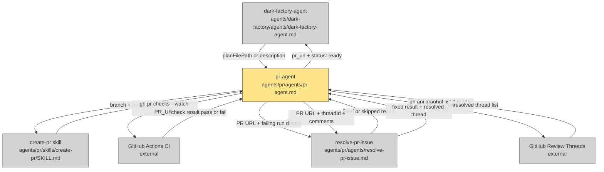

# PR Agent CI Watch Loop and Comment Resolution Loop

## Plan Metadata

- Plan type: `plan`
- Parent plan: N/A
- Depends on: N/A
- Status: `draft`

## System Intent

- What is being built: Explicit, well-structured CI watch loop and comment resolution loop inside `pr-agent.md`. The current agent has these steps described in terse numbered form; this plan replaces them with a rigorous pseudocode loop with named states, termination conditions, interleaving logic (re-check CI after resolving comments), hard-stop handling when `resolve-pr-issue` returns `fixed: false`, and a max-iteration guard to prevent infinite loops.
- Primary consumer(s): `pr-agent` (called by `dark-factory-agent` and `ralph-fix-and-push`)
- Boundary (black-box scope only): `resolve-pr-issue` is unchanged — only `pr-agent.md` is modified. GitHub Actions CI and GitHub Review Threads are external services accessed via `gh` CLI and GraphQL.

## Stage Gate Tracker

- [x] Stage 1 Mermaid approved
- [ ] Stage 2 Flows approved
- [ ] Stage 3 Logs + Deployment approved or skipped

## Mermaid Diagram



## Flows

### Global Types

```txt
StandardError {
  message: string (human-readable description of what went wrong)
}

CIResult {
  status: "pass" | "fail"
  failedRuns: RunSummary[]  (empty when status == "pass")
}

RunSummary {
  runId: string
  checkName: string
}

ReviewThread {
  threadId: string
  isResolved: boolean
  comments: string[]
}

ResolvePRIssueResult {
  fixed: boolean
  type: "ci" | "review"
  threadId?: string        (only for review threads)
  skipped?: boolean        (only when CI quota exhaustion)
  reason?: string          (only when fixed: false)
}

OpenPRInput {
  planFilePathOrDescription: string
}

OpenPROutput {
  pr_url: string
  status: "ready"
}
```

### Flow: `ciWatchLoop`

- Core files: `agents/pr/agents/pr-agent.md`
- Test files: N/A

#### Types

```txt
CIWatchLoopInput {
  pr_url: string
}

CIWatchLoopOutput {
  status: "pass"
}

CIWatchLoopError {
  message: string   (reason loop was aborted — unfixable failure or max iterations)
}
```

#### Paths

| path | input | output | path-type | notes |
| --- | --- | --- | --- | --- |
| `ciWatchLoop.pass` | `CIWatchLoopInput` | `CIWatchLoopOutput` | happy path | All CI checks pass on first watch |
| `ciWatchLoop.fail-fixed` | `CIWatchLoopInput` | `CIWatchLoopOutput` | happy path | CI failed, resolve-pr-issue fixed it, loop re-runs and passes |
| `ciWatchLoop.quota-skip` | `CIWatchLoopInput` | `CIWatchLoopOutput` | happy path | CI failure is quota exhaustion; treated as pass |
| `ciWatchLoop.unfixable` | `CIWatchLoopInput` | `CIWatchLoopError` | error | resolve-pr-issue returns fixed: false; loop aborts |
| `ciWatchLoop.max-iterations` | `CIWatchLoopInput` | `CIWatchLoopError` | error | CI keeps failing after MAX_CI_ITERATIONS fix attempts |

#### Pseudocode

```
MAX_CI_ITERATIONS = 5

ciWatchLoop(pr_url):
  iterations = 0

  LOOP:
    if iterations >= MAX_CI_ITERATIONS:
      STOP with error "CI watch loop exceeded MAX_CI_ITERATIONS without passing"

    result = gh pr checks <pr_url> --watch
    // --watch blocks until all checks complete or one fails

    if all checks passed:
      RETURN { status: "pass" }

    // At least one check failed — collect failing runs
    failedRuns = gh pr checks <pr_url> --fail-fast  // get failing run IDs

    for each run in failedRuns:
      fixResult = spawn resolve-pr-issue(pr_url, { type: "ci", runId: run.runId, failedChecks: [run.checkName] })

      if fixResult.skipped == true:
        // quota exhaustion — treat as pass, skip remaining runs
        RETURN { status: "pass" }

      if fixResult.fixed == false:
        STOP with error "CI failure unfixable: " + fixResult.reason

      // fixResult.fixed == true — fix was pushed; break out of run loop and re-watch CI
      // (remaining runs may already be fixed by the same commit)
      BREAK

    iterations += 1
    CONTINUE LOOP
```

### Flow: `commentResolutionLoop`

- Core files: `agents/pr/agents/pr-agent.md`
- Test files: N/A

#### Types

```txt
CommentResolutionLoopInput {
  pr_url: string
  pr_node_id: string
}

CommentResolutionLoopOutput {
  status: "all-resolved"
}

CommentResolutionLoopError {
  message: string   (reason loop was aborted — unfixable thread or max iterations)
}
```

#### Paths

| path | input | output | path-type | notes |
| --- | --- | --- | --- | --- |
| `commentResolutionLoop.no-threads` | `CommentResolutionLoopInput` | `CommentResolutionLoopOutput` | happy path | No unresolved threads; returns immediately |
| `commentResolutionLoop.threads-resolved` | `CommentResolutionLoopInput` | `CommentResolutionLoopOutput` | happy path | All threads resolved by resolve-pr-issue; CI re-checked and passes |
| `commentResolutionLoop.unfixable` | `CommentResolutionLoopInput` | `CommentResolutionLoopError` | error | resolve-pr-issue returns fixed: false for a thread; loop aborts |
| `commentResolutionLoop.max-iterations` | `CommentResolutionLoopInput` | `CommentResolutionLoopError` | error | Threads keep appearing after MAX_COMMENT_ITERATIONS rounds |

#### Pseudocode

```
MAX_COMMENT_ITERATIONS = 5

commentResolutionLoop(pr_url, pr_node_id):
  iterations = 0

  LOOP:
    if iterations >= MAX_COMMENT_ITERATIONS:
      STOP with error "Comment resolution loop exceeded MAX_COMMENT_ITERATIONS"

    unresolvedThreads = gh api graphql list-review-threads(pr_node_id)
      // filter to isResolved == false

    if unresolvedThreads is empty:
      RETURN { status: "all-resolved" }

    for each thread in unresolvedThreads:
      fixResult = spawn resolve-pr-issue(pr_url, { type: "review", threadId: thread.threadId, comments: thread.comments })

      if fixResult.fixed == false:
        STOP with error "Review thread unfixable: " + fixResult.reason

      // fixResult.fixed == true — fix was pushed and thread resolved via GraphQL

    // After resolving all threads in this round, re-check CI before checking for more threads
    ciResult = ciWatchLoop(pr_url)
    if ciResult is error:
      STOP with error ciResult.message

    iterations += 1
    CONTINUE LOOP  // check for any newly added threads
```

### Flow: `openPR`

- Core files: `agents/pr/agents/pr-agent.md`, `agents/pr/skills/create-pr/SKILL.md`, `agents/pr/templates/pr-template.md`, `agents/pr/agents/resolve-pr-issue.md`
- Test files: N/A

#### Types

```txt
// (same as Global Types above — OpenPRInput, OpenPROutput)
```

#### Paths

| path | input | output | path-type | notes |
| --- | --- | --- | --- | --- |
| `openPR.success` | `OpenPRInput` | `OpenPROutput` | happy path | CI passes, no threads, returns ready |
| `openPR.ci-fixed` | `OpenPRInput` | `OpenPROutput` | happy path | CI failed, ciWatchLoop resolved it, returns ready |
| `openPR.comments-resolved` | `OpenPRInput` | `OpenPROutput` | happy path | Review threads resolved, CI re-checked, returns ready |
| `openPR.ci-unfixable` | `OpenPRInput` | `StandardError` | error | ciWatchLoop aborted with unfixable error |
| `openPR.comment-unfixable` | `OpenPRInput` | `StandardError` | error | commentResolutionLoop aborted with unfixable thread |

#### Pseudocode

```
openPR(planFilePathOrDescription):
  // Steps 1-2: build body, open PR (unchanged from current pr-agent.md)
  prUrl = open PR via create-pr skill

  // Step 3: CI watch loop (replaces terse step 3-4 in current pr-agent.md)
  ciResult = ciWatchLoop(prUrl)
  if ciResult is error:
    STOP with error ciResult.message

  // Step 4: Comment resolution loop (replaces terse step 5 in current pr-agent.md)
  prNodeId = gh api graphql get-pr-node-id(prUrl)
  commentResult = commentResolutionLoop(prUrl, prNodeId)
  if commentResult is error:
    STOP with error commentResult.message

  // Step 5: Return ready — caller is responsible for merge
  RETURN { pr_url: prUrl, status: "ready" }
```

## Logs

| Source | Location |
|--------|----------|
| CI check output | `gh run view <run-id> --log-failed` |
| PR body | `/tmp/pr-body.md` (ephemeral) |
| Review thread comments | GraphQL `reviewThreads` query on PR node ID |

## Deployment

- Mechanism: `local only` — agent file edit only; no deploy step required
- Deploy command: N/A
- Notes: `agents/pr/agents/pr-agent.md` is the primary modification. `agents/pr/skills/create-pr/SKILL.md` also has the squash-merge row removed from its Scripts table since merging is no longer part of the pr-agent scope. All other agents and skills are unchanged.

