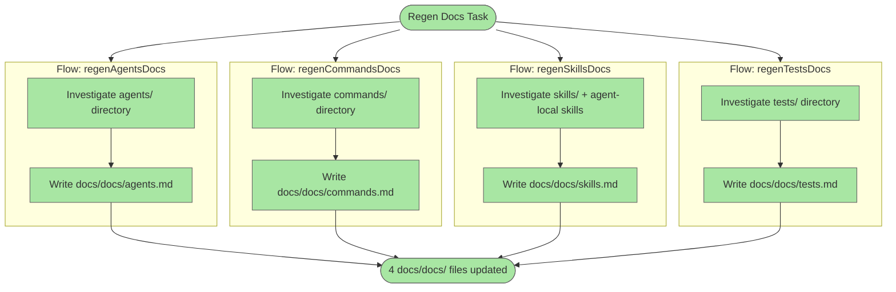

# Regenerate docs/docs/ Files Using Documentation Template

## Plan Metadata

- Plan type: `plan`
- Parent plan: N/A
- Depends on: N/A
- Status: `approved`

## System Intent

- What is being built: Rewrites the four existing `docs/docs/` files (agents.md, commands.md, skills.md, tests.md) so each conforms to the required documentation template — Metadata, Mermaid Diagram, Flows (Types + Paths + optional Pseudocode), Logs, and Deployment.
- Primary consumer(s): Developers reading system docs; `update-documentation-agent` and `detect-drift-agent` which validate docs against code.
- Boundary (black-box scope only): Only `docs/docs/agents.md`, `docs/docs/commands.md`, `docs/docs/skills.md`, and `docs/docs/tests.md` are modified. No agent, skill, command, or test files are changed.

## Stage Gate Tracker

- [x] Stage 1 Mermaid approved
- [x] Stage 2 Flows approved
- [x] Stage 3 Logs + Deployment approved or skipped

## Mermaid Diagram



## Flows

### Global Types

```txt
DocInput {
  systemName: string (one of: agents, commands, skills, tests)
  sourceDir: string (directory to investigate)
  outputPath: string (docs/docs/<systemName>.md)
}

DocOutput {
  outputPath: string (path written)
  sectionsWritten: string[] (Metadata, Mermaid, Flows, Logs, Deployment)
}

StandardError {
  message: string (human-readable description of what went wrong)
}
```

---

### Flow: `regenAgentsDocs`

- Test files: N/A
- Core files:
  - `agents/dark-factory/agents/dark-factory-agent.md`
  - `agents/featurework/agents/feature-agent.md`
  - `agents/featurework/planning/agents/planning-agent.md`
  - `agents/featurework/execution/agents/execution-agent.md`
  - `agents/featurework/execution/agents/skeleton-agent.md`
  - `agents/featurework/execution/agents/testing-agent.md`
  - `agents/featurework/execution/agents/implementation-agent.md`
  - `agents/debugger/agents/debugger-agent.md`
  - `agents/fix-flow/agents/fix-flow-orchestrator.md`
  - `agents/fix-flow/agents/debug-flow-agent.md`
  - `agents/fix-flow/agents/ralph-fix-and-push.md`
  - `agents/fix-flow/agents/setup-wizard.md`
  - `agents/code-review/agents/code-review-orchestrator-agent.md`
  - `agents/code-review/agents/high-level-review-agent.md`
  - `agents/code-review/agents/low-level-review-agent.md`
  - `agents/code-review/agents/resolver-agent.md`
  - `agents/documentation/agents/investigation-agent.md`
  - `agents/documentation/agents/update-documentation-agent.md`
  - `agents/documentation/agents/detect-drift-agent.md`
  - `agents/initialization/agents/init-orchestrator-agent.md`
  - `agents/initialization/agents/init-docs-agent.md`
  - `agents/pr/agents/pr-agent.md`
  - `agents/pr/agents/resolve-pr-issue.md`
  - `agents/skill-update/agents/skill-update-agent.md`
  - `docs/docs/agents.md` (existing — read before overwriting)

#### Types

```txt
AgentFile {
  name: string (agent identifier from front-matter)
  tools: string[] (tools declared in front-matter)
  model: string
  userInvocable: boolean
  skills: string[] (skill paths declared in front-matter)
  scripts: string[] (script paths declared in front-matter)
}
```

#### Paths

| path | input | output | path-type | notes |
| --- | --- | --- | --- | --- |
| `regenAgentsDocs.success` | `DocInput{systemName=agents}` | `DocOutput` | `happy path` | Read all agent .md files; apply investigate skill; write docs/docs/agents.md using documentation template |
| `regenAgentsDocs.missingFile` | `DocInput{systemName=agents}` | `StandardError` | `error` | An expected agent file is missing from agents/ |

#### Pseudocode

```
1. Read agents/documentation/skills/investigate/SKILL.md
2. For each agent directory group (dark-factory, featurework, debugger, fix-flow,
   code-review, documentation, initialization, pr, skill-update):
   a. Read each agent .md file — capture: name, tools, model, user-invocable,
      description, orchestration pseudocode, input/output contracts
3. Identify system type: library (no runtime — agents are markdown instructions)
4. Build Mermaid diagram showing top-level orchestration flow from dark-factory-agent
   through worker agents (feature-agent, debugger-agent, fix-flow-orchestrator)
5. Write one flow per major agent group with input/output types and paths table
6. Logs: N/A (agents are markdown — no runtime log emission)
7. Deployment: local only (agents run inside Claude Code sessions)
8. Write docs/docs/agents.md using documentation template
```

---

### Flow: `regenCommandsDocs`

- Test files: N/A
- Core files:
  - `commands/manufacture.md`
  - `commands/init.md`
  - `commands/update.md`
  - `docs/docs/commands.md` (existing — read before overwriting)

#### Types

```txt
CommandFile {
  name: string (command slug)
  description: string (front-matter description shown in Claude Code picker)
  delegatesTo: string (path to agent file)
  args: string (argument signature, e.g. "<task description>" or "[github_url]")
}
```

#### Paths

| path | input | output | path-type | notes |
| --- | --- | --- | --- | --- |
| `regenCommandsDocs.success` | `DocInput{systemName=commands}` | `DocOutput` | `happy path` | Read all 3 command files; write docs/docs/commands.md using documentation template |
| `regenCommandsDocs.missingFile` | `DocInput{systemName=commands}` | `StandardError` | `error` | A command file is absent from commands/ |

#### Pseudocode

```
1. Read commands/manufacture.md, commands/init.md, commands/update.md
2. For each command capture: front-matter description, delegate agent path, argument format
3. System type: library (slash-command stubs — no runtime logic)
4. Build Mermaid diagram: User → /dark-factory:<cmd> → Delegates to → Agent
5. Write one flow per command (manufacture, init, update) with input type = TaskDescription | void
6. Logs: N/A (commands are stubs with no log output)
7. Deployment: local only (plugin install makes commands available in Claude Code)
8. Write docs/docs/commands.md using documentation template
```

---

### Flow: `regenSkillsDocs`

- Test files: N/A
- Core files:
  - `skills/create-mermaid-diagram/SKILL.md`
  - `skills/find-dead-code/SKILL.md`
  - `skills/logging/SKILL.md`
  - `skills/install-plugin/SKILL.md`
  - `skills/install/SKILL.md`
  - `skills/open-in-vscode/SKILL.md`
  - `skills/handle-idempotent-setup-script/SKILL.md`
  - `skills/declare-tools-in-agent-frontmatter/SKILL.md`
  - `agents/documentation/skills/investigate/SKILL.md`
  - `agents/documentation/skills/documentation/SKILL.md`
  - `agents/documentation/skills/detect-drift/SKILL.md`
  - `agents/debugger/skills/debug/SKILL.md`
  - `agents/fix-flow/skills/generate-fetch-logs/SKILL.md`
  - `agents/fix-flow/skills/generate-wait-for-completion/SKILL.md`
  - `agents/fix-flow/skills/generate-trigger/SKILL.md`
  - `agents/fix-flow/skills/generate-deploy/SKILL.md`
  - `agents/pr/skills/create-pr/SKILL.md`
  - `agents/featurework/execution/skills/deviation-protocol/SKILL.md`
  - `docs/docs/skills.md` (existing — read before overwriting)

#### Types

```txt
SkillFile {
  name: string (skill slug from front-matter)
  description: string (one-sentence description)
  userInvocable: boolean
  scope: "project-level" | "agent-local"
  ownerAgent: string | null (agent directory if agent-local)
  steps: string[] (procedure steps)
}
```

#### Paths

| path | input | output | path-type | notes |
| --- | --- | --- | --- | --- |
| `regenSkillsDocs.success` | `DocInput{systemName=skills}` | `DocOutput` | `happy path` | Read all skill SKILL.md files (project-level + agent-local); write docs/docs/skills.md using documentation template |
| `regenSkillsDocs.missingFile` | `DocInput{systemName=skills}` | `StandardError` | `error` | A skill file listed in the inventory is missing |

#### Pseudocode

```
1. Glob skills/**/*.md for project-level skills
2. Glob agents/*/skills/**/*.md for agent-local skills
3. For each skill read: name, description, user-invocable, steps, when-to-use, notes
4. Group by scope: project-level vs agent-local (with owner agent)
5. System type: library (skills are markdown procedure files consumed by agents)
6. Build Mermaid diagram: Agent → reads SKILL.md → follows Steps → writes output
7. Write one flow per skill category group (project-level, documentation, debugger,
   fix-flow, pr, featurework) with input = AgentContext and output = SkillOutput
8. Logs: N/A (skills produce no log output themselves)
9. Deployment: local only (skills live in the plugin repo, loaded by agents at runtime)
10. Write docs/docs/skills.md using documentation template
```

---

### Flow: `regenTestsDocs`

- Test files: `tests/test_push_notification_declared.py`
- Core files:
  - `tests/test_push_notification_declared.py`
  - `docs/docs/tests.md` (existing — read before overwriting)

#### Types

```txt
TestFile {
  path: string (relative path to test file)
  purpose: string (what failure mode it guards)
  parametrizedCases: string[] (agent paths under test)
  assertionSteps: string[] (ordered assertions per case)
}

TestResult {
  passed: boolean
  failedCases: string[]
}
```

#### Paths

| path | input | output | path-type | notes |
| --- | --- | --- | --- | --- |
| `regenTestsDocs.success` | `DocInput{systemName=tests}` | `DocOutput` | `happy path` | Read tests/*.py; write docs/docs/tests.md using documentation template |
| `regenTestsDocs.missingFile` | `DocInput{systemName=tests}` | `StandardError` | `error` | tests/ directory or a listed test file is absent |

#### Pseudocode

```
1. Read tests/test_push_notification_declared.py
2. Capture: pytest parametrize list (8 agent paths), assertion sequence per case
3. Cross-reference docs/bugs/ for the originating bug that motivated these tests
4. System type: library (test suite — no deployed runtime)
5. Build Mermaid diagram: pytest → parametrized agent paths → parse YAML front-matter
   → assert PushNotification in tools
6. Write one flow per test file (currently one: pushNotificationDeclared)
   with input = AgentFilePath and output = TestResult
7. Logs: N/A (pytest stdout only — no structured log destinations)
8. Deployment: local only (`pytest tests/`)
9. Write docs/docs/tests.md using documentation template
```

---

## Logs

| Source | Location |
|--------|----------|
| N/A | This is a documentation-only task; no runtime log sources are modified or introduced. |

## Deployment

- Mechanism: `local only`
- Deploy command:
  ```bash
  # No deployment needed — this task only rewrites docs/docs/ markdown files.
  # Verify by reading the four output files after the flows complete.
  ```
- Notes: All four output files must pass a manual review against the documentation template before this plan is considered complete.
