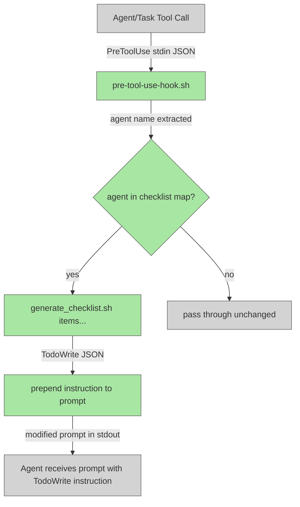

# Agent Checklists via generate_checklist.sh

## System Intent

- What is being built: A `generate_checklist.sh` shell script and wiring into the PreToolUse hook so every agent spawn automatically gets a TodoWrite checklist injected into its prompt.
- Primary consumer(s): All dark-factory agents (dark-factory-agent, feature-agent, execution-agent, skeleton-agent, testing-agent, implementation-agent, planning-agent, code-review-orchestrator-agent, high-level-review-agent, low-level-review-agent, resolver-agent, debugger-agent, pr-agent, update-documentation-agent, skill-update-agent, repair-agent, fix-flow-orchestrator)
- Boundary (black-box scope only): The `pre-tool-use-hook.sh` script, `scripts/generate_checklist.sh`, and `tests/test_generate_checklist.py`. No changes to agent `.md` files.

## Stage Gate Tracker

- [ ] Stage 1 Mermaid approved
- [ ] Stage 2 Flows approved
- [ ] Stage 3 Logs + Deployment approved or skipped

## Mermaid Diagram



## Flows

### Global Types

```txt
StandardError {
  message: string (human-readable description of what went wrong)
}

ChecklistItem {
  id: string (1-based integer as string)
  content: string
  status: "pending"
}

TodoWriteBody {
  todos: ChecklistItem[]
}
```

---

### Flow: `generateChecklist`

- Test files: `tests/test_generate_checklist.py`
- Core files: `scripts/generate_checklist.sh`

#### Types

```txt
GenerateChecklistInput {
  args: string[] (positional shell arguments, one per checklist item)
}

GenerateChecklistOutput {
  stdout: TodoWriteBody (JSON string)
}
```

#### Paths

| path | input | output | path-type | notes | updated |
| --- | --- | --- | --- | --- | --- |
| `generateChecklist.success` | `GenerateChecklistInput` with >=1 args | `GenerateChecklistOutput` with all items as pending | `happy path` | IDs are 1-based strings | |
| `generateChecklist.empty` | `GenerateChecklistInput` with 0 args | `{"todos":[]}` | `edge case` | No items, valid empty array | |
| `generateChecklist.single` | `GenerateChecklistInput` with 1 arg | single-item TodoWriteBody | `happy path` | | |
| `generateChecklist.special-chars` | item with quotes or spaces | item content preserved verbatim | `edge case` | Shell quoting must not corrupt content | |

#### Pseudocode

```
#!/usr/bin/env bash
# generate_checklist.sh "item1" "item2" ...
# Outputs: {"todos": [{"id":"1","content":"item1","status":"pending"}, ...]}

items=("$@")
printf '{"todos":['
for i in "${!items[@]}"; do
  id=$((i + 1))
  content="${items[$i]}"
  # JSON-encode content (escape backslash and double-quote)
  encoded=$(printf '%s' "$content" | sed 's/\\/\\\\/g; s/"/\\"/g')
  if [ $i -gt 0 ]; then printf ','; fi
  printf '{"id":"%d","content":"%s","status":"pending"}' "$id" "$encoded"
done
printf ']}'
```

---

### Flow: `preHookInjectsChecklist`

- Test files: `tests/test_generate_checklist.py` (integration path via hook)
- Core files: `agents/dark-factory/scripts/pre-tool-use-hook.sh`

#### Types

```txt
HookInput {
  tool_name: string
  tool_input: {
    subagent_type?: string   (for Agent tool calls)
    prompt?: string
  }
}

HookOutput {
  prompt: string  (modified with TodoWrite instruction prepended if agent is in map)
}
```

#### Paths

| path | input | output | path-type | notes | updated |
| --- | --- | --- | --- | --- | --- |
| `preHookInjectsChecklist.known-agent` | Agent tool call with subagent_type matching a known agent | prompt prepended with TodoWrite instruction | `happy path` | Script call hardcoded per agent | |
| `preHookInjectsChecklist.unknown-agent` | Agent tool call with subagent_type not in map | prompt unchanged (only brain injection) | `happy path` | falls through existing logic | |
| `preHookInjectsChecklist.no-brain` | No DARK_FACTORY_WORK_DIR set | stdin passed through unchanged | `happy path` | existing no-brain path, no checklist added | |
| `preHookInjectsChecklist.non-agent-tool` | tool_name != Agent | no checklist injection | `happy path` | hook only intercepts Agent tool | |

#### Pseudocode

```
# After existing brain-injection logic in pre-tool-use-hook.sh,
# add a checklist injection block:

AGENT_NAME=$(echo "$TOOL_INPUT" | jq -r '.tool_input.subagent_type // ""')

declare -A AGENT_CHECKLISTS
AGENT_CHECKLISTS["dark-factory-agent"]="Classify task|Prep work dir|Run worker agent|Code review|Update docs|Update skills|Open PR|Cleanup"
AGENT_CHECKLISTS["feature-agent"]="Plan feature|Get plan approval|Execute plan"
AGENT_CHECKLISTS["execution-agent"]="Build skeleton|Write tests|Implement flows"
AGENT_CHECKLISTS["skeleton-agent"]="Read plan|Build files checklist|Create skeleton files"
AGENT_CHECKLISTS["testing-agent"]="Read plan|Build flows checklist|Write failing tests"
AGENT_CHECKLISTS["implementation-agent"]="Read plan|Implement each flow|Run tests"
AGENT_CHECKLISTS["planning-agent"]="Explore codebase|Draft Mermaid diagram|Define I/O contracts|Write acceptance criteria|Get approval"
AGENT_CHECKLISTS["code-review-orchestrator-agent"]="Run high-level review|Run low-level review|Resolve issues"
AGENT_CHECKLISTS["high-level-review-agent"]="Read plan|Review code structure|Append issues"
AGENT_CHECKLISTS["low-level-review-agent"]="Review functions|Check edge cases|Append issues"
AGENT_CHECKLISTS["resolver-agent"]="Read issues|Apply fixes|Check off resolved items"
AGENT_CHECKLISTS["debugger-agent"]="Reproduce bug|Identify root cause|Apply fix|Write audit log"
AGENT_CHECKLISTS["pr-agent"]="Open PR|Wait for CI|Address review comments"
AGENT_CHECKLISTS["update-documentation-agent"]="Identify affected docs|Update stale content|Add new information"
AGENT_CHECKLISTS["skill-update-agent"]="Review completed work|Identify patterns|Write skill files"
AGENT_CHECKLISTS["repair-agent"]="Apply fix|Run tests|Open PR"
AGENT_CHECKLISTS["fix-flow-orchestrator"]="Understand system|Generate scripts|Run flow|Debug failures|Ship PR"

if [[ -n "$AGENT_NAME" ]] && [[ -n "${AGENT_CHECKLISTS[$AGENT_NAME]:-}" ]]; then
  IFS='|' read -ra ITEMS <<< "${AGENT_CHECKLISTS[$AGENT_NAME]}"
  CHECKLIST_JSON=$(bash scripts/generate_checklist.sh "${ITEMS[@]}")
  CHECKLIST_INSTRUCTION="At the start of your work, call TodoWrite with this exact body:
${CHECKLIST_JSON}
Then work through each item, marking it in_progress when you start and completed when done."
  ORIGINAL_PROMPT=$(echo "$TOOL_INPUT" | jq -r '.tool_input.prompt // ""')
  NEW_PROMPT="${CHECKLIST_INSTRUCTION}

${ORIGINAL_PROMPT}"
  TOOL_INPUT=$(echo "$TOOL_INPUT" | jq --arg p "$NEW_PROMPT" '.tool_input.prompt = $p')
fi
```

Note: The checklist injection is applied before the brain injection so the final prompt has brain state at the top followed by the checklist instruction.

---

## Logs

| Source | Location |
|--------|----------|
| pre-tool-use-hook.sh checklist injection | stderr: `pre-tool-use-hook | checklist-inject | agent=<name>` |
| pre-tool-use-hook.sh checklist skip | stderr: `pre-tool-use-hook | checklist-skip | agent=<name>` |

## Deployment

- Mechanism: `local only`
- Deploy command:
  ```bash
  chmod +x scripts/generate_checklist.sh
  pytest tests/test_generate_checklist.py -v
  ```
- Notes: No deploy needed — hook runs on every Agent tool call. Tests validate the script and hook injection.

## Handoff to Related Plan Reconciliation

N/A — no linked plans.
