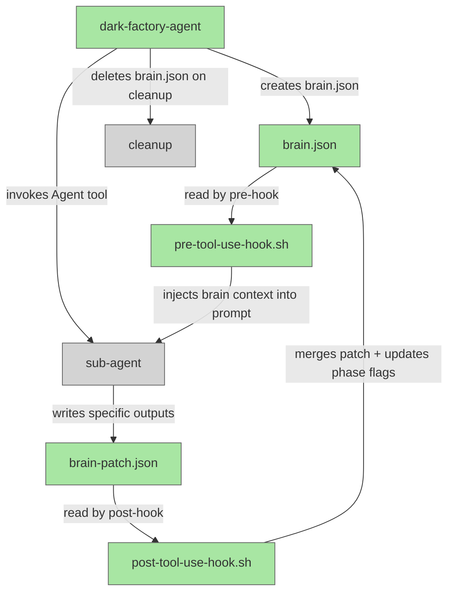

# Brain Hook-Driven Orchestration

## System Intent

- What is being built: A hook-driven brain.json state system for dark-factory. Instead of sub-agents manually reading/writing brain.json, Claude Code PreToolUse and PostToolUse hooks on the Agent tool automatically inject brain state into every agent prompt and merge each agent's output patch back into brain.json. Phase transition flags (*-running, *-complete) are managed exclusively by the hooks, not by agent instruction text.
- Primary consumer(s): dark-factory-agent (creates/deletes brain.json), all sub-agents (write brain-patch.json with their specific outputs), hooks (inject brain state and merge patches)
- Boundary (black-box scope only): Only the hook scripts in `agents/dark-factory/scripts/`, the `.claude/settings.json` hook configuration, and the agent .md files that currently do manual brain reads/writes are in scope. Claude Code's internal hook execution engine is out of scope.

## Stage Gate Tracker

- [x] Stage 1 Mermaid approved
- [x] Stage 2 Flows approved
- [x] Stage 3 Logs + Deployment approved or skipped

## Mermaid Diagram



## Flows

### Global Types

```txt
StandardError {
  message: string (human-readable description of what went wrong)
}

BrainState {
  taskDescription:    string   (verbatim user request)
  taskName:           string   (slug, e.g. "add-oauth")
  workDir:            string   (absolute path to worktree)
  classification:     string   (one of: feature | fix-flow | debugger)
  planFilePath:       string   (absolute path; null until planning completes)
  bugFiles:           string[] (absolute paths; null until debugger completes)
  prUrl:              string   (PR URL; null until pr-agent completes)
  docsWritten:        string[] (absolute paths; null until docs-agent completes)
  skillsWritten:      string[] (absolute paths; null until skill-update-agent completes)
  phases: {
    prep-running:         boolean
    prep-complete:        boolean
    worker-running:       boolean
    worker-complete:      boolean
    review-running:       boolean
    review-complete:      boolean
    docs-running:         boolean
    docs-complete:        boolean
    skills-running:       boolean
    skills-complete:      boolean
    pr-running:           boolean
    pr-complete:          boolean
    cleanup-running:      boolean
    cleanup-complete:     boolean
  }
}

BrainPatch {
  // Any subset of BrainState fields that the sub-agent produced.
  // Only output fields — sub-agents never set phase flags.
  planFilePath?:   string
  bugFiles?:       string[]
  prUrl?:          string
  docsWritten?:    string[]
  skillsWritten?:  string[]
}
```

---

### Flow: `pre-tool-use-hook`

- Core files: `agents/dark-factory/scripts/pre-tool-use-hook.sh` (new)
- Test files: N/A

#### Types

```txt
HookInput {
  // Environment provided by Claude Code hooks
  CLAUDE_TOOL_NAME: string   (always "Agent" — hook is filtered to this tool)
  CLAUDE_TOOL_INPUT: string  (JSON of the Agent tool call — contains "prompt" field)
}

HookOutput {
  // Exit codes
  0: brain context injected into the tool call prompt (via stdout JSON modification)
  // If brain.json does not exist: exit 0 silently (not a dark-factory session)
}
```

#### Paths

| path | input | output | path-type | notes | updated |
| --- | --- | --- | --- | --- | --- |
| `pre-hook.inject` | CLAUDE_TOOL_INPUT (Agent prompt) | modified prompt with brain context prepended | happy path | brain.json exists; read it and inject | |
| `pre-hook.no-brain` | CLAUDE_TOOL_INPUT | pass through unchanged | happy path | brain.json does not exist — not a dark-factory session | |
| `pre-hook.set-phase-running` | brain.json | brain.json with *-running=true | happy path | pre-hook sets the current phase's *-running flag | |

#### Pseudocode

```
pre-tool-use-hook.sh:
  # Only fires for Agent tool calls (configured in settings.json matcher)

  BRAIN_PATH="${DARK_FACTORY_WORK_DIR}/brain.json"
  if [ ! -f "$BRAIN_PATH" ]; then
    exit 0   # Not a dark-factory session — pass through
  fi

  # Read the tool call input from stdin (Claude Code passes hook input via stdin)
  TOOL_INPUT=$(cat)

  # Determine current phase from brain.json phases object
  PHASE=$(jq -r '
    .phases | to_entries |
    map(select(.value == false and (.key | endswith("-running") | not) and (.key | endswith("-complete") | not))) |
    first | .key // empty
  ' "$BRAIN_PATH")

  # Set *-running=true for the current phase
  if [ -n "$PHASE" ]; then
    jq ".phases[\"${PHASE}-running\"] = true" "$BRAIN_PATH" > /tmp/brain-tmp.json && mv /tmp/brain-tmp.json "$BRAIN_PATH"
  fi

  # Read brain context and inject into agent prompt
  BRAIN_CONTEXT=$(jq -c '.' "$BRAIN_PATH")
  ORIGINAL_PROMPT=$(echo "$TOOL_INPUT" | jq -r '.prompt // ""')
  NEW_PROMPT="BRAIN STATE (read-only context — do not modify brain.json directly):\n${BRAIN_CONTEXT}\n\n${ORIGINAL_PROMPT}"

  # Output the modified tool call (Claude Code reads hook stdout to override the tool input)
  echo "$TOOL_INPUT" | jq --arg p "$NEW_PROMPT" '.prompt = $p'
```

---

### Flow: `post-tool-use-hook`

- Core files: `agents/dark-factory/scripts/post-tool-use-hook.sh` (new)
- Test files: N/A

#### Types

```txt
HookInput {
  CLAUDE_TOOL_NAME:   string  (always "Agent")
  CLAUDE_TOOL_RESULT: string  (JSON result from the Agent tool call)
  DARK_FACTORY_WORK_DIR: string (absolute path to the worktree)
}
```

#### Paths

| path | input | output | path-type | notes | updated |
| --- | --- | --- | --- | --- | --- |
| `post-hook.merge-patch` | brain-patch.json | brain.json updated with merged fields | happy path | brain-patch.json exists; merge into brain.json | |
| `post-hook.no-patch` | (no brain-patch.json) | brain.json unchanged | happy path | sub-agent wrote no patch; only phase flag update | |
| `post-hook.set-phase-complete` | brain.json | brain.json with *-complete=true, *-running=false | happy path | post-hook sets current phase's *-complete flag | |
| `post-hook.no-brain` | (no brain.json) | exit 0 silently | happy path | not a dark-factory session | |

#### Pseudocode

```
post-tool-use-hook.sh:
  BRAIN_PATH="${DARK_FACTORY_WORK_DIR}/brain.json"
  PATCH_PATH="${DARK_FACTORY_WORK_DIR}/brain-patch.json"

  if [ ! -f "$BRAIN_PATH" ]; then
    exit 0  # Not a dark-factory session
  fi

  # Merge patch if it exists
  if [ -f "$PATCH_PATH" ]; then
    jq -s '.[0] * .[1]' "$BRAIN_PATH" "$PATCH_PATH" > /tmp/brain-tmp.json && mv /tmp/brain-tmp.json "$BRAIN_PATH"
    rm -f "$PATCH_PATH"
  fi

  # Find the currently-running phase and mark it complete
  RUNNING_PHASE=$(jq -r '
    .phases | to_entries |
    map(select(.key | endswith("-running")) | select(.value == true)) |
    first | .key // empty
  ' "$BRAIN_PATH")

  if [ -n "$RUNNING_PHASE" ]; then
    COMPLETE_PHASE="${RUNNING_PHASE%-running}-complete"
    jq ".phases[\"${RUNNING_PHASE}\"] = false | .phases[\"${COMPLETE_PHASE}\"] = true" \
      "$BRAIN_PATH" > /tmp/brain-tmp.json && mv /tmp/brain-tmp.json "$BRAIN_PATH"
  fi
```

---

### Flow: `settings-json-hooks`

- Core files: `.claude/settings.json` (updated)
- Test files: N/A

#### Types

```txt
HookConfig {
  hooks: {
    PreToolUse: [{
      matcher: "Agent",
      hooks: [{ type: "command", command: string }]
    }],
    PostToolUse: [{
      matcher: "Agent",
      hooks: [{ type: "command", command: string }]
    }]
  }
}
```

#### Paths

| path | input | output | path-type | notes | updated |
| --- | --- | --- | --- | --- | --- |
| `hooks.pre-agent` | Agent tool call | modified prompt with brain context | happy path | PreToolUse hook on "Agent" matcher | |
| `hooks.post-agent` | Agent tool result | brain.json updated | happy path | PostToolUse hook on "Agent" matcher | |

#### Pseudocode

```
Add to .claude/settings.json:
  "hooks": {
    ...existing Stop hook...,
    "PreToolUse": [
      {
        "matcher": "Agent",
        "hooks": [
          {
            "type": "command",
            "command": "bash agents/dark-factory/scripts/pre-tool-use-hook.sh"
          }
        ]
      }
    ],
    "PostToolUse": [
      {
        "matcher": "Agent",
        "hooks": [
          {
            "type": "command",
            "command": "bash agents/dark-factory/scripts/post-tool-use-hook.sh"
          }
        ]
      }
    ]
  }
```

---

### Flow: `dark-factory-agent-brain-lifecycle`

- Core files: `agents/dark-factory/agents/dark-factory-agent.md` (updated)
- Test files: N/A

#### Types

```txt
BrainInit {
  taskDescription: string
  taskName:        string
  workDir:         string
  classification:  string
  planFilePath:    null
  bugFiles:        null
  prUrl:           null
  docsWritten:     null
  skillsWritten:   null
  phases: {
    prep-running: false, prep-complete: false,
    worker-running: false, worker-complete: false,
    review-running: false, review-complete: false,
    docs-running: false, docs-complete: false,
    skills-running: false, skills-complete: false,
    pr-running: false, pr-complete: false,
    cleanup-running: false, cleanup-complete: false
  }
}
```

#### Paths

| path | input | output | path-type | notes | updated |
| --- | --- | --- | --- | --- | --- |
| `brain.create` | taskDescription, taskName, workDir | brain.json written to WORK_DIR | happy path | immediately after prep-feature-dir.sh succeeds | |
| `brain.delete` | WORK_DIR/brain.json | file removed | happy path | at cleanup — after pr-agent completes | |
| `brain.read-results` | brain.json | planFilePath, prUrl, skillsWritten fields | happy path | dark-factory-agent reads brain.json post-execution to get results instead of capturing from agent return values | |

#### Pseudocode

```
dark-factory-agent (updated):

Step 2 — after capturing WORK_DIR from prep-feature-dir.sh:
  Write $WORK_DIR/brain.json with BrainInit fields:
    {
      "taskDescription": "<taskDescription>",
      "taskName": "<taskName>",
      "workDir": "<WORK_DIR>",
      "classification": "<feature|fix-flow|debugger>",
      "planFilePath": null,
      "bugFiles": null,
      "prUrl": null,
      "docsWritten": null,
      "skillsWritten": null,
      "phases": {
        "prep-running": false, "prep-complete": true,
        "worker-running": false, "worker-complete": false,
        ...all others false...
      }
    }
  Export DARK_FACTORY_WORK_DIR=<WORK_DIR>

Steps 3-6 — invoke sub-agents normally (brain injection is automatic via hooks).
  Do NOT manually pass brain fields to sub-agents — hooks handle context injection.
  After each sub-agent returns, READ brain.json to get output values (planFilePath, prUrl, etc.)
  instead of parsing them from the agent's return value.

Step 7 (cleanup):
  rm -f $WORK_DIR/brain.json
  bash agents/dark-factory/scripts/cleanup-worktree.sh "$WORK_DIR" "$TASK_NAME"
```

---

### Flow: `sub-agent-brain-patch`

- Core files: All sub-agent .md files that produce output fields (feature-agent, debugger-agent, fix-flow-orchestrator, update-documentation-agent, skill-update-agent, pr-agent)
- Test files: N/A

#### Types

```txt
PlannerPatch {
  planFilePath: string  (absolute path to the written plan file)
}

DebuggerPatch {
  bugFiles: string[]  (absolute paths to bug audit logs written)
}

DocsPatch {
  docsWritten: string[]  (absolute paths to documentation files written)
}

SkillsPatch {
  skillsWritten: string[]  (absolute paths to skill files written)
}

PRPatch {
  prUrl: string  (GitHub PR URL)
}
```

#### Paths

| path | input | output | path-type | notes | updated |
| --- | --- | --- | --- | --- | --- |
| `patch.planner` | planFilePath produced | brain-patch.json with planFilePath | happy path | feature-agent writes after planning-agent completes | |
| `patch.debugger` | bugFiles produced | brain-patch.json with bugFiles | happy path | debugger-agent writes after bug files produced | |
| `patch.docs` | docsWritten produced | brain-patch.json with docsWritten | happy path | update-documentation-agent writes after docs completed | |
| `patch.skills` | skillsWritten produced | brain-patch.json with skillsWritten | happy path | skill-update-agent writes after skills completed | |
| `patch.pr` | prUrl produced | brain-patch.json with prUrl | happy path | pr-agent writes after PR opened | |

#### Pseudocode

```
Each sub-agent, after producing its output, writes:
  $DARK_FACTORY_WORK_DIR/brain-patch.json

Example — feature-agent after planning completes:
  {
    "planFilePath": "/absolute/path/to/docs/plans/2026-04-27-brain-hook-driven.md"
  }

Example — pr-agent after PR opened:
  {
    "prUrl": "https://github.com/org/repo/pull/123"
  }

Rules:
  - Sub-agents MUST NOT read brain.json directly (context is injected by pre-hook).
  - Sub-agents MUST NOT write brain.json directly.
  - Sub-agents ONLY write brain-patch.json with their specific output fields.
  - brain-patch.json is deleted by post-tool-use-hook.sh after merge.
  - If a sub-agent has no output fields to write, it does not write brain-patch.json.
```

---

### Flow: `remove-manual-brain-io`

- Core files: All agent .md files that currently contain manual brain.json read/write instructions (if any). Since brain.json doesn't exist yet, this flow focuses on ensuring NO new manual read/write logic is added to agent .md files.
- Test files: N/A

#### Paths

| path | input | output | path-type | notes | updated |
| --- | --- | --- | --- | --- | --- |
| `remove.add-patch-write` | agent .md files that produce outputs | agent updated to write brain-patch.json | happy path | add brain-patch.json write step to feature-agent, debugger-agent, docs-agent, skills-agent, pr-agent | |
| `remove.no-direct-brain-rw` | agent .md files | no brain.json read/write instructions | happy path | agents never read brain.json directly | |

#### Pseudocode

```
For each sub-agent that produces output fields, add this step to the agent .md:

  "After producing your outputs, write $DARK_FACTORY_WORK_DIR/brain-patch.json
   containing only your output fields (e.g. { \"planFilePath\": \"<path>\" }).
   Do NOT read brain.json directly — your context is already injected.
   Do NOT write brain.json directly — only write brain-patch.json."

Files to update:
  - agents/featurework/agents/feature-agent.md         → add planFilePath patch write
  - agents/debugger/agents/debugger-agent.md           → add bugFiles patch write
  - agents/documentation/agents/update-documentation-agent.md → add docsWritten patch write
  - agents/skill-update/agents/skill-update-agent.md   → add skillsWritten patch write
  - agents/pr/agents/pr-agent.md                       → add prUrl patch write
```

## Logs

| Source | Location |
|--------|----------|
| pre-tool-use-hook.sh | stderr only (errors); stdout is reserved for modified tool input |
| post-tool-use-hook.sh | stderr only (errors/warnings) |
| brain.json | `$DARK_FACTORY_WORK_DIR/brain.json` — readable at any point during a run |

## Deployment

- Mechanism: `local only`
- Deploy command:
  ```bash
  # No deploy needed — changes are to agent .md files, shell scripts, and settings.json
  # All changes take effect immediately after files are written
  ```
- Notes: Hook scripts must be executable (`chmod +x`). The `.claude/settings.json` hooks section must be valid JSON.

## Handoff to Related Plan Reconciliation

After all stages are approved, apply `.agent/skills/reconcile-plans/SKILL.md` to propagate contract updates across linked plans.
