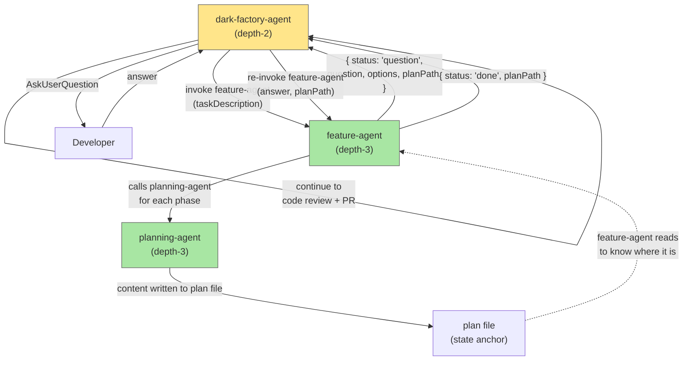

# Fix Planning Approval Gates

## Plan Metadata

- Plan type: `plan`
- Parent plan: `N/A`
- Depends on: `N/A`
- Status: `approved`

## System Intent

- What is being built: A return-question protocol so feature-agent (depth-3) can surface questions to the user via dark-factory-agent (depth-2). When feature-agent needs user input it returns `{ status: "question", ... }` instead of calling AskUserQuestion directly. Dark-factory-agent asks the question at depth-2 (where it works), then re-invokes feature-agent with the answer. Feature-agent resumes by reading the plan file — which already exists and tracks exactly which sections have been written — to know where it left off.
- Primary consumer(s): dark-factory-agent (feature route), developers invoking /dark-factory:manufacture
- Boundary: feature-agent returns structured question objects; dark-factory-agent owns the re-invoke loop for the feature route. All planning thinking remains in feature-agent/planning-agent. No change to execution-agent, code-review, PR, or cleanup.

## Stage Gate Tracker

- [x] Stage 1 Mermaid approved
- [x] Stage 2 Flows approved
- [x] Stage 3 Logs + Deployment approved or skipped

## Mermaid Diagram



## Flows

### Global Types

```txt
FeatureAgentResult =
  | { status: "question", question: string, options: string[], planPath: string, phase: string }
  | { status: "done", planPath: string }
  | { status: "hard-stop", reason: string }

StandardError {
  message: string
}
```

### Flow: `question-return-protocol`

- Test files: `N/A`
- Core files: `agents/featurework/agents/feature-agent.md`, `agents/dark-factory/agents/dark-factory-agent.md`

#### Types

```txt
FeatureAgentInput {
  taskDescription: string       (first invocation)
  answer: string | null         (re-invocation: user's answer to the question)
  planPath: string | null       (re-invocation: path to existing plan file)
}
```

#### Paths

| path | input | output | path-type | notes |
| --- | --- | --- | --- | --- |
| `question.firstInvoke` | `{ taskDescription, answer: null, planPath: null }` | `FeatureAgentResult{status:"question"}` | happy path | feature-agent runs draft_plan phase, hits first approval gate, returns question |
| `question.reInvoke` | `{ answer, planPath }` | `FeatureAgentResult{status:"question"}` | happy path | feature-agent reads planPath to know current phase, applies answer, continues to next gate, returns next question |
| `question.done` | `{ answer, planPath }` (last flow approved) | `FeatureAgentResult{status:"done", planPath}` | happy path | all phases approved and execution-agent complete |
| `question.hardStop` | execution-agent hard-stop | `FeatureAgentResult{status:"hard-stop", reason}` | error | report to developer and stop |

#### Pseudocode

```
# feature-agent — updated logic

Input: taskDescription, answer (may be null), planPath (may be null)

# Determine resume point by reading plan file
if planPath exists:
  read planPath
  determine current phase from Stage Gate Tracker checkboxes:
    - if "Stage 1 Mermaid approved" unchecked → phase = "mermaid" (apply answer, continue)
    - if "Stage 2 Flows approved" unchecked → phase = "flows" (apply answer, continue)
    - if all gates checked → phase = "execution"
else:
  phase = "draft_plan"

# Run the phase
if phase == "draft_plan":
  invoke planning-agent(phase="draft_plan", feedback=taskDescription)
  receive { planPath }
  RETURN { status: "question", question: "<System Intent section>", options: ["Approve — continue to Mermaid", "Request Changes"], planPath, phase: "draft_plan" }

if phase == "mermaid":
  if answer == "Request Changes" or feedback provided:
    invoke planning-agent(phase="mermaid", planPath, feedback=answer)
  else:
    invoke planning-agent(phase="mermaid", planPath, feedback="none")
  receive { planPath, url }
  RETURN { status: "question", question: "<Mermaid section + url>", options: ["Approve — continue to flows", "Request Changes"], planPath, phase: "mermaid" }

if phase == "flows":
  # find next unapproved flow
  # apply answer to current flow if feedback given
  # if all flows approved → proceed to execution
  ...
  RETURN { status: "question", ... } or proceed to execution

if phase == "execution":
  invoke execution-agent(planPath)
  if hardStop: RETURN { status: "hard-stop", reason }
  write brain-patch.json { planFilePath: planPath }
  RETURN { status: "done", planPath }
```

### Flow: `dark-factory-agent-reinvoke-loop`

- Test files: `N/A`
- Core files: `agents/dark-factory/agents/dark-factory-agent.md`

#### Paths

| path | input | output | path-type | notes |
| --- | --- | --- | --- | --- |
| `loop.question` | `FeatureAgentResult{status:"question"}` | AskUserQuestion → re-invoke | happy path | DFA asks question at depth-2, re-invokes feature-agent with answer |
| `loop.done` | `FeatureAgentResult{status:"done"}` | continue to Step 4 (code review) | happy path | planning + execution complete |
| `loop.hardStop` | `FeatureAgentResult{status:"hard-stop"}` | report + cleanup + STOP | error | surface reason to developer |

#### Pseudocode

```
# dark-factory-agent — feature route (Step 3)

result = invoke feature-agent({ taskDescription, answer: null, planPath: null })

LOOP:
  if result.status == "done":
    planFilePath = result.planPath
    BREAK  # proceed to Step 4 (code review)

  if result.status == "hard-stop":
    cleanup(WORK_DIR)
    report "Hard stop: " + result.reason
    STOP

  if result.status == "question":
    AskUserQuestion(result.question, result.options)
    answer = developer response
    result = invoke feature-agent({ answer, planPath: result.planPath, taskDescription: null })
    CONTINUE LOOP
```

## Logs

| Source | Location |
|--------|----------|
| feature-agent phase detection | Claude Code session transcript |
| planning-agent calls | Claude Code session transcript |
| question/answer relay | Claude Code session transcript |
| plan file (state anchor) | `docs/plans/<date>-<slug>.md` |

## Deployment

- Mechanism: `local only`
- Changes:
  - Modify `agents/featurework/agents/feature-agent.md` — replace AskUserQuestion calls with return-question protocol; add resume-from-plan-file logic
  - Modify `agents/dark-factory/agents/dark-factory-agent.md` — replace "invoke feature-agent" with re-invoke loop
- Deploy command: none — agent .md files take effect immediately

