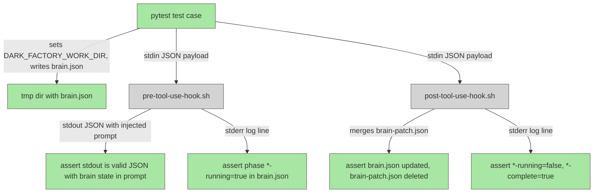

# Hook Unit Tests Plan

## System Intent

- What is being built: Real behavioral unit tests for `pre-tool-use-hook.sh` and `post-tool-use-hook.sh` that actually execute the shell scripts via subprocess and assert file state + stdout/stderr.
- Primary consumer(s): CI, developers running `pytest`
- Boundary (black-box scope only): `tests/test_hooks.py` only. The hook scripts themselves are not modified.

## Stage Gate Tracker

- [x] Stage 1 Mermaid approved
- [x] Stage 2 Flows approved
- [x] Stage 3 Logs + Deployment approved or skipped

## Mermaid Diagram



## Flows

### Global Types

```txt
BrainJson {
  taskDescription: string
  taskName: string
  workDir: string
  classification: string
  planFilePath: null | string
  bugFiles: null | any
  prUrl: null | string
  docsWritten: null | any
  skillsWritten: null | any
  phases: PhaseMap
}

PhaseMap {
  prep-running: bool
  prep-complete: bool
  worker-running: bool
  worker-complete: bool
  review-running: bool
  review-complete: bool
  docs-running: bool
  docs-complete: bool
  skills-running: bool
  skills-complete: bool
  pr-running: bool
  pr-complete: bool
  cleanup-running: bool
  cleanup-complete: bool
}

HookStdinPayload {
  prompt: string   (for pre-hook; any JSON for post-hook)
}
```

### Flow: `pre_hook_injects_brain_state`
- Test files: `tests/test_hooks.py`
- Core files: `agents/dark-factory/scripts/pre-tool-use-hook.sh`

#### Types

```txt
Input: brain.json written to tempdir, stdin = {"prompt": "hello"}
Output: stdout JSON where .prompt contains "BRAIN STATE" and the brain JSON content
```

#### Paths

| path | input | output | path-type | notes | updated |
| --- | --- | --- | --- | --- | --- |
| `pre_hook.inject.success` | valid brain.json + stdin prompt | stdout JSON with injected prompt | happy path | assert "BRAIN STATE" in stdout .prompt | |
| `pre_hook.inject.no_brain` | no brain.json (DARK_FACTORY_WORK_DIR unset) | stdout is unchanged stdin passthrough | happy path | script exits 0 | |

#### Pseudocode

```
tmpdir = tempfile.mkdtemp()
brain = { ...minimal valid brain... }
write brain.json to tmpdir
env = {"DARK_FACTORY_WORK_DIR": tmpdir}
stdin_payload = json.dumps({"prompt": "original prompt"})
result = subprocess.run(["bash", HOOK], input=stdin_payload, capture_output=True, env=env)
assert result.returncode == 0
out = json.loads(result.stdout)
assert "BRAIN STATE" in out["prompt"]
assert brain_json_str in out["prompt"]
```

### Flow: `pre_hook_sets_running_phase`
- Test files: `tests/test_hooks.py`
- Core files: `agents/dark-factory/scripts/pre-tool-use-hook.sh`

#### Types

```txt
Input: brain.json with prep-complete=true, worker-complete=false
Output: brain.json has worker-running=true after hook runs
```

#### Paths

| path | input | output | path-type | notes | updated |
| --- | --- | --- | --- | --- | --- |
| `pre_hook.set_running.success` | phases with first incomplete=worker | brain.json worker-running=true | happy path | | |
| `pre_hook.set_running.no_incomplete` | phases all complete | no change to phases | edge | stderr says "phase=none" | |

#### Pseudocode

```
brain = make_brain(phases={"prep-complete": true, "worker-complete": false, ...all others false})
write brain.json to tmpdir
run pre-hook with stdin={"prompt": "x"}
re-read brain.json
assert brain["phases"]["worker-running"] == True
```

### Flow: `pre_hook_emits_valid_json`
- Test files: `tests/test_hooks.py`
- Core files: `agents/dark-factory/scripts/pre-tool-use-hook.sh`

#### Types

```txt
Input: valid brain.json, stdin = arbitrary JSON
Output: stdout is valid JSON
```

#### Paths

| path | input | output | path-type | notes | updated |
| --- | --- | --- | --- | --- | --- |
| `pre_hook.valid_json.success` | any valid stdin JSON | stdout parseable as JSON | happy path | | |

### Flow: `post_hook_merges_patch`
- Test files: `tests/test_hooks.py`
- Core files: `agents/dark-factory/scripts/post-tool-use-hook.sh`

#### Types

```txt
Input: brain.json + brain-patch.json in same dir, stdin = any JSON
Output: brain.json has patch fields merged, brain-patch.json deleted
```

#### Paths

| path | input | output | path-type | notes | updated |
| --- | --- | --- | --- | --- | --- |
| `post_hook.merge.success` | brain.json + brain-patch.json | brain.json has patch merged; patch file deleted | happy path | | |
| `post_hook.merge.no_patch` | brain.json only (no patch file) | brain.json unchanged | happy path | stderr says "no-patch" | |

#### Pseudocode

```
brain = make_brain()
patch = {"planFilePath": "/some/plan.md"}
write brain.json and brain-patch.json to tmpdir
run post-hook with stdin={}
re-read brain.json
assert brain["planFilePath"] == "/some/plan.md"
assert not os.path.exists(patch_path)
```

### Flow: `post_hook_sets_complete_clears_running`
- Test files: `tests/test_hooks.py`
- Core files: `agents/dark-factory/scripts/post-tool-use-hook.sh`

#### Types

```txt
Input: brain.json with worker-running=true, stdin = any JSON
Output: brain.json has worker-running=false, worker-complete=true
```

#### Paths

| path | input | output | path-type | notes | updated |
| --- | --- | --- | --- | --- | --- |
| `post_hook.phase.success` | worker-running=true | worker-running=false, worker-complete=true | happy path | | |
| `post_hook.phase.no_running` | no phase is running | no change to phases | edge | stderr says "no running phase found" | |

### Flow: `post_hook_no_brain`
- Test files: `tests/test_hooks.py`
- Core files: `agents/dark-factory/scripts/post-tool-use-hook.sh`

#### Types

```txt
Input: DARK_FACTORY_WORK_DIR unset or brain.json absent
Output: exit 0, no file changes
```

#### Paths

| path | input | output | path-type | notes | updated |
| --- | --- | --- | --- | --- | --- |
| `post_hook.no_brain.success` | no brain.json | exit 0 silently | happy path | | |

## Logs

| Source | Location |
|--------|----------|
| pre-tool-use-hook.sh | stderr: `pre-tool-use-hook | <step> | <data>` |
| post-tool-use-hook.sh | stderr: `post-tool-use-hook | <step> | <data>` |

## Deployment

- Mechanism: `local only`
- Deploy command:
  ```bash
  cd /home/lewibs/github/dark_factory/dark_factory-hook-unit-tests && pytest tests/test_hooks.py -v
  ```
- Notes: No deployment — pure pytest unit tests.
