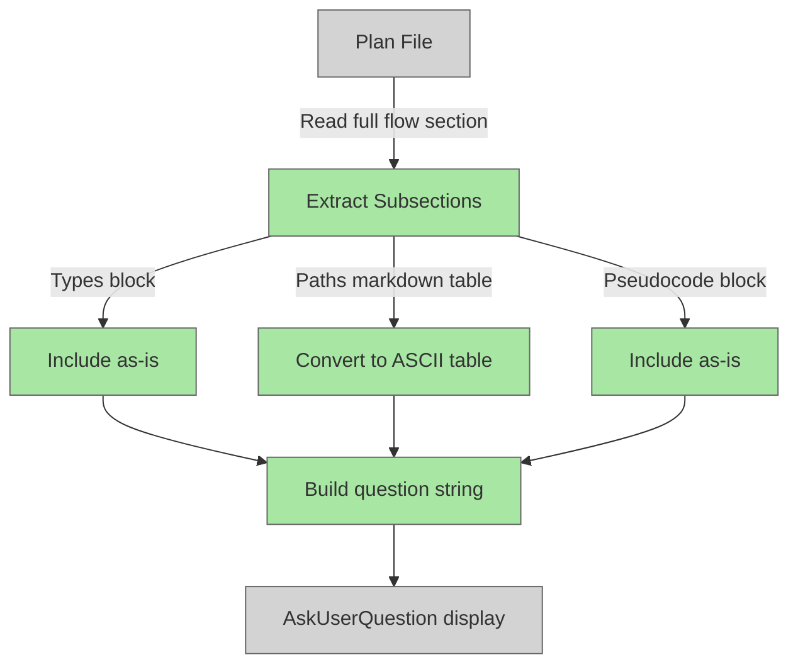

# Improve Flow Section Display in Feature-Agent

## Plan Metadata

- Plan type: `plan`
- Parent plan: N/A
- Depends on: N/A
- Status: `draft`

## System Intent

- What is being built: Improved formatting for the flow section shown to users during Phase 3 (flows) of feature planning, and consistent section inclusion (Types, Paths, Pseudocode) in the displayed question.
- Primary consumer(s): Developers reviewing individual flow sections via the AskUserQuestion prompt during feature planning.
- Boundary: `agents/featurework/agents/feature-agent.md` only — no new files needed.

## Stage Gate Tracker

- [ ] Stage 1 Mermaid approved
- [ ] Stage 2 Flows approved
- [ ] Stage 3 Logs + Deployment approved or skipped

## Mermaid Diagram

> Use the skill at `skills/create-mermaid-diagram/SKILL.md` to generate this diagram.



ONCE YOU GET APPROVAL FROM THE DEVELOPER, DELETE THIS LINE AND UPDATE THE STAGE GATE TRACKER

## Flows

### Global Types

```txt
FlowSection {
  name: string (flow name from ### Flow: header)
  testFiles: string (from "- Test files:" line)
  coreFiles: string (from "- Core files:" line)
  types: string | null (#### Types fenced block content, or null if section absent)
  paths: string (#### Paths markdown table content)
  pseudocode: string | null (#### Pseudocode fenced block content, or null if section absent)
}

AsciiTable {
  header: string[] (column names)
  rows: string[][] (data row values)
  rendered: string (ASCII-art table string)
}
```

### Flow: `format-flow-display`
- Test files: N/A
- Core files: `agents/featurework/agents/feature-agent.md`

#### Types

```txt
Input: FlowSection (parsed from plan file)
Output: question string with ASCII-formatted table and all present subsections
```

#### Paths

| path | input | output | path-type | notes | updated |
| --- | --- | --- | --- | --- | --- |
| `format-flow-display.success` | Flow section with Types + Paths + Pseudocode | Formatted question with ASCII table, types block, pseudocode block | happy path | All three subsections present | |
| `format-flow-display.types-missing` | Flow section without #### Types | Formatted question with ASCII table and pseudocode only | happy path | Types block omitted gracefully when not in plan | |
| `format-flow-display.pseudocode-missing` | Flow section without #### Pseudocode | Formatted question with ASCII table and types only | happy path | Pseudocode block omitted gracefully when not in plan | |
| `format-flow-display.paths-only` | Flow section with only #### Paths | Formatted question with ASCII table only | happy path | Only mandatory section (Paths) present | |

#### Pseudocode

```
Phase 3 — extract and format flow section for display:

1. Read planPath
2. Find the ### Flow: <nextFlow> section boundary:
   - Start: line matching "### Flow: `<nextFlow>`"
   - End: next "### Flow:" line, "## " section, or end of file
3. Parse subsections within that boundary:
   a. Test files line: "- Test files: ..."
   b. Core files line: "- Core files: ..."
   c. #### Types block: content between "#### Types" and next "####" or "###" or "##"
   d. #### Paths table: content between "#### Paths" and next "####" or "###" or "##"
   e. #### Pseudocode block: content between "#### Pseudocode" and next "####" or "###" or "##"

4. Convert the #### Paths markdown table to ASCII art inline:
   - Split table lines; skip empty lines
   - Row 0 is the header: "| col1 | col2 | ... |"
   - Row 1 is the separator: "| --- | --- | ... |" — skip this row
   - Remaining rows are data rows
   - For each column, compute max width = max(header col length, all data col lengths)
   - Build ASCII table:
       +--------+--------+
       | col1   | col2   |
       +--------+--------+
       | val1   | val2   |
       +--------+--------+

5. Construct the question display string:
   "Here is the `<nextFlow>` flow:
   
   Test files: <testFiles>
   Core files: <coreFiles>
   
   [#### Types (if present):
   <types block content>]
   
   #### Paths:
   <ascii table>
   
   [#### Pseudocode (if present):
   <pseudocode block content>]
   
   How would you like to proceed?"
```

ONCE YOU GET APPROVAL FROM THE DEVELOPER, DELETE THIS LINE AND UPDATE THE STAGE GATE TRACKER

## Logs

| Source | Location |
|--------|----------|
| N/A | Local agent execution only |

## Deployment

- Mechanism: `local only`
- Deploy command: N/A — agent prompt file change, no deploy step
- Notes: Change takes effect immediately on next feature-agent invocation.

ONCE YOU GET APPROVAL FROM THE DEVELOPER, DELETE THIS LINE AND UPDATE THE STAGE GATE TRACKER

## Handoff to Related Plan Reconciliation

After all stages are approved, apply `.agent/skills/reconcile-plans/SKILL.md` to propagate contract updates across linked plans.
