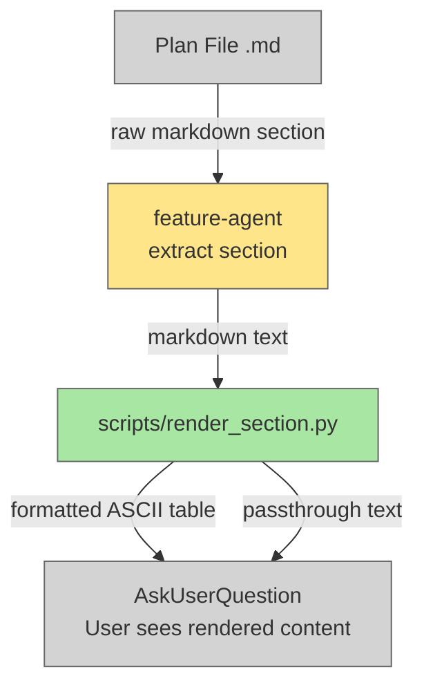

# Improve Flow Plan Display Rendering

## Plan Metadata

- Plan type: `plan`
- Parent plan: `N/A`
- Depends on: `N/A`
- Status: `draft`

## System Intent

- What is being built: A rendering script (`scripts/render_section.py`) that converts raw markdown text with pipe-delimited tables into beautifully formatted ASCII tables with proper column alignment and borders. Feature-agent is updated to use this script when displaying plan sections (System Intent, Mermaid Diagram, individual flows) to users. This replaces the current raw markdown display with rendered, human-friendly formatted output.
- Primary consumer(s): feature-agent (invokes render script to format section content before displaying in AskUserQuestion)
- Boundary (black-box scope only): Output rendering only — plan files remain unchanged; only the user-facing question display is formatted

## Stage Gate Tracker

- [x] Stage 1 Mermaid approved
- [x] Stage 2 Flows approved
- [x] Stage 3 Logs + Deployment approved or skipped

## Mermaid Diagram



## Flows

### Global Types

```txt
MarkdownSection: string
  Raw markdown text extracted from plan file (may contain pipe-delimited tables, code blocks, headers)

FormattedSection: string
  Rendered text with ASCII tables replacing pipe-delimited markdown tables
  Other content (headers, code blocks, text) passes through unchanged
```

### Flow: `renderTable`

- Test files: `tests/test_render_section.py`
- Core files: `scripts/render_section.py`

#### Types

```txt
TableInput {
  rows: list[string]
    Raw markdown table rows (each starts with "|")
}

TableOutput {
  lines: list[string]
    Formatted ASCII table lines with padded columns and +-+- borders
}
```

#### Paths

| path | input | output | path-type | notes | updated |
| --- | --- | --- | --- | --- | --- |
| `renderTable.markdown` | `MarkdownSection` with pipe-delimited rows | `FormattedSection` with padded ASCII table | happy path | Detects contiguous | rows, skips separator rows (` \| --- \| `), computes column widths, renders table with borders | |
| `renderTable.singleRow` | `MarkdownSection` with header row only | `FormattedSection` with header row and borders | happy path | Even with no data rows, renders table structure with borders | |

#### Pseudocode

```
def render_markdown_to_ascii(content: str) -> str:
    lines = content.split('\n')
    result = []
    i = 0
    
    while i < len(lines):
        if lines[i].startswith('|'):
            # Collect all contiguous table rows
            table_lines = []
            while i < len(lines) and lines[i].startswith('|'):
                table_lines.append(lines[i])
                i += 1
            
            # Render table
            result.extend(render_table(table_lines))
        else:
            # Non-table content passes through
            result.append(lines[i])
            i += 1
    
    return '\n'.join(result)

def render_table(rows: list[str]) -> list[str]:
    # Parse cells from each row
    cells = [parse_pipe_row(r) for r in rows]
    
    # Filter out separator rows (| --- | --- |)
    data_cells = [c for c in cells if not is_separator_row(c)]
    
    if not data_cells:
        return []
    
    # Compute column widths
    ncols = len(data_cells[0])
    widths = [max(len(row[i]) for row in data_cells) for i in range(ncols)]
    
    # Render table
    result = []
    border = '+' + '+'.join('-' * (w + 2) for w in widths) + '+'
    result.append(border)
    
    for i, row in enumerate(data_cells):
        rendered_row = '| ' + ' | '.join(
            cell.ljust(widths[j]) for j, cell in enumerate(row)
        ) + ' |'
        result.append(rendered_row)
        
        if i == 0:  # After header
            result.append(border)
    
    result.append(border)
    return result
```

### Flow: `passthroughContent`

- Test files: `tests/test_render_section.py`
- Core files: `scripts/render_section.py`

#### Types

```txt
NonTableInput {
  content: string
    Markdown text without pipe-delimited table rows (headers, code blocks, plain text)
}
```

#### Paths

| path | input | output | path-type | notes | updated |
| --- | --- | --- | --- | --- | --- |
| `passthroughContent.text` | `MarkdownSection` with headers/plain text | `FormattedSection` identical to input | happy path | Non-table lines pass through unchanged | |
| `passthroughContent.codeBlock` | `MarkdownSection` with ` ``` ` fenced code blocks | `FormattedSection` identical to input | happy path | Content inside code fences never treated as tables, passes through unchanged | |

#### Pseudocode

```
def is_in_code_fence(line_index: int, lines: list[str]) -> bool:
    in_fence = False
    for i in range(line_index):
        if lines[i].startswith('```') or lines[i].startswith('~~~'):
            in_fence = not in_fence
    return in_fence

# When processing lines:
# If in code fence: output as-is
# Else if starts with "|": buffer for table rendering
# Else: flush buffered table, output as-is
```

### Flow: `featureAgentIntegration`

- Test files: `tests/test_feature_agent_render.py`
- Core files: `agents/featurework/agents/feature-agent.md`, `scripts/render_section.py`

#### Types

```txt
SectionContent: string
  Raw markdown extracted from plan file

FormattedContent: string
  Output of scripts/render_section.py (rendered tables, passthrough text)

FeatureAgentQuestion {
  question: string
    Contains FormattedContent instead of raw SectionContent
  status: string = "question"
}
```

#### Paths

| path | input | output | path-type | notes | updated |
| --- | --- | --- | --- | --- | --- |
| `featureAgentIntegration.draftPlan` | System Intent section from plan | question with FormattedContent | happy path | feature-agent pipes System Intent through render_section.py before embedding in question | |
| `featureAgentIntegration.mermaid` | Mermaid Diagram section from plan | question with FormattedContent | happy path | Same pipeline; mermaid code blocks pass through unchanged | |
| `featureAgentIntegration.flowSection` | `### Flow: <name>` section (includes Types, Paths, Pseudocode) | question with FormattedContent | happy path | Paths table rendered as ASCII; Types and Pseudocode code blocks pass through | |
| `featureAgentIntegration.fallback` | scripts/render_section.py missing/errors | question with raw SectionContent | degradation | feature-agent falls back to unformatted content if script fails | |

#### Pseudocode

```
# In feature-agent, when extracting a section for user display:
section_content = read_plan_file_section(planPath, section_name)

# Attempt to render
rendered = bash(f'python3 scripts/render_section.py', stdin=section_content)
if rendered.exit_code == 0:
    formatted_content = rendered.stdout
else:
    formatted_content = section_content  # fallback to raw

# Embed in question
question_text = f"Here is the {section_name}:\n\n{formatted_content}\n\nHow would you like to proceed?"
```

## Logs

| Source | Location |
|--------|----------|
| render_section.py | stderr (table parsing errors, column width issues) |

## Deployment

- Mechanism: `local only`
- Deploy command: N/A
- Notes: Script runs in-process during manufacture via bash pipe; no external deployment required.
