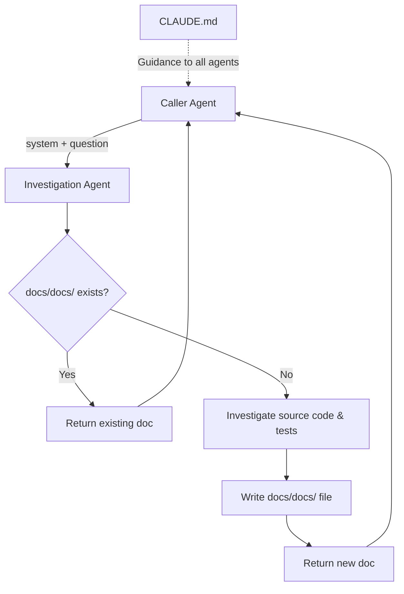

# Investigation Agent Integration

## Plan Metadata

- Plan type: `plan`
- Parent plan: `N/A`
- Depends on: `N/A`
- Status: `draft`

## System Intent

- **What is being built**: Establish a convention where all worker agents delegate system understanding questions to investigation-agent rather than doing their own code research. This follows the single-responsibility principle and centralizes documentation generation. The guidance is provided via CLAUDE.md (injected into every agent's context) rather than individual agent edits.

- **Primary consumer(s)**: 
  - Any agent that needs to understand a system to proceed: debugger-agent, repair-agent, sub-planning-agent, implementation-agent, skeleton-agent, testing-agent, setup-wizard, debug-flow-agent, all review agents

- **Boundary (black-box scope only)**: 
  - Investigation-agent provides a service interface: given a system/topic question, it returns authoritative documentation (either existing or newly created)
  - Worker agents invoke investigation-agent when they need to understand a system to proceed with their work
  - Investigation-agent is responsible for checking docs/docs/ and writing new docs — worker agents only consume the result
  - Guidance about when and how to call investigation-agent is documented in CLAUDE.md

## Stage Gate Tracker

- [x] Stage 1 Mermaid approved
- [ ] Stage 2 Flows approved
- [ ] Stage 3 Logs + Deployment approved or skipped

## Mermaid Diagram



## Flows

### Global Types

```txt
InvestigationQuestion {
  system: string (system or topic name to investigate)
  question: string (optional: specific question about the system)
}

InvestigationResult {
  documentPath: string (absolute path to docs/docs/<system-name>.md)
  content: string (the documentation content)
  isNew: boolean (true if doc was created by this call)
}

StandardError {
  message: string (human-readable error description)
}
```

### Flow: `investigation-agent-handles-documentation-request`

- Test files: `tests/test_investigation_agent_integration.py` (new), `tests/test_investigation_agent_core.py` (verify existing)
- Core files: `agents/documentation/agents/investigation-agent.md`, CLAUDE.md (guidance added), optional skill wrapper

#### Description

A caller (worker agent) invokes investigation-agent with a system name and optional question. Investigation-agent:
1. Checks if documentation exists in docs/docs/
2. If docs exist, returns them immediately (no staleness check)
3. If docs do not exist, investigates the source code and tests to understand the system, then writes new documentation
4. Returns the documentation content and metadata to the caller

#### Paths

| path | input | output | path-type | notes |
| --- | --- | --- | --- | --- |
| `investigation.doc-exists` | `InvestigationQuestion` | `InvestigationResult` | `happy path` | Existing docs found; return them immediately |
| `investigation.doc-missing-discover-create` | `InvestigationQuestion` | `InvestigationResult` | `happy path` | No docs exist; investigate code and create new documentation |
| `investigation.system-not-found` | `InvestigationQuestion` | `StandardError` | `error` | System cannot be understood (code not in repo, invalid system, investigation failed) |

#### Pseudocode

```
investigation_agent(system, question):
  # Step 1: Check for existing documentation
  docPath = "docs/docs/<system>.md"
  if docPath exists:
    existing_content = read(docPath)
    return {
      documentPath: docPath,
      content: existing_content,
      isNew: false
    }
  
  # Step 2: No existing doc - investigate and create
  investigation_results = investigate_system(system, question)
  if investigation_results.error:
    return error
  
  new_doc = create_documentation(investigation_results)
  write(docPath, new_doc)
  return {
    documentPath: docPath,
    content: new_doc,
    isNew: true
  }
```

#### Caller Integration Pattern (CLAUDE.md Guidance)

Worker agents invoke investigation-agent when they need to understand a system:

```
when agent needs to understand system X:
  result = invoke investigation-agent({
    system: "X",
    question: "Please provide documentation on how system X works"
  })
  
  if result.error:
    log error but continue (pattern: "doc lookup failed, continuing without")
    return null or proceed with partial knowledge
  
  return result.content  # use the documentation to proceed with work
```

## Implementation via CLAUDE.md

Rather than editing all agent files individually, the plan uses the CLAUDE.md approach:

1. **Update CLAUDE.md** with a section titled "Investigation Agent Pattern" that provides:
   - When to call investigation-agent: "Whenever you need to understand how a system or component works before proceeding"
   - How to call it: Example pseudocode and/or optional skill wrapper call
   - Error handling: "If investigation-agent returns an error, log and continue with partial knowledge"
   - Example: "Before making code changes, call investigation-agent to understand the system's architecture"

2. **Verify investigation-agent handles being called by another agent properly**:
   - Test that investigation-agent works when invoked as a sub-agent (not just as a direct CLI call)
   - Ensure it returns structured JSON output (not just markdown)
   - Confirm it gracefully handles missing systems with error messages

3. **Optional: Create an investigation-agent-call skill** (if agents cannot directly invoke sub-agents):
   - Wraps the investigation-agent invocation with standard error handling
   - Provides a convenient interface: `@invoke-investigation-agent(system="...", question="...")`
   - Agents reference this skill in their CLAUDE.md guidance

## Logs

This feature work does not generate logs at a specific location. Logging is managed by the `skills/logging/SKILL.md` invoked during implementation-agent execution.

## Deployment

- Mechanism: `local only` (dark-factory plugin agents update)
- Deploy command:
  ```bash
  # No deployment needed - CLAUDE.md updates are effective immediately
  # In production (dark-factory plugin repo), rebuild and publish the plugin
  ```
- Notes: This is a lightweight refactoring of dark-factory guidance (CLAUDE.md update) with optional skill addition. No individual agent files require bulk editing. The feature is complete when CLAUDE.md is updated, investigation-agent is verified to work as a sub-agent, and any skill wrapper is in place.

## Summary

This plan establishes a lightweight pattern for agents to delegate system understanding work to investigation-agent. By updating CLAUDE.md with guidance (rather than editing all agent files), every agent automatically receives the pattern in its context. The implementation is minimal: verify investigation-agent works when called by other agents, add guidance to CLAUDE.md, and optionally create a skill wrapper.

The benefits remain the same:
1. **Reduces duplication**: Each system/topic is researched once, then reused
2. **Improves accuracy**: Centralized documentation is easier to keep up-to-date
3. **Speeds up agent execution**: Agents reuse documentation instead of running independent discovery
4. **Enables knowledge sharing**: Docs written by one agent's investigation help future agents
5. **Follows the pattern**: investigation-agent already exists for this purpose; agents can easily use it via CLAUDE.md guidance

The primary flow is:
- **Caller invokes investigation-agent** with a system/topic question
- **Investigation-agent checks docs/docs/** and returns existing docs immediately, or investigates code and creates new docs
- **Returns documentation content** to the caller for use in proceeding with their work
