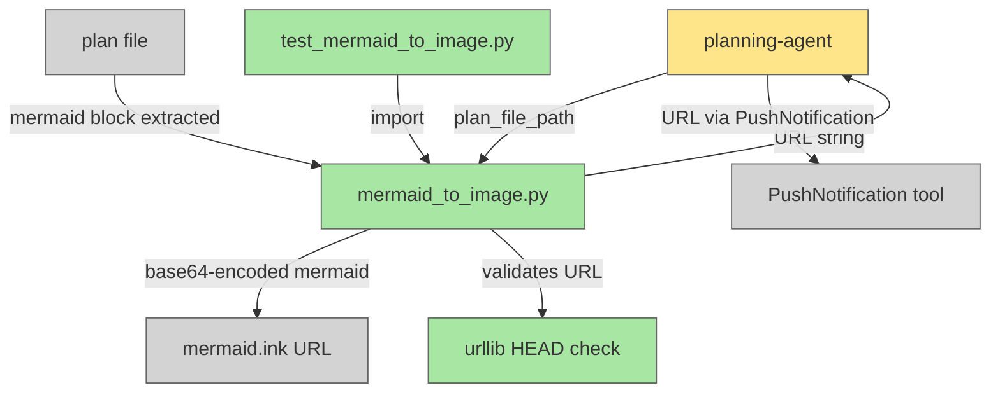

# Mermaid to Image — Plan Diagram to Phone

## System Intent

- What is being built: A Python script (`scripts/mermaid_to_image.py`) that extracts a Mermaid fenced code block (by 1-indexed position, defaulting to the first) from a plan `.md` file, base64-encodes it, and returns a `mermaid.ink` URL. The planning-agent is updated to call this script after writing the plan and push the URL to the user's phone via PushNotification so they can tap it.
- Primary consumer(s): `planning-agent` — calls the script after writing each plan and pushes the URL to the user's phone.
- Boundary (black-box scope only): `mermaid.ink` (external rendering service — treated as a black box). PushNotification tool (Claude Code built-in — treated as a black box).

## Stage Gate Tracker

- [x] Stage 1 Mermaid approved
- [x] Stage 2 Flows approved
- [ ] Stage 3 Logs + Deployment approved or skipped

## Mermaid Diagram



## Flows

- Flow naming rule: ``### Flow: `<flowname>` ``
- `N/A` for test files means explicit no-test-required waiver (not a missing mapping).

### Global Types

```txt
StandardError {
  message: string (human-readable description of what went wrong)
}
```

---

### Flow: `extractMermaidFromPlan`

- Test files: `tests/test_mermaid_to_image.py`
- Core files: `scripts/mermaid_to_image.py`

#### Types

```txt
ExtractInput {
  plan_file_path: string   (absolute path to a docs/plans/*.md file)
  block_index: int         (1-indexed position of the mermaid block to extract; default 1)
}

ExtractOutput {
  mermaid_string: string   (the mermaid fenced code block at position block_index)
}
```

#### Paths

| path | input | output | path-type | notes |
| --- | --- | --- | --- | --- |
| `extractMermaidFromPlan.success-block-1` | `ExtractInput{block_index=1}` (or omitted) | `ExtractOutput` | `happy path` | first ```mermaid...``` block extracted and returned |
| `extractMermaidFromPlan.success-block-2` | `ExtractInput{block_index=2}` | `ExtractOutput` | `happy path` | second ```mermaid...``` block extracted and returned |
| `extractMermaidFromPlan.not-found` | `ExtractInput` (no mermaid block) | `StandardError` | `error` | raises ValueError: "No mermaid block found in <path>" |
| `extractMermaidFromPlan.index-out-of-range` | `ExtractInput{block_index=N}` where N > number of blocks | `StandardError` | `error` | raises ValueError: "Block index <N> out of range: only <count> mermaid block(s) found in <path>" |
| `extractMermaidFromPlan.file-missing` | `ExtractInput` (bad path) | `StandardError` | `error` | raises FileNotFoundError |

#### Pseudocode

```
extract_mermaid_from_plan(plan_file_path: str, block_index: int = 1) -> str:
  read file at plan_file_path
  collect all occurrences of ```mermaid\n...\n``` patterns (regex or line scan) into a list
  if list is empty: raise ValueError("No mermaid block found in <plan_file_path>")
  if block_index > len(list): raise ValueError("Block index <block_index> out of range: only <len(list)> mermaid block(s) found in <plan_file_path>")
  return the block content at list[block_index - 1] (between the fences, exclusive)
```

---

### Flow: `generateMermaidInkUrl`

- Test files: `tests/test_mermaid_to_image.py`
- Core files: `scripts/mermaid_to_image.py`

#### Types

```txt
UrlInput {
  mermaid_string: string   (raw Mermaid diagram text extracted from a plan file)
}

UrlOutput {
  url: string              (fully-qualified mermaid.ink URL: https://mermaid.ink/img/<base64>)
}
```

#### Paths

| path | input | output | path-type | notes |
| --- | --- | --- | --- | --- |
| `generateMermaidInkUrl.success` | `UrlInput` | `UrlOutput` | `happy path` | mermaid string base64-encoded; URL returned |
| `generateMermaidInkUrl.empty-input` | `UrlInput{mermaid_string=""}` | `StandardError` | `error` | raises ValueError: "empty mermaid input" |

#### Pseudocode

```
generate_mermaid_ink_url(mermaid_string: str) -> str:
  if mermaid_string.strip() == "": raise ValueError("empty mermaid input")
  encoded = base64.urlsafe_b64encode(mermaid_string.encode("utf-8")).decode("utf-8")
  return f"https://mermaid.ink/img/{encoded}"
```

---

### Flow: `cliEntryPoint`

- Test files: `tests/test_mermaid_to_image.py`
- Core files: `scripts/mermaid_to_image.py`

#### Types

```txt
CliInput {
  plan_file_path: string   (positional CLI argument — path to the plan .md file)
  block_index: int         (optional positional or --block flag; 1-indexed; default 1)
}

CliOutput {
  url: string              (printed to stdout: the mermaid.ink URL)
}
```

#### Paths

| path | input | output | path-type | notes |
| --- | --- | --- | --- | --- |
| `cliEntryPoint.success-default` | valid plan file path, no block arg | URL printed to stdout, exit 0 | `happy path` | defaults to block 1; extract + URL generation succeed |
| `cliEntryPoint.success-block-n` | valid plan file path, `--block N` or positional N | URL printed to stdout, exit 0 | `happy path` | extracts Nth block; URL printed |
| `cliEntryPoint.no-block` | plan file with no mermaid block | error message to stderr, exit 1 | `error` | ValueError from extractMermaidFromPlan |
| `cliEntryPoint.index-out-of-range` | plan file, block_index > number of blocks | error message to stderr, exit 1 | `error` | ValueError from extractMermaidFromPlan |
| `cliEntryPoint.file-missing` | non-existent file path | error message to stderr, exit 1 | `error` | FileNotFoundError from extractMermaidFromPlan |

#### Pseudocode

```
cli (argparse):
  arg: plan_file_path (positional, required)
  arg: block_index (optional; either positional second arg or --block flag; type=int; default=1)
  try:
    mermaid_string = extract_mermaid_from_plan(plan_file_path, block_index)
    url = generate_mermaid_ink_url(mermaid_string)
    print(url)
    sys.exit(0)
  except (FileNotFoundError, ValueError) as e:
    print(f"Error: {e}", file=sys.stderr)
    sys.exit(1)
```

---

### Flow: `planningAgentPushesUrl`

- Test files: `N/A`
- Core files: `agents/featurework/planning/agents/planning-agent.md`

#### Types

```txt
PlanningAgentUrlStep {
  plan_file_path: string     (absolute path to the written plan file)
  url: string                (mermaid.ink URL returned by the script)
}
```

#### Paths

| path | input | output | path-type | notes |
| --- | --- | --- | --- | --- |
| `planningAgentPushesUrl.success` | plan written with mermaid block | PushNotification with tappable URL sent | `happy path` | After writing plan, agent calls script; URL pushed to phone |
| `planningAgentPushesUrl.no-mermaid` | plan has no mermaid block | skip URL step, continue | `branch` | If no mermaid block exists yet, skip silently |
| `planningAgentPushesUrl.script-failure` | script exits non-zero | log warning, continue without URL | `branch` | Do not block plan approval gate on script failure |

#### Pseudocode

```
planning-agent (after writing plan file):
  run: python3 scripts/mermaid_to_image.py <plan_file_path>
  capture stdout as url
  if exit code == 0 and url is non-empty:
    call PushNotification with message: "Plan diagram: <url>"
  else:
    log warning — skip URL push, continue to approval gate
```

---

## Logs

| Source | Location |
|--------|----------|
| mermaid_to_image.py | stderr (extraction/encoding errors); stdout (URL on success) |

## Deployment

- Mechanism: `local only`
- Deploy command:
  ```bash
  # No deployment step. Script is called directly by the planning-agent.
  # Requires: Python 3 standard library only (base64, argparse, re, sys).
  # No external dependencies or CLI tools needed.
  ```
- Notes: `mermaid.ink` is an external rendering service. The script only generates the URL — no HTTP requests are made locally. The user's phone browser renders the diagram when they tap the link.

## Handoff to Related Plan Reconciliation

After all stages are approved, apply `.agent/skills/reconcile-plans/SKILL.md` to propagate contract updates across linked plans.
