# Orchestrators to Haiku

## System Intent

- **What is being built:** A cost-reduction change that switches all pure orchestrator agents from `model: sonnet` to `model: haiku`. Orchestrators that only classify input, call sub-agents, read results, and route — without doing deep reasoning, writing code, plans, or docs — are converted to haiku. Worker agents that write plans, implement code, debug, review, or write docs remain on sonnet.
- **Primary consumer(s):** dark-factory-agent and all callers that invoke the manufacture workflow.
- **Boundary (black-box scope only):** Only `model:` field changes in agent `.md` front-matter files. No logic, instructions, or tooling changes.

## Agent Audit

### Classification Table

| Agent | File | Current Model | Classification | Justification | Action |
|---|---|---|---|---|---|
| `dark-factory-agent` | `agents/dark-factory/agents/dark-factory-agent.md` | haiku | Orchestrator | Classifies input, preps work dir, routes to worker, reads brain.json results, coordinates cleanup. No deep reasoning. | Already haiku — no change |
| `feature-agent` | `agents/featurework/agents/feature-agent.md` | sonnet | Orchestrator | Drives phase-by-phase planning gate; calls planning-agent per phase, presents sections to user, then calls execution-agent. Does not write plans or code. Uses AskUserQuestion for user interaction only. | **Switch to haiku** |
| `planning-agent` | `agents/featurework/planning/agents/planning-agent.md` | haiku | Orchestrator | Pure phase-delegator. Receives phase + context, spawns sub-planning-agent, returns structured output. No reasoning. | Already haiku — no change |
| `sub-planning-agent` | `agents/featurework/planning/agents/sub-planning-agent.md` | sonnet | Worker | Researches codebase, writes plan files, runs mermaid scripts. Heavy reasoning and writing. | Keep sonnet |
| `execution-agent` | `agents/featurework/execution/agents/execution-agent.md` | sonnet | Orchestrator | Sequences skeleton → testing → implementation agents in strict order; gate-checks checklists; enters planning mode on hard-stop. No code writing. | **Switch to haiku** |
| `skeleton-agent` | `agents/featurework/execution/agents/skeleton-agent.md` | sonnet | Worker | Reads plan, builds files checklist, creates skeleton files. Does actual file creation and reasoning. | Keep sonnet |
| `testing-agent` | `agents/featurework/execution/agents/testing-agent.md` | sonnet | Worker | Reads plan, builds flows checklist, writes failing tests. Does actual test writing. | Keep sonnet |
| `implementation-agent` | `agents/featurework/execution/agents/implementation-agent.md` | sonnet | Worker | Implements each flow from checklist, runs tests, invokes deviation-protocol. Heavy implementation work. | Keep sonnet |
| `code-review-orchestrator-agent` | `agents/code-review/agents/code-review-orchestrator-agent.md` | sonnet | Orchestrator | Creates issues.md, spawns parallel reviewers, runs resolver loop until clean. No review reasoning itself. | **Switch to haiku** |
| `high-level-review-agent` | `agents/code-review/agents/high-level-review-agent.md` | sonnet | Worker | Reviews code against plan for structural/architectural conformance. Deep reasoning required. | Keep sonnet |
| `low-level-review-agent` | `agents/code-review/agents/low-level-review-agent.md` | sonnet | Worker | Reviews code at function level for bugs, untested paths, conflicts. Deep reasoning required. | Keep sonnet |
| `resolver-agent` | `agents/code-review/agents/resolver-agent.md` | sonnet | Worker | Reads issues, applies fixes, checks them off. Does actual code editing and reasoning. | Keep sonnet |
| `debugger-agent` | `agents/debugger/agents/debugger-agent.md` | sonnet | Worker | Systematic debugging following debug skill checklist. Heavy reasoning and investigation. | Keep sonnet |
| `detect-drift-agent` | `agents/documentation/agents/detect-drift-agent.md` | sonnet | Worker | Audits parity between docs and code, fixes drift in place. Deep analysis required. | Keep sonnet |
| `investigation-agent` | `agents/documentation/agents/investigation-agent.md` | sonnet | Worker | Explores codebase, validates/creates authoritative docs. Heavy research and writing. | Keep sonnet |
| `update-documentation-agent` | `agents/documentation/agents/update-documentation-agent.md` | sonnet | Worker | Identifies affected flows/docs, deletes stale content, updates/adds sections. Complex writing. | Keep sonnet |
| `fix-flow-orchestrator` | `agents/fix-flow/agents/fix-flow-orchestrator.md` | sonnet | Orchestrator | Runs 3 phases in strict sequence: spawns investigation-agent, setup-wizard, ralph-fix-and-push. Routing and sequencing only. Handles required-argument clarification via AskUserQuestion. | **Switch to haiku** |
| `debug-flow-agent` | `agents/fix-flow/agents/debug-flow-agent.md` | sonnet | Worker | Runs integration flow, waits, fetches logs, hands off to debugger-agent. Complex coordination and log analysis. Borderline — but reads and interprets logs. | Keep sonnet |
| `ralph-fix-and-push` | `agents/fix-flow/agents/ralph-fix-and-push.md` | sonnet | Orchestrator | Loops: trigger flow → spawn debugger-agent → spawn pr-agent → deploy. Sequencing and loop management; no debugging or PRs itself. Handles stuck-loop user interaction. | **Switch to haiku** |
| `setup-wizard` | `agents/fix-flow/agents/setup-wizard.md` | sonnet | Worker | Reads system document, generates trigger.sh, wait-for-completion.sh, fetch-logs.sh, deploy.sh. Actual script writing and reasoning. | Keep sonnet |
| `init-orchestrator-agent` | `agents/initialization/agents/init-orchestrator-agent.md` | sonnet | Orchestrator | Clones repo, sets bypassPermissions, invokes init-docs-agent, invokes pr-agent. Pure delegation with minimal logic. | **Switch to haiku** |
| `init-docs-agent` | `agents/initialization/agents/init-docs-agent.md` | sonnet | Worker | Discovers systems, discovers flows per system, invokes investigation-agent per flow, writes CLAUDE.md index. Heavy codebase exploration and writing. | Keep sonnet |
| `pr-agent` | `agents/pr/agents/pr-agent.md` | sonnet | Worker | Manages full PR lifecycle: builds PR body, opens PR, CI watch loop, comment resolution loop, spawns resolve-pr-issue. Complex multi-loop management with real reasoning about CI failures. | Keep sonnet |
| `resolve-pr-issue` | `agents/pr/agents/resolve-pr-issue.md` | sonnet | Worker | Resolves single PR issue (CI failure or review thread): reads issue, applies fix, pushes, resolves thread. Actual fix implementation. | Keep sonnet |
| `repair-agent` | `agents/repair/agents/repair-agent.md` | sonnet | Worker | Applies targeted changes, runs test suite, iteratively fixes failures up to 5 times. Actual implementation work. | Keep sonnet |
| `skill-update-agent` | `agents/skill-update/agents/skill-update-agent.md` | sonnet | Worker | Reviews completed work, identifies patterns, writes/updates skill files. Deep analysis and writing. | Keep sonnet |

### Summary of Changes

**Switch to haiku (5 agents):**
1. `feature-agent` — orchestrates planning phases and approval gates; no plan writing
2. `execution-agent` — sequences skeleton/testing/implementation; no code writing
3. `code-review-orchestrator-agent` — spawns parallel reviewers and loops resolver; no review reasoning
4. `fix-flow-orchestrator` — sequences 3 phases; no investigation/debugging/fixing
5. `ralph-fix-and-push` — loops debugger/pr-agent; no debugging or PR work itself
6. `init-orchestrator-agent` — clones repo, delegates to init-docs-agent and pr-agent; minimal logic

**Already haiku (2 agents):**
- `dark-factory-agent`
- `planning-agent`

**Stay sonnet (19 agents):**
All workers that write code, plans, docs, tests, scripts, or do deep reasoning/debugging/review.

## Stage Gate Tracker

- [ ] Stage 1 Mermaid approved
- [ ] Stage 2 Flows approved
- [ ] Stage 3 Logs + Deployment approved or skipped

## Mermaid Diagram

```mermaid
graph TD
  subgraph Orchestrators["Orchestrators — switch to haiku"]
    DFA["dark-factory-agent<br/>(already haiku)"]
    FA["feature-agent<br/>sonnet → haiku"]
    PA["planning-agent<br/>(already haiku)"]
    EA["execution-agent<br/>sonnet → haiku"]
    CROA["code-review-orchestrator-agent<br/>sonnet → haiku"]
    FFO["fix-flow-orchestrator<br/>sonnet → haiku"]
    RFAP["ralph-fix-and-push<br/>sonnet → haiku"]
    IOA["init-orchestrator-agent<br/>sonnet → haiku"]
  end

  subgraph Workers["Workers — stay on sonnet"]
    SPA["sub-planning-agent"]
    SKA["skeleton-agent"]
    TA["testing-agent"]
    IA["implementation-agent"]
    HLRA["high-level-review-agent"]
    LLRA["low-level-review-agent"]
    RA2["resolver-agent"]
    DA["debugger-agent"]
    DDA["detect-drift-agent"]
    INVA["investigation-agent"]
    UDA["update-documentation-agent"]
    DFA2["debug-flow-agent"]
    SW["setup-wizard"]
    IDA["init-docs-agent"]
    PRA["pr-agent"]
    RPRI["resolve-pr-issue"]
    REP["repair-agent"]
    SUA["skill-update-agent"]
  end

  DFA -->|routes to| FA
  FA -->|delegates phase| PA
  PA -->|delegates| SPA
  FA -->|invokes| EA
  EA -->|sequences| SKA
  EA -->|sequences| TA
  EA -->|sequences| IA
  DFA -->|invokes| CROA
  CROA -->|parallel| HLRA
  CROA -->|parallel| LLRA
  CROA -->|loops| RA2
  DFA -->|routes to| FFO
  FFO -->|phase 1| INVA
  FFO -->|phase 2| SW
  FFO -->|phase 3| RFAP
  RFAP -->|loops| DA
  RFAP -->|loops| PRA
  DFA -->|routes to| IOA
  IOA -->|delegates| IDA
  IOA -->|delegates| PRA

  classDef haiku fill:#a8e6a3,stroke:#2d7a2d,stroke-width:2px;
  classDef sonnet fill:#d3d3d3,stroke:#666,stroke-width:1px;
  classDef already fill:#c8f0c8,stroke:#2d7a2d,stroke-width:1px,stroke-dasharray:4;

  class FA,EA,CROA,FFO,RFAP,IOA haiku;
  class DFA,PA already;
  class SPA,SKA,TA,IA,HLRA,LLRA,RA2,DA,DDA,INVA,UDA,DFA2,SW,IDA,PRA,RPRI,REP,SUA sonnet;
```



ONCE YOU GET APPROVAL FROM THE DEVELOPER, DELETE THIS LINE AND UPDATE THE STAGE GATE TRACKER

## Flows

### Global Types

```txt
StandardError {
  message: string (human-readable description of what went wrong)
}
```

### Flow: `update-feature-agent`

- Test files: N/A (config change only — no logic change)
- Core files: `agents/featurework/agents/feature-agent.md`

#### Types

```txt
AgentModelChange {
  file: string (path to agent .md file)
  oldModel: "sonnet"
  newModel: "haiku"
}
```

#### Paths

| path | input | output | path-type | notes | updated |
| --- | --- | --- | --- | --- | --- |
| `update-feature-agent.success` | `AgentModelChange` | updated front-matter with `model: haiku` | happy path | Change `model: sonnet` to `model: haiku` in YAML front-matter | |

#### Pseudocode

```
Read agents/featurework/agents/feature-agent.md
Replace `model: sonnet` with `model: haiku` in YAML front-matter
Write updated file
```

### Flow: `update-execution-agent`

- Test files: N/A
- Core files: `agents/featurework/execution/agents/execution-agent.md`

#### Paths

| path | input | output | path-type | notes | updated |
| --- | --- | --- | --- | --- | --- |
| `update-execution-agent.success` | `AgentModelChange` | updated front-matter with `model: haiku` | happy path | Change `model: sonnet` to `model: haiku` | |

#### Pseudocode

```
Read agents/featurework/execution/agents/execution-agent.md
Replace `model: sonnet` with `model: haiku` in YAML front-matter
Write updated file
```

### Flow: `update-code-review-orchestrator-agent`

- Test files: N/A
- Core files: `agents/code-review/agents/code-review-orchestrator-agent.md`

#### Paths

| path | input | output | path-type | notes | updated |
| --- | --- | --- | --- | --- | --- |
| `update-code-review-orchestrator-agent.success` | `AgentModelChange` | updated front-matter with `model: haiku` | happy path | Change `model: sonnet` to `model: haiku` | |

#### Pseudocode

```
Read agents/code-review/agents/code-review-orchestrator-agent.md
Replace `model: sonnet` with `model: haiku` in YAML front-matter
Write updated file
```

### Flow: `update-fix-flow-orchestrator`

- Test files: N/A
- Core files: `agents/fix-flow/agents/fix-flow-orchestrator.md`

#### Paths

| path | input | output | path-type | notes | updated |
| --- | --- | --- | --- | --- | --- |
| `update-fix-flow-orchestrator.success` | `AgentModelChange` | updated front-matter with `model: haiku` | happy path | Change `model: sonnet` to `model: haiku` | |

#### Pseudocode

```
Read agents/fix-flow/agents/fix-flow-orchestrator.md
Replace `model: sonnet` with `model: haiku` in YAML front-matter
Write updated file
```

### Flow: `update-ralph-fix-and-push`

- Test files: N/A
- Core files: `agents/fix-flow/agents/ralph-fix-and-push.md`

#### Paths

| path | input | output | path-type | notes | updated |
| --- | --- | --- | --- | --- | --- |
| `update-ralph-fix-and-push.success` | `AgentModelChange` | updated front-matter with `model: haiku` | happy path | Change `model: sonnet` to `model: haiku` | |

#### Pseudocode

```
Read agents/fix-flow/agents/ralph-fix-and-push.md
Replace `model: sonnet` with `model: haiku` in YAML front-matter
Write updated file
```

### Flow: `update-init-orchestrator-agent`

- Test files: N/A
- Core files: `agents/initialization/agents/init-orchestrator-agent.md`

#### Paths

| path | input | output | path-type | notes | updated |
| --- | --- | --- | --- | --- | --- |
| `update-init-orchestrator-agent.success` | `AgentModelChange` | updated front-matter with `model: haiku` | happy path | Change `model: sonnet` to `model: haiku` | |

#### Pseudocode

```
Read agents/initialization/agents/init-orchestrator-agent.md
Replace `model: sonnet` with `model: haiku` in YAML front-matter
Write updated file
```

ONCE YOU GET APPROVAL FROM THE DEVELOPER, DELETE THIS LINE AND UPDATE THE STAGE GATE TRACKER

## Logs

N/A — this is a configuration-only change with no runtime logs.

## Deployment

- Mechanism: `local only`
- Deploy command: N/A (changes take effect immediately on next agent invocation)
- Notes: Model changes are read at agent spawn time. No restart or deploy needed.

ONCE YOU GET APPROVAL FROM THE DEVELOPER, DELETE THIS LINE AND UPDATE THE STAGE GATE TRACKER

## Handoff to Related Plan Reconciliation

No linked plans depend on agent model fields. No reconciliation needed.
