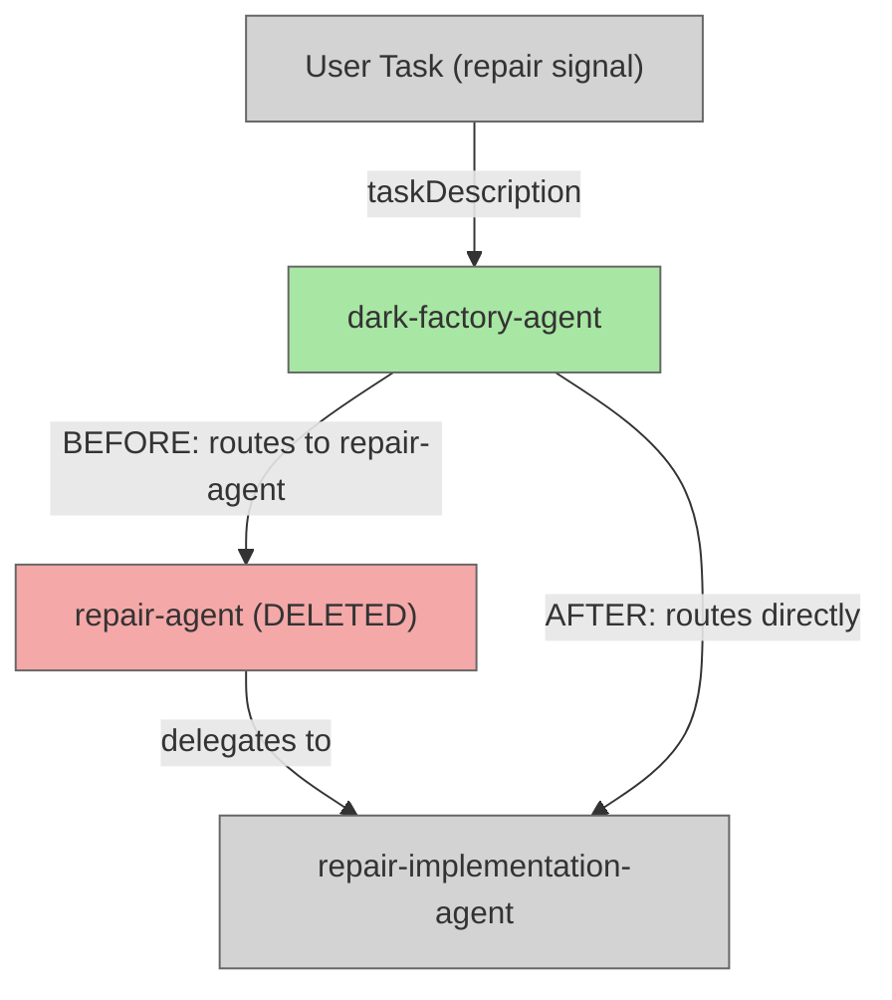

# Remove repair-agent Middle Manager

## Plan Metadata

- Plan type: `plan`
- Parent plan: N/A
- Depends on: N/A
- Status: `draft`

## System Intent

- What is being built: Elimination of the `repair-agent` pass-through. `dark-factory-agent` will route repair tasks directly to `repair-implementation-agent`, removing one unnecessary hop.
- Primary consumer(s): `dark-factory-agent` (orchestrator), end users who invoke repair/tweak/rename tasks.
- Boundary (black-box scope only): Two files are touched — `agents/dark-factory/agents/dark-factory-agent.md` (routing table + classification table updated) and `agents/dark-factory/agents/repair-agent.md` (deleted).

## Stage Gate Tracker

- [ ] Stage 1 Mermaid approved
- [ ] Stage 2 Flows approved
- [ ] Stage 3 Logs + Deployment approved or skipped

## Mermaid Diagram



ONCE YOU GET APPROVAL FROM THE DEVELOPER, DELETE THIS LINE AND UPDATE THE STAGE GATE TRACKER

## Flows

- Flow naming rule: ``### Flow: `<flowname>` ``

### Global Types

```txt
StandardError {
  message: string (human-readable description of what went wrong)
}
```

### Flow: `removeRepairAgentMiddleman`
- Test files: N/A (agent markdown files, no automated tests)
- Core files:
  - `agents/dark-factory/agents/dark-factory-agent.md` (updated)
  - `agents/dark-factory/agents/repair-agent.md` (deleted)

#### Types

```txt
RepairTask {
  taskDescription: string (verbatim user request with a repair signal)
}
```

#### Paths

| path | input | output | path-type | notes | updated |
| --- | --- | --- | --- | --- | --- |
| `removeRepairAgentMiddleman.updatePathsTable` | file edit | updated table row | `happy path` | Change `repair-agent` row to `repair-implementation-agent` with correct path `agents/repair/agents/repair-implementation-agent.md` | yes |
| `removeRepairAgentMiddleman.updateClassificationTable` | file edit | updated table row | `happy path` | Change classification table's repair signal row to route to `repair-implementation-agent` instead of `repair-agent` | yes |
| `removeRepairAgentMiddleman.updateOrchestrationComment` | file edit | updated inline comment | `happy path` | Update the inline routing comment in the Orchestration pseudocode from `repair-agent` to `repair-implementation-agent` | yes |
| `removeRepairAgentMiddleman.updateFrontmatterDescription` | file edit | updated description field | `happy path` | Remove any reference to `repair-agent` in the `description:` frontmatter field of `dark-factory-agent.md` | yes |
| `removeRepairAgentMiddleman.deleteRepairAgent` | file deletion | file removed | `happy path` | Delete `agents/dark-factory/agents/repair-agent.md` entirely | yes |

#### Pseudocode

```
1. Edit agents/dark-factory/agents/dark-factory-agent.md:
   a. In the "Paths to key agents" table:
      - Remove the row: | `repair-agent` | `agents/dark-factory/agents/repair-agent.md` |
      - Add a row (or confirm already present): | `repair-implementation-agent` | `agents/repair/agents/repair-implementation-agent.md` |
   b. In the "Orchestration" pseudocode block, update the routing comment:
      - Before: "Small change / tweak / rename / quick fix → invoke repair-agent with taskDescription"
      - After:  "Small change / tweak / rename / quick fix → invoke repair-implementation-agent with taskDescription"
   c. In the "Classification rules" table:
      - Change the Route to column for the repair signal row from `repair-agent` to `repair-implementation-agent`
   d. In the YAML frontmatter description field:
      - Remove or replace any mention of `repair-agent` — update to say `repair-implementation-agent`

2. Delete agents/dark-factory/agents/repair-agent.md (rm -f or Bash delete)
```

ONCE YOU GET APPROVAL FROM THE DEVELOPER, DELETE THIS LINE AND UPDATE THE STAGE GATE TRACKER

## Logs

| Source | Location |
|--------|----------|
| N/A | No log sources — agent markdown files only |

## Deployment

- Mechanism: `local only`
- Deploy command: N/A (markdown file edits take effect immediately when agents run)
- Notes: No build, deploy, or test step needed.

ONCE YOU GET APPROVAL FROM THE DEVELOPER, DELETE THIS LINE AND UPDATE THE STAGE GATE TRACKER

## Handoff to Related Plan Reconciliation

No linked plans require reconciliation for this change.
