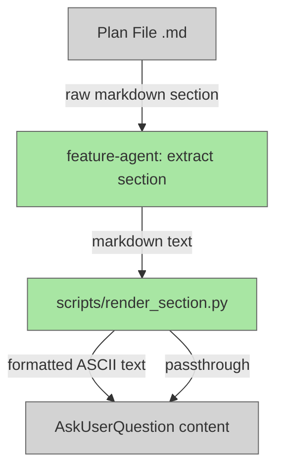

# Render Flow Section as Formatted ASCII Table

## Plan Metadata

- Plan type: `plan`
- Parent plan: N/A
- Depends on: N/A
- Status: `draft`

## System Intent

- What is being built: A render script (`scripts/render_section.py`) that converts raw markdown text (pipe-delimited tables, headers, code blocks) into a human-readable formatted output using padded ASCII tables. `feature-agent` is updated to pipe every extracted section through this script before embedding the content in the user-facing question.
- Primary consumer(s): `feature-agent` → `dark-factory-agent` → user (via `AskUserQuestion`)
- Boundary: Output rendering only — plan files are stored unchanged; only the text presented to the user in the question is reformatted.

## Stage Gate Tracker

- [ ] Stage 1 Mermaid approved
- [ ] Stage 2 Flows approved
- [ ] Stage 3 Logs + Deployment approved or skipped

## Mermaid Diagram

> Use the skill at `skills/create-mermaid-diagram/SKILL.md` to generate this diagram.



ONCE YOU GET APPROVAL FROM THE DEVELOPER, DELETE THIS LINE AND UPDATE THE STAGE GATE TRACKER

## Flows

- Flow naming rule: ``### Flow: `<flowname>` ``
- `N/A` for test files means explicit no-test-required waiver (not a missing mapping).

### Global Types

```txt
MarkdownSection: string  (raw markdown text extracted from plan file)
FormattedSection: string (rendered text with ASCII tables replacing pipe-delimited tables)
```

### Flow: `renderSection.table`

- Test files: `tests/test_render_section.py`
- Core files: `scripts/render_section.py`

#### Types

```txt
TableInput {
  rows: list[string]  (each row is a raw "| col | col | col |" line)
}

TableOutput {
  lines: list[string]  (padded ASCII table lines with +---+ borders)
}
```

#### Paths

| path | input | output | path-type | notes | updated |
| --- | --- | --- | --- | --- | --- |
| `renderSection.table.success` | `MarkdownSection` with `\| col \|` rows | `FormattedSection` with padded ASCII table | happy path | separator rows (`\| --- \|`) are skipped; column widths computed from all data rows | |
| `renderSection.table.single-row` | `MarkdownSection` with header row only | `FormattedSection` table with header and no data rows | happy path | renders header with borders even if no data rows follow | |

#### Pseudocode

```
# Detect contiguous block of lines starting with "|"
# Skip the separator row (| --- | or | :--- |)
# Compute column widths: max(len(cell)) for each column across all rows
# Render: top border, header row, divider, data rows, bottom border
# Use "+" at corners and intersections, "-" for horizontal, "|" for vertical

def render_table(rows):
    # Remove separator rows
    data_rows = [r for r in rows if not is_separator(r)]
    cells = [parse_cells(r) for r in data_rows]
    widths = [max(len(row[i]) for row in cells) for i in range(ncols)]
    border = "+" + "+".join("-" * (w + 2) for w in widths) + "+"
    yield border
    for i, row in enumerate(cells):
        yield "| " + " | ".join(cell.ljust(widths[j]) for j, cell in enumerate(row)) + " |"
        if i == 0:
            yield border   # divider after header
    yield border
```

### Flow: `renderSection.passthrough`

- Test files: `tests/test_render_section.py`
- Core files: `scripts/render_section.py`

#### Types

```txt
NonTableInput {
  content: string  (markdown text with no pipe-delimited table rows)
}
```

#### Paths

| path | input | output | path-type | notes | updated |
| --- | --- | --- | --- | --- | --- |
| `renderSection.passthrough.text` | `MarkdownSection` with plain text / headers | `FormattedSection` identical to input | happy path | non-table lines (headers, blank lines, text paragraphs) are output as-is | |
| `renderSection.passthrough.codeBlock` | `MarkdownSection` containing ` ``` ` fenced code blocks | `FormattedSection` identical to input | happy path | lines inside code fences are never treated as tables even if they contain `\|`; code blocks pass through unchanged | |

#### Pseudocode

```
# Track whether we are inside a code fence (``` or ```)
# If inside fence: output line as-is
# If line starts with "|": buffer for table rendering
# Otherwise: flush any buffered table, output line as-is
```

### Flow: `featureAgent.formattedQuestion`

- Test files: N/A (agent instruction change only; covered by manual smoke test)
- Core files: `agents/featurework/agents/feature-agent.md`

#### Types

```txt
SectionContent: string  (raw markdown extracted from plan file)
FormattedContent: string  (output of scripts/render_section.py)
```

#### Paths

| path | input | output | path-type | notes | updated |
| --- | --- | --- | --- | --- | --- |
| `featureAgent.formattedQuestion.draftPlan` | System Intent section extracted from plan file | question string with FormattedContent embedded | happy path | feature-agent runs `echo "<section>" \| python3 scripts/render_section.py` and uses stdout in question | |
| `featureAgent.formattedQuestion.mermaid` | Mermaid Diagram section extracted from plan file | question string with FormattedContent embedded | happy path | same script invocation; mermaid code blocks pass through unchanged | |
| `featureAgent.formattedQuestion.flow` | `### Flow: <name>` section (includes #### Types, #### Paths, #### Pseudocode) | question string with FormattedContent embedded | happy path | Paths table rendered as ASCII; Types and Pseudocode code blocks pass through | |
| `featureAgent.formattedQuestion.scriptError` | `scripts/render_section.py` exits non-zero or is missing | question string with raw SectionContent (unformatted fallback) | error | feature-agent falls back to embedding raw section content unchanged | |

#### Pseudocode

```
# In feature-agent, wherever section content is embedded in a question:
section_content = extract_section(planPath, section_name)
result = bash(f'python3 scripts/render_section.py <<\'EOF\'\n{section_content}\nEOF')
formatted = result.stdout if result.exit_code == 0 else section_content
embed formatted in question string
```

ONCE YOU GET APPROVAL FROM THE DEVELOPER, DELETE THIS LINE AND UPDATE THE STAGE GATE TRACKER

## Logs

| Source | Location |
|--------|----------|
| render_section.py | stderr only (errors parsing table cells) |

## Deployment

- Mechanism: `local only`
- Deploy command: N/A
- Notes: Script runs in-process during manufacture; no deployment required.

ONCE YOU GET APPROVAL FROM THE DEVELOPER, DELETE THIS LINE AND UPDATE THE STAGE GATE TRACKER

## Handoff to Related Plan Reconciliation

After all stages are approved, apply `.agent/skills/reconcile-plans/SKILL.md` to propagate contract updates across linked plans.
