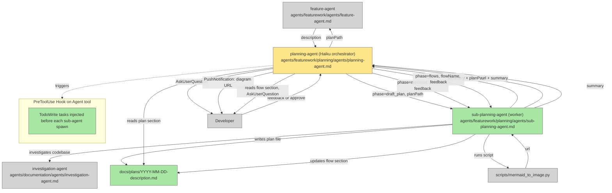

# Restructure Planning Agent into Two-Agent System

## Plan Metadata

- Plan type: `plan`
- Parent plan: `N/A`
- Depends on: `N/A`
- Status: `draft`

## System Intent

- What is being built: A two-agent planning system where a lightweight Haiku orchestrator (planning-agent) handles state, display, and user interaction, while a worker (sub-planning-agent) handles all research, writing, and heavy reasoning.
- Primary consumer(s): feature-agent (invokes planning-agent to produce plan files)
- Boundary (black-box scope only): feature-agent → planning-agent interface is unchanged; planning-agent still writes docs/plans/<date>-<slug>.md and returns planPath to feature-agent.

## Stage Gate Tracker

- [x] Stage 1 Mermaid approved
- [x] Stage 2 Flows approved
- [ ] Stage 3 Logs + Deployment approved or skipped

## Mermaid Diagram



## Flows

- Flow naming rule: ``### Flow: `<flowname>` ``
- `N/A` for test files means explicit no-test-required waiver (not a missing mapping).

### Global Types

```txt
Phase = "draft_plan" | "mermaid" | "flows"

SubPlanningAgentInput {
  phase: Phase (required)
  planPath: string (absolute path to plan file; null for draft_plan phase)
  feedback: string (user feedback or "none")
  flowName: string (only for flows phase — the ### Flow: name to update)
}

SubPlanningAgentOutput {
  planPath: string (absolute path to the written/updated plan file)
  url: string | null (mermaid.ink URL; only for mermaid phase)
  summary: string (short description of what was done)
}

StandardError {
  message: string (human-readable description of what went wrong)
}
```

### Flow: `draftPlan`

- Test files: `N/A`
- Core files: `agents/featurework/planning/agents/planning-agent.md`, `agents/featurework/planning/agents/sub-planning-agent.md`

#### Types

```txt
DraftPlanInput {
  description: string (feature description from feature-agent)
}

DraftPlanOutput {
  planPath: string (absolute path to the newly created plan file)
}
```

#### Paths

| path | input | output | path-type | notes |
| --- | --- | --- | --- | --- |
| `draftPlan.success` | `DraftPlanInput` | `DraftPlanOutput` | happy path | orchestrator spawns sub-planning-agent with phase=draft_plan; worker researches codebase (optionally via investigation-agent), writes plan file to docs/plans/<date>-<slug>.md, returns planPath |
| `draftPlan.error` | `DraftPlanInput` | `StandardError` | error | sub-planning-agent fails to create plan file |

#### Pseudocode

```
# planning-agent orchestrator — draft_plan phase
todoWrite(["Create draft plan", "Create mermaid diagram", "Create flows"])
spawn sub-planning-agent(phase="draft_plan", planPath=null, feedback=description, flowName=null)
receive { planPath, summary }
read planPath to extract overview section
display overview to developer
ask developer for feedback (AskUserQuestion)
```

### Flow: `mermaidPhase`

- Test files: `N/A`
- Core files: `agents/featurework/planning/agents/planning-agent.md`, `agents/featurework/planning/agents/sub-planning-agent.md`, `scripts/mermaid_to_image.py`

#### Types

```txt
MermaidPhaseInput {
  planPath: string
  feedback: string
}

MermaidPhaseOutput {
  planPath: string
  url: string | null
}
```

#### Paths

| path | input | output | path-type | notes |
| --- | --- | --- | --- | --- |
| `mermaidPhase.success` | `MermaidPhaseInput` | `MermaidPhaseOutput` | happy path | worker runs `python3 scripts/mermaid_to_image.py <planPath>`, captures URL, updates mermaid section in plan; orchestrator pushes URL via PushNotification |
| `mermaidPhase.noUrl` | `MermaidPhaseInput` | `MermaidPhaseOutput (url=null)` | graceful degradation | script fails or produces no block — orchestrator skips PushNotification, continues |
| `mermaidPhase.retry` | `MermaidPhaseInput` | feedback loop | retry | developer provides feedback; orchestrator re-spawns sub-planning-agent |

#### Pseudocode

```
# planning-agent orchestrator — mermaid phase
LOOP:
  spawn sub-planning-agent(phase="mermaid", planPath, feedback)
  receive { planPath, url, summary }
  if url is non-null:
    PushNotification("Plan diagram: <url>")
  read planPath mermaid section
  display to developer
  ask developer for approval (AskUserQuestion)
  if approved: BREAK
  else: feedback = developer input; CONTINUE
```

### Flow: `flowsPhase`

- Test files: `N/A`
- Core files: `agents/featurework/planning/agents/planning-agent.md`, `agents/featurework/planning/agents/sub-planning-agent.md`

#### Types

```txt
FlowsPhaseInput {
  planPath: string
  flowName: string
  feedback: string
}

FlowsPhaseOutput {
  planPath: string
  summary: string
}
```

#### Paths

| path | input | output | path-type | notes |
| --- | --- | --- | --- | --- |
| `flowsPhase.success` | `FlowsPhaseInput` | `FlowsPhaseOutput` | happy path | orchestrator iterates over each `### Flow:` section; for each, shows it to developer, collects feedback, spawns sub-planning-agent, waits for update |
| `flowsPhase.retry` | `FlowsPhaseInput` | feedback loop | retry | developer provides feedback on a flow; orchestrator re-spawns sub-planning-agent for that same flow |
| `flowsPhase.allApproved` | `FlowsPhaseInput (last flow)` | planPath | completion | all flows approved; orchestrator returns planPath to feature-agent |

#### Pseudocode

```
# planning-agent orchestrator — flows phase
flows = parse_flow_names(planPath)  # grep for "### Flow:" lines
for each flowName in flows:
  LOOP:
    read flowName section from planPath
    display section to developer
    ask developer for approval (AskUserQuestion)
    if approved: BREAK to next flow
    else:
      feedback = developer input
      spawn sub-planning-agent(phase="flows", planPath, flowName, feedback)
      receive { planPath, summary }
      CONTINUE LOOP
return planPath to feature-agent
```

### Flow: `subPlanningAgentWorker`

- Test files: `N/A`
- Core files: `agents/featurework/planning/agents/sub-planning-agent.md`

#### Types

See SubPlanningAgentInput / SubPlanningAgentOutput in Global Types.

#### Paths

| path | input | output | path-type | notes |
| --- | --- | --- | --- | --- |
| `worker.draft_plan` | `SubPlanningAgentInput (phase=draft_plan)` | `SubPlanningAgentOutput` | happy path | researches codebase (investigation-agent if needed), creates plan file from template, returns planPath |
| `worker.mermaid` | `SubPlanningAgentInput (phase=mermaid)` | `SubPlanningAgentOutput` | happy path | updates mermaid section in plan, runs `python3 scripts/mermaid_to_image.py <planPath>`, returns url |
| `worker.flows` | `SubPlanningAgentInput (phase=flows)` | `SubPlanningAgentOutput` | happy path | updates the specified `### Flow:` section in plan based on feedback, returns summary |
| `worker.error` | any | `StandardError` | error | sub-planning-agent fails to complete phase |

### Flow: `orchestratorHook`

- Test files: `tests/test_pre_tool_use_hook.py`
- Core files: `agents/dark-factory/scripts/pre-tool-use-hook.sh`

#### Types

```txt
HookInput {
  agentName: string (extracted from Agent tool call — used to look up checklist)
}
```

#### Paths

| path | input | output | path-type | notes |
| --- | --- | --- | --- | --- |
| `orchestratorHook.sub-planning-agent` | `HookInput (agentName=sub-planning-agent)` | checklist injected | happy path | pre-tool-use-hook.sh adds "sub-planning-agent" entry to AGENT_CHECKLISTS with items: "Research phase context\|Update plan file\|Run mermaid script (mermaid phase only)\|Return structured output" |
| `orchestratorHook.planning-agent` | `HookInput (agentName=planning-agent)` | checklist updated | happy path | existing planning-agent checklist updated to reflect new orchestrator duties: "Spawn draft-plan sub-agent\|Run mermaid phase\|Run flows phase (one at a time)\|Return planPath" |

## Logs

| Source | Location |
|--------|----------|
| planning-agent orchestrator | Claude Code session transcript |
| sub-planning-agent worker | Claude Code session transcript |
| plan files | docs/plans/<date>-<slug>.md |
| mermaid URL | PushNotification to developer's phone |

## Deployment

- Mechanism: `local only` — agents run inside Claude Code as sub-agents
- Deploy command:
  ```bash
  # No deploy needed — agent .md files are used directly by Claude Code
  ```
- Notes: Changes to planning-agent.md and creation of sub-planning-agent.md take effect immediately on next invocation. pre-tool-use-hook.sh changes take effect immediately.

## Files Changed

| File | Change | Notes |
|------|--------|-------|
| `agents/featurework/planning/agents/planning-agent.md` | Updated | Replace current monolith with Haiku orchestrator |
| `agents/featurework/planning/agents/sub-planning-agent.md` | Created | New worker agent |
| `agents/dark-factory/scripts/pre-tool-use-hook.sh` | Updated | Add sub-planning-agent to AGENT_CHECKLISTS; update planning-agent checklist |
