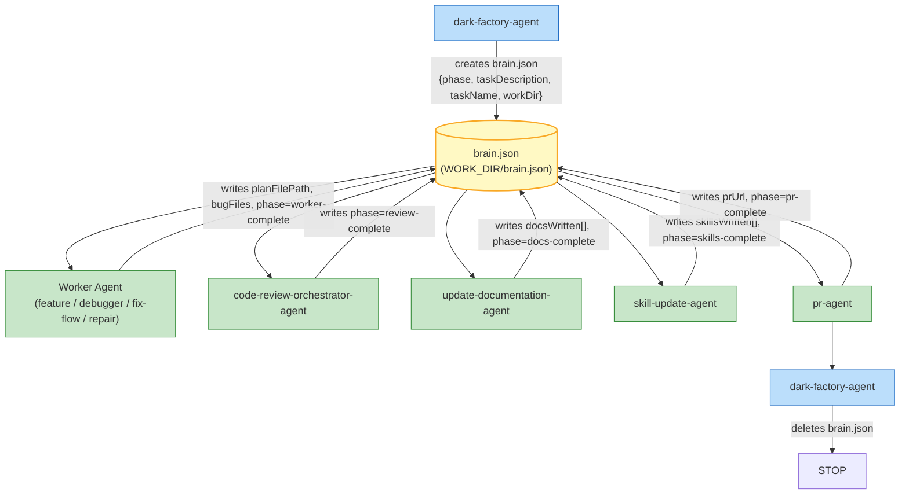

# Shared brain.json for Cross-Agent State

## Plan Metadata

- Plan type: `plan`
- Parent plan: N/A
- Depends on: N/A
- Status: `implemented`

## System Intent

- What is being built: A shared `brain.json` file that carries context across a full dark-factory run. It is created by `dark-factory-agent` at the start of a run, updated by each sub-agent as it completes its phase, and deleted by `dark-factory-agent` at cleanup. This eliminates context reconstruction from scratch between phases.
- Primary consumer(s): `dark-factory-agent` (creates/deletes), `feature-agent`, `debugger-agent`, `repair-agent`, `pr-agent`, `code-review-orchestrator-agent`, `update-documentation-agent`, `skill-update-agent`
- Boundary (black-box scope only): The `brain.json` file lives at `<WORK_DIR>/brain.json`. For the repair route, it lives at the repair agent's own WORK_DIR. External services (GitHub, CI) are not in scope — they remain unchanged.

## Stage Gate Tracker

- [x] Stage 1 Mermaid approved
- [x] Stage 2 Flows approved
- [x] Stage 3 Logs + Deployment approved or skipped

## Mermaid Diagram



## Flows

### Global Types

```txt
Brain {
  schemaVersion: "1.0"
  taskName:        string   (slug for the work dir)
  taskDescription: string   (verbatim user request)
  workDir:         string   (absolute path to WORK_DIR)
  phase:           Phase    (current lifecycle phase; updated by each agent on entry and exit)
  planFilePath:    string | null  (absolute path written by feature-agent; null until set)
  bugFiles:        string[]       (absolute paths to docs/bugs/ files; empty until set by debugger-agent)
  prUrl:           string | null  (PR URL written by pr-agent; null until set)
  docsWritten:     string[]       (paths returned by update-documentation-agent; empty until set)
  skillsWritten:   SkillFile[]    (output from skill-update-agent; empty until set)
  route:           "feature" | "debugger" | "fix-flow" | "repair" | null
}

Phase = "init"
      | "worker-running"
      | "worker-complete"
      | "review-running"
      | "review-complete"
      | "docs-running"
      | "docs-complete"
      | "skills-running"
      | "skills-complete"
      | "pr-running"
      | "pr-complete"
      | "cleanup"

SkillFile {
  path:   string   (relative path within workDir)
  action: "created" | "updated"
}

StandardError {
  message: string
}
```

### Flow: `brain.init`

- Test files: N/A
- Core files: `agents/dark-factory/agents/dark-factory-agent.md`

#### Types

```txt
BrainInitInput {
  taskName:        string
  taskDescription: string
  workDir:         string
  route:           "feature" | "debugger" | "fix-flow" | "repair"
}

BrainInitOutput {
  brainPath: string  (absolute path — always <workDir>/brain.json)
}
```

#### Paths

| path | input | output | path-type | notes |
| --- | --- | --- | --- | --- |
| `brain.init.success` | `BrainInitInput` | `BrainInitOutput` | happy path | dark-factory-agent writes brain.json and passes brainPath to each sub-agent |
| `brain.init.write-error` | `BrainInitInput` | `StandardError` | error | dark-factory-agent cannot write to workDir; halts and cleans up |

#### Pseudocode

```
# dark-factory-agent — after prep-feature-dir.sh and route classification

brainPath = WORK_DIR + "/brain.json"

brain = {
  schemaVersion:   "1.0",
  taskName:        taskName,
  taskDescription: taskDescription,
  workDir:         WORK_DIR,
  phase:           "init",
  planFilePath:    null,
  bugFiles:        [],
  prUrl:           null,
  docsWritten:     [],
  skillsWritten:   [],
  route:           classifiedRoute   # "feature" | "debugger" | "fix-flow" | "repair"
}

write JSON.stringify(brain, null, 2) to brainPath

# Pass brainPath to every sub-agent invocation that follows
```

---

### Flow: `brain.workerWrite`

- Test files: N/A
- Core files:
  - `agents/featurework/agents/feature-agent.md`
  - `agents/debugger/agents/debugger-agent.md`
  - `agents/fix-flow/agents/fix-flow-orchestrator.md`
  - `agents/dark-factory/agents/repair-agent.md`

#### Types

```txt
BrainWorkerUpdate {
  phase:        "worker-running" (set on entry) | "worker-complete" (set on exit)
  planFilePath: string | null    (set by feature-agent / fix-flow-orchestrator; null for debugger-agent)
  bugFiles:     string[]         (set by debugger-agent; empty for others)
}
```

#### Paths

| path | input | output | path-type | notes |
| --- | --- | --- | --- | --- |
| `brain.workerWrite.feature` | `brainPath` | sets `planFilePath`, `phase=worker-complete` | happy path | feature-agent writes plan path into brain.json |
| `brain.workerWrite.debugger` | `brainPath` | sets `bugFiles[]`, `phase=worker-complete` | happy path | debugger-agent writes bug file paths |
| `brain.workerWrite.repair` | `brainPath` | sets `prUrl`, `phase=pr-complete` | happy path | repair-agent writes prUrl directly (it manages its own PR) |
| `brain.workerWrite.error` | `brainPath` | sets `phase=worker-complete`, error surfaced upstream | error | worker fails; dark-factory-agent cleans up |

#### Pseudocode

```
# Each worker agent — on entry:
brain = read + parse brainPath
brain.phase = "worker-running"
write brain to brainPath

# On successful exit:
brain = read + parse brainPath
brain.planFilePath = planFilePath     # feature-agent / fix-flow-orchestrator only
brain.bugFiles     = [bugFilePath]    # debugger-agent only
brain.phase        = "worker-complete"
write brain to brainPath
```

---

### Flow: `brain.reviewWrite`

- Test files: N/A
- Core files: `agents/code-review/agents/code-review-orchestrator-agent.md`

#### Pseudocode

```
# code-review-orchestrator-agent — on entry:
brain = read + parse brainPath
brain.phase = "review-running"
write brain to brainPath

# On exit (status: "complete"):
brain = read + parse brainPath
brain.phase = "review-complete"
write brain to brainPath
```

---

### Flow: `brain.docsWrite`

- Test files: N/A
- Core files: `agents/documentation/agents/update-documentation-agent.md`

#### Pseudocode

```
# update-documentation-agent — on entry:
brain = read + parse brainPath
brain.phase = "docs-running"
write brain to brainPath

# On exit:
brain = read + parse brainPath
brain.docsWritten = [paths-written]
brain.phase = "docs-complete"
write brain to brainPath
```

---

### Flow: `brain.skillsWrite`

- Test files: N/A
- Core files: `agents/skill-update/agents/skill-update-agent.md`

#### Pseudocode

```
# skill-update-agent — on entry:
brain = read + parse brainPath
brain.phase = "skills-running"
write brain to brainPath

# On exit:
brain = read + parse brainPath
brain.skillsWritten = skillsWritten
brain.phase = "skills-complete"
write brain to brainPath
```

---

### Flow: `brain.prWrite`

- Test files: N/A
- Core files: `agents/pr/agents/pr-agent.md`

#### Pseudocode

```
# pr-agent — on entry:
brain = read + parse brainPath
brain.phase = "pr-running"
write brain to brainPath

# On exit (status: "ready"):
brain = read + parse brainPath
brain.prUrl = prUrl
brain.phase = "pr-complete"
write brain to brainPath
```

---

### Flow: `brain.cleanup`

- Test files: N/A
- Core files: `agents/dark-factory/agents/dark-factory-agent.md`, `agents/dark-factory/scripts/cleanup-worktree.sh`

#### Pseudocode

```
# dark-factory-agent — in cleanup step, BEFORE calling cleanup-worktree.sh:
delete file at brainPath   # rm WORK_DIR/brain.json

# Then call cleanup-worktree.sh as normal
```

---

### Flow: `brain.readFallback`

Each agent should read `brainPath` on entry to recover context (e.g., `planFilePath`, `prUrl`) rather than relying solely on arguments passed by the caller. If `brainPath` is not provided or the file cannot be read, the agent falls back to arguments passed directly — this is non-fatal.

#### Pseudocode

```
# Pattern used by all agents:
if brainPath is provided and file exists:
  brain = read + parse brainPath
  # prefer brain.planFilePath over caller-provided planFilePath if non-null
else:
  # use caller-provided arguments as-is (no change to current behavior)
```

## Logs

| Source | Location |
|--------|----------|
| brain.json lifecycle | WORK_DIR/brain.json (deleted on cleanup) |
| dark-factory-agent output | Claude Code session transcript |

## Deployment

- Mechanism: `local only` — all changes are to agent `.md` files; no scripts or binaries are modified
- Deploy command:
  ```bash
  # No deploy step — agent .md files take effect immediately on next manufacture run
  ```
- Notes: brain.json is ephemeral — it is created at run start and deleted at cleanup. It never persists between runs.

## Files Changed

The following files must be updated to wire brain.json through the full orchestration flow:

| File | Change |
|---|---|
| `agents/dark-factory/agents/dark-factory-agent.md` | Create brain.json after prep-feature-dir.sh; pass brainPath to every sub-agent; delete brain.json in cleanup step |
| `agents/featurework/agents/feature-agent.md` | Accept brainPath; read on entry (set phase=worker-running); write planFilePath + phase=worker-complete on exit |
| `agents/debugger/agents/debugger-agent.md` | Accept brainPath; read on entry (set phase=worker-running); write bugFiles + phase=worker-complete on exit |
| `agents/dark-factory/agents/repair-agent.md` | Accept brainPath; create brain.json in own WORK_DIR; write prUrl + phase=pr-complete; delete on cleanup |
| `agents/code-review/agents/code-review-orchestrator-agent.md` | Accept brainPath; read on entry (set phase=review-running); write phase=review-complete on exit |
| `agents/documentation/agents/update-documentation-agent.md` | Accept brainPath; read on entry (set phase=docs-running); write docsWritten + phase=docs-complete on exit |
| `agents/skill-update/agents/skill-update-agent.md` | Accept brainPath; read on entry (set phase=skills-running); write skillsWritten + phase=skills-complete on exit |
| `agents/pr/agents/pr-agent.md` | Accept brainPath; read on entry (set phase=pr-running); write prUrl + phase=pr-complete on exit |
| `docs/docs/manufacture.md` | Update system doc to describe brain.json lifecycle |
