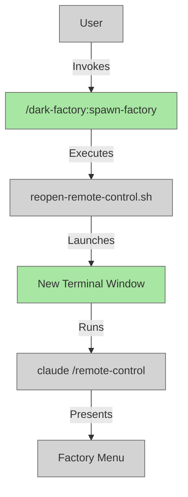

# spawn-factory Command

## System Intent

- **What is being built**: A new Claude command called `spawn-factory` that opens a new Claude remote control terminal in a fresh window, enabling users to quickly launch parallel factory processing sessions.
- **Primary consumer(s)**: dark-factory plugin users who want to run multiple independent factory tasks simultaneously without waiting for completion.
- **Boundary (black-box scope only)**: Uses existing `reopen-remote-control.sh` script pattern; integrates with Claude plugin command system; gnome-terminal for launching new windows.

## Stage Gate Tracker

- [x] Stage 1 Mermaid approved
- [x] Stage 2 Flows approved
- [x] Stage 3 Logs + Deployment approved or skipped

## Mermaid Diagram



## Flows

- Flow naming rule: `### Flow: <flowname>`
- `N/A` for test files means explicit no-test-required waiver (not a missing mapping).

### Global Types

```txt
StandardError {
  message: string (human-readable description of what went wrong)
}
```

### Flow: spawn-factory-command
- Test files: `N/A` (command invocation test via plugin framework)
- Core files: `.claude-plugin/plugin.json`, `commands/spawn-factory.md`

#### Types

```txt
SpawnFactoryInput {
  terminalName: string (optional, defaults to "dark factory")
}

SpawnFactoryOutput {
  status: "success" | "error"
  message: string (status message or error description)
}
```

#### Paths

| path | input | output | path-type | notes | updated |
| --- | --- | --- | --- | --- | --- |
| `spawn-factory.success` | `SpawnFactoryInput` | `SpawnFactoryOutput{status: success}` | `happy path` | New terminal launched with claude remote-control | |
| `spawn-factory.terminal-fail` | `SpawnFactoryInput` | `SpawnFactoryOutput{status: error}` | `error` | gnome-terminal not available or failed to launch | |

#### Pseudocode

```
function spawn-factory(terminalName):
  name = terminalName ?? "dark factory"
  workdir = current working directory
  command = "bash scripts/reopen-remote-control.sh \"" + name + "\""
  
  execute_async:
    gnome-terminal --working-directory=workdir -- bash -c "claude /remote-control <name>"
  
  return { status: "success", message: "Terminal launched" }
```


## Logs

Not applicable — this is a user-facing CLI command with no backend logging requirements.

## Deployment

- Mechanism: Plugin command in `.claude-plugin/plugin.json`
- Update README.md with command documentation
- Notes: Leverages existing `reopen-remote-control.sh` script; no new scripts needed.


## Handoff to Related Plan Reconciliation

No related plans to reconcile.
