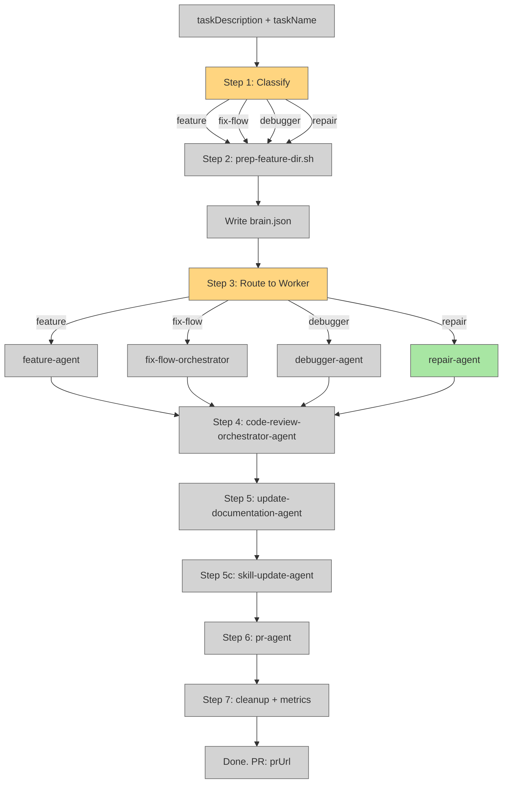

# Unify Repair Agent into the Full Orchestrator Flow

## System Intent

- What is being built: Removing the early-exit repair shortcut in `dark-factory-agent.md` so that `repair-agent` goes through the same full orchestration flow (worktree, brain.json, code review, docs, skills update, PR) as `feature-agent`, `fix-flow-orchestrator`, and `debugger-agent`. Also changing the orchestrator model from `sonnet` to `haiku` since it only does routing/delegation.
- Primary consumer(s): `dark-factory-agent` (orchestrator), developers invoking dark-factory for repair-type tasks
- Boundary (black-box scope only): `agents/dark-factory/agents/dark-factory-agent.md` and `agents/dark-factory/agents/repair-agent.md` are modified. No changes to scripts or any other agents.

## Stage Gate Tracker

- [x] Stage 1 Mermaid approved
- [x] Stage 2 Flows approved
- [ ] Stage 3 Logs + Deployment approved or skipped

## Mermaid Diagram



## Flows

### Global Types

```txt
StandardError {
  message: string (human-readable description of what went wrong)
}
```

### Flow: `unifyRepairAgentFlow`

- Test files: N/A (agent instruction file, no automated tests)
- Core files: `agents/dark-factory/agents/dark-factory-agent.md`

#### Types

```txt
OrchestratorInput {
  taskDescription: string (required)
  taskName: string (optional, derived if absent)
}

Classification {
  type: "feature" | "fix-flow" | "debugger" | "repair"
}
```

#### Paths

| path | input | output | path-type | notes | updated |
| --- | --- | --- | --- | --- | --- |
| `unifyRepairAgentFlow.repair-via-full-flow` | `OrchestratorInput` with repair signals | Full flow output (PR URL) | `happy path` | repair-agent now gets worktree, brain.json, review, docs, skills, PR | yes |
| `unifyRepairAgentFlow.feature` | `OrchestratorInput` with feature signals | Full flow output (PR URL) | `happy path` | unchanged | no |
| `unifyRepairAgentFlow.fix-flow` | `OrchestratorInput` with fix-flow signals | Full flow output (PR URL) | `happy path` | unchanged | no |
| `unifyRepairAgentFlow.debugger` | `OrchestratorInput` with debug signals | Full flow output (PR URL) | `happy path` | unchanged | no |

#### Pseudocode

```
dark-factory-agent(taskDescription, taskName):

  # Step 1 — classify
  classification = classify(taskDescription)
  # Routes: "feature" | "fix-flow" | "debugger" | "repair"
  # NO early-exit for repair — fall through to prep

  # Step 2 — prep isolated work dir (all routes)
  run prep-feature-dir.sh <taskName>
  capture WORK_DIR
  write brain.json with classification = <classification>
  export DARK_FACTORY_WORK_DIR

  # Step 3 — route to worker
  if classification == "feature":     invoke feature-agent(taskDescription)
  if classification == "fix-flow":    invoke fix-flow-orchestrator(taskDescription)
  if classification == "debugger":    invoke debugger-agent(taskDescription)
  if classification == "repair":      invoke repair-agent(taskDescription)   # NEW — full flow

  # Steps 4–7 unchanged: review, docs, skills, PR, cleanup
```

#### Changes to dark-factory-agent.md

1. **YAML frontmatter**: `model: sonnet` → `model: haiku`
2. **Remove** the early-exit repair block (lines 45–53 in the current file):
   ```
   # Repair route: repair-agent manages its own worktree...
   If classified as repair ...:
     result = invoke repair-agent ...
     ...
     STOP
   ```
3. **Step 2 comment**: Change "feature / fix-flow / debugger routes only" → "all routes"
4. **brain.json `classification` field**: Change `"feature" | "fix-flow" | "debugger"` → `"feature" | "fix-flow" | "debugger" | "repair"`
5. **Step 3 routing table**: Add fourth route: `Small change / tweak / rename / quick fix → invoke repair-agent with taskDescription`
6. **Classification rules table**: The repair row already exists and maps to `repair-agent` — no change needed to the table itself; the early-exit block removal is what unifies the flow.

## Logs

| Source | Location |
|--------|----------|
| N/A | N/A — agent instruction file only |

## Deployment

- Mechanism: `local only`
- Deploy command:
  ```bash
  # No deployment needed — editing a markdown agent instruction file
  ```
- Notes: Changes take effect immediately when dark-factory-agent is next invoked.

## Handoff to Related Plan Reconciliation

After all stages are approved, apply `.agent/skills/reconcile-plans/SKILL.md` to propagate contract updates across linked plans.
