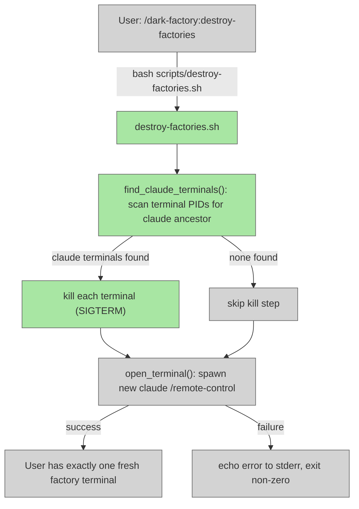

# Add `destroy-factories` Command

## System Intent

- What is being built: A new slash command `destroy-factories` that terminates all other running Claude / dark-factory terminal sessions and spawns one fresh factory terminal, leaving the user with exactly one active terminal.
- Primary consumer(s): Developers who want to reset all running dark-factory sessions back to a single clean state. Invoked via `/dark-factory:destroy-factories`.
- Boundary (black-box scope only):
  - `commands/destroy-factories.md` — the slash command entrypoint
  - `scripts/destroy-factories.sh` — the shell script that finds Claude terminals, kills them, and spawns a fresh one
  - Safety constraint: only terminals running `claude` processes are targeted; unrelated terminals are never touched.
  - Platform: Linux (same as `reopen-remote-control.sh`); documents supported platforms explicitly.

## Stage Gate Tracker

- [x] Stage 1 Mermaid approved
- [x] Stage 2 Flows approved
- [ ] Stage 3 Logs + Deployment approved or skipped

## Mermaid Diagram

> Use the skill at `skills/create-mermaid-diagram/SKILL.md` to generate this diagram.



## Flows

- Flow naming rule: ``### Flow: `<flowname>` ``
- `N/A` for test files means explicit no-test-required waiver (not a missing mapping).

### Global Types

```txt
StandardError {
  message: string (human-readable description of what went wrong)
}
```

### Flow: `destroy-factories`
- Test files: `tests/test_destroy_factories.py`
- Core files: `commands/destroy-factories.md`, `scripts/destroy-factories.sh`

#### Types

```txt
DestroyFactoriesInput {
  name: string (optional, default: "dark factory" — remote-control session name for the new terminal)
}

DestroyFactoriesOutput {
  void (side effects: all Claude terminals killed, one new factory terminal spawned)
}

StandardError {
  message: string (written to stderr)
}
```

#### Paths

| path | input | output | path-type | notes | updated |
| --- | --- | --- | --- | --- | --- |
| `destroy-factories.success` | `DestroyFactoriesInput` | `DestroyFactoriesOutput` | `happy path` | All Claude terminals found and killed; new factory terminal spawned successfully | |
| `destroy-factories.none-found` | `DestroyFactoriesInput` | `DestroyFactoriesOutput` | `happy path` | No other Claude terminals found; new factory terminal spawned (no kills needed) | |
| `destroy-factories.kill-failed` | `DestroyFactoriesInput` | `StandardError` | `degraded` | One or more terminals could not be killed (permission error); warns to stderr, continues to spawn | |
| `destroy-factories.spawn-failed` | `DestroyFactoriesInput` | `StandardError` | `error` | New terminal could not be opened (no terminal emulator found or emulator returned non-zero); exits non-zero | |

#### Pseudocode

```
NAME = argv[1] ?? "dark factory"

# Step 1: Find all terminal emulator processes that have a `claude` descendant
# For each running terminal PID (gnome-terminal, xterm, konsole, x-terminal-emulator):
#   walk its child process tree
#   if any descendant process name matches "claude":
#     mark that terminal PID for killing
#   exclude the terminal that IS our own ancestor (the one running this script)

find_claude_terminals():
  own_ancestor_pid = find_terminal_ancestor($$)  # same walk as reopen-remote-control.sh
  for each terminal_pid in all_terminal_emulator_pids():
    if terminal_pid == own_ancestor_pid: skip  # never kill self
    if has_claude_descendant(terminal_pid):
      yield terminal_pid

# Step 2: Kill each found terminal
for pid in find_claude_terminals():
  kill pid || warn("could not kill PID $pid")

# Step 3: Spawn fresh factory (reuse open_terminal from reopen-remote-control.sh logic)
open_terminal(NAME) || { echo error; exit 1 }
```

## Logs

| Source | Location |
|--------|----------|
| script stderr | terminal session running the destroy-factories command |

## Deployment

- Mechanism: `local only`
- Deploy command:
  ```bash
  # Called automatically by the /dark-factory:destroy-factories slash command.
  # Can also be invoked directly:
  bash scripts/destroy-factories.sh "dark factory"
  ```
- Notes: Linux only (same platform support as `reopen-remote-control.sh`). Requires at least one of: gnome-terminal, x-terminal-emulator, xterm, or konsole. The script is safe by design — it only kills terminals whose process tree contains a `claude` descendant.

## Handoff to Related Plan Reconciliation

After all stages are approved, apply `.agent/skills/reconcile-plans/SKILL.md` to propagate contract updates across linked plans.
