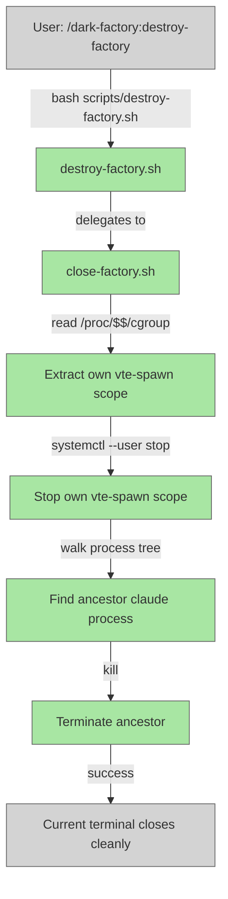

# Add `destroy-factory` Command

## System Intent

- What is being built: A new slash command `destroy-factory` that closes the current terminal/factory session by stopping its vte-spawn cgroup scope and killing the ancestor `claude` process. Only affects the terminal the command is run from — does not affect any other terminals or sessions.
- Primary consumer(s): Developers who want to cleanly exit the current dark-factory terminal session. Invoked via `/dark-factory:destroy-factory`.
- Boundary (black-box scope only):
  - `commands/destroy-factory.md` — the slash command entrypoint
  - `scripts/destroy-factory.sh` — the shell script that delegates to close-factory.sh
  - `scripts/close-factory.sh` — the implementation script that closes the current terminal
  - Safety constraint: only closes the terminal the command is run from; other terminals are never affected.
  - Platform: Linux (same as `reopen-remote-control.sh`); documents supported platforms explicitly.

## Stage Gate Tracker

- [x] Stage 1 Mermaid approved
- [x] Stage 2 Flows approved
- [ ] Stage 3 Logs + Deployment approved or skipped

## Mermaid Diagram

> Use the skill at `skills/create-mermaid-diagram/SKILL.md` to generate this diagram.



## Flows

- Flow naming rule: ``### Flow: `<flowname>` ``
- `N/A` for test files means explicit no-test-required waiver (not a missing mapping).

### Global Types

```txt
StandardError {
  message: string (human-readable description of what went wrong)
}
```

### Flow: `destroy-factory`
- Test files: `tests/test_destroy_factory.py`, `tests/test_destroy_factory_kills_other_windows.py`
- Core files: `commands/destroy-factory.md`, `scripts/destroy-factory.sh`, `scripts/close-factory.sh`

#### Types

```txt
DestroyFactoryInput {
  (none — command takes no arguments)
}

DestroyFactoryOutput {
  void (side effects: current terminal's vte-spawn scope stopped; ancestor claude process killed)
}

StandardError {
  message: string (written to stderr)
}
```

#### Paths

| path | input | output | path-type | notes | updated |
| --- | --- | --- | --- | --- | --- |
| `destroy-factory.success` | `DestroyFactoryInput` | `DestroyFactoryOutput` | `happy path` | Current terminal closed cleanly; vte-spawn scope stopped, ancestor claude killed | |

#### Pseudocode

```
# Read own vte-spawn scope from cgroup
SCOPE = read /proc/$$/cgroup and extract vte-spawn scope name

# Stop the scope
systemctl --user stop "$SCOPE"

# Walk process tree to find and kill ancestor claude process
PPID = parent of $$
while PPID is not 1:
    PNAME = name of process PPID
    if PNAME == "claude":
        kill PPID
        break
    PPID = parent of PPID

exit 0
```

## Logs

| Source | Location |
|--------|----------|
| scope stop/kill events | stderr of the calling claude session (`destroy-factory \| <flow> \| <step> \| <data>`) |

## Deployment

- Mechanism: `local only`
- Deploy command:
  ```bash
  # No deployment needed; the command and script ship with the plugin.
  # Install via:
  /dark-factory:install
  ```
- Notes: This command only closes the terminal it is run from. It does not spawn a new terminal, does not install anything, and does not affect other terminals. Requires Linux with systemd (GNOME) or similar cgroup-based terminal management.
