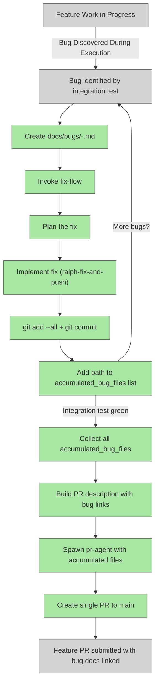

# Fix-Flow Single-Branch Accumulation

## System Intent

- **What is being built**: Restructure the dark-factory fix flow to accumulate all bug fixes on a single feature branch as commits, rather than creating a new PR for each bug. All fixes accumulate in one branch / one PR, with the PR description automatically linking to every `docs/bugs/*.md` file produced during the fix work.
  
- **Primary consumer(s)**: Dark-factory development process. When bugs are discovered during feature validation or integration testing, fixes should be committed to the same feature branch and accumulated in one PR rather than spawning multiple PRs.

- **Boundary (black-box scope only)**:
  - The fix-flow agents (`agents/fix-flow/`) that orchestrate bug discovery, planning, and implementation
  - The pr-agent integration that accepts multi-file input and creates single PR
  - PR generation logic that collects all `docs/bugs/*.md` files produced and links them in the PR description
  - Commit message formatting to indicate these are fixes on the current feature branch
  - No changes to fundamental planning/execution architecture; only the fix-flow subprocess model

## Stage Gate Tracker

- [ ] Stage 1 Mermaid approved
- [ ] Stage 2 Flows approved
- [ ] Stage 3 Logs + Deployment approved or skipped

## Mermaid Diagram

> Use the skill at `skills/create-mermaid-diagram/SKILL.md` to generate this diagram.



ONCE YOU GET APPROVAL FROM THE DEVELOPER, DELETE THIS LINE AND UPDATE THE STAGE GATE TRACKER

## Flows

- Flow naming rule: `### Flow: <flowname>`
- `N/A` for test files means no test file required.

### Global Types

```txt
StandardError {
  message: string (human-readable description of what went wrong)
}
```

### Flow: `ralph-commit-per-fix`

**File:** `agents/fix-flow/agents/ralph-fix-and-push.md`

**Test files:** N/A (agent instruction file, tested end-to-end)

**Current loop (to replace):**
```
loop N:
  a. Spawn debugger-agent → writes docs/bugs/bug-explanation-N.md
  b. If exit_code 0 (flow passed), break
  c. Spawn pr-agent(docs/bugs/bug-explanation-N.md) → { pr_url, status: "ready" }
  d. Optionally run deploy.sh
```

**New loop:**
```
loop N:
  a. Spawn debugger-agent → writes docs/bugs/bug-explanation-N.md
  b. If exit_code 0 (flow passed), break
  c. git add --all
     git commit -m "fix: <title from bug-explanation-N.md>"
  d. Append docs/bugs/bug-explanation-N.md to accumulated_bug_files list
  e. Optionally run deploy.sh

After loop exits with all-green:
  f. Spawn pr-agent(accumulated_bug_files=[path1, path2, ...])
  g. Receive { pr_url, status: "ready" }
  h. Return { all_green: true, pr_url }   ← single url, not an array
```

**Rule changes:**
- Remove: "Never touch GitHub yourself. Always delegate to pr-agent." inside the loop
- Add: commit the fix to the current branch after each debugger-agent iteration (exit_code 1)
- Add: collect all bug file paths in a list across iterations
- Add: spawn pr-agent exactly once after the loop, passing the full bug files list
- Change return value from `{ all_green: true, pr_urls: [...] }` to `{ all_green: true, pr_url: "..." }`

---

### Flow: `pr-agent-multi-file`

**File:** `agents/pr/agents/pr-agent.md`

**Test files:** N/A (agent instruction file)

**Changes to Input section:**
- Accept either:
  - A **single file path** — existing behavior for callers outside fix-flow
  - A **list of file paths** — new behavior when called from ralph-fix-and-push

**Changes to task steps:**

Step 1 (Build PR body) — multi-file case:
- Description section: render a markdown list with a link to each bug file
  ```markdown
  ## Bug Fixes
  - [2026-04-28-bug-one](docs/bugs/2026-04-28-bug-one.md)
  - [2026-04-28-bug-two](docs/bugs/2026-04-28-bug-two.md)

  ---
  <full raw contents of bug-explanation-1.md>

  ---
  <full raw contents of bug-explanation-2.md>
  ```
- Test Plan: run the project test suite (unchanged)

Step 2 (currently "Create branch") — **remove when called from ralph**:
- When a list of files is passed (ralph mode), skip branch creation. The current branch already has all commits.
- When a single file is passed (existing mode), keep current branch creation behavior.

Step 3 (currently "Stage and commit") — **remove when called from ralph**:
- When a list of files is passed (ralph mode), skip staging and committing. Already committed by ralph.
- When a single file is passed (existing mode), keep current staging and commit behavior.

Step 4 (push + `gh pr create`) — **add push step in ralph mode**:
- In ralph mode: `git push -u origin HEAD` before `gh pr create`
- In single-file mode: push happens as part of existing branch creation

Steps 5–6 (CI loop, comment resolution loop): unchanged in both modes.

Return value: `{ pr_url, status: "ready" }` — unchanged.

**Brain Patch:** unchanged.

---

### Flow: `create-pr-no-branch`

**File:** `agents/pr/skills/create-pr/SKILL.md`

**Change:** Add a note at the top of the Steps section:

```
> Note: When the fix has already been committed to the current branch (ralph-fix-and-push mode),
> skip Steps 1–2. Start from Step 3: push the branch and open the PR.
```

No other changes to this file.

---

### Flow: `orchestrator-single-pr`

**File:** `agents/fix-flow/agents/fix-flow-orchestrator.md`

**Change — Phase 3 result:** ralph-fix-and-push now returns `{ all_green: true, pr_url }` (single string, not `pr_urls` array).

**Change — Completion section:**
```
When ralph-fix-and-push returns all-green:
1. Report success to the developer with the single PR URL
2. Note that docs/plans/system-diagram.md and any docs/bugs/ files are kept as persistent project documentation.
```

---

### Flow: `update-fix-broken-flow-docs`

**File:** `docs/docs/fix-broken-flow.md`

**Changes:**
- Update the `fixBrokenFlow` flow description: remove "opens a PR per bug fix", replace with "commits each fix to the current branch; opens one PR at the end"
- Update the mermaid diagram to show: `ralph loop → commit → [loop back] → pr-agent (once) → single PR`
- Update the `paths` table: remove `fix-per-bug.pr-per-iteration` path, add `fix-per-bug.single-pr-at-end` path
- Note in the PR description section: "links to all docs/bugs/*.md files produced"

---

## Logs

| Source | Location |
|--------|----------|
| fix-flow execution | `~/.claude/dark-factory/fix-flow-<date>-<slug>/execution.log` |
| bug documentation | `docs/bugs/<date>-<slug>.md` |

## Deployment

- Mechanism: `no deployment required` (this is infrastructure for dark-factory)
- Notes: Changes are shipped as part of the dark-factory main branch release.

ONCE YOU GET APPROVAL FROM THE DEVELOPER, DELETE THIS LINE AND UPDATE THE STAGE GATE TRACKER

## Handoff to Related Plan Reconciliation

After all stages are approved, no plan reconciliation needed (this is internal to dark-factory).
