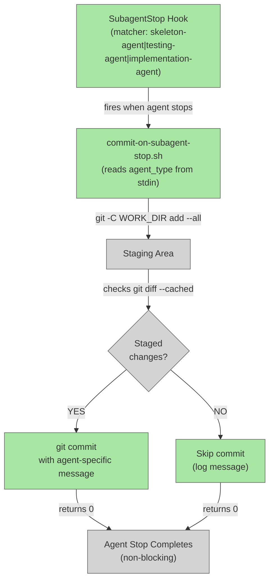

# Add SubagentStop Hook for Ordered Agent Commits

## System Intent

- **What is being built**: A new `SubagentStop` hook in `hooks/hooks.json` that automatically commits staged changes when skeleton-agent, testing-agent, or implementation-agent finishes execution. The hook fires after each of these three agents completes, producing an ordered sequence of 3 commits per feature run that prove the agents executed in the correct sequence.

- **Primary consumer(s)**: dark-factory features that run through the full skeleton → testing → implementation pipeline. The commits serve as proof-of-execution markers in the git history.

- **Boundary (black-box scope only)**:
  - Git worktree (already in DARK_FACTORY_WORK_DIR)
  - Bash script execution environment
  - Hook system (Claude Code hooks.json)

## Stage Gate Tracker

- [x] Stage 1 Mermaid approved
- [x] Stage 2 Flows approved
- [x] Stage 3 Logs + Deployment approved or skipped

## Mermaid Diagram



## Flows

### Global Types

```txt
StandardError {
  message: string (human-readable description of what went wrong)
}

HookInput {
  agent_type: "skeleton-agent" | "testing-agent" | "implementation-agent"  (from stdin)
}

HookOutput {
  commit_created: boolean
  commit_hash: string | null
  message: string | null
}
```

### Flow: `hook-fired`

- Test files: `tests/test_commit_on_subagent_stop.py`
- Core files: `hooks/hooks.json`, `agents/dark-factory/scripts/commit-on-subagent-stop.sh`

#### Types

```txt
CommitMessage {
  skeleton-agent: "skeleton"
  testing-agent: "tests"
  implementation-agent: "implementation"
}
```

#### Paths

| path | input | output | path-type | notes | updated |
| --- | --- | --- | --- | --- | --- |
| `hook-fired.skeleton-agent-stops-with-changes` | agent_type="skeleton-agent", staged changes exist | HookOutput with commit_created=true | happy path | skeleton-agent completed, changes staged | |
| `hook-fired.testing-agent-stops-with-changes` | agent_type="testing-agent", staged changes exist | HookOutput with commit_created=true | happy path | testing-agent completed, changes staged | |
| `hook-fired.implementation-agent-stops-with-changes` | agent_type="implementation-agent", staged changes exist | HookOutput with commit_created=true | happy path | implementation-agent completed, changes staged | |
| `hook-fired.no-staged-changes` | agent_type one of the three, NO staged changes | HookOutput with commit_created=false | edge case | Git diff --cached shows nothing; skip commit | |
| `hook-fired.unknown-agent-type` | agent_type not in the three recognized agents | HookOutput with commit_created=false | error handling | Matcher prevents this in production, but script should handle gracefully | |
| `hook-fired.git-command-failure` | any git command fails | StandardError with message | error | Non-blocking — logs to stderr and exits 0 | |

#### Pseudocode

```
commit-on-subagent-stop.sh:

1. Read DARK_FACTORY_WORK_DIR env var (should be set by dark-factory-agent)
2. Read agent_type from stdin (first line)
3. Validate agent_type is one of: skeleton-agent, testing-agent, implementation-agent
   - If not recognized: log "agent_type not recognized: <type>" to stderr and exit 0
4. cd to $DARK_FACTORY_WORK_DIR
5. Check if there are staged changes:
   - git diff --cached --quiet
   - exit_code == 0 → no changes, skip commit (log message to stderr)
   - exit_code != 0 → changes exist, proceed
6. Stage all changes:
   - git add --all
7. Commit with simple generic message based on agent_type:
   - "skeleton" if agent_type is "skeleton-agent"
   - "tests" if agent_type is "testing-agent"
   - "implementation" if agent_type is "implementation-agent"
8. If commit succeeds, log commit hash to stderr
9. If commit fails, log error to stderr but continue
10. Always exit 0 (non-blocking — do not prevent agent from stopping)
```

## Logs

| Source | Location |
|--------|----------|
| Hook execution | stderr during agent stop |
| Commit messages | Git log in feature branch |
| Failures | stderr, non-fatal |

## Deployment

- Mechanism: `plugin-level hook` — registered in `hooks/hooks.json` under the dark-factory plugin
- Deploy command: Hook is active automatically once hooks.json is updated and the plugin is reloaded
- Notes: Non-blocking — failures in the script never prevent the calling agent from stopping. Hook only fires when running dark-factory features in an isolated work directory (DARK_FACTORY_WORK_DIR is set).
