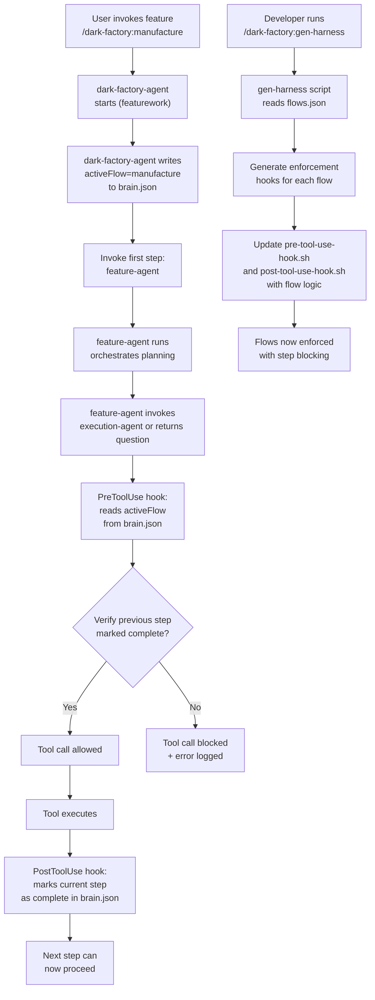

# Implementation Plan: flow.json Registry and Harness Generator

## System Intent

The flow.json system formalizes named flow definitions in a centralized registry, where each flow specifies an orchestrating agent and an ordered sequence of agent/skill invocations. The system enables the dark-factory harness to enforce flow-specific constraints at invocation time by reading the active flow name from brain.json before invoking the first step.

The complementary `gen-harness` command generates deterministic hook enforcement logic from flow.json, automatically wiring new or modified flows into the harness without manual hook editing.

**Key characteristics:**
- Centralized registry: single source of truth for all named flows
- Explicit flow structure: agent + ordered steps (each with type: agent or skill)
- Brain-driven enforcement: orchestrating agent writes activeFlow to brain.json before invoking first step
- Deterministic generation: gen-harness script reads flows.json and generates consistent enforcement hooks
- No manual hook editing: new flows are automatically enforced once gen-harness is run
- Two-sided hook enforcement: PreToolUse verifies step prerequisites, PostToolUse marks steps complete

## Goals

1. Create `flows.json` in the project root with named flow definitions (execution, manufacture, improve, etc.)
2. Update orchestrating agents (dark-factory-agent, execution-agent) to write activeFlow to brain.json before invoking first step
3. Create `/dark-factory:gen-harness` command as a deterministic script
4. Implement gen-harness script to:
   - Read flows.json
   - Generate/update hook enforcement logic
   - Wire new or changed flows into pre-tool-use-hook.sh
5. Update hook documentation to explain flow-based enforcement
6. Test gen-harness with sample flow modifications

## Mermaid Diagram



## Flows

### Flow 1: flows.json Schema and Initial Registry

**Inputs:**
- Existing agent definitions (execution-agent, feature-agent, dark-factory-agent, etc.)

**Process:**
1. Define JSON schema for flows.json:
   ```json
   {
     "flow_name": {
       "agent": "orchestrating_agent_name",
       "description": "optional description",
       "flows": [
         { "type": "agent", "name": "step1_agent" },
         { "type": "skill", "name": "step2_skill" },
         { "type": "agent", "name": "step3_agent" }
       ]
     }
   }
   ```

2. Create initial flows.json with two primary flows:
   - **execution**: execution-agent → [skeleton-agent, testing-agent, implementation-agent]
   - **manufacture**: dark-factory-agent → [feature-agent, code-review-orchestrator-agent, update-documentation-agent, pr-agent]

3. Add optional flows for future/secondary workflows (improve, repair, etc.)

4. Validate JSON structure and agent name references

**Output:**
- `/home/lewibs/github/dark_factory/dark_factory/flows.json` with complete registry

### Flow 2: Orchestrating Agent Brain.json Integration

**Inputs:**
- execution-agent.md and dark-factory-agent.md
- flows.json registry

**Process:**

**Part A: Orchestrating Agent Setup**
1. Modify execution-agent to:
   - Before invoking skeleton-agent (first step), write activeFlow="execution" to brain.json
   - Initialize flow step tracking in brain.json with all steps marked incomplete
   - Document this behavior in agent frontmatter

2. Modify dark-factory-agent to:
   - Before invoking feature-agent (first step), write activeFlow="manufacture" to brain.json
   - Initialize flow step tracking in brain.json with all steps marked incomplete
   - Document this behavior in agent frontmatter

**Part B: PreToolUse Hook Integration (Start Check)**
3. Update pre-tool-use-hook.sh to implement the start check:
   - Read activeFlow from brain.json
   - Log which flow is currently active
   - Determine the current step based on the calling agent
   - **Before allowing tool call:** Read brain.json and verify that the previous step in the flow is marked complete
   - If previous step is not complete: block tool invocation and log error
   - If activeFlow is missing or invalid: log warning but allow (backward compatibility)
   - Prepare enforcement data for gen-harness validation

**Part C: PostToolUse Hook Integration (End Check)**
4. Create/update post-tool-use-hook.sh to implement the end check:
   - Read activeFlow from brain.json
   - Determine the current step (same agent that just ran)
   - **After tool execution completes:** Mark the current step as complete in brain.json
   - This unblocks the next step in the flow to proceed
   - Log step completion

**Error handling:**
- If activeFlow is missing: log warning but don't block (backward compatibility)
- If activeFlow is invalid: log warning but don't block
- If flow step data is missing: initialize it automatically
- If previous step cannot be determined: use permissive defaults

**Output:**
- Modified execution-agent.md and dark-factory-agent.md with brain.json initialization
- Updated pre-tool-use-hook.sh with activeFlow reading and step prerequisite verification
- New/updated post-tool-use-hook.sh with step completion marking
- Documentation of the two-sided hook contract in both hooks

### Flow 3: gen-harness Command Registration

**Inputs:**
- flows.json definition
- Existing command structure (manufacture.md, improve.md templates)

**Process:**
1. Create `/home/lewibs/github/dark_factory/dark_factory/commands/gen-harness.md` with:
   - Frontmatter: name, user-invocable: true, description
   - Purpose: "Generate/update hook enforcement logic from flows.json"
   - Usage: `/dark-factory:gen-harness` (no arguments)

2. Register command in plugin.json (if registration needed)

3. Document command behavior in command file

**Output:**
- `/home/lewibs/github/dark_factory/dark_factory/commands/gen-harness.md`

### Flow 4: gen-harness Script Implementation

**Inputs:**
- flows.json registry
- Template for hook enforcement logic
- Current pre-tool-use-hook.sh and post-tool-use-hook.sh

**Process:**

**Part A: Script Setup**
1. Create `/home/lewibs/github/dark_factory/dark_factory/scripts/gen-harness.sh` as a deterministic script that:
   - Reads flows.json from project root
   - Parses each named flow's agent and step sequence
   - Generates a lookup table for flow → agent → step_position
   - Creates enforcement logic for both pre-tool-use-hook.sh and post-tool-use-hook.sh

**Part B: PreToolUse Hook Generation (Start Check)**
2. Generate PreToolUse enforcement logic that:
   - For each flow, defines which agents execute in which order
   - Creates validation rules: "if activeFlow=X and currentAgent=Y, verify step_position_Y-1 is marked complete before proceeding"
   - Extracts allowed tools for each agent (from agent .md frontmatter or defaults)
   - Implements the prerequisite check: agent can only proceed if the previous step is marked complete

**Part C: PostToolUse Hook Generation (End Check)**
3. Generate PostToolUse enforcement logic that:
   - For each flow, defines step completion tracking
   - Creates completion rules: "if activeFlow=X and currentAgent=Y (step_position_Y), mark step_position_Y as complete"
   - Ensures atomic marking so the next step can immediately proceed

**Part D: Hook Merging**
4. Merge enforcement logic into both hooks:
   - Generate a new "flow validation" function for pre-tool-use-hook.sh (step blocking)
   - Generate a new "flow completion" function for post-tool-use-hook.sh (step marking)
   - Call them after reading activeFlow from brain.json
   - Preserve existing hook logic (backward compat)

5. Output completion message with:
   - Count of flows processed
   - Agents and steps registered
   - Confirmation of two-sided hook setup (PreToolUse blocking + PostToolUse marking)
   - Suggestion to commit flows.json changes

**Error handling:**
- If flows.json not found: warn and exit
- If flow references non-existent agent: warn but continue
- If agent has no frontmatter: use permissive defaults
- If post-tool-use-hook.sh doesn't exist: create it

**Output:**
- Updated `/home/lewibs/github/dark_factory/dark_factory/scripts/gen-harness.sh`
- Updated hook logic in pre-tool-use-hook.sh with step prerequisite checks
- Created/updated post-tool-use-hook.sh with step completion marking
- Console summary of generated enforcement (including both hook sides)

### Flow 5: Documentation and Testing

**Inputs:**
- flows.json registry
- Updated agents and hooks
- gen-harness script

**Process:**
1. Create `docs/docs/flows-registry.md` documenting:
   - Purpose and structure of flows.json
   - How to define new flows
   - Brain.json activeFlow contract
   - How gen-harness works
   - Two-sided hook enforcement: PreToolUse blocking + PostToolUse marking
   - Examples of common flow modifications

2. Create `docs/docs/gen-harness-command.md` documenting:
   - Purpose of gen-harness
   - How to run it
   - Output and validation
   - Two-sided hook behavior explanation
   - Troubleshooting

3. Create `docs/docs/flow-step-blocking.md` documenting:
   - How the two-sided hook system works
   - PreToolUse hook: step prerequisite verification
   - PostToolUse hook: step completion marking
   - Brain.json step state structure
   - Debugging step blocking issues

4. Write tests for gen-harness:
   - Test flows.json parsing
   - Test PreToolUse hook generation logic (step blocking)
   - Test PostToolUse hook generation logic (step marking)
   - Test flow enforcement in both hooks
   - Test step blocking: verify tool blocked when previous step incomplete
   - Test step marking: verify step marked complete and next step unblocked

5. Document in CLAUDE.md:
   - When to use gen-harness
   - How flow-based enforcement works (two-sided)
   - Adding new flows (checklist)
   - Understanding step blocking and completion

**Output:**
- `docs/docs/flows-registry.md`
- `docs/docs/gen-harness-command.md`
- `docs/docs/flow-step-blocking.md`
- Test files in tests/ directory with comprehensive coverage
- Updated CLAUDE.md

## Implementation Stages

### Stage 1: flows.json Registry
- Create flows.json with execution and manufacture flows
- Validate schema
- Commit to repo

### Stage 2: Orchestrating Agent Integration with Two-Sided Hooks
- Update execution-agent.md to write activeFlow and initialize step tracking
- Update dark-factory-agent.md to write activeFlow and initialize step tracking
- Update pre-tool-use-hook.sh with activeFlow reading and step prerequisite checking
- Create post-tool-use-hook.sh with step completion marking
- Document two-sided hook contract

### Stage 3: gen-harness Command
- Create commands/gen-harness.md
- Register in plugin.json if needed
- Document command purpose and usage

### Stage 4: gen-harness Script with Two-Sided Enforcement
- Implement scripts/gen-harness.sh
- Generate PreToolUse hook logic (step blocking)
- Generate PostToolUse hook logic (step marking)
- Integrate with both pre-tool-use-hook.sh and post-tool-use-hook.sh
- Test with sample flows

### Stage 5: Documentation
- Document flows.json structure and purpose
- Document gen-harness command
- Document two-sided hook system (PreToolUse + PostToolUse)
- Add comprehensive tests for gen-harness
- Update CLAUDE.md with flow system overview

### Stage 6: Integration Testing
- Test /dark-factory:manufacture with flow enforcement
- Test /dark-factory:gen-harness command
- Verify two-sided hook enforcement works correctly
- Test step blocking: verify tool blocked when prerequisites not met
- Test step marking: verify completion marking enables next step
- Test flow modification and re-generation

## Stage Gate Tracker

- [ ] Stage 1 Mermaid approved
- [ ] Stage 2 Flows approved
- [ ] Stage 3 Ready for execution

---

*Plan created for flow.json system implementation with two-sided hook enforcement.*
