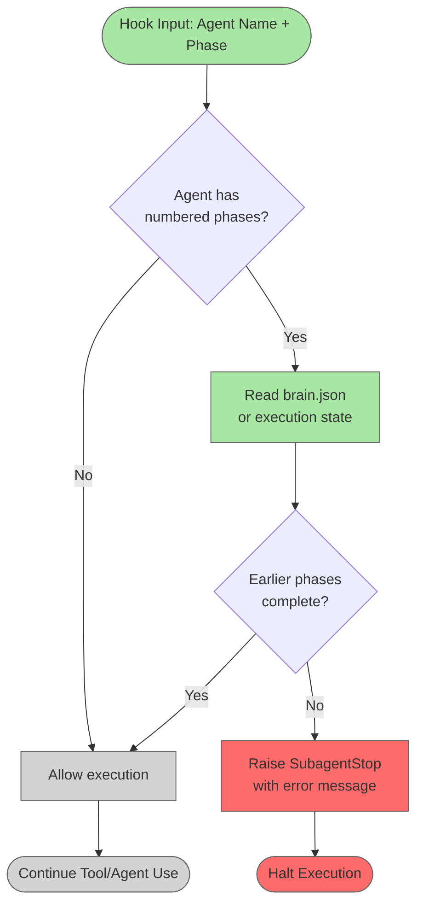

# Phase Order Enforcement Hook

## System Intent

- What is being built: A pre-tool-use hook and pre-agent-use hook that enforces sequential phase execution for agents that have strictly-ordered numbered flows (1 → 2 → 3 ... N). The hook prevents an agent from advancing to a later phase if earlier phases have not yet completed.
- Primary consumer(s): Agents with sequential phase workflows (dark-factory-agent with 7 steps, update-documentation-agent with 3 phases, fix-flow-orchestrator with 3 phases, and others with explicitly numbered flows).
- Boundary (black-box scope only): Hook-level enforcement only; agent implementations remain unchanged. The hook reads agent state via brain.json or execution state, and raises SubagentStop if phase ordering is violated.

## Stage Gate Tracker

- [ ] Stage 1 Mermaid approved
- [ ] Stage 2 Flows approved
- [ ] Stage 3 Logs + Deployment approved or skipped

## Mermaid Diagram



## Flows

### Global Types

```txt
PhaseState {
  agentName: string (e.g., "dark-factory-agent", "update-documentation-agent")
  currentPhase: int (1-based index of the phase being executed)
  completedPhases: int[] (list of already-completed phase numbers)
}

PhaseOrderViolation {
  agentName: string
  attemptedPhase: int
  incompletePhases: int[] (phases that must complete before attemptedPhase)
  message: string
}
```

### Flow: `check-phase-order`

Sequential phases that should not be skipped or reordered. Enforces that phase N cannot start until phases 1...N-1 are marked complete.

#### Types

```txt
HookInput {
  agentName: string (required, provided by hook mechanism)
  currentPhase: int (required, parsed from agent context)
}

HookOutput {
  allowed: bool (true = proceed, false = stop)
  reason: string | null (if not allowed, reason for block)
}
```

#### Paths

| path | input | output | path-type | notes | updated |
| --- | --- | --- | --- | --- | --- |
| `check-phase-order.allowed` | `HookInput` | `{ allowed: true }` | `happy path` | Phase order is valid, agent continues | |
| `check-phase-order.blocked` | `HookInput` | `{ allowed: false, reason: string }` | `error` | Earlier phases incomplete, SubagentStop raised | |

#### Pseudocode

```
function checkPhaseOrder(agentName, currentPhase):
  phaseMap = {
    "dark-factory-agent": 7,
    "update-documentation-agent": 3,
    "fix-flow-orchestrator": 3,
    "planning-agent": 1,  // phases: draft_plan only (not numbered)
    "execution-agent": N,  // variable phases per flow
  }
  
  if agentName not in phaseMap:
    return { allowed: true }  // unknown agent, allow
  
  stateFile = readBrainState(agentName)
  if stateFile.completedPhases includes (currentPhase - 1):
    return { allowed: true }
  else:
    incompletePhases = [1 ... currentPhase-1] - stateFile.completedPhases
    raise SubagentStop with {
      message: "Phase order violation in ${agentName}: cannot execute phase ${currentPhase} until phases ${incompletePhases} are complete."
    }
```

### Flow: `mark-phase-complete`

Called at the end of each phase to update agent state and permit subsequent phases to execute.

#### Types

```txt
MarkCompleteInput {
  agentName: string (required)
  phaseNumber: int (required, 1-based)
}

MarkCompleteOutput {
  updated: bool
  newCompletedPhases: int[]
}
```

#### Paths

| path | input | output | path-type | notes | updated |
| --- | --- | --- | --- | --- | --- |
| `mark-phase-complete.success` | `MarkCompleteInput` | `{ updated: true, newCompletedPhases: [...] }` | `happy path` | Phase marked in brain.json or state file | |
| `mark-phase-complete.error` | `MarkCompleteInput` | `{ updated: false, error: string }` | `error` | State file not writable or inaccessible | |

## Logs

| Source | Location |
|--------|----------|
| Hook output | `${DARK_FACTORY_WORK_DIR}/phase-order-enforcement.log` |
| Brain state | `${DARK_FACTORY_WORK_DIR}/brain.json` (under `phases` key) |

## Deployment

- Mechanism: Plugin hook registration via hooks.json
- Hook location: `agents/dark-factory/scripts/phase-order-enforcement-hook.sh`
- Registration: `agents/dark-factory/hooks.json` (pre-tool-use, pre-agent-use)
- Deploy command:
  ```bash
  # Copy hook script to plugin
  cp agents/dark-factory/scripts/phase-order-enforcement-hook.sh \
    ${CLAUDE_PLUGIN_ROOT}/agents/dark-factory/scripts/

  # Update hooks.json in plugin to register the hook
  # See agents/dark-factory/hooks.json for registration syntax
  ```
- Notes: Hook runs before any tool or agent invocation; exits early (no-op) if agent is not in the phase-ordered list.

## Handoff to Related Plan Reconciliation

After all stages are approved, apply `.agent/skills/reconcile-plans/SKILL.md` to propagate contract updates across linked plans (if any dark-factory-agent subcomponents have their own plans).
