# Refactor Overly-Complex Agents: Extract Logic into Skills and Commands

## System Intent

**What is being built**: A comprehensive refactoring of three overly-complex agents (dark-factory-agent, feature-agent, pr-agent) by extracting business logic into focused, reusable skills and commands. This decouples orchestration logic from state management and specialized loops.

**Primary consumers**: All dark-factory workflows that run through feature planning, execution, code review, and PR lifecycle.

**Scope**:
- Extract classification logic → `task-classifier` skill
- Extract brain.json operations → `brain-state-manager` skill
- Extract flow approval state machine → `flow-state-manager` skill
- Extract plan section rendering → `render-plan-section` command
- Extract CI polling loop → `ci-watch-runner` command
- Extract comment resolution loop → `comment-resolution-runner` command
- Extract document search logic → `find-affected-docs` command
- Extract issues tracking → `manage-issues-file` command
- Add explicit phase enforcement → `phase-gate-check` command

## Stage Gate Tracker

- [x] Stage 1 Skills Designed (task-classifier, brain-state-manager, flow-state-manager)
- [x] Stage 2 Commands Designed (render-plan-section, ci-watch-runner, comment-resolution-runner, find-affected-docs, manage-issues-file, phase-gate-check)
- [ ] Stage 3 Implementation & Integration (refactor agents to use new skills/commands)
- [ ] Stage 4 Testing & Validation

## Mermaid Diagram

```mermaid
graph TD
  Agent["Dark Factory Agents"]:::start
  
  Agent -->|Classification| Classifier["task-classifier Skill"]:::extract
  Agent -->|Brain State| BrainMgr["brain-state-manager Skill"]:::extract
  
  FeatureAgent["feature-agent"]:::refactor
  FeatureAgent -->|Flow State| FlowMgr["flow-state-manager Skill"]:::extract
  FeatureAgent -->|Section Rendering| RenderSec["render-plan-section Command"]:::extract
  
  PRAgent["pr-agent"]:::refactor
  PRAgent -->|CI Management| CIWatch["ci-watch-runner Command"]:::extract
  PRAgent -->|Comment Resolution| CommentRes["comment-resolution-runner Command"]:::extract
  
  DocAgent["update-documentation-agent"]:::future
  DocAgent -->|Doc Search| DocFind["find-affected-docs Command"]:::extract
  
  ReviewAgent["code-review-orchestrator-agent"]:::future
  ReviewAgent -->|Issues Tracking| IssuesMgr["manage-issues-file Command"]:::extract
  
  AllOrchestrators["All Orchestrators"]:::future
  AllOrchestrators -->|Phase Enforcement| PhaseGate["phase-gate-check Command"]:::extract
  
  classDef start fill:#fff,stroke:#333,stroke-width:2px
  classDef extract fill:#a8e6a3,stroke:#333,stroke-width:1px
  classDef refactor fill:#ffd700,stroke:#333,stroke-width:1px
  classDef future fill:#87ceeb,stroke:#333,stroke-width:1px
```

## Flows

### Flow 1: Classification

**File locations**: `skills/task-classifier/SKILL.md`

#### Paths

| Path | Input | Output | Type | Notes | Updated |
| --- | --- | --- | --- | --- | --- |
| `classify.feature` | taskDesc="add OAuth support" | classification="feature" | happy | Matches "add" signal | ✓ |
| `classify.fix-flow` | taskDesc="broken payment flow" | classification="fix-flow" | happy | Matches "broken flow" signal | ✓ |
| `classify.debugger` | taskDesc="login crashes" | classification="debugger" | happy | Matches "crash" signal | ✓ |
| `classify.repair` | taskDesc="tweak button color" | classification="repair" | happy | Matches "tweak" signal | ✓ |
| `classify.ambiguous` | taskDesc="update system" | ambiguous=true, question returned | happy | No clear signal; ask user | ✓ |

### Flow 2: Brain State Management

**File locations**: `skills/brain-state-manager/SKILL.md`

#### Paths

| Path | Input | Output | Type | Notes | Updated |
| --- | --- | --- | --- | --- | --- |
| `brain.create` | (all inputs) | brain.json written, env var exported | happy | Initial state setup | ✓ |
| `brain.read.full` | workDir | full brain.json object | happy | Entire state | ✓ |
| `brain.read.field` | workDir, "planFilePath" | field value | happy | Nested path support | ✓ |
| `brain.patch` | workDir, {planFilePath: "..."} | merged state | happy | Shallow merge | ✓ |
| `brain.delete` | workDir | files removed | happy | Cleanup | ✓ |

### Flow 3: Flow State Management

**File locations**: `skills/flow-state-manager/SKILL.md`

#### Paths

| Path | Input | Output | Type | Notes | Updated |
| --- | --- | --- | --- | --- | --- |
| `flow-state.load` | workDir | {approved: [], current: null} | happy | Init or load existing | ✓ |
| `flow-state.mark-approved` | workDir, "flow-1" | {approved: ["flow-1"], current: null} | happy | Mark approved | ✓ |
| `flow-state.set-current` | workDir, "flow-2" | {approved: ["flow-1"], current: "flow-2"} | happy | Update current | ✓ |
| `flow-state.find-next` | workDir, allFlows | nextFlow or null | happy | Find unapproved | ✓ |

### Flow 4: Section Rendering

**File locations**: `commands/render-plan-section.md`

#### Paths

| Path | Input | Output | Type | Notes | Updated |
| --- | --- | --- | --- | --- | --- |
| `render.success` | planPath, "## System Intent" | {success: true, rendered, fallback: false} | happy | Rendered OK | ✓ |
| `render.fallback` | planPath, section | {success: true, rendered (raw), fallback: true} | edge | Render failed; fallback to raw | ✓ |
| `render.not-found` | planPath, "### Nonexistent" | {success: false, reason} | error | Section not in plan | ✓ |

### Flow 5: CI Watch Loop

**File locations**: `commands/ci-watch-runner.md`

#### Paths

| Path | Input | Output | Type | Notes | Updated |
| --- | --- | --- | --- | --- | --- |
| `ci.all-pass` | prUrl | {status: "pass", checks} | happy | All checks succeed | ✓ |
| `ci.fix-attempt` | prUrl | {status: "pass"} after fix | happy | CI failed, fix applied | ✓ |
| `ci.quota-exhaustion` | prUrl | {status: "pass"} | edge | Fix spotter hits quota; treat as pass | ✓ |
| `ci.unfixable` | prUrl | {status: "fail", reason} | error | Fix failed; cannot proceed | ✓ |
| `ci.max-iterations` | prUrl | {status: "fail", reason} | error | Exceeded iteration limit | ✓ |

### Flow 6: Comment Resolution Loop

**File locations**: `commands/comment-resolution-runner.md`

#### Paths

| Path | Input | Output | Type | Notes | Updated |
| --- | --- | --- | --- | --- | --- |
| `comments.all-resolved` | prUrl, prNodeId | {status: "all-resolved"} | happy | No unresolved threads | ✓ |
| `comments.fix-thread` | prUrl, threadId | {status: "all-resolved"} after fix | happy | Fixed and resolved thread | ✓ |
| `comments.unfixable` | prUrl, threadId | {status: "failed", reason} | error | Cannot fix thread | ✓ |
| `comments.max-iterations` | prUrl | {status: "failed", reason} | error | Exceeded iteration limit | ✓ |

### Flow 7: Affected Docs Finder

**File locations**: `commands/find-affected-docs.md`

#### Paths

| Path | Input | Output | Type | Notes | Updated |
| --- | --- | --- | --- | --- | --- |
| `docs.found-affected` | planPath, projectDir | affectedDocs array with reasons | happy | Matched docs found | ✓ |
| `docs.none-affected` | planPath, projectDir | empty affectedDocs array | edge | No matching docs | ✓ |
| `docs.plan-not-found` | invalid planPath | {success: false, reason} | error | Plan file missing | ✓ |

### Flow 8: Issues File Management

**File locations**: `commands/manage-issues-file.md`

#### Paths

| Path | Input | Output | Type | Notes | Updated |
| --- | --- | --- | --- | --- | --- |
| `issues.create` | workDir, reviewPoints | issues.md written | happy | Initial issue list | ✓ |
| `issues.update` | workDir, issueId, resolved | issue marked resolved | happy | Mark issue fixed | ✓ |
| `issues.read` | workDir | issues array with status | happy | Current state | ✓ |
| `issues.idempotent` | update same issue twice | same result | edge | Multiple updates safe | ✓ |

### Flow 9: Phase Gate Check

**File locations**: `commands/phase-gate-check.md`

#### Paths

| Path | Input | Output | Type | Notes | Updated |
| --- | --- | --- | --- | --- | --- |
| `phase.can-run` | brainPath, "worker" | {canRun: true} | happy | Prereq complete | ✓ |
| `phase.blocked` | brainPath, "review" (worker incomplete) | {canRun: false, blockingPhases} | edge | Prereq not met | ✓ |
| `phase.first` | brainPath, "prep" | {canRun: true} | happy | First phase always OK | ✓ |

## Logs

| Source | Location |
|--------|----------|
| Skill/Command definitions | `skills/*/SKILL.md`, `commands/*.md` |
| Dark Factory agents (to be refactored) | `agents/dark-factory/agents/dark-factory-agent.md` |
| Feature agent (to be refactored) | `agents/featurework/agents/feature-agent.md` |
| PR agent (to be refactored) | `agents/pr/agents/pr-agent.md` |
| Integration examples | Within each skill/command doc |

## Deployment

**Mechanism**: Skills and commands are passive — they must be explicitly invoked by agents.

**Phase 1 Deploy** (after design completion):
- Create and review all skill/command markdown files
- Document integration points in each agent
- PR with all skills/commands (agents unchanged yet)

**Phase 2 Deploy** (integration):
- Update dark-factory-agent to call task-classifier and brain-state-manager
- Update feature-agent to call flow-state-manager and render-plan-section
- Update pr-agent to call ci-watch-runner and comment-resolution-runner
- One PR per agent refactoring (or all together if small)

**Phase 3 Deploy** (polish):
- Update update-documentation-agent to call find-affected-docs
- Update code-review-orchestrator-agent to call manage-issues-file
- Add phase-gate-check calls to all orchestrators (optional, for enforcement)

**Rollout**: All skills/commands are backward-compatible (agents don't change from the outside). Refactoring is internal only.

## Success Criteria

After Phase 1 (this PR):
- All 9 skills/commands are documented and in the codebase
- No circular dependencies
- Clear integration points identified

After Phase 2 (follow-up PRs):
- dark-factory-agent: ≤100 lines (down from 235)
- feature-agent: ≤150 lines (down from 233)
- pr-agent: ≤70 lines (down from 130)
- All existing tests pass
- No behavior changes (same outputs for same inputs)
