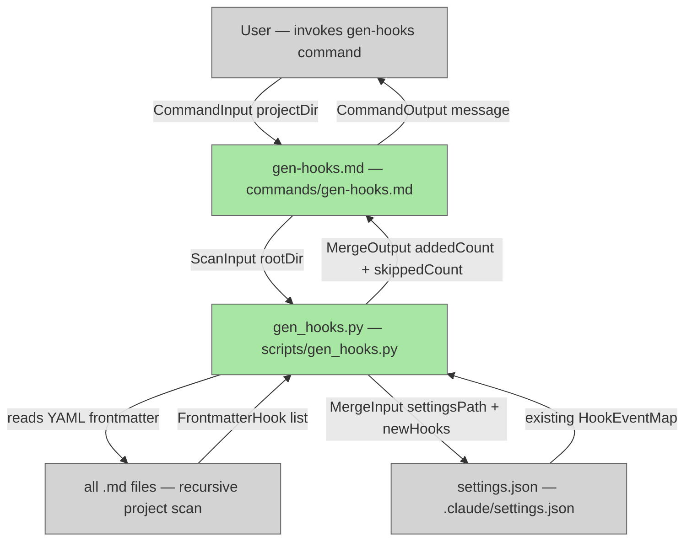

# YAML-Declared Hooks in gen-hooks Command

## System Intent

- What is being built: A new `/dark-factory:gen-hooks` slash command (and backing command file) that scans all skill, agent, and command `.md` files for hook declarations in their YAML frontmatter (e.g., `PreToolUse: ./commit.sh`) and writes those hooks into `.claude/settings.json` — additively, without disturbing any pre-existing hooks.
- Primary consumer(s): Plugin users who want to attach custom shell scripts to Claude Code hook events (PreToolUse, PostToolUse, Stop, SubagentStop, PreCompact, etc.) by declaring them directly in the YAML frontmatter of a skill or agent file they own, then running `gen-hooks` to activate them.
- Boundary (black-box scope only): `gen-hooks` reads `.md` frontmatter and writes `.claude/settings.json`. It does not modify plugin-level `hooks/hooks.json`, does not delete existing hooks entries from `settings.json`, and does not execute the declared scripts.

### Supported hook types

All hook events documented at https://code.claude.com/docs/en/hooks:
- `PreToolUse`
- `PostToolUse`
- `Stop`
- `SubagentStop`
- `PreCompact`

### YAML frontmatter syntax

Users declare hooks inside the `---` frontmatter block of any `.md` file anywhere in the project directory (scanned recursively):

```yaml
---
name: my-skill
PreToolUse: ./hooks/pre-use.sh
PostToolUse: ./hooks/post-use.sh
PreToolUse: ./hooks/pre-use-2.sh   # second entry — both are registered
---
```

Multiple declarations of the same hook key are allowed; each produces a separate hook entry in `settings.json`.

The `matcher` field defaults to `""` (matches everything) unless the user also declares `matcher: <value>` directly below the hook line (exact syntax TBD in flows).

### Output target

Hooks are written to `.claude/settings.json` under the `hooks` key, following the same structure Claude Code uses natively:

```json
{
  "hooks": {
    "PreToolUse": [
      { "matcher": "", "hooks": [{ "type": "command", "command": "bash ./hooks/pre-use.sh" }] }
    ]
  }
}
```

Existing entries are preserved; only new entries derived from the YAML scan are appended (deduplication by exact command string).

## Stage Gate Tracker

- [x] Stage 1 Mermaid approved
- [x] Stage 2 Flows approved
- [x] Stage 3 Logs + Deployment approved or skipped

## Mermaid Diagram



ONCE YOU GET APPROVAL FROM THE DEVELOPER, DELETE THIS LINE AND UPDATE THE STAGE GATE TRACKER

## Flows

- Flow naming rule: ``### Flow: `<flowname>` ``
- `N/A` for test files means explicit no-test-required waiver (not a missing mapping).

### Global Types

```txt
StandardError {
  message: string (human-readable description of what went wrong)
}

HookEntry {
  type: "command"
  command: string (the shell command string to execute)
}

HookMatcher {
  matcher: string (glob/regex matcher; defaults to "" for match-all)
  hooks: HookEntry[]
}

HookEventMap {
  PreToolUse?: HookMatcher[]
  PostToolUse?: HookMatcher[]
  Stop?: HookMatcher[]
  SubagentStop?: HookMatcher[]
  PreCompact?: HookMatcher[]
}
```

### Flow: `scanFrontmatter`
- Test files: `tests/test_gen_hooks.py`
- Core files: `commands/gen-hooks.md`, `scripts/gen_hooks.py`

#### Types

```txt
ScanInput {
  rootDir: string (absolute path to the project root being scanned)
}

FrontmatterHook {
  eventType: string (e.g. "PreToolUse")
  command: string (raw value from the YAML key)
  matcher: string (defaults to "")
  sourceFile: string (path to the .md file declaring the hook)
}

ScanOutput {
  hooks: FrontmatterHook[]
}
```

#### Paths

| path | input | output | path-type | notes | updated |
| --- | --- | --- | --- | --- | --- |
| `scanFrontmatter.success` | `ScanInput` | `ScanOutput` | `happy path` | Found 0 or more hook declarations | |
| `scanFrontmatter.no-md-files` | `ScanInput` | `ScanOutput{hooks:[]}` | `happy path` | No .md files with hook keys found | |
| `scanFrontmatter.invalid-yaml` | `ScanInput` | `StandardError` | `error` | A .md file has malformed YAML frontmatter | |

#### Pseudocode

```
scanFrontmatter(rootDir):
  results = []
  for each .md file found recursively under rootDir (all subdirectories):
    frontmatter = parse_yaml_frontmatter(file)
    if frontmatter is None: continue
    for each key in frontmatter:
      if key in HOOK_TYPES:
        values = ensure_list(frontmatter[key])   # handle single or list values
        for value in values:
          results.append(FrontmatterHook(eventType=key, command=value, matcher="", sourceFile=file))
  return ScanOutput(hooks=results)
```

### Flow: `mergeIntoSettings`
- Test files: `tests/test_gen_hooks.py`
- Core files: `scripts/gen_hooks.py`

#### Types

```txt
MergeInput {
  settingsPath: string (absolute path to .claude/settings.json)
  newHooks: FrontmatterHook[]
}

MergeOutput {
  addedCount: int
  skippedCount: int (duplicates already present)
  settingsPath: string
}
```

#### Paths

| path | input | output | path-type | notes | updated |
| --- | --- | --- | --- | --- | --- |
| `mergeIntoSettings.success` | `MergeInput` | `MergeOutput` | `happy path` | Hooks merged without deleting existing entries | |
| `mergeIntoSettings.settings-missing` | `MergeInput` | `MergeOutput` | `happy path` | settings.json doesn't exist yet — create it with just the hooks key | |
| `mergeIntoSettings.all-duplicates` | `MergeInput` | `MergeOutput{addedCount:0}` | `happy path` | All declared hooks already present; no-op | |
| `mergeIntoSettings.write-error` | `MergeInput` | `StandardError` | `error` | File system write fails | |

#### Pseudocode

```
mergeIntoSettings(settingsPath, newHooks):
  settings = read_json(settingsPath) if exists else {}
  existing = settings.get("hooks", {})
  added = 0
  skipped = 0
  for hook in newHooks:
    event_list = existing.setdefault(hook.eventType, [])
    command_str = "bash " + hook.command
    # check for duplicate by exact command string across all matchers in this event
    already_present = any(
      entry["command"] == command_str
      for matcher_obj in event_list
      for entry in matcher_obj.get("hooks", [])
    )
    if already_present:
      skipped += 1
      continue
    event_list.append({
      "matcher": hook.matcher,
      "hooks": [{"type": "command", "command": command_str}]
    })
    added += 1
  settings["hooks"] = existing
  write_json(settingsPath, settings)
  return MergeOutput(addedCount=added, skippedCount=skipped, settingsPath=settingsPath)
```

### Flow: `genHooksCommand`
- Test files: `tests/test_gen_hooks.py`
- Core files: `commands/gen-hooks.md`, `scripts/gen_hooks.py`

#### Types

```txt
CommandInput {
  projectDir: string (CWD when the command is invoked — the user's project root)
}

CommandOutput {
  addedCount: int
  skippedCount: int
  settingsPath: string
  message: string (human-readable summary)
}
```

#### Paths

| path | input | output | path-type | notes | updated |
| --- | --- | --- | --- | --- | --- |
| `genHooksCommand.success` | `CommandInput` | `CommandOutput` | `happy path` | Scanned + merged; prints summary to user | |
| `genHooksCommand.nothing-to-add` | `CommandInput` | `CommandOutput{addedCount:0}` | `happy path` | No YAML hook declarations found in any .md file | |
| `genHooksCommand.error` | `CommandInput` | `StandardError` | `error` | Scan or merge step failed | |

#### Pseudocode

```
genHooksCommand(projectDir):
  scanResult = scanFrontmatter(projectDir)
  if error: return StandardError

  settingsPath = projectDir + "/.claude/settings.json"
  mergeResult = mergeIntoSettings(settingsPath, scanResult.hooks)
  if error: return StandardError

  return CommandOutput(
    addedCount=mergeResult.addedCount,
    skippedCount=mergeResult.skippedCount,
    settingsPath=mergeResult.settingsPath,
    message="Added " + mergeResult.addedCount + " hook(s), skipped " + mergeResult.skippedCount + " duplicate(s)."
  )
```

ONCE YOU GET APPROVAL FROM THE DEVELOPER, DELETE THIS LINE AND UPDATE THE STAGE GATE TRACKER

## Logs

| Source | Location |
|--------|----------|
| gen-hooks script | stdout (printed to user terminal) |

## Deployment

- Mechanism: `local only`
- Deploy command:
  ```bash
  # No deployment — ships as a plugin command + Python script
  ```
- Notes: After implementing, run `/dark-factory:install` to pick up the new command.

ONCE YOU GET APPROVAL FROM THE DEVELOPER, DELETE THIS LINE AND UPDATE THE STAGE GATE TRACKER

## Handoff to Related Plan Reconciliation

After all stages are approved, apply `.agent/skills/reconcile-plans/SKILL.md` to propagate contract updates across linked plans.
