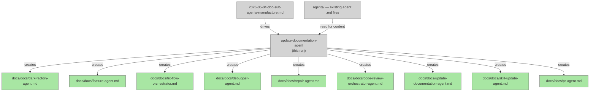

# Doc Sub-Agents Manufacture

## System Intent

- **What is being built**: Individual documentation files in `docs/docs/` for dark-factory-agent and its 8 direct child agents. Each agent currently lacks a dedicated doc; they are only described inline in `docs/docs/manufacture.md`. This feature creates one authoritative doc per agent using the existing documentation template. Sub-sub-agents (planning-agent, sub-planning-agent, execution-agent, skeleton-agent, testing-agent, implementation-agent, high-level-review-agent, low-level-review-agent, resolver-agent) are explicitly out of scope.
- **Primary consumer(s)**: Future agents (investigation-agent, update-documentation-agent) that look up `docs/docs/<system>.md` before modifying a system. Also human developers onboarding to the pipeline.
- **Boundary (black-box scope only)**: Read-only analysis of agent `.md` files under `agents/`; write new `.md` files under `docs/docs/`. No agent source files are modified. Exactly 9 doc files will be created: dark-factory-agent, feature-agent, fix-flow-orchestrator, debugger-agent, repair-agent, code-review-orchestrator-agent, update-documentation-agent, skill-update-agent, pr-agent.

## Stage Gate Tracker

- [x] Stage 1 Mermaid approved
- [x] Stage 2 Flows approved
- [x] Stage 3 Logs + Deployment approved or skipped

## Mermaid Diagram

> Use the skill at `skills/create-mermaid-diagram/SKILL.md` to generate this diagram.



## Flows

- Flow naming rule: ``### Flow: `<flowname>` ``
- `N/A` for test files means explicit no-test-required waiver (not a missing mapping).

### Global Types

```txt
StandardError {
  message: string (human-readable description of what went wrong)
}

AgentDocInput {
  agentFilePath: string (absolute path to the source agent .md file)
  outputDocPath: string (absolute path to the destination docs/docs/*.md file)
}

AgentDocOutput {
  path: string (absolute path to the written doc file)
  action: "created"
}
```

---

### Flow: `doc.dark-factory-agent`

- Test files: `N/A`
- Core files: `docs/docs/dark-factory-agent.md`

#### Types

```txt
Input: AgentDocInput {
  agentFilePath: "agents/dark-factory/agents/dark-factory-agent.md"
  outputDocPath: "docs/docs/dark-factory-agent.md"
}
Output: AgentDocOutput
```

#### Paths

| path | input | output | path-type | notes | updated |
| --- | --- | --- | --- | --- | --- |
| `doc.dark-factory-agent.success` | `AgentDocInput` | `AgentDocOutput` | `happy path` | doc written covering: classification, prep-feature-dir, brain.json lifecycle, worker routing (feature/fix-flow/debugger/repair), branch-drift guard, code-review, update-documentation, skill-update, pr-agent, cleanup | |
| `doc.dark-factory-agent.write-error` | `AgentDocInput` | `StandardError` | `error` | unable to write output file | |

#### Pseudocode

```
Read agents/dark-factory/agents/dark-factory-agent.md
Document:
  - Role: top-level haiku orchestrator
  - Model: haiku (state/routing only, no heavy reasoning)
  - Input: taskDescription, taskName
  - 12-step orchestration loop (classify → prep → brain → route → drift-guard → code-review → update-docs → skill-update → pr → metrics → cleanup)
  - Worker routes: feature-agent, fix-flow-orchestrator, debugger-agent, repair-agent
  - cleanup() helper definition
  - Key rules: never write code, always cleanup on error, brain state via brain-state-manager
Write docs/docs/dark-factory-agent.md
```

---

### Flow: `doc.feature-agent`

- Test files: `N/A`
- Core files: `docs/docs/feature-agent.md`

#### Types

```txt
Input: AgentDocInput {
  agentFilePath: "agents/featurework/agents/feature-agent.md"
  outputDocPath: "docs/docs/feature-agent.md"
}
Output: AgentDocOutput
```

#### Paths

| path | input | output | path-type | notes | updated |
| --- | --- | --- | --- | --- | --- |
| `doc.feature-agent.success` | `AgentDocInput` | `AgentDocOutput` | `happy path` | doc written covering: 5-phase planning loop (draft_plan → mermaid → flows → final gate → execute), return-question protocol, flow-state-manager delegation | |
| `doc.feature-agent.write-error` | `AgentDocInput` | `StandardError` | `error` | unable to write output file | |

#### Pseudocode

```
Read agents/featurework/agents/feature-agent.md
Document:
  - Role: end-to-end feature orchestrator (haiku)
  - Input: taskDescription, answer, planPath
  - Resume logic: reads Stage Gate Tracker checkboxes to determine current phase
  - Phase 1 (draft_plan): invokes planning-agent, returns status:"question"
  - Phase 2 (mermaid): invokes planning-agent, sends PushNotification with diagram URL
  - Phase 3 (flows): one-flow-at-a-time approval via flow-state-manager
  - Phase 4 (final gate): shows full plan, waits for Approve and Execute
  - Phase 5 (execute): invokes execution-agent, writes brain-patch.json on success
  - Key rule: never call AskUserQuestion — return status:"question" instead
Write docs/docs/feature-agent.md
```

---

### Flow: `doc.code-review-orchestrator-agent`

- Test files: `N/A`
- Core files: `docs/docs/code-review-orchestrator-agent.md`

#### Types

```txt
Input: AgentDocInput {
  agentFilePath: "agents/code-review/agents/code-review-orchestrator-agent.md"
  outputDocPath: "docs/docs/code-review-orchestrator-agent.md"
}
Output: AgentDocOutput
```

#### Paths

| path | input | output | path-type | notes | updated |
| --- | --- | --- | --- | --- | --- |
| `doc.code-review-orchestrator-agent.success` | `AgentDocInput` | `AgentDocOutput` | `happy path` | doc written covering: parallel reviewer spawn, resolver loop, issues.md lifecycle, 10-iteration guard | |
| `doc.code-review-orchestrator-agent.write-error` | `AgentDocInput` | `StandardError` | `error` | unable to write output file | |

#### Pseudocode

```
Read agents/code-review/agents/code-review-orchestrator-agent.md
Document:
  - Role: haiku orchestrator for code review
  - Input: planFilePath, codePath
  - Flow: manage-issues-file create → spawn HLR + LLR in parallel → wait → resolver loop until anyRemaining=false → manage-issues-file delete
  - Guard: halt if resolver runs > 10 iterations
  - Output: {status: "complete"}
  - Error paths: reviewer error (before resolver), resolver error (during loop)
Write docs/docs/code-review-orchestrator-agent.md
```

---

### Flow: `doc.fix-flow-orchestrator`

- Test files: `N/A`
- Core files: `docs/docs/fix-flow-orchestrator.md`

#### Types

```txt
Input: AgentDocInput {
  agentFilePath: "agents/fix-flow/agents/fix-flow-orchestrator.md"
  outputDocPath: "docs/docs/fix-flow-orchestrator.md"
}
Output: AgentDocOutput
```

#### Paths

| path | input | output | path-type | notes | updated |
| --- | --- | --- | --- | --- | --- |
| `doc.fix-flow-orchestrator.success` | `AgentDocInput` | `AgentDocOutput` | `happy path` | doc written covering: 3 phases (investigate → setup → fix-and-push), required flow-name argument, ralph-fix-and-push loop | |
| `doc.fix-flow-orchestrator.write-error` | `AgentDocInput` | `StandardError` | `error` | unable to write output file | |

#### Pseudocode

```
Read agents/fix-flow/agents/fix-flow-orchestrator.md
Document:
  - Role: haiku orchestrator for fix-flow route
  - Input: flow-name (required; asks user if missing)
  - Phase 1: investigation-agent → docs/plans/system-diagram.md
  - Phase 2: setup-wizard → generated scripts (trigger, fetch-logs, wait-for-completion)
  - Phase 3: ralph-fix-and-push → single PR with all accumulated fixes
  - Artifacts persisted: docs/plans/system-diagram.md, docs/bugs/*.md
Write docs/docs/fix-flow-orchestrator.md
```

---

### Flow: `doc.debugger-agent`

- Test files: `N/A`
- Core files: `docs/docs/debugger-agent.md`

#### Types

```txt
Input: AgentDocInput {
  agentFilePath: "agents/debugger/agents/debugger-agent.md"
  outputDocPath: "docs/docs/debugger-agent.md"
}
Output: AgentDocOutput
```

#### Paths

| path | input | output | path-type | notes | updated |
| --- | --- | --- | --- | --- | --- |
| `doc.debugger-agent.success` | `AgentDocInput` | `AgentDocOutput` | `happy path` | doc written covering: systematic debug checklist, bug audit log lifecycle, brain-patch.json output | |
| `doc.debugger-agent.write-error` | `AgentDocInput` | `StandardError` | `error` | unable to write output file | |

#### Pseudocode

```
Read agents/debugger/agents/debugger-agent.md
Document:
  - Role: systematic debugger (sonnet) for non-obvious/state-dependent bugs
  - Input: taskDescription
  - Steps in order: confirm bug warrants systematic debug → check docs/bugs/ for existing log → read logs before touching code → fill bug-audit-log-template → run debug checklist (write failing test → confirm fails → identify root cause → fix → confirm passes → optionally remove fix and confirm fails)
  - Output: brain-patch.json with bugFiles array
  - Key rule: do not touch code before reading all relevant logs
Write docs/docs/debugger-agent.md
```

---

### Flow: `doc.repair-agent`

- Test files: `N/A`
- Core files: `docs/docs/repair-agent.md`

#### Types

```txt
Input: AgentDocInput {
  agentFilePath: "agents/repair/agents/repair-agent.md"
  outputDocPath: "docs/docs/repair-agent.md"
}
Output: AgentDocOutput
```

#### Paths

| path | input | output | path-type | notes | updated |
| --- | --- | --- | --- | --- | --- |
| `doc.repair-agent.success` | `AgentDocInput` | `AgentDocOutput` | `happy path` | doc written covering: baseline test run, targeted apply, significantChange flag, 5-attempt fix loop | |
| `doc.repair-agent.write-error` | `AgentDocInput` | `StandardError` | `error` | unable to write output file | |

#### Pseudocode

```
Read agents/repair/agents/repair-agent.md
Document:
  - Role: lightweight targeted change agent (sonnet) — no plan file required
  - Input: taskDescription
  - Steps: understand scope → baseline test run (record pre-existing failures) → apply minimal change → assess significantChange flag → fix loop up to 5 attempts for new failures
  - significantChange=true if: agent .md, SKILL.md, command, or public API boundary changed
  - Output: {success: true, significantChange} or {success: false, significantChange, error}
  - Key rule: pre-existing failures are noted but not counted against repair
Write docs/docs/repair-agent.md
```

---

### Flow: `doc.update-documentation-agent`

- Test files: `N/A`
- Core files: `docs/docs/update-documentation-agent.md`

#### Types

```txt
Input: AgentDocInput {
  agentFilePath: "agents/documentation/agents/update-documentation-agent.md"
  outputDocPath: "docs/docs/update-documentation-agent.md"
}
Output: AgentDocOutput
```

#### Paths

| path | input | output | path-type | notes | updated |
| --- | --- | --- | --- | --- | --- |
| `doc.update-documentation-agent.success` | `AgentDocInput` | `AgentDocOutput` | `happy path` | doc written covering: 3-phase flow (identify flows → identify affected docs → update docs), find-affected-docs command, brain-patch.json | |
| `doc.update-documentation-agent.write-error` | `AgentDocInput` | `StandardError` | `error` | unable to write output file | |

#### Pseudocode

```
Read agents/documentation/agents/update-documentation-agent.md
Document:
  - Role: post-execution doc updater (sonnet)
  - Input: planFilePath
  - Phase 1: extract flows/services/components from plan → build tmp/update-docs-flows.md
  - Phase 2: invoke find-affected-docs command → append affected doc list to checklist
  - Phase 3: for each existing doc edit in place; for each new flow create docs/docs/<flow-name>.md using documentation skill
  - Output: brain-patch.json with docsWritten array
Write docs/docs/update-documentation-agent.md
```

---

### Flow: `doc.skill-update-agent`

- Test files: `N/A`
- Core files: `docs/docs/skill-update-agent.md`

#### Types

```txt
Input: AgentDocInput {
  agentFilePath: "agents/skill-update/agents/skill-update-agent.md"
  outputDocPath: "docs/docs/skill-update-agent.md"
}
Output: AgentDocOutput
```

#### Paths

| path | input | output | path-type | notes | updated |
| --- | --- | --- | --- | --- | --- |
| `doc.skill-update-agent.success` | `AgentDocInput` | `AgentDocOutput` | `happy path` | doc written covering: candidate pattern detection, recurrence filter, skill template, brain-patch.json | |
| `doc.skill-update-agent.write-error` | `AgentDocInput` | `StandardError` | `error` | unable to write output file | |

#### Pseudocode

```
Read agents/skill-update/agents/skill-update-agent.md
Document:
  - Role: post-execution skill harvester (sonnet) — non-fatal step in dark-factory-agent
  - Input: planFilePath (nullable), workDir, taskSummary
  - Steps: gather context (plan + git diff) → identify candidate patterns (NOTEs, WORKAROUNDs, HACKs, repeated lookups) → recurrence filter (task-specific vs general) → write/update skills/<slug>/SKILL.md
  - Output: {skillsWritten: SkillFile[]} + brain-patch.json if skillsWritten non-empty
  - Key rule: only write when pattern is non-obvious AND likely to recur; prefer empty list over noise
Write docs/docs/skill-update-agent.md
```

---

### Flow: `doc.pr-agent`

- Test files: `N/A`
- Core files: `docs/docs/pr-agent.md`

#### Types

```txt
Input: AgentDocInput {
  agentFilePath: "agents/pr/agents/pr-agent.md"
  outputDocPath: "docs/docs/pr-agent.md"
}
Output: AgentDocOutput
```

#### Paths

| path | input | output | path-type | notes | updated |
| --- | --- | --- | --- | --- | --- |
| `doc.pr-agent.success` | `AgentDocInput` | `AgentDocOutput` | `happy path` | doc written covering: 5-step PR lifecycle, ci-watch-runner and comment-resolution-runner delegation, does-not-merge rule | |
| `doc.pr-agent.write-error` | `AgentDocInput` | `StandardError` | `error` | unable to write output file | |

#### Pseudocode

```
Read agents/pr/agents/pr-agent.md
Document:
  - Role: PR lifecycle manager (sonnet)
  - Input: planFilePath or description string
  - Steps: build PR body from plan/description → invoke create-pr skill → write brain-patch.json with prUrl → ci-watch-runner (max 5 iterations) → comment-resolution-runner (max 5 iterations)
  - Output: {prUrl, status: "ready"}
  - SubagentStop hook: pr-agent-cleanup-hook.sh
  - Key rule: does NOT merge — stops at status ready; always uses git -C "$WORK_DIR"
Write docs/docs/pr-agent.md
```

## Logs

| Source | Location |
|--------|----------|
| N/A | This feature produces only static documentation files; no runtime logs are generated. |

## Deployment

- Mechanism: `local only`
- Deploy command:
  ```bash
  # No deployment — files are committed to the repository as documentation.
  # After manufacture completes, the new docs/docs/*.md files will be in the PR.
  ```
- Notes: All 9 new doc files land in `docs/docs/` and are committed as part of the manufacture PR. No runtime or infra changes.
