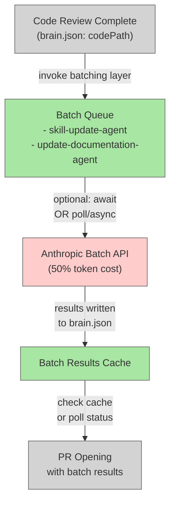

# Batch API Processing for Non-Interactive Dark-Factory Agents

## System Intent

- **What is being built**: An architectural enhancement to the dark-factory manufacture flow that enables asynchronous batch processing of non-interactive agents (skill-update-agent and update-documentation-agent) via Anthropic's Batch API, reducing token costs by ~50% since these agents don't need real-time responses.

- **Primary consumer(s)**: The dark-factory-agent orchestrator, which currently invokes skill-update-agent (Step 9) and update-documentation-agent (Step 8) synchronously after code review and before PR opening.

- **Boundary (black-box scope only)**: The Anthropic Batch API service (external); internal implementation stays within dark-factory agents, scripts, and configuration. No changes to downstream agent logic (they remain pure and unaware of batching).

## Stage Gate Tracker

- [ ] Stage 1 Mermaid approved
- [ ] Stage 2 Flows approved
- [ ] Stage 3 Logs + Deployment approved or skipped

## Mermaid Diagram



ONCE YOU GET APPROVAL FROM THE DEVELOPER, DELETE THIS LINE AND UPDATE THE STAGE GATE TRACKER

## Flows

- Flow naming rule: ``### Flow: <flowname> ``
- `N/A` for test files means explicit no-test-required waiver (not a missing mapping).

### Global Types

```txt
StandardError {
  message: string (human-readable description of what went wrong)
}

BatchJobRequest {
  agent: string (agent name, e.g. "skill-update-agent")
  inputArgs: object (arguments to pass to agent)
  priority: enum["high", "normal"] (default: "normal")
}

BatchJobResult {
  jobId: string (Batch API job ID)
  agent: string (agent name)
  status: enum["queued", "processing", "completed", "failed"]
  result: object | null (agent output when completed)
  error: string | null (error message if failed)
}
```

### Flow: `create_batch_job_request`

Converts dark-factory agent invocations (update-documentation-agent, skill-update-agent) into Batch API job requests.

- Test files: `tests/test_batch_job_creation.py`
- Core files: `agents/dark-factory/scripts/batch-queue-manager.py`, `agents/dark-factory/scripts/batch-request-builder.py`

#### Types

```txt
JobRequestInput {
  agentName: string (update-documentation-agent | skill-update-agent)
  agentArgs: object (original agent arguments)
  planFilePath: string (from brain.json)
  workDir: string (from brain.json)
}

JobRequestOutput {
  requestPath: string (path to persisted JSON request file)
  jobId: string (unique job identifier)
}
```

#### Paths

| path | input | output | path-type | notes | updated |
| --- | --- | --- | --- | --- | --- |
| `create_batch_job.success` | `JobRequestInput` | `JobRequestOutput` | `happy path` | Request queued in Batch API | |
| `create_batch_job.invalid_agent` | `JobRequestInput` | `StandardError` | `error` | Agent name not recognized | |
| `create_batch_job.api_error` | `JobRequestInput` | `StandardError` | `error` | Batch API returned error | |

#### Pseudocode

```
function create_batch_job_request(agentName, agentArgs, planFilePath, workDir):
  
  # Validate agent is batchable (currently: skill-update-agent, update-documentation-agent)
  if agentName not in BATCHABLE_AGENTS:
    return error("Agent not eligible for batching")
  
  # Build job request payload matching agent's expected input format
  payload = build_batch_payload(agentName, agentArgs)
  
  # Create Batch API request via anthropic.Batch.create()
  batch_response = anthropic_client.beta.batches.create(
    requests=[
      {
        "custom_id": generate_unique_id(workDir, agentName),
        "params": {
          "model": get_agent_model(agentName),  # sonnet for both agents
          "max_tokens": 4096,
          "system": build_system_prompt(agentName),
          "messages": [
            {
              "role": "user",
              "content": serialize_agent_input(agentArgs)
            }
          ]
        }
      }
    ]
  )
  
  jobId = batch_response.id
  
  # Write batch job metadata to WORK_DIR/batch-jobs/<agentName>.json
  write_batch_job_metadata(jobId, agentName, agentArgs)
  
  return { jobId, requestPath: metadata_file_path }
```

ONCE YOU GET APPROVAL FROM THE DEVELOPER, DELETE THIS LINE AND UPDATE THE STAGE GATE TRACKER

### Flow: `poll_batch_job_status`

Polls the Anthropic Batch API for job completion and retrieves results.

- Test files: `tests/test_batch_polling.py`
- Core files: `agents/dark-factory/scripts/batch-poll-manager.py`

#### Types

```txt
PollInput {
  jobId: string (from previous create_batch_job_request)
  timeout: integer (seconds to poll before giving up; default 60)
}

PollOutput {
  jobId: string
  status: string (queued | processing | completed | failed)
  result: object | null (parsed agent output when completed)
  error: string | null
}
```

#### Paths

| path | input | output | path-type | notes | updated |
| --- | --- | --- | --- | --- | --- |
| `poll_batch_job.completed` | `PollInput` | `PollOutput` | `happy path` | Job finished; results available | |
| `poll_batch_job.timeout` | `PollInput` | `StandardError` | `error` | Polling exceeded timeout | |
| `poll_batch_job.failed` | `PollInput` | `StandardError` | `error` | Batch API reported job failure | |

#### Pseudocode

```
function poll_batch_job_status(jobId, timeout_seconds=60):
  
  start_time = current_time()
  poll_interval = 5  # seconds between polls
  
  while (current_time() - start_time) < timeout_seconds:
    batch_status = anthropic_client.beta.batches.retrieve(jobId)
    
    if batch_status.processing_status == "completed":
      # Parse results from batch_status.request_counts and output
      results = parse_batch_results(batch_status, jobId)
      return {
        jobId: jobId,
        status: "completed",
        result: results,
        error: null
      }
    
    if batch_status.processing_status == "failed":
      error_msg = batch_status.errors or "Unknown batch failure"
      return {
        jobId: jobId,
        status: "failed",
        result: null,
        error: error_msg
      }
    
    # Still queued or processing
    sleep(poll_interval)
  
  # Timeout reached without completion
  return {
    jobId: jobId,
    status: "timeout",
    result: null,
    error: f"Job {jobId} did not complete within {timeout_seconds}s"
  }
```

ONCE YOU GET APPROVAL FROM THE DEVELOPER, DELETE THIS LINE AND UPDATE THE STAGE GATE TRACKER

### Flow: `dark_factory_batch_orchestration`

Integrates batching into the dark-factory-agent manufacture flow. Replaces synchronous invocations of skill-update-agent and update-documentation-agent with batch queue operations.

- Test files: `tests/test_manufacture_batch_flow.py`
- Core files: `agents/dark-factory/agents/dark-factory-agent.md`, `agents/dark-factory/scripts/batch-manufacture-wrapper.py`

#### Types

```txt
ManufactureBatchInput {
  planFilePath: string
  workDir: string
  projectDir: string
  batchMode: enum["sync", "async", "poll"]
}

ManufactureBatchOutput {
  docsWritten: string[] | null
  skillsWritten: string[] | null
  batchJobs: string[] (job IDs that were queued)
}
```

#### Paths

| path | input | output | path-type | notes | updated |
| --- | --- | --- | --- | --- | --- |
| `dark_factory_batch_sync` | `ManufactureBatchInput` | `ManufactureBatchOutput` | `happy path` | Wait for batch completion before PR (existing behavior but faster) | |
| `dark_factory_batch_async` | `ManufactureBatchInput` | `ManufactureBatchOutput` | `happy path` | Queue batches, write results to brain.json, proceed with PR | |
| `dark_factory_batch_poll` | `ManufactureBatchInput` | `ManufactureBatchOutput` | `happy path` | Non-blocking poll; PR proceed regardless (can retry results later) | |
| `dark_factory_batch_fallback` | `ManufactureBatchInput` | `ManufactureBatchOutput` | `error recovery` | If batch fails, fall back to synchronous invocation | |

#### Pseudocode

```
# In dark-factory-agent.md Steps 8-9 (currently synchronous):

# Current behavior (BEFORE):
invoke update-documentation-agent({ planFilePath })
try:
  invoke skill-update-agent({ planFilePath, workDir, taskSummary })
catch:
  warn "skill-update-agent failed"

# NEW behavior (AFTER): Configurable batching

batchMode = get_config("DARK_FACTORY_BATCH_MODE", "sync")  # sync | async | poll

if batchMode == "sync":
  # Traditional: queue both jobs, block until completion
  docJobId = create_batch_job_request("update-documentation-agent", {planFilePath})
  skillJobId = create_batch_job_request("skill-update-agent", {planFilePath, workDir, taskDescription})
  
  docResult = poll_batch_job_status(docJobId, timeout=120)
  skillResult = poll_batch_job_status(skillJobId, timeout=120)
  
  # Merge results into brain.json as if agents had run synchronously
  invoke brain-state-manager({
    operation: "patch",
    workDir: workDir,
    fieldsObject: {
      docsWritten: docResult.result.docsWritten || null,
      skillsWritten: skillResult.result.skillsWritten || null,
      phases: { "docs-complete": true, "skills-complete": true }
    }
  })

elif batchMode == "async":
  # Fire-and-forget: queue jobs, proceed with PR, monitor async
  docJobId = create_batch_job_request("update-documentation-agent", {planFilePath})
  skillJobId = create_batch_job_request("skill-update-agent", {planFilePath, workDir, taskDescription})
  
  # Record in brain.json for later polling
  invoke brain-state-manager({
    operation: "patch",
    workDir: workDir,
    fieldsObject: {
      batchJobIds: [docJobId, skillJobId],
      phases: { "docs-complete": false, "skills-complete": false }
    }
  })
  
  # Continue to PR opening; batch jobs run in parallel with PR CI

elif batchMode == "poll":
  # Non-blocking: check if results are cached, proceed regardless
  docJobId = create_batch_job_request("update-documentation-agent", {planFilePath})
  skillJobId = create_batch_job_request("skill-update-agent", {planFilePath, workDir, taskDescription})
  
  # Attempt quick poll (don't block manufacture flow)
  docResult = poll_batch_job_status(docJobId, timeout=10)
  skillResult = poll_batch_job_status(skillJobId, timeout=10)
  
  # Whatever we got, proceed with PR
  results_to_save = {}
  if docResult.status == "completed":
    results_to_save.docsWritten = docResult.result.docsWritten
  if skillResult.status == "completed":
    results_to_save.skillsWritten = skillResult.result.skillsWritten
  
  invoke brain-state-manager({
    operation: "patch",
    workDir: workDir,
    fieldsObject: results_to_save
  })
```

ONCE YOU GET APPROVAL FROM THE DEVELOPER, DELETE THIS LINE AND UPDATE THE STAGE GATE TRACKER

## Logs

| Source | Location |
|--------|----------|
| Batch API polling | `work_dir/batch-jobs/` (local logs) |
| Batch job results | `work_dir/batch-results/` (persisted results) |

## Deployment

- Mechanism: `Python scripts + dark-factory agent updates` (no external infra change)
- Install steps:
  ```bash
  # 1. New scripts are added to agents/dark-factory/scripts/:
  #    - batch-request-builder.py (construct Batch API requests)
  #    - batch-poll-manager.py (poll and retrieve results)
  #    - batch-queue-manager.py (manage queued jobs)
  #
  # 2. Update dark-factory-agent.md pseudocode (Steps 8-9) to use batch flow
  #
  # 3. Add configuration option DARK_FACTORY_BATCH_MODE (default: "sync")
  #    to .claude/settings.json or environment
  #
  # 4. Run test suite to ensure backward compatibility
  ```

- Notes:
  - Default behavior (batchMode="sync") maintains 100% backward compatibility: manufacture flow behavior is identical, just using Batch API internally (~50% cost savings)
  - Experimental modes ("async", "poll") enable faster PR opening at cost of eventual-consistency for docs/skills
  - Batch job metadata persisted in work_dir for auditing and debugging

ONCE YOU GET APPROVAL FROM THE DEVELOPER, DELETE THIS LINE AND UPDATE THE STAGE GATE TRACKER
