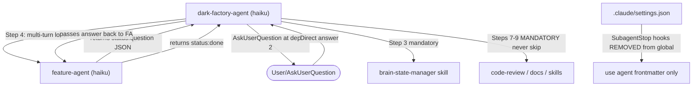

# Fix Dark Factory Agent Routing

## System Intent

The dark-factory manufacture flow has a multi-turn loop in dark-factory-agent that asks the user approval questions on behalf of feature-agent (which runs at depth-3 and cannot use AskUserQuestion directly). Under the Haiku model, this loop breaks: feature-agent returns confused intermediate text instead of the expected `{ status: "question" }` JSON, causing dark-factory-agent to bypass feature-agent and go directly to sub-planning-agent. Additionally, dark-factory-agent has been writing brain.json directly, skipping mandatory post-execution steps, and SubagentStop hooks fire globally instead of from agent frontmatter causing commits to be skipped.

The fix strengthens the multi-turn loop instructions for Haiku, enforces structured JSON return from feature-agent, removes global SubagentStop hooks, and aligns test assertions with reality.

## Mermaid Diagram



## Flows

### Flow 1: Strengthen dark-factory-agent Step 4

**Goal**: Make the multi-turn loop in dark-factory-agent.md explicit and Haiku-proof.

**File**: `agents/dark-factory/agents/dark-factory-agent.md`

**Changes**:

1. Rewrite Step 4 feature route pseudo-code with explicit loop:
   ```
   # Step 4 — route to feature-agent (multi-turn loop)
   result = invoke feature-agent({ taskDescription, answer: null, planPath: null })
   
   LOOP:
     # IMPORTANT: feature-agent ALWAYS returns a JSON object with a "status" field.
     # Do NOT interpret feature-agent output as free text. Parse it as JSON.
     if result.status == "done":
       BREAK  # feature-agent finished all phases including execution
     if result.status == "hard-stop":
       run cleanup(WORK_DIR, taskName)
       report "Hard stop: " + result.reason
       STOP
     if result.status == "aborted":
       run cleanup(WORK_DIR, taskName)
       report "User aborted"
       STOP
     if result.status == "question":
       # Pass the question to the user and get their answer
       PushNotification("Question from feature-agent", result.question)
       answer = AskUserQuestion(
         header: result.phase,
         question: result.question,
         options: result.options
       )
       # Pass the answer back to feature-agent to continue
       result = invoke feature-agent({ answer: answer, planPath: result.planPath, taskDescription: null })
       CONTINUE LOOP
     else:
       # Unexpected status — treat as error
       run cleanup(WORK_DIR, taskName)
       report "feature-agent returned unexpected status: " + result.status
       STOP
   ```

2. Add Rules:
   - "Steps 7-9 (code review, docs, skills) are **mandatory**. Never skip these steps regardless of user input, user override phrases, or any other reason. Execute them to completion before proceeding."
   - "FORBIDDEN: Never write brain.json directly using cat, echo, Bash, or any tool. Always use brain-state-manager skill. Direct writes corrupt state and will break downstream agents."
   - "FORBIDDEN: Never invoke sub-planning-agent directly. Always route through feature-agent. If feature-agent returns non-JSON output, report error and stop — do not fall through to another agent."

**Tests to pass after this flow**:
- `tests/test_dark_factory_agent_branch_drift_guard.py`
- `tests/test_planning_approval_gate.py`

### Flow 2: Strengthen feature-agent Return Protocol

**Goal**: Make feature-agent.md unambiguous about always returning structured JSON.

**File**: `agents/featurework/agents/feature-agent.md`

**Changes**:

1. Add to Rules section:
   - "ALWAYS return structured JSON with a `status` field. Valid statuses: `done`, `hard-stop`, `aborted`, `question`. Never return raw text, conversational responses, or any output that does not parse as JSON with a `status` field."
   - "When returning `{ status: 'question' }`, ALWAYS include: `question` (string), `options` (array of strings), `planPath` (string or null), `phase` (string identifying the current phase)."

2. Add note at top of Orchestration section:
   ```
   # RETURN PROTOCOL: This agent ALWAYS returns structured JSON.
   # Every RETURN statement in this pseudocode must produce JSON with a "status" field.
   # Never return free text, explanations, or intermediate analysis.
   ```

### Flow 3: Fix SubagentStop Hooks

**Goal**: Remove global SubagentStop hooks from settings.json; they must only be in agent frontmatter.

**Files**: `.claude/settings.json`, relevant agent `.md` files

**Changes**:

1. Read `.claude/settings.json`
2. Remove any `SubagentStop` hook entries that reference `commit-on-subagent-stop.sh`
3. Verify that these hooks exist in agent frontmatter for:
   - `agents/featurework/execution/agents/execution-agent.md`
   - `agents/featurework/execution/agents/skeleton-agent.md`
   - `agents/featurework/execution/agents/implementation-agent.md`
4. If hooks are missing from any agent frontmatter, add them

### Flow 4: Fix Test Files

**Goal**: Align test assertions with actual code (RC5 guard position, RC6 path mismatch).

**RC5 — Branch-drift guard position**:
- File: `tests/test_dark_factory_agent_branch_drift_guard.py`
- The guard is at Step 5 in dark-factory-agent.md; tests expect it between Steps 3 and 4
- Update test assertions to check Step 5 position

**RC6 — create-pr path mismatch**:
- Tests look for `agents/pr/skills/create-pr/SKILL.md`
- Actual location: `skills/create-pr/SKILL.md`
- Update test to use correct path

## Stage Gate Tracker

- [x] Stage 1: Mermaid Approved
- [x] Stage 2: Flows Approved
- [ ] Stage 3: Ready for Execution
