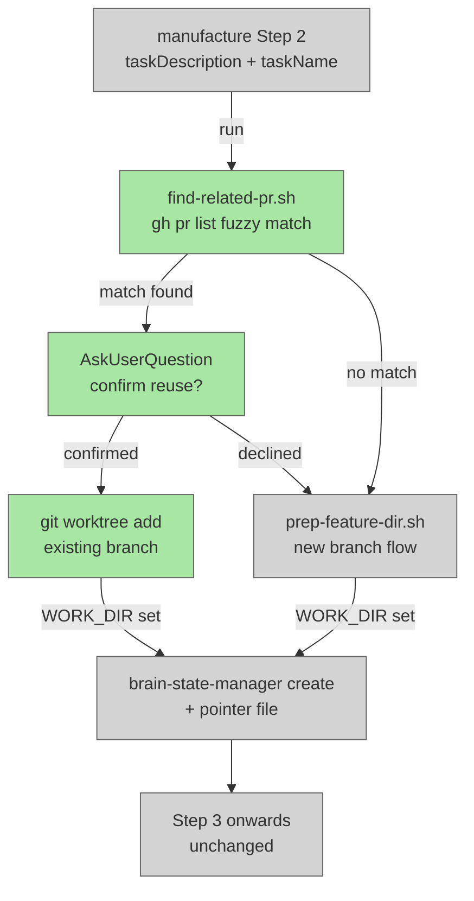

# PR Reuse Existing Branch

## System Intent

- What is being built: Before manufacture creates a new feature branch, it checks open GitHub PRs for a related one by fuzzy-matching the task description against existing PR titles and branch names. If a match is found, the user is prompted to confirm reuse. If confirmed, the existing branch is checked out in the worktree so pr-agent's Step 0b detection routes commits to the existing PR. If no match or user declines, the normal new-branch flow proceeds unchanged.
- Primary consumer(s): manufacture command (commands/manufacture.md); indirectly pr-agent via Step 0b existing-PR detection
- Boundary (black-box scope only): Step 2 of manufacture.md and a new helper script `find-related-pr.sh`. No changes to prep-feature-dir.sh, pr-agent, or brain-state-manager.

## Stage Gate Tracker

- [ ] Stage 1 Mermaid approved
- [ ] Stage 2 Flows approved
- [ ] Stage 3 Logs + Deployment approved or skipped

## Mermaid Diagram



ONCE YOU GET APPROVAL FROM THE DEVELOPER, DELETE THIS LINE AND UPDATE THE STAGE GATE TRACKER

## Flows

- Flow naming rule: ``### Flow: `<flowname>` ``
- `N/A` for test files means explicit no-test-required waiver (not a missing mapping).

### Global Types

```txt
StandardError {
  message: string (human-readable description of what went wrong)
}

PRMatch {
  branchName: string   (e.g. "feature/add-oauth")
  prUrl: string        (e.g. "https://github.com/org/repo/pull/42")
  prTitle: string      (human-readable title of the matched PR)
}
```

### Flow: `relatedPrFoundAndConfirmed`

- Test files: `N/A`
- Core files: `commands/manufacture.md`, `agents/dark-factory/scripts/find-related-pr.sh`

#### Types

```txt
FindRelatedPrInput {
  taskDescription: string (required — verbatim user task request)
}

FindRelatedPrOutput {
  match: PRMatch | null
}
```

#### Paths

| path | input | output | path-type | notes | updated |
| --- | --- | --- | --- | --- | --- |
| `relatedPrFoundAndConfirmed.match-confirmed` | `FindRelatedPrInput` | worktree on existing branch, WORK_DIR set | `happy path` | pr-agent Step 0b will detect existing PR and push to it | |
| `relatedPrFoundAndConfirmed.match-declined` | `FindRelatedPrInput` | falls through to normal new-branch flow | `alternate` | user saw match but declined reuse | |
| `relatedPrFoundAndConfirmed.no-match` | `FindRelatedPrInput` | falls through to normal new-branch flow | `alternate` | find-related-pr.sh returned empty | |
| `relatedPrFoundAndConfirmed.script-error` | `FindRelatedPrInput` | `StandardError` | `error` | gh CLI unavailable or repo not found; treat as no-match and proceed | |

#### Pseudocode

```
# find-related-pr.sh <taskDescription>
# Outputs: BRANCH=<branch> URL=<url> TITLE=<title>  OR  empty stdout on no match

taskDescription="$1"
# Normalize to lowercase keywords, strip punctuation
keywords=$(echo "$taskDescription" | tr '[:upper:]' '[:lower:]' | tr -cs 'a-z0-9 ' ' ' | tr -s ' ')

# Fetch all open PRs with title, headRefName, url
prs=$(gh pr list --state open --limit 50 --json title,headRefName,url 2>/dev/null) || exit 0

# For each PR: score = count of keyword hits in (title + branchName)
# Select best match if score >= 2 keywords match
best=$(echo "$prs" | python3 -c "
import sys, json, re
data = json.load(sys.stdin)
keywords = set(\"\"\"$keywords\"\"\".split())
best = None
best_score = 0
for pr in data:
    candidate = (pr['title'] + ' ' + pr['headRefName']).lower()
    score = sum(1 for kw in keywords if kw in candidate and len(kw) > 2)
    if score >= 2 and score > best_score:
        best_score = score
        best = pr
if best:
    print(f\"BRANCH={best['headRefName']}\")
    print(f\"URL={best['url']}\")
    print(f\"TITLE={best['title']}\")
")

echo "$best"
```

```
# manufacture.md Step 2 (modified):

PROJECT_DIR = bash("git rev-parse --show-toplevel")
PLUGIN_ROOT = <resolve as before>

# NEW: check for related open PR before creating a new branch
relatedPrOutput = bash("\"$PLUGIN_ROOT/agents/dark-factory/scripts/find-related-pr.sh\" \"$taskDescription\"") || ""
EXISTING_BRANCH = extract BRANCH=<value> from relatedPrOutput  (or empty)
EXISTING_URL    = extract URL=<value>    from relatedPrOutput  (or empty)
EXISTING_TITLE  = extract TITLE=<value>  from relatedPrOutput (or empty)

if EXISTING_BRANCH is not empty:
  answer = AskUserQuestion(
    header: "Reuse Existing PR?",
    question: "Found a related open PR that may match your task.\n\nPR: \"" + EXISTING_TITLE + "\"\nBranch: " + EXISTING_BRANCH + "\nURL: " + EXISTING_URL + "\n\nReuse this branch (new commits will be pushed to the existing PR) or create a fresh branch?",
    options: ["Reuse existing branch", "Create new branch"]
  )
  if answer == "Reuse existing branch":
    USE_EXISTING = true
  else:
    USE_EXISTING = false
else:
  USE_EXISTING = false

if USE_EXISTING:
  # Derive WORK_DIR path (mirrors prep-feature-dir.sh naming convention)
  GIT_ROOT = PROJECT_DIR
  PROJECT_NAME = basename(GIT_ROOT)
  # EXISTING_BRANCH is e.g. "feature/add-oauth"; taskName for worktree dir is the slug after "feature/"
  existingTaskName = EXISTING_BRANCH after stripping leading "feature/"
  WORKTREE_NAME = PROJECT_NAME + "-" + existingTaskName
  WORK_DIR = GIT_ROOT + "/../" + WORKTREE_NAME

  # Check if worktree already exists for this branch
  worktreeExists = bash("git -C \"$GIT_ROOT\" worktree list | grep -qF \"$WORKTREE_NAME\" && echo yes || echo no")
  if worktreeExists == "no":
    bash("git -C \"$GIT_ROOT\" pull origin main || true")
    bash("git -C \"$GIT_ROOT\" worktree add \"$WORK_DIR\" \"$EXISTING_BRANCH\"")
  # taskName for brain.json should reflect the existing branch slug
  taskName = existingTaskName
else:
  prepOutput = bash("\"$PLUGIN_ROOT/agents/dark-factory/scripts/prep-feature-dir.sh\" \"$taskName\"")
  WORK_DIR = extract WORK_DIR=<value> line from prepOutput
  If script fails: report error and STOP

# Step 3 — create brain.json (unchanged, uses WORK_DIR and taskName as set above)
invoke brain-state-manager({ ... })
bash("printf '%s' \"$WORK_DIR\" > /tmp/dark-factory-work-dir")
# ... rest of manufacture unchanged
```

ONCE YOU GET APPROVAL FROM THE DEVELOPER, DELETE THIS LINE AND UPDATE THE STAGE GATE TRACKER

### Flow: `noMatchOrDeclined`

- Test files: `N/A`
- Core files: `commands/manufacture.md`, `agents/dark-factory/scripts/find-related-pr.sh`

#### Types

```txt
(same as relatedPrFoundAndConfirmed)
```

#### Paths

| path | input | output | path-type | notes | updated |
| --- | --- | --- | --- | --- | --- |
| `noMatchOrDeclined.no-open-prs` | `FindRelatedPrInput` | prep-feature-dir.sh runs, new branch created | `happy path` | find-related-pr.sh returns empty; falls through unchanged | |
| `noMatchOrDeclined.gh-unavailable` | `FindRelatedPrInput` | prep-feature-dir.sh runs, new branch created | `happy path` | gh CLI error treated as no-match; `|| true` guards the call | |
| `noMatchOrDeclined.user-declined` | `FindRelatedPrInput` | prep-feature-dir.sh runs, new branch created | `happy path` | user was shown match but chose "Create new branch" | |

#### Pseudocode

```
# No additional pseudocode — falls through to the normal prep-feature-dir.sh call
# which is unchanged from the current manufacture.md Step 2.
```

ONCE YOU GET APPROVAL FROM THE DEVELOPER, DELETE THIS LINE AND UPDATE THE STAGE GATE TRACKER

## Logs

| Source | Location |
|--------|----------|
| find-related-pr.sh | stderr only; stdout is machine-parseable key=value pairs |
| manufacture Step 2 | inline manufacture orchestration output |

## Deployment

- Mechanism: `local only`
- Deploy command:
  ```bash
  /dark-factory:install
  ```
- Notes: No external services required. Requires `gh` CLI authenticated to the repo. The fuzzy-match threshold (score >= 2 keywords, keyword length > 2) can be tuned in find-related-pr.sh without touching manufacture.md.

ONCE YOU GET APPROVAL FROM THE DEVELOPER, DELETE THIS LINE AND UPDATE THE STAGE GATE TRACKER
