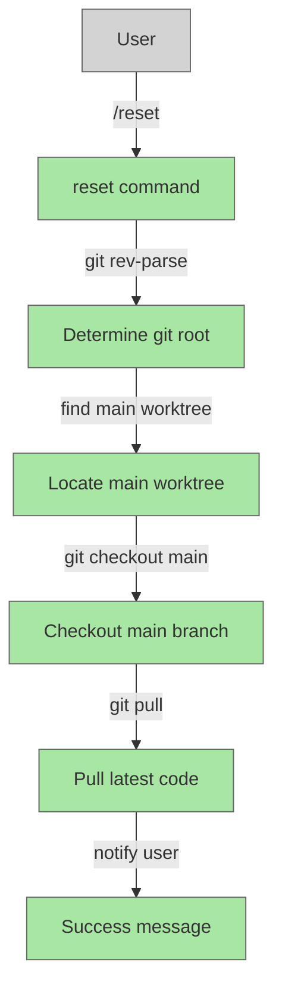

# Add Reset Command

## System Intent

- What is being built: A new `/reset` slash command for Claude Code that quickly returns to the main branch in the main worktree and pulls the latest code. This command is useful for cleaning up after feature development, providing a fast way to sync back to the main branch without manual git operations.
- Primary consumer(s): Dark-factory developers/users who want to return to main and refresh their code state
- Boundary (black-box scope only): Git operations (branch checkout, pulls), file system (worktree navigation)

## Stage Gate Tracker

- [x] Stage 1 Mermaid approved
- [x] Stage 2 Flows approved
- [x] Stage 3 Logs + Deployment approved or skipped

## Mermaid Diagram



## Flows

### Global Types

```txt
StandardError {
  message: string (human-readable description of what went wrong)
}
```

### Flow: `resetToMain`
- Test files: `tests/test_reset_command.py`
- Core files: `commands/reset.md`

#### Types

```txt
ResetInput {
  (no input parameters)
}

ResetOutput {
  message: string (success message confirming reset completed)
}
```

#### Paths

| path | input | output | path-type | notes | updated |
| --- | --- | --- | --- | --- | --- |
| `resetToMain.success` | `ResetInput` | `ResetOutput` | `happy path` | Returns to main worktree, checks out main branch, pulls latest | Y |
| `resetToMain.not-git-repo` | `ResetInput` | `StandardError` | `error` | Current directory is not in a git repository | Y |
| `resetToMain.no-main-worktree` | `ResetInput` | `StandardError` | `error` | Main worktree cannot be found | Y |
| `resetToMain.checkout-failed` | `ResetInput` | `StandardError` | `error` | Checkout to main branch fails (e.g., dirty working directory) | Y |
| `resetToMain.pull-failed` | `ResetInput` | `StandardError` | `error` | Pull command fails (e.g., merge conflicts) | Y |

#### Pseudocode

```
Function resetToMain():
  1. Get the git root directory using `git rev-parse --show-toplevel`
     - If fails: return error "not in a git repository"
  2. Determine the main worktree directory:
     - List all worktrees with `git worktree list`
     - Find the worktree for branch "main" or that is the primary worktree (has no branch prefix in path)
     - If not found: return error "main worktree not found"
  3. Change directory to the main worktree
  4. Check out the main branch with `git checkout main`
     - If fails: return error with the git failure message
  5. Pull latest code with `git pull origin main`
     - If pull fails with conflicts: return error with the git failure message
     - If pull succeeds: return success message
  6. Send user notification: "Reset complete: returned to main branch in main worktree, pulled latest code"
```

## Logs

N/A - local CLI command, no logging infrastructure required

## Deployment

- Mechanism: `local only` (slash command installed as part of dark-factory plugin)
- Installation: Command file (`commands/reset.md`) is automatically registered as `/reset` slash command by Claude Code plugin system
- Notes: No additional deployment needed; follows standard dark-factory command registration pattern

