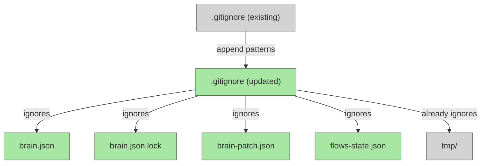

# Add .gitignore for Transient Agent Files

## System Intent

- What is being built: An updated root `.gitignore` that covers all transient files created by dark-factory agents during manufacture runs, so they are never accidentally committed to git.
- Primary consumer(s): All contributors and the dark-factory CI/CD pipeline — anyone running `git status` or `git add` after a manufacture run.
- Boundary (black-box scope only): Only the root `.gitignore` file is modified. No agent logic, scripts, or documentation changes.

## Stage Gate Tracker

- [x] Stage 1 Mermaid approved
- [x] Stage 2 Flows approved
- [x] Stage 3 Logs + Deployment approved or skipped

## Mermaid Diagram

> Use the skill at `skills/create-mermaid-diagram/SKILL.md` to generate this diagram.



## Flows

- Flow naming rule: ``### Flow: `<flowname>` ``
- `N/A` for test files means explicit no-test-required waiver (not a missing mapping).

### Global Types

```txt
StandardError {
  message: string (human-readable description of what went wrong)
}
```

### Flow: `updateGitignore`
- Test files: `N/A`
- Core files: `.gitignore`

#### Types

```txt
GitignoreUpdate {
  patternsAdded: string[]  (list of new patterns appended to .gitignore)
}
```

#### Paths

| path | input | output | path-type | notes | updated |
| --- | --- | --- | --- | --- | --- |
| `updateGitignore.success` | existing `.gitignore` | `.gitignore` with transient patterns added | `happy path` | patterns appended under a `# dark-factory transient files` comment block | |

#### Pseudocode

```
# Read existing .gitignore (already has: tmp/, __pycache__/, *.pyc, *.pyo)
# Append the following block:

# dark-factory transient files
brain.json
brain.json.lock
brain-patch.json
flows-state.json
```

#### Inventory of transient files and rationale

| File / Pattern | Created by | Lifecycle | Why ignore |
|---|---|---|---|
| `brain.json` | `dark-factory-agent` after `prep-feature-dir.sh` | Deleted at end of manufacture by `rm -f $WORK_DIR/brain.json` | Per-run worktree state; only meaningful during a live session; must not be committed |
| `brain.json.lock` | `flock` inside pre/post hooks | Deleted with brain.json | Byte-range lockfile; OS artifact; not meaningful outside its process |
| `brain-patch.json` | Sub-agents (feature-agent, pr-agent, debugger-agent, etc.) | Deleted by `post-tool-use-hook.sh` after merge | Ephemeral output patch; merged into brain.json immediately; should never persist |
| `flows-state.json` | `feature-agent` during planning phase | Deleted after all flows approved | Tracks per-flow approval during one planning session; not a project artifact |
| `tmp/` | Various agent scripts | Ad-hoc scratch space | Already in .gitignore; no change needed |

#### Files explicitly NOT added to .gitignore

| File | Reason |
|---|---|
| `metrics.csv` | Permanent running total of manufacture metrics; explicitly documented as "Do not gitignore" in `docs/docs/metrics-csv-tracking.md` |


## Logs

| Source | Location |
|--------|----------|
| N/A | No runtime logs for a .gitignore change |

## Deployment

- Mechanism: `local only`
- Deploy command:
  ```bash
  # No deployment — just edit .gitignore at the repo root
  ```
- Notes: Change takes effect immediately for any `git status` / `git add` invocation after the file is saved.


## Handoff to Related Plan Reconciliation

After all stages are approved, apply `.agent/skills/reconcile-plans/SKILL.md` to propagate contract updates across linked plans.
