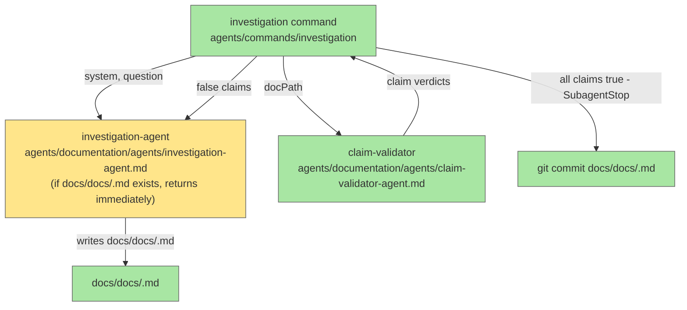

# Add Investigation-Agent Flow to Manufacturer Pipeline

## System Intent

- What is being built: A standalone dark-factory command (`investigation`) that runs investigation-agent to generate system documentation, then runs a claim-validator loop to verify every factual claim in the generated doc against actual source code, feeding false claims back to investigation-agent for correction until all claims pass. When the loop completes, the resulting docs file is committed to the repo via a `SubagentStop` hook declared in the command's YAML frontmatter (processed by `gen-hooks`). It is its own self-contained command flow — not part of the manufacture pipeline — and does not open a PR.
- Primary consumer(s): Developers who want to generate and validate system documentation on demand by running `/dark-factory:investigation <system>` directly from the CLI.
- Output file path convention: investigation-agent writes documentation to `docs/docs/<system>.md` in the project root, following the existing convention used by all documentation in this repo. For example, documenting the `repair-agent` system produces `docs/docs/repair-agent.md`. The `SubagentStop` hook committed at the end of the command targets this specific file path — it runs `git add docs/docs/<system>.md && git commit` so only the verified doc is committed, not any other workspace changes.
- Boundary (black-box scope only): The command lives in `agents/commands/` (like other dark-factory commands). It invokes `investigation-agent` and the claim-validator loop internally. The only external side effects are: writing/updating `docs/docs/<system>.md` and committing that specific file via a `SubagentStop` hook. It does not touch `dark-factory-agent`, `feature-agent`, `execution-agent`, or the PR pipeline. No `SubagentStop` hook is written to `hooks/hooks.json` — the hook is declared in the command's own YAML frontmatter and registered by running `gen-hooks`.

<!-- investigation-agent invocation skipped — system is already well-understood from reading agents/documentation/agents/investigation-agent.md and related files -->

## Stage Gate Tracker

- [x] Stage 1 Mermaid approved
- [x] Stage 2 Flows approved
- [x] Stage 3 Logs + Deployment approved or skipped

## Mermaid Diagram

> Use the skill at `skills/create-mermaid-diagram/SKILL.md` to generate this diagram.



## Flows

- Flow naming rule: ``### Flow: `<flowname>` ``
- `N/A` for test files means explicit no-test-required waiver (not a missing mapping).

### Global Types

```txt
StandardError {
  message: string (human-readable description of what went wrong)
}

Claim {
  text: string (the factual statement extracted from the doc)
  verified: boolean
  evidence: string | null (source file path + line that confirms or refutes)
}

ClaimValidatorResult {
  allVerified: boolean
  falseClaims: Claim[] (empty when allVerified is true)
}
```

### Flow: `investigationCommand`

- Test files: `tests/test_investigation_command.py`
- Core files:
  - `agents/commands/investigation` (new)
  - `agents/documentation/agents/investigation-agent.md` (existing, unchanged)
  - `agents/documentation/agents/claim-validator-agent.md` (new)

#### Types

```txt
InvestigationCommandInput {
  system: string (required — name of the system to document)
  question: string | null (optional — specific aspect to focus on)
}

InvestigationCommandOutput {
  docPath: string (absolute path to the verified docs/docs/<system>.md)
  iterations: number (how many validator → investigation-agent cycles ran)
}
```

#### Paths

| path | input | output | path-type | notes | updated |
| --- | --- | --- | --- | --- | --- |
| `investigationCommand.success` | `InvestigationCommandInput` | `InvestigationCommandOutput` | `happy path` | all claims verify on first pass; SubagentStop hook commits doc | |
| `investigationCommand.iterative-correction` | `InvestigationCommandInput` | `InvestigationCommandOutput` | `happy path` | one or more false-claim feedback cycles before all claims pass | |
| `investigationCommand.max-iterations-exceeded` | `InvestigationCommandInput` | `StandardError` | `error` | validator cycles hit hard cap (5) without full verification | |

#### Pseudocode

```
investigationCommand(system, question):
  maxIterations = 5
  iterations = 0

  # Step 1: Generate initial documentation
  docPath = invoke investigation-agent(system, question)

  loop:
    iterations += 1
    if iterations > maxIterations:
      RETURN StandardError("Max validation iterations exceeded for system: " + system)

    # Step 2: Run claim-validator-agent — it extracts claims AND verifies them internally
    result = invoke claim-validator-agent(docPath)  # returns ClaimValidatorResult

    # Step 3: If all verified, commit via SubagentStop hook and finish
    if result.allVerified:
      trigger SubagentStop  # hook runs: git add docs/docs/<system>.md && git commit
      RETURN InvestigationCommandOutput(docPath, iterations)

    # Step 4: Feed false claims back to investigation-agent for correction
    falseSummary = format result.falseClaims as bullet list with evidence
    docPath = invoke investigation-agent(system, question, corrections=falseSummary)

  # unreachable — loop exits via return
```

---

### Flow: `claimValidation`

- Test files: `tests/test_claim_validation.py`
- Core files:
  - `agents/documentation/agents/claim-validator-agent.md` (new)

#### Types

```txt
ClaimValidatorInput {
  docPath: string (absolute path to a docs/docs/<system>.md file)
}

ClaimValidatorResult {
  allVerified: boolean
  falseClaims: Claim[] (those where evidence contradicts or is absent)
}
```

#### Paths

| path | input | output | path-type | notes | updated |
| --- | --- | --- | --- | --- | --- |
| `claimValidation.all-true` | `ClaimValidatorInput` | `ClaimValidatorResult` with empty falseClaims | `happy path` | every extracted claim confirmed against source | |
| `claimValidation.some-false` | `ClaimValidatorInput` | `ClaimValidatorResult` with falseClaims populated | `happy path` | caller (investigationCommand) feeds falseClaims back to investigation-agent | |
| `claimValidation.doc-not-found` | `ClaimValidatorInput` | `StandardError` | `error` | docPath does not exist | |

#### Pseudocode

```
claimValidation(docPath):
  if not file_exists(docPath):
    RETURN StandardError("Doc not found: " + docPath)

  content = read(docPath)

  # Internal step 1: Extract factual claims from the doc
  # Looks for: file paths, agent/tool names, behavioral assertions, config values
  claims = []
  for each sentence/bullet in content:
    if is_factual_claim(sentence):
      claims.append(Claim(text=sentence, verified=false, evidence=null))

  # Internal step 2: Verify each claim against source code one-by-one
  falseClaims = []
  for each claim in claims:
    evidence = search_codebase(claim.text, projectRoot)
    # Uses agentic search (agent tools) to look for referenced files, agent names, config keys,
    # or behavioral patterns in source files
    if evidence confirms claim:
      claim.verified = true
      claim.evidence = evidence
    else:
      claim.verified = false
      claim.evidence = evidence  # may be null or a contradicting snippet
      falseClaims.append(claim)

  RETURN ClaimValidatorResult(
    allVerified = len(falseClaims) == 0,
    falseClaims = falseClaims
  )
```

## Logs

| Source | Location |
|--------|----------|
| investigation-agent iterations | written to calling agent's stdout (no persistent log) |
| false claims per cycle | included inline in the correction prompt fed back to investigation-agent |

## Deployment

- Mechanism: `local only`
- Deploy command:
  ```bash
  # No separate deploy step — new skill files are loaded by agents at invocation time.
  # Install plugin after changes:
  /dark-factory:install
  ```
- Notes: New files (`claim-validator-agent.md`) are picked up automatically once written to `agents/documentation/agents/`. No changes to settings.json or hooks are required beyond running `gen-hooks` to register the SubagentStop hook declared in the investigation command's YAML frontmatter.
