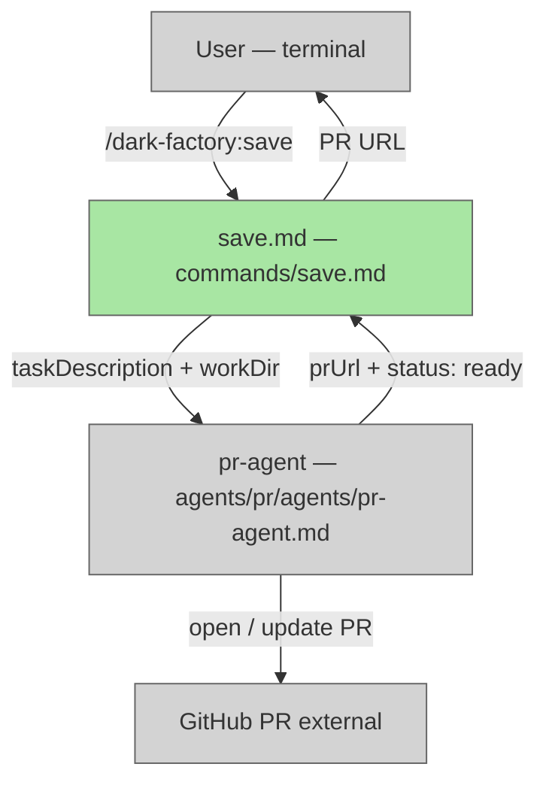

# Add /dark-factory:save Command

## System Intent

- What is being built: A new `/dark-factory:save` slash command that commits the current working tree and opens (or updates) a PR — in one step, with no code review, doc update, or skill update steps. It is the user-facing shortcut to hand off staged work to pr-agent.
- Primary consumer(s): Developers who have already made manual changes in a worktree and want to open a PR without running the full execute/repair/debug pipeline.
- Boundary (black-box scope only): `commands/save.md` contains all instructions inline; it delegates directly to pr-agent. The three existing command-agent docs (`execute-command-agent.md`, `repair-command-agent.md`, `debug-command-agent.md`) are updated to mention `/dark-factory:save` as the manual PR trigger pattern — no behavioral change to those agents.

## Stage Gate Tracker

- [x] Stage 1 Mermaid approved
- [x] Stage 2 Flows approved
- [x] Stage 3 Logs + Deployment approved or skipped

## Mermaid Diagram

> Use the skill at `skills/create-mermaid-diagram/SKILL.md` to generate this diagram.




## Flows

- Flow naming rule: ``### Flow: `<flowname>` ``
- `N/A` for test files means explicit no-test-required waiver (not a missing mapping).

### Global Types

```txt
StandardError {
  message: string (human-readable description of what went wrong)
}
```

### Flow: `saveCommand`

- Test files: N/A
- Core files:
  - `commands/save.md` (new)
  - `agents/dark-factory/agents/execute-command-agent.md` (modified — doc reference only)
  - `agents/dark-factory/agents/repair-command-agent.md` (modified — doc reference only)
  - `agents/dark-factory/agents/debug-command-agent.md` (modified — doc reference only)

#### Types

```txt
SaveInput {
  taskDescription: string (optional — description used as PR body; defaults to git diff summary if absent)
}

SaveOutput {
  prUrl: string (URL of the opened or updated PR)
  status: "ready" (pr-agent always stops here; does not merge)
}
```

#### Paths

| path | input | output | path-type | notes | updated |
| --- | --- | --- | --- | --- | --- |
| `saveCommand.success` | `SaveInput` | `SaveOutput` | `happy path` | pr-agent opens PR, watches CI, resolves comments | |
| `saveCommand.pr-exists` | `SaveInput` | `SaveOutput` | `happy path` | pr-agent detects existing PR on branch, commits + pushes, updates it | |
| `saveCommand.pr-agent-error` | `SaveInput` | `StandardError` | `error` | pr-agent CI failure or comment resolution failure; user sees error message | |

#### Pseudocode

```
saveCommand(taskDescription?):

  # Step 1 — resolve workDir
  workDir = bash("git rev-parse --show-toplevel")

  # Step 2 — delegate to pr-agent
  # pr-agent handles: commit, push, open/update PR, CI watch, comment resolution
  result = invoke pr-agent({
    taskDescription: taskDescription ?? "Save current changes",
    workDir: workDir
  })

  if result.status != "ready":
    STOP with error result.reason

  # Step 3 — report
  Report: "Saved. PR: " + result.prUrl
  STOP

# --- Agent doc updates (execute, repair, debug command agents) ---
# In the ## Rules section of each agent, add:
#   "If the automated pipeline was skipped or the user wants to open a PR manually,
#    they can run /dark-factory:save as a shortcut to commit and open/update a PR."
# No behavioral change — documentation/reference addition only.
```


## Logs

| Source | Location |
|--------|----------|
| save command | stdout / Claude Code terminal session |

## Deployment

- Mechanism: `local only`
- Deploy command:
  ```bash
  # No deploy step — command file is picked up by Claude Code plugin loader automatically
  # after plugin reinstall if needed: /dark-factory:install
  ```
- Notes: `commands/save.md` must be placed directly in `commands/` (not a subdirectory) for the plugin loader to register it. See skill `plugin-command-must-be-in-commands-dir`.

