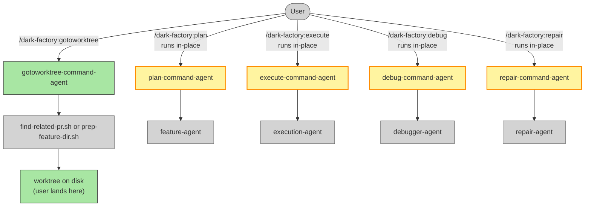

# Add gotoworktree Command and Remove Worktree Prep from Command Agents

## System Intent

- **What is being built:** A new standalone `/dark-factory:gotoworktree` command that sets up a worktree and leaves the user there. It accepts a PR number, task name, or description — finds or creates the matching worktree and pulls main/master. Separately, the four command agents (plan, execute, debug, repair) have their inline worktree-prep logic removed; they simply run in whatever directory they are called from.
- **Primary consumer(s):** End users who want to get into a worktree before running a command. The command agents are not consumers — they no longer manage worktrees at all.
- **Boundary:** No changes to worker agents (feature-agent, execution-agent, etc.) or existing scripts. Reuses `prep-feature-dir.sh` and `find-related-pr.sh`.

---

## Stage Gate Tracker

- [ ] Stage 1 Mermaid approved
- [ ] Stage 2 Flows approved

---

## Mermaid Diagram



ONCE YOU GET APPROVAL FROM THE DEVELOPER, DELETE THIS LINE AND UPDATE THE STAGE GATE TRACKER

---

## Flows

- `N/A` for test files means explicit no-test-required waiver.

### Global Types

```txt
StandardError {
  message: string
}
```

---

### Flow: `gotoworktreeCommand`

- Test files: `N/A`
- Core files:
  - `commands/gotoworktree.md` (new)
  - `agents/dark-factory/agents/gotoworktree-command-agent.md` (new)

#### Paths

| path | input | output | path-type | notes |
| --- | --- | --- | --- | --- |
| `gotoworktreeCommand.reuse-local` | any input | confirmation message | happy path | matching local worktree already exists; pull and report path |
| `gotoworktreeCommand.reuse-pr` | prNumber or description | confirmation message | happy path | open PR branch found; create worktree if absent, pull, report path |
| `gotoworktreeCommand.create-new` | taskName or description | confirmation message | happy path | no existing worktree/PR; create fresh via prep-feature-dir.sh, report path |
| `gotoworktreeCommand.no-input` | all null | `StandardError` | error | no input provided |
| `gotoworktreeCommand.prep-failure` | any | `StandardError` | error | prep-feature-dir.sh failed |

#### Pseudocode

```
gotoworktree-command-agent(prNumber, taskName, description):

  # Step 1 — validate input
  if prNumber is empty AND taskName is empty AND description is empty:
    report error: "Must provide prNumber, taskName, or description"
    STOP

  PROJECT_DIR = bash("git rev-parse --show-toplevel")
  PROJECT_NAME = basename(PROJECT_DIR)

  # Step 2 — derive taskName if not yet provided
  if taskName is empty:
    if prNumber is not empty:
      branchName = bash("gh pr view \"$prNumber\" --json headRefName --jq .headRefName")
      taskName = branchName after stripping leading "<prefix>/" (e.g. "feature/add-oauth" → "add-oauth")
    elif description is not empty:
      taskName = slugify(description)   # lowercase, hyphens, ≤30 chars

  # Step 3 — search for existing local worktree by taskName
  WORKTREE_NAME = PROJECT_NAME + "-" + taskName
  WORK_DIR = PROJECT_DIR + "/../" + WORKTREE_NAME
  if WORK_DIR exists and is a git worktree:
    bash("git -C \"$WORK_DIR\" fetch origin")
    bash("git -C \"$WORK_DIR\" pull origin main 2>/dev/null || git -C \"$WORK_DIR\" pull origin master || true")
    Report: "Worktree ready at: " + WORK_DIR
    STOP

  # Step 4 — search for open PR (by prNumber or description)
  if prNumber is not empty:
    prJson = bash("gh pr view \"$prNumber\" --json headRefName,url --jq '[.headRefName,.url]|@tsv'")
    EXISTING_BRANCH = first field of prJson
  else:
    relatedPrOutput = bash("bash \"${CLAUDE_PLUGIN_ROOT}/agents/dark-factory/scripts/find-related-pr.sh\" \"$description\"") || ""
    EXISTING_BRANCH = extract BRANCH= from relatedPrOutput

  if EXISTING_BRANCH is not empty:
    existingTaskName = EXISTING_BRANCH after stripping leading "<prefix>/" prefix
    WORK_DIR = PROJECT_DIR + "/../" + PROJECT_NAME + "-" + existingTaskName
    if WORK_DIR does not exist:
      bash("git -C \"$PROJECT_DIR\" pull origin main || true")
      bash("git -C \"$PROJECT_DIR\" worktree add \"$WORK_DIR\" \"$EXISTING_BRANCH\"")
    bash("git -C \"$WORK_DIR\" pull origin main 2>/dev/null || git -C \"$WORK_DIR\" pull origin master || true")
    Report: "Worktree ready at: " + WORK_DIR
    STOP

  # Step 5 — create new worktree via prep-feature-dir.sh
  prepOutput = bash("bash \"${CLAUDE_PLUGIN_ROOT}/agents/dark-factory/scripts/prep-feature-dir.sh\" \"$taskName\"")
  if script fails:
    report error: "Failed to create worktree: " + prepOutput
    STOP
  WORK_DIR = extract WORK_DIR=<value> from prepOutput
  Report: "Worktree ready at: " + WORK_DIR
  STOP
```

---

### Flow: `removeWorktreePrepFromCommandAgents`

- Test files: `N/A`
- Core files (modified):
  - `agents/dark-factory/agents/plan-command-agent.md`
  - `agents/dark-factory/agents/execute-command-agent.md`
  - `agents/dark-factory/agents/debug-command-agent.md`
  - `agents/dark-factory/agents/repair-command-agent.md`

#### What changes

Each command agent currently opens with worktree-prep logic: PR reuse detection, `AskUserQuestion` for reuse confirmation, `prep-feature-dir.sh` invocation, and `WORK_DIR`/`branchRef` derivation. **Delete all of that.** The agents run in-place — they assume they are already in the right working directory when invoked.

Any remaining references to `WORK_DIR`, `branchRef`, `PROJECT_DIR`, `taskName` that were set by the worktree-prep block must also be removed or replaced with `bash("git rev-parse --show-toplevel")` where the project dir is still needed for post-execution steps (code review, PR, cleanup).

#### Pattern (applied to all four agents)

```
# REMOVE entirely from each agent:
#   - PROJECT_DIR / relatedPrOutput / EXISTING_BRANCH / EXISTING_URL / EXISTING_TITLE derivation
#   - AskUserQuestion for PR reuse
#   - USE_EXISTING branch
#   - git worktree add calls
#   - prep-feature-dir.sh call
#   - WORK_DIR and branchRef derivation

# KEEP (or derive fresh):
#   - taskName derivation from input (still needed for cleanup and PR naming)
#   - PROJECT_DIR = bash("git rev-parse --show-toplevel")  ← wherever still needed
#   - All post-execution steps: code review, docs, skill update, PR, cleanup
```

---

## Files to Create

| File | Purpose |
|---|---|
| `commands/gotoworktree.md` | User-facing slash-command; delegates to `gotoworktree-command-agent` |
| `agents/dark-factory/agents/gotoworktree-command-agent.md` | Finds or creates worktree, pulls main/master, reports path |

## Files to Modify

| File | Change |
|---|---|
| `agents/dark-factory/agents/plan-command-agent.md` | Remove all worktree-prep logic; run in-place |
| `agents/dark-factory/agents/execute-command-agent.md` | Same |
| `agents/dark-factory/agents/debug-command-agent.md` | Same |
| `agents/dark-factory/agents/repair-command-agent.md` | Same |

---

## Deployment

- Mechanism: `local only` — Claude Code plugin.
- Deploy command: `/dark-factory:install`
