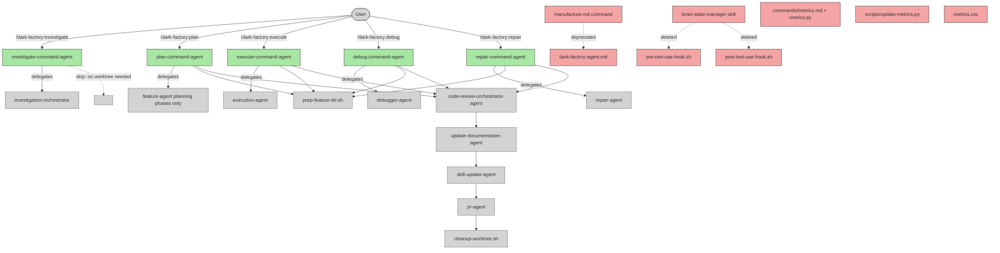

# Remove Orchestrator and Add Standalone Commands

## System Intent

- **What is being built:** Replace the monolithic `/dark-factory:manufacture` command (backed by `dark-factory-agent.md`) with five standalone user-facing commands, each of which directly manages its own worktree lifecycle and delegates to a single dedicated worker agent. The `brain.json` state system is removed entirely — no `brain-state-manager` skill is called, no `brain.json` file is created, and the hooks that read/write brain state are deleted. The metrics system (`update-metrics.py`, `metrics.csv`, `/dark-factory:metrics` command) is also deleted as it was tightly coupled to brain.json flush.
- **Primary consumer(s):** End users of the dark-factory Claude Code plugin who invoke commands via `/dark-factory:<name>`.
- **Boundary (black-box scope only):** This refactor is internal to the dark-factory plugin. Existing worker agents (`feature-agent`, `execution-agent`, `debugger-agent`, `repair-agent`, `investigation-agent`) are **not modified** except for minor updates to their `user-invocable` flag. Scripts and the PR lifecycle remain unchanged.

### Goal and Motivation

The current architecture routes every task — feature work, debugging, investigation, repair — through a single monolithic orchestrator (`dark-factory-agent`) that classifies the task, then branches based on the classification. This creates:
1. A single large agent responsible for too many concerns.
2. An implicit routing step the user has no visibility into.
3. Difficulty extending or testing individual paths in isolation.
4. The `manufacture` command name is non-descriptive from the user's perspective.

The replacement is a set of five focused commands. Each command is a thin orchestrator wrapper that:
- Preps its own isolated worktree (via existing scripts).
- Routes to exactly one worker agent (no classification needed, no brain state).
- Passes state (planFilePath, prUrl, workDir) directly between steps rather than via brain.json.
- Runs the standard post-execution pipeline: code review → docs → skill update → PR → cleanup.

The `/dark-factory:manufacture` command and `dark-factory-agent.md` are deprecated (not deleted immediately — see Migration section).

---

## Stage Gate Tracker

- [ ] Stage 1 Mermaid approved
- [ ] Stage 2 Flows approved
- [ ] Stage 3 Logs + Deployment approved or skipped

---

## Mermaid Diagram



ONCE YOU GET APPROVAL FROM THE DEVELOPER, DELETE THIS LINE AND UPDATE THE STAGE GATE TRACKER

---

## Flows

- Flow naming rule: ``### Flow: `<flowname>` ``
- `N/A` for test files means explicit no-test-required waiver (not a missing mapping).

### Global Types

```txt
StandardError {
  message: string (human-readable description of what went wrong)
}

WorktreeContext {
  WORK_DIR:    string   (absolute path to git worktree)
  taskName:    string   (slug, hyphens, ≤30 chars)
  PROJECT_DIR: string   (git root of main repo)
  branchRef:   string   (e.g. "feature/add-oauth")
}
```

State (planFilePath, prUrl) is passed directly between steps in local variables — no brain.json file is created or read.

---

### Flow: `investigateCommand`

- Test files: `N/A`
- Core files:
  - `commands/investigate.md` (new)
  - `agents/commands/investigation-orchestrator.md` (unchanged)

#### Types

```txt
InvestigateCommandInput {
  system:   string (required — name of system/topic to investigate)
  question: string (optional — specific aspect to focus on)
}

InvestigateCommandOutput {
  docPath:    string (absolute path to written doc)
  iterations: number
}
```

#### Paths

| path | input | output | path-type | notes |
| --- | --- | --- | --- | --- |
| `investigateCommand.success` | `InvestigateCommandInput` | `InvestigateCommandOutput` | happy path | doc written to `docs/docs/<system>.md`, committed via SubagentStop hook |
| `investigateCommand.error` | `InvestigateCommandInput` | `StandardError` | error | investigation-orchestrator returns error |

#### Pseudocode

```
investigate-command-agent(system, question):

  # No worktree needed — investigation always runs in-place on the project repo.
  # No brain.json, no PR, no cleanup.

  # Step 1 — delegate entirely to investigation-orchestrator
  result = invoke investigation-orchestrator({ system, question })

  if result.error:
    STOP with error: result.message

  # Step 2 — done
  Report: "Investigation complete. Doc written to: " + result.docPath
  STOP
```

**Key design decision:** `investigate-command-agent` does **not** create a worktree, write brain.json, run code review, or open a PR. Investigation is a read-and-document operation that runs directly on the project. The SubagentStop hook on `investigation-orchestrator` already commits the doc.

---

### Flow: `planCommand`

- Test files: `N/A`
- Core files:
  - `commands/plan.md` (new)
  - `agents/dark-factory/agents/plan-command-agent.md` (new)
  - `agents/featurework/agents/feature-agent.md` (unchanged — planning phases only)

#### Types

```txt
PlanCommandInput {
  taskDescription: string (required)
  taskName:        string (optional — derived from taskDescription if absent)
}

PlanCommandOutput {
  planPath: string (absolute path to approved plan file)
  prUrl:    string (URL of opened PR)
}
```

#### Paths

| path | input | output | path-type | notes |
| --- | --- | --- | --- | --- |
| `planCommand.success` | `PlanCommandInput` | `PlanCommandOutput` | happy path | plan fully approved, committed, PR opened |
| `planCommand.aborted` | `PlanCommandInput` | `StandardError` | error | user aborted at final approval gate |
| `planCommand.hard-stop` | `PlanCommandInput` | `StandardError` | error | feature-agent returned hard-stop |
| `planCommand.prep-failure` | `PlanCommandInput` | `StandardError` | error | prep-feature-dir.sh failed; no cleanup needed |
| `planCommand.drift-guard-failure` | `PlanCommandInput` | `StandardError` | error | branch has no commits ahead of main after execution |

#### Pseudocode

```
plan-command-agent(taskDescription, taskName):

  # Step 1 — derive taskName slug if not provided
  if taskName is empty:
    taskName = slugify(taskDescription)   # lowercase, hyphens, ≤30 chars

  # Step 2 — check for related open PR (PR reuse)
  PROJECT_DIR = bash("git rev-parse --show-toplevel")
  relatedPrOutput = bash("bash \"${CLAUDE_PLUGIN_ROOT}/agents/dark-factory/scripts/find-related-pr.sh\" \"$taskDescription\"") || ""
  EXISTING_BRANCH = extract BRANCH= from relatedPrOutput
  EXISTING_URL    = extract URL=    from relatedPrOutput
  EXISTING_TITLE  = extract TITLE=  from relatedPrOutput

  if EXISTING_BRANCH is not empty:
    answer = AskUserQuestion(
      header: "Reuse Existing PR?",
      question: "Found related open PR: \"" + EXISTING_TITLE + "\" (" + EXISTING_URL + "). Reuse branch '" + EXISTING_BRANCH + "' or create fresh?",
      options: ["Reuse existing branch", "Create new branch"]
    )
    USE_EXISTING = (answer == "Reuse existing branch")
  else:
    USE_EXISTING = false

  # Step 3 — prep worktree
  if USE_EXISTING:
    # strip "prefix/" from branch to get bare task name for worktree path
    existingTaskName = EXISTING_BRANCH after stripping leading "<anything>/" prefix
    WORK_DIR = PROJECT_DIR + "/../" + basename(PROJECT_DIR) + "-" + existingTaskName
    if worktree does not exist:
      bash("git -C \"$PROJECT_DIR\" pull origin main || true")
      bash("git -C \"$PROJECT_DIR\" worktree add \"$WORK_DIR\" \"$EXISTING_BRANCH\"")
    taskName = existingTaskName
    branchRef = EXISTING_BRANCH
  else:
    prepOutput = bash("bash \"${CLAUDE_PLUGIN_ROOT}/agents/dark-factory/scripts/prep-feature-dir.sh\" \"$taskName\"")
    WORK_DIR = extract WORK_DIR=<value> from prepOutput
    if script fails: report error and STOP (no cleanup needed)
    branchRef = "feature/" + taskName

  # Step 4 — drive feature-agent through planning phases ONLY
  # feature-agent runs draft_plan → mermaid → flows → final approval, then stops
  # before invoking execution-agent. We achieve this by stopping at plan approval.
  result = invoke feature-agent({ taskDescription, answer: null, planPath: null })

  LOOP:
    if result.status == "done":
      # feature-agent has approved the plan — planPath is in result.planPath
      BREAK
    if result.status == "aborted":
      run cleanup(WORK_DIR, taskName)
      report "Aborted: " + result.reason
      STOP
    if result.status == "hard-stop":
      run cleanup(WORK_DIR, taskName)
      report "Hard stop: " + result.reason
      STOP
    if result.status == "question":
      PushNotification("Question", result.question)
      answer = AskUserQuestion(header: result.phase, question: result.question, options: result.options)
      result = invoke feature-agent({ answer, planPath: result.planPath, taskDescription: null })
      CONTINUE LOOP

  # NOTE: feature-agent will drive planning → approval → call execution-agent internally
  # in its current form. For /plan we want ONLY the planning phases.
  # DESIGN DECISION: feature-agent is NOT changed. The /plan command stops after
  # feature-agent returns "done" — which happens after execution. For a "planning only"
  # experience the user should use /plan to get the plan file and /execute to run it.
  # Alternatively, feature-agent is modified to accept a planOnly flag (see Rules below).

  # Step 6 — branch drift guard
  driftCheck = bash("git -C \"$WORK_DIR\" log main.." + branchRef + " --oneline 2>&1")
  if driftCheck is empty:
    run cleanup(WORK_DIR, taskName)
    report error: "Branch-drift guard failed"
    STOP

  # Step 7 — planFilePath returned directly by feature-agent
  planFilePath = result.planPath

  # Step 8 — code review
  invoke code-review-orchestrator-agent({ planFilePath, codePath: WORK_DIR })

  # Step 9 — update docs
  invoke update-documentation-agent({ planFilePath, workDir: WORK_DIR })

  # Step 10 — skill update (non-fatal)
  try: invoke skill-update-agent({ planFilePath, workDir: WORK_DIR, taskSummary: taskDescription })
  catch: warn and continue

  # Step 11 — open PR; pr-agent returns prUrl directly
  prResult = invoke pr-agent({ planFilePath })
  prUrl = prResult.prUrl

  # Step 12 — cleanup (no brain.json to delete)
  bash("bash \"${CLAUDE_PLUGIN_ROOT}/agents/dark-factory/scripts/cleanup-worktree.sh\" \"$WORK_DIR\" \"$taskName\"")

  Report: "Plan approved and committed. PR: " + prUrl
  STOP
```

**Design note on `feature-agent` and planning-only:** The `/plan` command invokes `feature-agent` which in its current form calls `execution-agent` after plan approval. Two options:
1. Add a `planOnly: true` flag to `feature-agent` so it stops after the final approval gate without calling execution-agent. (Preferred — clean separation.)
2. Have `/plan` and `/execute` both call `feature-agent` but the plan command stops the loop before execution phase.

**Decision:** Modify `feature-agent` to accept `planOnly: true`. When set, after all flows are approved and the user presses "Approve and Execute", `feature-agent` skips `execution-agent` and returns `{ status: "done", planPath }` immediately.

---

### Flow: `executeCommand`

- Test files: `N/A`
- Core files:
  - `commands/execute.md` (new)
  - `agents/dark-factory/agents/execute-command-agent.md` (new)
  - `agents/featurework/execution/agents/execution-agent.md` (unchanged)

#### Types

```txt
ExecuteCommandInput {
  planPath: string (required — absolute path to approved plan file)
  taskName: string (optional — derived from plan file name if absent)
}

ExecuteCommandOutput {
  prUrl:    string
  workDir:  string
}
```

#### Paths

| path | input | output | path-type | notes |
| --- | --- | --- | --- | --- |
| `executeCommand.success` | `ExecuteCommandInput` | `ExecuteCommandOutput` | happy path | all flows implemented, PR opened |
| `executeCommand.hard-stop` | `ExecuteCommandInput` | `StandardError` | error | execution-agent hard-stop that user did not resume |
| `executeCommand.prep-failure` | `ExecuteCommandInput` | `StandardError` | error | worktree prep failed |
| `executeCommand.drift-guard-failure` | `ExecuteCommandInput` | `StandardError` | error | branch has no commits after execution |

#### Pseudocode

```
execute-command-agent(planPath, taskName):

  # Step 1 — validate plan file exists
  if planPath not found: report error and STOP

  # Step 2 — derive taskName from plan file name if not provided
  if taskName is empty:
    taskName = basename(planPath) without .md extension and date prefix
    # e.g. "2026-05-27-add-oauth.md" → "add-oauth"

  # Step 3 — prep worktree (same PR-reuse logic as plan-command-agent)
  PROJECT_DIR = bash("git rev-parse --show-toplevel")
  relatedPrOutput = bash("bash \"${CLAUDE_PLUGIN_ROOT}/agents/dark-factory/scripts/find-related-pr.sh\" \"$taskName\"") || ""
  EXISTING_BRANCH = extract BRANCH= from relatedPrOutput
  ... (same PR reuse logic as planCommand Step 2-3) ...
  branchRef = USE_EXISTING ? EXISTING_BRANCH : "feature/" + taskName

  # Step 4 — validate plan file; no brain.json created

  # Step 5 — copy plan file into worktree if not already there
  # The plan lives in the main repo docs/plans/ but execution-agent reads it from planPath.
  # Since WORK_DIR is a worktree of the same repo, the file is already accessible.
  # No copy needed — planPath is already readable from the worktree.

  # Step 6 — invoke execution-agent
  invoke execution-agent({ planPath })

  if execution-agent returns hardStop: true (user chose Abort):
    run cleanup(WORK_DIR, taskName)
    report "Execution aborted by user."
    STOP

  # Step 7 — branch drift guard
  driftCheck = bash("git -C \"$WORK_DIR\" log main.." + branchRef + " --oneline 2>&1")
  if driftCheck is empty:
    run cleanup(WORK_DIR, taskName)
    report error: "Branch-drift guard failed"
    STOP

  # Step 8 — code review
  invoke code-review-orchestrator-agent({ planFilePath: planPath, codePath: WORK_DIR })

  # Step 9 — update docs
  invoke update-documentation-agent({ planFilePath: planPath, workDir: WORK_DIR })

  # Step 10 — skill update (non-fatal)
  try: invoke skill-update-agent({ planFilePath: planPath, workDir: WORK_DIR, taskSummary: "Execute: " + planPath })
  catch: warn and continue

  # Step 11 — open PR; pr-agent returns prUrl directly
  prResult = invoke pr-agent({ planPath })
  prUrl = prResult.prUrl

  # Step 12 — cleanup (no brain.json to delete)
  bash("bash \"${CLAUDE_PLUGIN_ROOT}/agents/dark-factory/scripts/cleanup-worktree.sh\" \"$WORK_DIR\" \"$taskName\"")

  Report: "Execution complete. PR: " + prUrl
  STOP
```

---

### Flow: `debugCommand`

- Test files: `N/A`
- Core files:
  - `commands/debug.md` (new)
  - `agents/dark-factory/agents/debug-command-agent.md` (new)
  - `agents/debugger/agents/debugger-agent.md` (unchanged)

#### Types

```txt
DebugCommandInput {
  taskDescription: string (required — description of the bug)
  taskName:        string (optional — derived if absent)
}

DebugCommandOutput {
  prUrl:    string
  bugFiles: string[]  (paths to bug audit log files written)
}
```

#### Paths

| path | input | output | path-type | notes |
| --- | --- | --- | --- | --- |
| `debugCommand.success` | `DebugCommandInput` | `DebugCommandOutput` | happy path | bug fixed, docs updated, PR opened |
| `debugCommand.prep-failure` | `DebugCommandInput` | `StandardError` | error | worktree prep failed |
| `debugCommand.drift-guard-failure` | `DebugCommandInput` | `StandardError` | error | debugger-agent made no commits |
| `debugCommand.worker-error` | `DebugCommandInput` | `StandardError` | error | debugger-agent returned error |

#### Pseudocode

```
debug-command-agent(taskDescription, taskName):

  # Step 1 — derive taskName slug
  if taskName is empty:
    taskName = "debug-" + slugify(taskDescription)

  # Step 2 — PR reuse check + worktree prep (same pattern as planCommand Steps 2-3)
  PROJECT_DIR = bash("git rev-parse --show-toplevel")
  ... (PR reuse + worktree prep) ...
  branchRef = USE_EXISTING ? EXISTING_BRANCH : "feature/" + taskName

  # Step 3 — invoke debugger-agent (no brain.json created)
  result = invoke debugger-agent({ taskDescription })

  if result is error:
    run cleanup(WORK_DIR, taskName)
    report error: result.message
    STOP

  # Step 5 — branch drift guard
  driftCheck = bash("git -C \"$WORK_DIR\" log main.." + branchRef + " --oneline 2>&1")
  if driftCheck is empty:
    run cleanup(WORK_DIR, taskName)
    report error: "Branch-drift guard failed — debugger made no commits"
    STOP

  # Step 6 — planFilePath is null for debugger route (no plan file generated)
  planFilePath = null

  # Step 7 — code review
  invoke code-review-orchestrator-agent({
    planFilePath: planFilePath ?? "Task: " + taskDescription,
    codePath: WORK_DIR
  })

  # Step 8 — update docs (non-fatal if no planFilePath)
  invoke update-documentation-agent({ planFilePath, workDir: WORK_DIR })

  # Step 9 — skill update (non-fatal)
  try: invoke skill-update-agent({ planFilePath, workDir: WORK_DIR, taskSummary: taskDescription })
  catch: warn and continue

  # Step 10 — open PR; pr-agent returns prUrl directly
  prResult = invoke pr-agent({ planFilePath ?? taskDescription })
  prUrl = prResult.prUrl

  # Step 11 — cleanup (no brain.json to delete)
  bash("bash \"${CLAUDE_PLUGIN_ROOT}/agents/dark-factory/scripts/cleanup-worktree.sh\" \"$WORK_DIR\" \"$taskName\"")

  Report: "Debug complete. PR: " + prUrl
  STOP
```

---

### Flow: `repairCommand`

- Test files: `N/A`
- Core files:
  - `commands/repair.md` (new)
  - `agents/dark-factory/agents/repair-command-agent.md` (new)
  - `agents/repair/agents/repair-agent.md` (unchanged)

#### Types

```txt
RepairCommandInput {
  taskDescription: string (required — description of targeted change)
  taskName:        string (optional — derived if absent)
}

RepairCommandOutput {
  prUrl:             string
  significantChange: boolean
}
```

#### Paths

| path | input | output | path-type | notes |
| --- | --- | --- | --- | --- |
| `repairCommand.success` | `RepairCommandInput` | `RepairCommandOutput` | happy path | repair applied, tests passing, PR opened |
| `repairCommand.test-failure` | `RepairCommandInput` | `StandardError` | error | repair-agent could not fix new test failures within 5 iterations |
| `repairCommand.prep-failure` | `RepairCommandInput` | `StandardError` | error | worktree prep failed |
| `repairCommand.drift-guard-failure` | `RepairCommandInput` | `StandardError` | error | repair made no commits |

#### Pseudocode

```
repair-command-agent(taskDescription, taskName):

  # Step 1 — derive taskName slug
  if taskName is empty:
    taskName = "repair-" + slugify(taskDescription)

  # Step 2 — PR reuse check + worktree prep (same pattern as planCommand Steps 2-3)
  PROJECT_DIR = bash("git rev-parse --show-toplevel")
  ... (PR reuse + worktree prep) ...
  branchRef = USE_EXISTING ? EXISTING_BRANCH : "feature/" + taskName

  # Step 3 — invoke repair-agent (no brain.json created)
  result = invoke repair-agent({ taskDescription })

  if result.success == false:
    run cleanup(WORK_DIR, taskName)
    report error: "Repair failed after 5 iterations: " + result.error.message
    STOP

  # Step 5 — if repair was insignificant, skip code review and PR (fast path)
  if result.significantChange == false:
    bash("bash \"${CLAUDE_PLUGIN_ROOT}/agents/dark-factory/scripts/cleanup-worktree.sh\" \"$WORK_DIR\" \"$taskName\"")
    Report: "Repair applied (insignificant change — no PR opened)."
    STOP

  # Step 6 — branch drift guard (only for significant changes)
  driftCheck = bash("git -C \"$WORK_DIR\" log main.." + branchRef + " --oneline 2>&1")
  if driftCheck is empty:
    run cleanup(WORK_DIR, taskName)
    report error: "Branch-drift guard failed"
    STOP

  # Step 7 — code review
  invoke code-review-orchestrator-agent({
    planFilePath: "Task: " + taskDescription,
    codePath: WORK_DIR
  })

  # Step 8 — update docs (non-fatal)
  invoke update-documentation-agent({ planFilePath: null, workDir: WORK_DIR })

  # Step 9 — skill update (non-fatal)
  try: invoke skill-update-agent({ planFilePath: null, workDir: WORK_DIR, taskSummary: taskDescription })
  catch: warn and continue

  # Step 10 — open PR; pr-agent returns prUrl directly
  prResult = invoke pr-agent({ taskDescription })
  prUrl = prResult.prUrl

  # Step 11 — cleanup (no brain.json to delete)
  bash("bash \"${CLAUDE_PLUGIN_ROOT}/agents/dark-factory/scripts/cleanup-worktree.sh\" \"$WORK_DIR\" \"$taskName\"")

  Report: "Repair complete. PR: " + prUrl
  STOP
```

---

### Flow: `manufactureDeprecation`

- Test files: `N/A`
- Core files:
  - `commands/manufacture.md` (modified — add deprecation notice)
  - `agents/dark-factory/agents/dark-factory-agent.md` (modified — add deprecation header)

#### Types

```txt
N/A — this is a file-edit-only flow with no runtime behavior change.
```

#### Paths

| path | input | output | path-type | notes |
| --- | --- | --- | --- | --- |
| `manufactureDeprecation.update` | file edits | file edits | happy path | deprecation notice added to manufacture.md and dark-factory-agent.md |

#### Pseudocode

```
# In commands/manufacture.md — prepend deprecation notice:
---
description: "[DEPRECATED] Use /dark-factory:plan, /dark-factory:execute, /dark-factory:debug, or /dark-factory:repair instead."
---

> **Deprecated.** This command will be removed in a future version.
> Use the following commands instead:
> - `/dark-factory:investigate` — investigate a system
> - `/dark-factory:plan` — plan a feature end-to-end
> - `/dark-factory:execute` — execute an approved plan
> - `/dark-factory:debug` — debug a non-obvious bug
> - `/dark-factory:repair` — apply a targeted repair
>
> This command continues to work for backward compatibility.

Follow the instructions in `agents/dark-factory/agents/dark-factory-agent.md` exactly.

# In dark-factory-agent.md — prepend deprecation header to description:
description: "[DEPRECATED] Top-level orchestrator. Use the standalone commands instead."
```

---

### Flow: `pluginJsonUpdate`

- Test files: `N/A`
- Core files:
  - `.claude-plugin/plugin.json` (unchanged structurally — commands are auto-discovered from `commands/`)
  - New command files in `commands/` are picked up automatically.

#### Pseudocode

```
# plugin.json does NOT need editing — "commands": "./commands/" auto-discovers all *.md files.
# Adding investigate.md, plan.md, execute.md, debug.md, repair.md to commands/
# is sufficient for the plugin loader to expose them as slash-commands.

# No manual plugin.json edits required for this flow.
```

---

### Flow: `infrastructureDeletion`

- Test files: `N/A`
- Core files:
  - `skills/brain-state-manager/` (deleted)
  - `agents/dark-factory/scripts/pre-tool-use-hook.sh` (deleted)
  - `agents/dark-factory/scripts/post-tool-use-hook.sh` (deleted)
  - `hooks/hooks.json` (modified — remove hook registrations)
  - `scripts/update-metrics.py` (deleted)
  - `commands/metrics.md` (deleted)
  - `commands/metrics/metrics.py` (deleted)
  - `metrics.csv` (deleted)

#### Paths

| path | input | output | path-type | notes |
| --- | --- | --- | --- | --- |
| `infrastructureDeletion.delete` | file system | file system | happy path | brain, hooks, and metrics artifacts deleted |

#### Pseudocode

```
# 1. Delete brain-state-manager skill
rm -rf skills/brain-state-manager/

# 2. Delete pre/post-tool-use hook scripts
rm agents/dark-factory/scripts/pre-tool-use-hook.sh
rm agents/dark-factory/scripts/post-tool-use-hook.sh

# 3. Remove hook registrations from hooks/hooks.json
# Remove PreToolUse and PostToolUse entries that reference the deleted scripts.
# If hooks.json becomes empty after removal, delete it.

# 4. Delete metrics artifacts
rm scripts/update-metrics.py
rm commands/metrics.md
rm -rf commands/metrics/
rm metrics.csv

# 5. Grep for any remaining brain-state-manager, brain.json, or update-metrics references
# in non-deprecated files and remove them.
# (References in dark-factory-agent.md are acceptable — it is already deprecated.)
```

---

### Flow: `featureAgentPlanOnlyFlag`

- Test files: `N/A`
- Core files:
  - `agents/featurework/agents/feature-agent.md` (modified — add `planOnly` flag support)

#### Types

```txt
FeatureAgentInput (updated) {
  taskDescription: string | null
  answer:          string | null
  planPath:        string | null
  planOnly:        boolean (new — default false; when true, skip execution-agent)
}
```

#### Paths

| path | input | output | path-type | notes |
| --- | --- | --- | --- | --- |
| `featureAgentPlanOnly.approve-and-stop` | `planOnly: true` + user approves | `{ status: "done", planPath }` | happy path | execution-agent never called |
| `featureAgentPlanOnly.abort` | `planOnly: true` + user aborts | `{ status: "aborted" }` | happy path | same as normal abort |
| `featureAgentPlanOnly.normal` | `planOnly: false` (default) | existing behavior | happy path | no change to existing orchestrator path |

#### Pseudocode

```
# In feature-agent.md — Phase 4 modification:

  # ── Phase 4: Final Approval Gate ────────────────────────────────────────────
  if phase == "execution" and answer != "Approve and Execute":
    planContent = read planPath
    RETURN {
      status: "question",
      question: "All flows approved. Complete plan:\n\n" + planContent + "\n\nProceed?",
      options: ["Approve and Execute", "Abort"],
      planPath: planPath,
      phase: "execution"
    }

  if answer == "Abort":
    RETURN { status: "aborted", reason: "User aborted at final approval gate", planPath }

  # ── NEW: planOnly short-circuit ──────────────────────────────────────────────
  if planOnly == true:
    # Return planPath directly in the return value — no brain.json needed
    RETURN { status: "done", planPath }

  # ── Phase 5: Execute (existing, only when planOnly == false) ─────────────────
  invoke execution-agent({ planPath })
  ...
```

---

## Files to Create

| File | Purpose |
|---|---|
| `commands/investigate.md` | User-facing slash-command: delegates to `investigation-orchestrator` |
| `commands/plan.md` | User-facing slash-command: delegates to `plan-command-agent` |
| `commands/execute.md` | User-facing slash-command: delegates to `execute-command-agent` |
| `commands/debug.md` | User-facing slash-command: delegates to `debug-command-agent` |
| `commands/repair.md` | User-facing slash-command: delegates to `repair-command-agent` |
| `agents/dark-factory/agents/plan-command-agent.md` | Orchestrator for the plan command (worktree + brain + feature-agent + post-pipeline) |
| `agents/dark-factory/agents/execute-command-agent.md` | Orchestrator for the execute command |
| `agents/dark-factory/agents/debug-command-agent.md` | Orchestrator for the debug command |
| `agents/dark-factory/agents/repair-command-agent.md` | Orchestrator for the repair command |

### Command file template

Each new `commands/<name>.md` follows this pattern:
```markdown
---
description: "<one-liner describing what this command does>"
---

Follow the instructions in `agents/dark-factory/agents/<name>-command-agent.md` exactly.
```

The `investigate.md` command is simpler — it delegates directly to `investigation-orchestrator` (which already exists at `agents/commands/investigation-orchestrator.md`), so no new command-agent is needed:
```markdown
---
description: "Generates system documentation using investigation-agent, validates all claims via claim-validator-agent loops, commits verified doc via SubagentStop hook."
---

Follow the instructions in `agents/commands/investigation-orchestrator.md` exactly.
```

---

## Files to Modify

| File | Change |
|---|---|
| `commands/manufacture.md` | Add deprecation notice pointing to the five new commands |
| `agents/dark-factory/agents/dark-factory-agent.md` | Add `[DEPRECATED]` prefix to `description:` field in YAML frontmatter |
| `agents/featurework/agents/feature-agent.md` | Add `planOnly: boolean` input support; short-circuit before execution-agent when true; return `planPath` in return value |

---

## Files to Delete / Deprecate

| File | Action | Rationale |
|---|---|---|
| `commands/manufacture.md` | Deprecate (keep, add notice) | Backward compatibility — existing workflows using `/dark-factory:manufacture` continue to work |
| `agents/dark-factory/agents/dark-factory-agent.md` | Deprecate (keep, add notice) | Same; `manufacture.md` still references it |
| `skills/brain-state-manager/` | **Delete** | brain.json is removed entirely; no command creates or reads it |
| `agents/dark-factory/scripts/pre-tool-use-hook.sh` | **Delete** | Hook exists solely to inject/read brain state; with no brain.json there is nothing to inject |
| `agents/dark-factory/scripts/post-tool-use-hook.sh` | **Delete** | Same — phase tracking via brain.json is removed |
| `hooks/hooks.json` | **Modify** — remove pre/post-tool-use hook registrations | Unregister the deleted hooks |
| `scripts/update-metrics.py` | **Delete** | Metrics collection was tied to brain.json flush; no brain means no metrics |
| `commands/metrics.md` | **Delete** | The /metrics command reads metrics.csv which is no longer written |
| `commands/metrics/metrics.py` | **Delete** | Implementation of the deleted /metrics command |
| `metrics.csv` | **Delete** | No longer written; stale data should not persist |
| `skills/metrics/` | **Delete if exists** | Any metrics-related skill |

**Brain + metrics deletion scope:** Any `brain.json`, `brain.json.lock`, `brain-patch.json`, and `/tmp/dark-factory-work-dir` pointer files are no longer created. `brain-state-manager`, `update-metrics.py`, `metrics.csv`, and the `/metrics` command are all deleted. Deletion of `manufacture.md` and `dark-factory-agent.md` is a follow-up task once no users depend on the old command.

---

## Logs

| Source | Location |
|--------|----------|
| command-agent stdout | each command agent reports its status and PR URL directly |

No brain.json, no hook-based phase logs — state flows directly through agent return values.

---

## Deployment

- Mechanism: `local only` — Claude Code plugin, no cloud deployment.
- Deploy command:
  ```bash
  /dark-factory:install
  ```
- Notes: After installing, verify the five new slash-commands appear in Claude Code's command palette. The `manufacture` command should still appear with a deprecation notice in its description.

ONCE YOU GET APPROVAL FROM THE DEVELOPER, DELETE THIS LINE AND UPDATE THE STAGE GATE TRACKER
