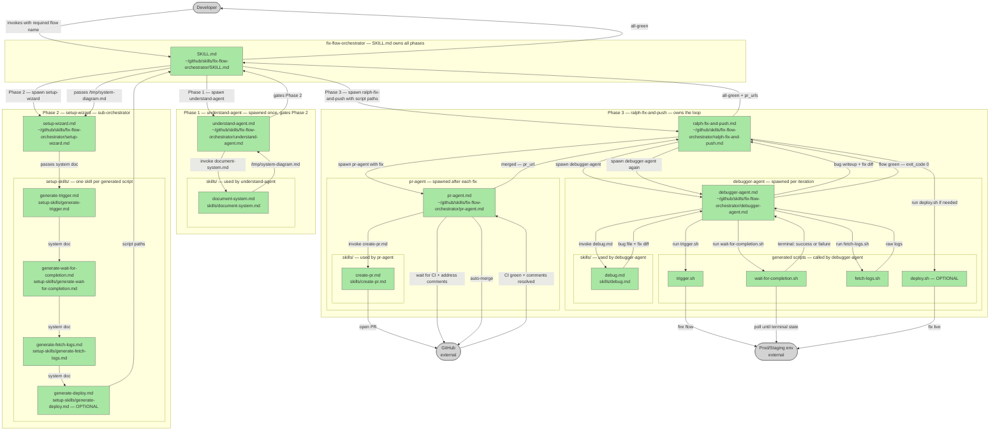

# fix-flow-orchestrator Plugin

## Plan Metadata

- Plan type: `plan`
- Parent plan: N/A
- Depends on: N/A (fully self-contained)
- Status: `approved`

Status semantics:
- `draft`: Plan is being created or updated and is not final.
- `approved`: Plan is approved but not yet applied in code.
- `documentation`: Code currently exists and matches the plan contract.

Update rule:
- When an existing plan is edited, set status to `draft` until re-approved.

## System Intent

- **What is being built**: A fully self-contained Claude Code skill (`/fix-flow-orchestrator`) with its own internal sub-skills, scripts, and orchestration. A parent skill manages a tight ralph-fix-and-push — spawning a fresh sub-agent per iteration to run the integration command, parse errors, debug, fix, and open a PR — until the command passes green.
- **Primary consumer(s)**: Developers who want to autonomously drive a failing integration flow to green without manual debug iterations.
- **Boundary (black-box scope only)**: Accepts a shell command + repo context; emits a passing test run and one or more open PRs containing fixes. No external skill dependencies.

## Stage Gate Tracker

- [x] Stage 1 Mermaid approved
- [x] Stage 2 I/O contracts approved
- [x] Stage 3 pseudocode/technical details approved or skipped — skipped, contracts are sufficient

---

## 1. Mermaid Diagram

Reference: `.agent/skills/create-mermaid-diagram/SKILL.md`

**Node path notes:**
- All files live under `~/github/skills/fix-flow-orchestrator/`.
- `understand-agent.md` is a dedicated sub-agent spawned once for Phase 1 — the orchestrator never does the understanding work itself.
- `skills/document-system.md` mirrors the new-plan template exactly — Mermaid diagram, I/O contracts, component descriptions — but documents an existing system by reading the code rather than planning new work.
- Phase 1 gates Phase 2: setup-wizard only runs after `understand-agent` writes `/tmp/system-diagram.md`.
- `/tmp/system-diagram.md` is a temporary working file — the orchestrator deletes it when the session ends.
- `setup-skills/` contains one skill per generated script.
- `ralph-fix-and-push.md` owns Phase 3 entirely — the orchestrator spawns it and only gets back `{ all_green, pr_urls }`.
- `skills/debug.md` is used by the debugger-agent only.
- `skills/create-pr.md` is used by the pr-agent only.
- Neither the orchestrator nor ralph-fix-and-push ever touch GitHub directly — only pr-agent does.
- `scripts/` is where generated scripts land: `trigger.sh`, `wait-for-completion.sh`, `fetch-logs.sh`, `deploy.sh` (optional).

---

## 2. Black-Box Inputs and Outputs

### `SKILL.md` — orchestrator

**Job:** Entry point. Runs Phase 1, Phase 2, then Phase 3 in strict sequence. Holds `/tmp/system-diagram.md` for the duration of the session and cleans it up on exit. Does not know about the internal workings of any phase.

| | Description |
|---|---|
| **In** | Developer invocation with required flow argument — e.g. `/fix-flow-orchestrator ingest_window` |
| **Out** | All-green confirmation + list of PR URLs created across iterations; cleans up `/tmp/system-diagram.md` on exit |

---

### Phase 1 — Understand System

#### `understand-agent.md`

**Job:** Spawned once. Explores the codebase and writes the system document. Returns when `/tmp/system-diagram.md` is written — that file gates Phase 2.

| | Description |
|---|---|
| **In** | Flow name from orchestrator |
| **Invokes** | `skills/document-system.md` |
| **Out** | `/tmp/system-diagram.md` written to disk |

#### `skills/document-system.md`

**Job:** Explores the codebase and documents the existing system using the new-plan template — Mermaid diagram, I/O contracts, component descriptions. Describes what already exists, not what to build.

| | Description |
|---|---|
| **In** | Flow name |
| **Out** | `/tmp/system-diagram.md` — structured identically to a new-plan file |

---

### Phase 2 — Setup

#### `setup-wizard.md`

**Job:** Reads `/tmp/system-diagram.md` and orchestrates each setup sub-skill in sequence to generate the scripts the ralph-fix-and-push needs.

| | Description |
|---|---|
| **In** | `/tmp/system-diagram.md` from orchestrator |
| **Out** | Paths to all generated scripts, passed back to SKILL.md |
| **Invokes** | `generate-trigger.md` → `generate-wait-for-completion.md` → `generate-fetch-logs.md` → `generate-deploy.md` (optional) |

#### `setup-skills/generate-trigger.md`

| | Description |
|---|---|
| **In** | `/tmp/system-diagram.md` |
| **Out** | `scripts/trigger.sh` — fires the flow and exits immediately |

#### `setup-skills/generate-wait-for-completion.md`

| | Description |
|---|---|
| **In** | `/tmp/system-diagram.md` |
| **Out** | `scripts/wait-for-completion.sh` — polls until success (exit 0) or failure (exit 1) |

#### `setup-skills/generate-fetch-logs.md`

| | Description |
|---|---|
| **In** | `/tmp/system-diagram.md` |
| **Out** | `scripts/fetch-logs.sh` — fetches all relevant logs and prints to stdout |

#### `setup-skills/generate-deploy.md` _(optional)_

| | Description |
|---|---|
| **In** | `/tmp/system-diagram.md` |
| **Out** | `scripts/deploy.sh` — deploys current code to target environment; exits 0 on success |

---

### Phase 3 — Ralph Fix and Push

#### `ralph-fix-and-push.md` — loop controller

**Job:** Spawned by the orchestrator with the generated script paths. Owns the entire loop — spawns debugger-agent, receives `/tmp/bug-explanation.md` path back, passes it to pr-agent, handles deploy if needed, repeats until the flow passes. The orchestrator knows nothing about what happens inside.

| | Description |
|---|---|
| **In** | Script paths from orchestrator |
| **Out** | `{ all_green: true, pr_urls: [] }` — returned to orchestrator |

#### `debugger-agent.md` — spawned per iteration by ralph-fix-and-push

**Job:** Run the flow, wait for it to finish, fetch logs, and produce a fix. Does not touch GitHub — hands the fix back to the orchestrator.

| | Description |
|---|---|
| **In** | Paths to generated scripts + iteration number |
| **Calls** | `trigger.sh` → `wait-for-completion.sh` → `fetch-logs.sh` → `debug.md` |
| **Out** | `/tmp/bug-explanation.md` path + fix applied to working tree — returned to ralph-fix-and-push |

#### `skills/debug.md`

**Job:** Read raw logs, identify root cause, write a bug explanation, apply a code fix. The bug explanation is used as the PR summary/description.

| | Description |
|---|---|
| **In** | Raw log output from `fetch-logs.sh` + flow context |
| **Out** | Bug explanation written to `/tmp/bug-explanation.md` + fix applied to working tree |

#### `pr-agent.md` — spawned after each fix by ralph-fix-and-push

**Job:** Own the full PR lifecycle. Receives the bug explanation path from ralph-fix-and-push, reads it, and uses it as the PR description. Creates the PR, waits for CI, addresses review comments, auto-merges. Returns only after the PR is merged.

| | Description |
|---|---|
| **In** | Path to `/tmp/bug-explanation.md` (passed by ralph-fix-and-push) + fix applied to working tree |
| **Invokes** | `skills/create-pr.md` (passing bug explanation as PR description) → waits for CI → addresses comments → auto-merges |
| **Out** | `{ pr_url, merged: true }` — returned to ralph-fix-and-push |

#### `skills/create-pr.md`

**Job:** Read the bug explanation file and open a PR on GitHub using it as the PR description.

| | Description |
|---|---|
| **In** | Path to `/tmp/bug-explanation.md` + fix applied to working tree |
| **Out** | PR URL on GitHub |

---

### Generated scripts (contract summary)

| Script | Always? | Exits 0 when | Exits 1 when |
|---|---|---|---|
| `trigger.sh` | yes | flow successfully fired | could not invoke |
| `wait-for-completion.sh` | yes | flow reached success terminal state | flow reached failure terminal state or timed out |
| `fetch-logs.sh` | yes | logs fetched and printed to stdout | log source unreachable |
| `deploy.sh` | optional | fix deployed to environment | deploy failed |

---

## 3. Pseudocode / Technical Details

_Skipped — I/O contracts are sufficient for implementation._

---

## 4. Handoff to Related Plan Reconciliation

After all stages are approved, apply `.agent/skills/reconcile-plans/SKILL.md` to propagate contract updates across linked plans.
