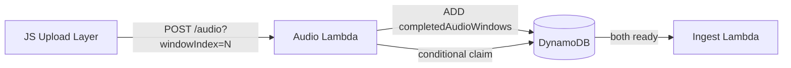

# Create Pull Request

This skill ensures high-quality Pull Requests by automating title formatting and body generation. The PR should be **self-contained** — a reviewer should never need to open another document to understand what changed and why.

## Instructions

Follow these steps in order.

This skill is step 3 in `.agent/workflows/development-flow.md`.

When used in the planning phase (after `new-plan` + `reconcile-plans`), the PR must be based on the updated plan files and explicitly state it is a planning-contract PR.

### Step 1: Analyze the diff

Before writing anything, understand the change:

1. Run `git log --oneline <base>..HEAD` to see all commits.
2. Run `git diff <base>...HEAD --stat` to see files changed and scope.
3. Categorize: is this a small fix (1-3 files), a feature (multi-file, one concern), or a large feature (multi-layer, multi-concern)?

### Step 2: Draft PR Title

1. Use **Conventional Commits** prefix with scope: `feat(audio):`, `fix(auth):`, `chore:`, `docs:`, `refactor:`, `test:`, `ci:`.
2. Use **imperative mood** — "add", "fix", "remove", "stream", not "added", "fixed", "removed".
3. Describe the **user-facing or system-level change**, not the implementation detail.
4. Keep under 72 characters.

**Good titles:**
- `feat(audio): stream audio in 30s WAV chunks with real-time ingest`
- `fix(auth): add 401/403 response interceptor with token refresh`
- `chore: remove stop-recording alert, add CodeRabbit config`

**Bad titles:**
- `fixed the login bug` (no prefix, past tense, vague)
- `feat(audio): replace AVAudioRecorder with AVAudioEngine` (implementation detail, not the change)
- `update files` (meaningless)

### Step 3: Generate PR Body

**CRITICAL**: Do NOT output the description to the chat. Write the final content to `/tmp/pr_description.md`.

The body has **required** and **conditional** sections. Scale the description to the size of the change — a 2-file fix does not need a diagram or a "What's NOT Changing" section.

#### Required: Why (1-2 sentences)

Lead with the **problem or motivation**, not the solution. The reviewer needs to understand why this change exists before reading what it does.

**Good:** "Expired tokens left users trapped in a dead authenticated state where every API call failed silently."
**Bad:** "This PR adds a response interceptor to the axios API client."

#### Required: What Changed (bullet points)

Group by layer when the change spans multiple:
- **Backend:** ...
- **Mobile:** ...
- **Infra:** ...

For single-layer changes, just use flat bullets. Each bullet should be one line — file or module name, dash, what changed.

#### Conditional: Diagram

The diagram exists to supplement the diff, not duplicate it. The reviewer already has the code. A diagram earns its place only when it shows something the diff can't easily show.

**The gate — two tests, both must pass:**

1. **Shape test:** "Does this change have a shape that isn't obvious from the code?" The diff struggles to convey temporal flow (what happens in what order, especially async/event-driven), cross-boundary assembly (logic distributed across services/files — the diff shows fragments but not how they compose), structural shape (state machines, data pipelines, fan-out/fan-in), and scope boundaries (what's touched vs. deliberately left alone). The diff handles function-level changes, type signatures, config, and linear refactors just fine on its own.
2. **Caption test:** Can you write a one-line caption like *"Order of events when a token expires mid-request"* or *"Components that touch the new audio buffer"*? If you can't articulate what the diagram answers, it shouldn't be there.

**What the diagram must have:**

- **Labeled arrows** — every arrow explains the relationship. `A → B` means nothing. `A →|POST /audio| B` tells the reviewer what's happening. Unlabeled arrows are the most common diagram mistake.
- **Consistent abstraction level** — don't mix "DynamoDB" with "parse_json()". Pick a level and stay there. Each box looks fine in isolation, which makes this mistake sneaky — but a diagram mixing high-level services with low-level functions is confusing.
- **Specific names** — "IngestWindow Lambda" not "Lambda". "completedAudioWindows" not "database".
- **Only what this PR changes** — not the whole system. If your PR touches 3 components out of 20, show those 3.
- **20-second readability** — if a reviewer needs more than that, the diagram is too complex or the wrong type.
- **One-line caption** — placed above the diagram, stating what question it answers.

**Which type to use:**

| Type | Use when |
|------|----------|
| **Flowchart** | Sequential workflows, decision logic, data flow through a pipeline |
| **Sequence diagram** | Async interactions, API calls, timing between services |
| **Component diagram** | Showing how pieces fit together structurally |

Sequence diagrams and flowcharts are the most reviewer-friendly — no UML knowledge needed.

**Use Mermaid.** It lives inline in the PR body (no broken image links in two years), it's text so it diffs like code, and GitHub renders it natively. Its weaknesses (ugly auto-layout, limited for real architecture docs) don't bite in a PR context because we're showing small, focused flows. Full system architecture belongs in `/docs`, not a PR.

**Example — good vs bad:**

Good (labeled arrows, consistent abstraction, focused on what changed):

*How an audio chunk triggers ingest after coordinating with the frame stream.*

Bad (unlabeled arrows, mixed abstraction, shows everything):
```
App → Server → Database → Lambda → GPU → S3 → Database → Response
```

If a plan exists with a relevant diagram, adapt it for the PR context (the reviewer's perspective), don't paste it verbatim.

#### Conditional: What's NOT Changing (only for large diffs)

When the diff touches shared code or core modules, explicitly state what is unchanged. This prevents reviewer anxiety about blast radius.

Example: "Frame capture and upload flow (unchanged). GPU worker (unchanged). ORM schema (unchanged)."

#### Conditional: Key Decisions (only when non-obvious choices were made)

If the implementation made trade-offs that a reviewer might question, explain them briefly. This preempts review comments and shows the decisions were intentional.

Example: "DynamoDB Number Sets over counters — avoids out-of-order bugs. Native-side PCM accumulation — no raw bytes crossing the React Native bridge."


### Step 4: Create the PR

1. Write final content to `/tmp/pr_description.md`.
2. Create the PR using `gh pr create --title "..." --body-file /tmp/pr_description.md --base master`.
3. Return the PR URL to the user.

## Size Guidelines

| Change Size | Title | Body |
|------------|-------|------|
| Tiny (1-2 files, obvious fix) | `fix(scope): one-line description` | Why + bullets. No diagram. |
| Small (3-10 files, one concern) | `feat/fix(scope): description` | Why + bullets. Diagram only if multi-component. |
| Large (10+ files, multi-layer) | `feat(scope): description` | Full treatment: why, bullets by layer, diagram, what's NOT changing, key decisions. Manual testing only if CI can't cover it. |

## Anti-Patterns

- **Plan dump**: Don't paste the plan into the PR body. The PR should be self-contained with its own narrative.
- **"Goal from plan.md"**: The reviewer doesn't want to read your plan. Synthesize the context here.
- **Link to plan as the description**: "See plan.md" is not a PR description.
- **Diagram for everything**: A diagram on a 2-file change is noise.
- **Missing the why**: Listing what changed without explaining why is a changelog, not a PR.
- **Screenshots with no context**: Screenshots are great, but always pair them with a text explanation.

## Troubleshooting

- **Permission Denied**: If writing to `/tmp` fails, verify environment access.
- **Missing Diagram**: If the Mermaid skill is not found, create a minimal diagram manually that still reflects the change and lists all changed files.
